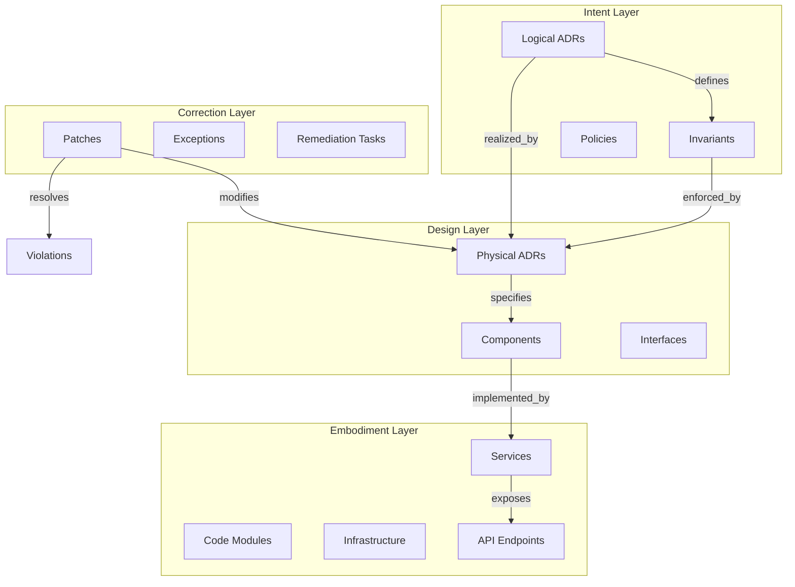

# ADR Architecture Kit v1.0 - Project Design

## Implementation Phases: Parallel Work Paths

The todo list is organized into 6 phases with opportunities for parallel execution:

**Phase 1: Foundation Setup** (All can run in parallel)

- Add git submodules (ste-spec, ste-runtime)
- Explore STE architecture (read ste-spec invariants, ste-runtime RECON)
- Initialize Python package structure

**Phase 2: Core Implementation** (Sequential, builds on Phase 1)

- Create JSON Schemas (requires STE exploration)
- Create Pydantic models (requires schemas)
- Build YAML parser (requires models)

**Phase 3: Dogfooding & Validation** (Sequential, builds on Phase 2)

- Write ADR-L-0001 (requires parser)
- Validate against STE invariants
- Test ste-runtime RECON extraction
- Iterate schema based on friction

**Phase 4: Generators & Testing** (View and Manifest generators can run in parallel)

- Build markdown view generator (parallel)
- Build manifest generator (parallel)
- Create test suite (after generators)

**Phase 5: Documentation & CI** (Can run in parallel after Phase 4)

- Write additional dogfooding ADRs (parallel)
- Setup CI governance workflow (parallel)
- Write documentation (parallel)

**Phase 6: Integration Validation** (Final validation)

- Validate complete STE integration (ste-spec → adr-kit → ste-runtime)

**Estimated parallel speedup: 30-40% reduction in wall-clock time**

## Positioning: STE-Compliant Documentation-State Implementation

The ADR Architecture Kit is an **STE-compliant implementation of the Documentation-State Layer (Layer 5)** for architectural decisions, governed by the normative ste-spec and integrated with ste-runtime semantic graph.

### Relationship to STE System

**ste-spec** (submodule): Normative ISO-42010 architectural specification

- Defines: Invariant Hierarchy (PRIME, SYS, Domain)
- Governs: All STE-compliant systems
- Authority: Architectural specification

**adr-architecture-kit** (this project): Documentation-State artifacts for architecture

- Implements: Layer 5 (Documentation-State) for ADRs
- Complies with: ste-spec invariants and Artifact Specifications
- Provides: Schema, validators, generators for ADR artifacts

**ste-runtime** (submodule): Semantic graph and RECON implementation

- Implements: RECON protocol, semantic graph, RSS, MCP
- Extracts: ADRs into graph during RECON
- Enables: AI reasoning over architecture via graph queries

### Three-Repository Architecture

```mermaid
graph TB
    subgraph ste_spec [ste-spec - Normative Specification]
        prime[Prime Invariant<br/>PRIME-1 to PRIME-5]
        sys[System Invariants<br/>SYS-1 to SYS-16]
        artifact_specs[Artifact Specifications<br/>Structure rules]
        div_tax[Divergence Taxonomy<br/>Fault classification]
    end
    
    subgraph adr_kit [adr-architecture-kit - Documentation-State Layer 5]
        schema[ADR Schema v1.0<br/>STE-compliant]
        adrs[ADR Documents<br/>Authoritative artifacts]
        validators[Validators<br/>Divergence detection]
        manifest[Manifest<br/>SYS-14 compliance]
    end
    
    subgraph ste_runtime [ste-runtime - Semantic Graph]
        recon[RECON Protocol<br/>Extract canonical state]
        adr_parser[ADR Parser<br/>NEW in RECON]
        graph[Semantic Graph<br/>AI-DOC substrate]
        mcp[MCP Interface<br/>Architecture queries]
    end
    
    prime -.governs.-> schema
    sys -.governs.-> adrs
    artifact_specs -.defines.-> schema
    div_tax -.classifies.-> validators
    
    adrs --> adr_parser
    adr_parser --> graph
    graph --> mcp
    
    recon -.governed by.-> sys
    
    style ste_spec fill:#FFE4B5
    style adr_kit fill:#87CEEB
    style ste_runtime fill:#90EE90
```


**Co-evolution model:**

- Execution pressure in adr-kit reveals spec gaps
- Spec updates govern both adr-kit and ste-runtime
- ste-runtime feedback validates adr-kit design
- All three evolve together under real usage

## Vision: Architecture Knowledge System

The ADR Architecture Kit is the **foundational artifact layer** for a larger architecture knowledge system that bridges human intent and machine reasoning through structured artifacts.

### System Layers

```mermaid
graph TB
    subgraph layer1 [Layer 1: ADR Artifacts - THIS PROJECT]
        schema[JSON Schema v1.0]
        adrs[YAML ADR Documents]
        parser[Parser & Validator]
        views[View Generators]
    end
    
    subgraph layer2 [Layer 2: Semantic Graph - ste-runtime]
        recon[RECON Process]
        adr_recon[ADR Parser]
        graph[Semantic Graph]
        mcp[MCP Interface]
    end
    
    subgraph layer3 [Layer 3: AI Reasoning - FUTURE]
        agents[Specialized Agents]
        validation[Validation Loop]
        edr[EDR Comparison]
        policy[Policy Engine]
    end
    
    subgraph layer4 [Layer 4: Governance - FUTURE]
        patches[Patch System]
        remediation[Remediation Tasks]
        compliance[Compliance Tracking]
    end
    
    adrs --> parser
    parser --> adr_recon
    adr_recon --> graph
    graph --> agents
    agents --> validation
    validation --> patches
    
    style layer1 fill:#87CEEB
    style layer2 fill:#90EE90
```


**This project (Layer 1)** provides the structured artifact format that feeds the entire system.

**ste-runtime (Layer 2)** extracts ADRs into semantic graph during RECON process.

**Future layers** enable AI reasoning, policy enforcement, and automated governance.

## Architecture Overview

The toolkit follows a layered architecture optimized for AI-first reasoning with graph integration:

```mermaid
graph TB
    subgraph adr_kit [ADR Kit - This Project]
        schema[JSON Schema v1.0<br/>Graph-friendly structure]
        adrs[YAML ADR Documents<br/>Authoritative source]
        parser[Parser & Validator<br/>Schema compliance]
        views[View Generators<br/>Human-readable output]
        manifest[Manifest Generator<br/>Derived discovery index]
    end
    
    subgraph ste [ste-runtime - Submodule]
        recon[RECON Process<br/>Workspace discovery]
        adr_parser[ADR Parser<br/>NEW in ste-runtime]
        graph[Semantic Graph<br/>Nodes + Edges]
        mcp_api[MCP Interface<br/>Graph queries]
    end
    
    subgraph workspace [Workspace]
        adr_dir[adrs/ directory<br/>Logical & Physical ADRs]
        code[src/ code]
        infra[Infrastructure]
    end
    
    schema -.defines.-> adrs
    adrs --> parser
    parser -.validates.-> adrs
    adrs --> views
    adrs --> manifest
    
    adr_dir --> adr_parser
    code --> recon
    infra --> recon
    
    adr_parser --> graph
    recon --> graph
    graph --> mcp_api
    
    style adr_kit fill:#87CEEB
    style ste fill:#90EE90
```


### Key Architectural Principles

1. **STE Compliance** - Governed by ste-spec invariants (PRIME, SYS, Domain, Artifact Specs)
2. **Documentation-State Layer** - Implements Layer 5 of STE Invariant Hierarchy
3. **ADRs are authoritative** - All metadata in ADR frontmatter (SYS-5: Documentation-State Precedence)
4. **Manifest is derived** - Generated from ADRs (SYS-14: Index Currency)
5. **Graph extraction in ste-runtime** - ADR Kit defines structure, ste-runtime RECON extracts graph (SYS-6, SYS-13)
6. **Divergence detection** - Schema violations map to STE Divergence Taxonomy
7. **Iterative co-evolution** - adr-kit ↔ ste-spec ↔ ste-runtime feedback loop
8. **Dogfooding from day 1** - Real project ADRs validate STE compliance

## ADR Schema v1.0 Structure

### Three Artifact Types

**1. PROJECT.yaml** - Project/service metadata (one per repository):

- Ownership (team, tech lead, on-call)
- Implementation identifiers (service name, repository, namespace)
- Automation permissions (what agents can do)
- Integrations (SCM, CI, observability, deployment)
- Compliance requirements

**2. Logical ADRs** - Conceptual design decisions:

- Capabilities and architectural boundaries
- Interaction contracts and constraints
- Invariants and non-functional requirements
- NO operational/infrastructure details

**3. Physical ADRs** - Implementation specifications:

- Implementation-ready technical specifications
- Must be complete enough for AI implementation
- Explicit gaps emitted as ADR questions
- References to logical ADR(s) they implement

### Core Schema Components

#### 0. PROJECT.yaml Structure (Project Metadata)

**Project-level metadata** (one per repository, enables automation):

```yaml
schema_version: "1.0"
type: project_metadata

project:
  name: "payment-service"
  description: "Payment processing microservice"
  type: service | library | platform | system

ownership:
  team: "team-payments"
  tech_lead: "@alice"
  on_call:
    schedule: "payments-oncall"
    rotation: weekly
    members: ["@alice", "@bob", "@charlie"]
    backup: "@tech-lead"

repository:
  url: "github.com/org/payment-service"
  primary_branch: "main"

implementation_identifiers:
  service_name: "payment-service"
  namespace: "payments"
  deployment_name: "payment-service"

automation:
  auto_merge_allowed: false
  auto_deploy_staging: true
  auto_deploy_production: false
  requires_human_review: true
  comfort_level: conservative | moderate | aggressive

integrations:
  scm:
    type: github | gitlab | bitbucket
    app_installation_id: "12345678"
    required_approvers: ["@alice", "@team-payments"]
  
  ci:
    type: github_actions | jenkins | circleci
    workflow_path: ".github/workflows/ci.yml"
    required_checks: ["test", "lint", "security-scan"]
  
  observability:
    metrics:
      provider: datadog | prometheus | cloudwatch
      dashboards: [service-health, api-latency]
    logs:
      provider: cloudwatch | datadog | splunk
      log_groups: [/aws/ecs/payment-service]
    alerts:
      provider: pagerduty | opsgenie
      escalation_policy: payments-oncall

compliance:
  security_level: high | medium | low
  data_classification: public | internal | confidential | restricted
  regulatory_requirements: [PCI-DSS, SOC2, GDPR]
  required_controls:
    encryption_at_rest: true
    encryption_in_transit: true
    mfa_required: true
    audit_logging: true

architecture_documentation:
  adr_directory: "adrs/"
  manifest_path: "adrs/manifest.yaml"
```

#### 1. ADR Frontmatter (Authoritative Metadata)

**Rich frontmatter** contains all discovery metadata (single source of truth):

```yaml
schema_version: "1.0"
adr_type: logical | physical
id: ADR-L-0001 | ADR-P-0001  # Type-prefixed to prevent collision
title: "Human-readable title"
status: proposed | accepted | deprecated | superseded
created_date: "2026-03-07"
modified_date: "2026-03-07"
authors: ["erik.gallmann"]

# Discovery metadata (authoritative)
domains: [api, infrastructure, security]
tags: [gateway, authentication, microservices]

# Relationships (graph edges)
related_adrs: [ADR-L-0002]
supersedes: []
superseded_by: null

# Physical ADR only
implements_logical: [ADR-L-0001]  # Physical → Logical edge
technologies: [kong, kubernetes, postgresql]  # For policy propagation

# Ownership (for governance)
ownership:
  architecture_authority: "platform-architecture"
  implementation_owners: ["team-api", "team-infra"]
```

**Design rationale:**

- All metadata in frontmatter prevents drift
- Type-prefixed IDs (`ADR-L-XXXX`, `ADR-P-XXXX`) prevent collision
- Rich metadata enables manifest generation and graph extraction
- Ownership enables policy propagation and blast radius analysis

#### 2. Logical ADR Structure

```yaml
# Frontmatter (above)
context: |
  Markdown: problem space, business drivers, constraints
  
capabilities:
  - id: CAP-001
    name: "Capability name"
    description: |
      What the system must be able to do
    
architectural_boundaries:
  - id: BOUND-001
    name: "Boundary name"
    description: |
      Separation of concerns, module boundaries
    rationale: |
      Why this boundary exists

interaction_contracts:
  - id: CONTRACT-001
    parties: [component_a, component_b]
    protocol: "Communication protocol"
    guarantees: |
      What each party guarantees
    
constraints:
  - id: CONST-001
    type: technical | business | regulatory | performance
    description: |
      Constraint details
    rationale: |
      Why this constraint exists

invariants:
  - id: INV-0001
    statement: "Must always be true"
    scope: global | domain_name | component_name
    enforcement_level: must | should | may  # For policy engine
    enforcement_mechanism: design | runtime | test
    verification_method: automated | manual | audit
    rationale: |
      Why this must hold

non_functional_requirements:
  - id: NFR-001
    category: performance | security | scalability | reliability
    requirement: |
      Specific NFR statement
    acceptance_criteria: |
      How to verify

decisions:
  - id: DEC-001
    summary: "Decision statement"
    rationale: |
      Markdown: why this decision was made
    alternatives_considered:
      - name: "Alternative approach"
        rejected_because: |
          Reasoning
    consequences:
      positive: [list of benefits]
      negative: [list of trade-offs]
    related_invariants: [INV-001, INV-002]

gaps:
  - id: GAP-001
    question: "Unresolved design question"
    impact: high | medium | low
    blocking: true | false
```

#### 3. Physical ADR Structure

```yaml
# Frontmatter (above)
implements_logical: [ADR-001, ADR-002]

context: |
  Implementation context, technology choices

technology_stack:
  - category: "database" | "framework" | "library" | etc
    name: "PostgreSQL"
    version: "15.x"
    rationale: |
      Why this technology

architecture_patterns:
  - pattern_name: "Microservices" | "Event-Driven" | etc
    application: |
      How pattern is applied
    components_affected: [list]

component_specifications:
  - id: COMP-0001
    name: "Component name"
    type: service | library | database | queue | etc
    responsibilities: |
      What this component does
    interfaces:
      - id: IFACE-0001
        type: REST | gRPC | message | etc
        specification: |
          API contract details
    dependencies: [COMP-0002, COMP-0003]
    
    # For EDR matching (embodiment layer)
    implementation_identifiers:
      service_name: "api-gateway"  # Kubernetes/runtime name
      repository: "github.com/org/api-gateway"
      module_path: "src/services/gateway"  # Code location
    
    # For governance
    owned_by: "team-api"
    
deployment_model:
  hosting: cloud | on-premise | hybrid
  orchestration: kubernetes | docker-compose | etc
  scaling_strategy: |
    How components scale
    
data_architecture:
  - entity: "User"
    storage: "PostgreSQL users table"
    schema: |
      Table/collection structure
    access_patterns: |
      How data is queried
      
implementation_decisions:
  - id: IMPL-001
    summary: "Implementation choice"
    rationale: |
      Technical reasoning
    implements_invariants: [INV-001]
    alternatives_considered:
      - name: "Alternative"
        rejected_because: |
          Why not chosen

integration_points:
  - id: INTEG-001
    systems: [system_a, system_b]
    protocol: "HTTP/REST"
    specification: |
      Integration contract
      
operational_requirements:
  monitoring: |
    What to monitor and how
  logging: |
    Logging strategy
  backup_recovery: |
    DR strategy
  security: |
    Security implementation

gaps:
  - id: GAP-001
    question: "Unresolved implementation detail"
    impact: high | medium | low
    blocking: true | false
    requires_decision_from: [stakeholder or team]
```

#### 4. Invariant Definition Structure

Invariants can be defined standalone or within ADRs:

```yaml
schema_version: "1.0"
type: invariant
id: INV-0001
statement: "All user data must be encrypted at rest"
scope: global | domain_name | component_name
enforcement_level: must | should | may
enforcement_mechanism: design | runtime | test
verification_method: automated | manual | audit
rationale: |
  Why this invariant exists
defined_in: ADR-L-0001
enforced_by: [ADR-P-0005, ADR-P-0007]
related_constraints: [CONST-0001]

# For policy engine (future)
policy_reference: POL-0001  # Links to policy system
exceptions: [EXC-0001]  # Granted exceptions
```

#### 5. Manifest Structure (Generated, Not Authoritative)

The manifest is a **derived convenience view** for discovery, never manually edited:

```yaml
# manifest.yaml - GENERATED FROM ADRs, DO NOT EDIT
schema_version: "1.0"
type: manifest
generated_date: "2026-03-07T19:45:00Z"
generated_from: "adrs/**/*.yaml"

# Aggregated from ADR frontmatter
adrs:
  - id: ADR-L-0001
    type: logical
    title: "API Gateway Pattern"
    status: accepted
    file_path: "adrs/logical/ADR-L-0001-api-gateway.yaml"
    domains: [api, infrastructure]  # Copied from ADR frontmatter
    tags: [gateway, security]       # Copied from ADR frontmatter
    decision_count: 3               # Computed from body
    invariant_count: 2              # Computed from body
    gap_count: 0                    # Computed from body
    
  - id: ADR-P-0001
    type: physical
    title: "Kong Gateway Implementation"
    status: accepted
    file_path: "adrs/physical/ADR-P-0001-kong-impl.yaml"
    implements_logical: [ADR-L-0001]  # Copied from frontmatter
    domains: [api, infrastructure]
    technologies: [kong, kubernetes]
    component_count: 3
    gap_count: 1
    blocking_gaps: 0

# Discovery indexes (computed)
by_domain:
  api: [ADR-L-0001, ADR-P-0001]
  infrastructure: [ADR-L-0001, ADR-P-0001]

by_status:
  accepted: [ADR-L-0001, ADR-P-0001]
  proposed: [ADR-L-0002]

by_technology:
  kong: [ADR-P-0001]
  kubernetes: [ADR-P-0001, ADR-P-0002]

# Traceability maps (computed)
logical_to_physical_map:
  ADR-L-0001: [ADR-P-0001, ADR-P-0002]
  ADR-L-0002: []  # Not yet implemented

invariants:
  - id: INV-0001
    statement: "All external traffic through API gateway"
    defined_in: ADR-L-0001
    enforced_by: [ADR-P-0001]
    enforcement_level: must

gaps_summary:
  total: 3
  blocking: 1
  by_adr:
    ADR-P-0001: {total: 1, blocking: 0}
    ADR-P-0003: {total: 2, blocking: 1}

statistics:
  total_adrs: 5
  logical_adrs: 2
  physical_adrs: 3
  total_decisions: 15
  total_invariants: 4
  total_components: 8
```

**Manifest governance:**

- Generated via `adr generate-manifest`
- CI validates manifest is up-to-date
- Stale manifest fails build
- Provides fast discovery without reading all ADRs

## Repository Structure

```
adr-architecture-kit/
├── README.md
├── LICENSE
├── .gitmodules                       # Git submodule config
├── pyproject.toml                    # Python project config
├── requirements.txt                  # Python dependencies
├── setup.py                          # Package setup
│
├── ste-spec/                         # Git submodule (normative specification)
│   └── (ste-spec repository - ISO-42010 compliant)
│
├── ste-runtime/                      # Git submodule (graph implementation)
│   └── (ste-runtime repository - RECON + semantic graph)
│
├── schema/                           # JSON Schema definitions
│   ├── v1.0/
│   │   ├── adr-common.schema.json   # Shared frontmatter
│   │   ├── adr-logical.schema.json  # Logical ADR schema
│   │   ├── adr-physical.schema.json # Physical ADR schema
│   │   ├── invariant.schema.json    # Invariant schema
│   │   ├── manifest.schema.json     # Manifest schema
│   │   └── types.schema.json        # Shared type definitions
│   └── README.md                     # Schema documentation
│
├── adrs/                             # DOGFOODING: Real ADRs for this project
│   ├── logical/
│   │   ├── ADR-L-0001-two-layer-architecture.yaml
│   │   ├── ADR-L-0002-machine-verifiable-adr-system.yaml
│   │   └── ADR-L-0003-manifest-based-discovery.yaml
│   ├── physical/
│   │   ├── ADR-P-0001-python-toolkit-implementation.yaml
│   │   ├── ADR-P-0002-json-schema-yaml-format.yaml
│   │   ├── ADR-P-0003-pydantic-validation-pipeline.yaml
│   │   └── ADR-P-0004-ste-runtime-graph-integration.yaml
│   ├── invariants/
│   │   ├── INV-0001-schema-validation-required.yaml
│   │   ├── INV-0002-logical-no-implementation.yaml
│   │   └── INV-0003-physical-references-logical.yaml
│   ├── manifest.yaml                 # Generated discovery index
│   └── rendered/                     # Generated human views
│       ├── ADR-L-0001.md
│       ├── ADR-P-0001.md
│       └── index.md
│
├── src/
│   └── adr_kit/
│       ├── __init__.py
│       │
│       ├── models/                   # Python data models (Pydantic)
│       │   ├── __init__.py
│       │   ├── common.py            # Shared types
│       │   ├── logical_adr.py
│       │   ├── physical_adr.py
│       │   ├── invariant.py
│       │   └── manifest.py
│       │
│       ├── parser/                   # YAML parsing
│       │   ├── __init__.py
│       │   └── yaml_parser.py
│       │
│       ├── validator/                # Validation engine (future)
│       │   ├── __init__.py
│       │   ├── schema_validator.py
│       │   └── manifest_validator.py
│       │
│       ├── generators/               # Artifact generators
│       │   ├── __init__.py
│       │   ├── views/               # Human view generators
│       │   │   ├── __init__.py
│       │   │   └── markdown.py      # YAML → Markdown
│       │   └── manifest_generator.py  # Generate manifest from ADRs
│       │
│       ├── templates/                # Jinja2 templates for views
│       │   ├── adr-full.md.jinja2
│       │   ├── adr-summary.md.jinja2
│       │   └── index.md.jinja2
│       │
│       └── cli/                      # CLI commands (future)
│           ├── __init__.py
│           └── main.py
│
├── tests/                            # Test suite
│   ├── __init__.py
│   ├── fixtures/                    # Test ADR fixtures
│   │   ├── valid/
│   │   │   ├── logical-minimal.yaml
│   │   │   ├── logical-complete.yaml
│   │   │   ├── physical-minimal.yaml
│   │   │   └── physical-complete.yaml
│   │   └── invalid/
│   │       ├── missing-required-field.yaml
│   │       ├── invalid-id-format.yaml
│   │       └── wrong-type.yaml
│   ├── test_schema_validation.py
│   ├── test_models.py
│   ├── test_parser.py
│   ├── test_manifest_generator.py
│   └── test_markdown_generator.py
│
└── docs/                            # Project documentation
    ├── schema-guide.md              # JSON Schema reference
    ├── logical-adr-guide.md         # When and how to write logical ADRs
    ├── physical-adr-guide.md        # When and how to write physical ADRs
    ├── invariants-guide.md          # Invariant design patterns
    ├── manifest-guide.md            # Manifest generation and usage
    ├── graph-integration.md         # ste-runtime integration guide
    └── view-generation.md           # Human view generation
```

## MVP Scope: Schema v1.0 with Graph Integration

The MVP establishes the schema foundation designed for semantic graph extraction, validated through dogfooding.

### Deliverables

1. **ste-runtime Integration**
  - Add ste-runtime as git submodule
  - Explore RECON architecture
  - Understand graph node/edge requirements
  - Design ADR schema for graph extraction
2. **JSON Schema Definitions (STE-Compliant)**
  - Complete schema for logical ADRs (follows ste-spec Artifact Specifications)
  - Complete schema for physical ADRs (supports EDR comparison)
  - Invariant schema (aligns with STE invariant structure)
  - Manifest schema (SYS-14: Index Currency)
  - Shared type definitions
  - ID patterns: `ADR-L-XXXX`, `ADR-P-XXXX` (STE-compatible, graph-ready)
  - Schema enables divergence detection (maps to STE Divergence Taxonomy)
3. **Python Data Models**
  - Pydantic models matching JSON Schema
  - Type-safe parsing and validation
  - Serialization/deserialization
  - Graph-ready structure (explicit IDs, typed relationships)
4. **Basic YAML Parser**
  - Load YAML ADR documents
  - Validate against schema
  - Parse into Python models
  - Validate ID format patterns
5. **Dogfooding ADRs (Real Project Documentation)**
  - ADR-L-0001: STE-compliant ADR system conception (this conversation)
  - ADR-L-0002: Two-layer architecture model (logical vs physical)
  - ADR-L-0003: STE integration architecture (spec + runtime + kit)
  - ADR-P-0001: Python toolkit implementation
  - ADR-P-0002: JSON Schema + YAML format choice
  - ADR-P-0003: STE compliance implementation
  - INV-0001: Schema validation required (aligns with SYS-4)
  - INV-0002: ADRs are authoritative (aligns with SYS-5)
  - Validates schema through real usage and STE compliance
6. **Graph Extraction Validation**
  - Run ste-runtime RECON on ADRs
  - Validate graph generation
  - Query graph via MCP
  - Iterate schema based on feedback
7. **View Generators**
  - Markdown view generator (YAML → MD)
  - Manifest generator (ADRs → manifest.yaml)
  - Basic Jinja2 templates
  - Demonstrates human-readable output
8. **Documentation**
  - Schema documentation with graph integration notes
  - Logical vs Physical ADR guide
  - Dogfooding walkthrough
  - Graph integration guide
  - View generation guide

### Out of Scope for MVP (Future Phases)

- Full CLI tooling (`adr new`, `adr validate`, etc.)
- Advanced validators (convergence, conflicts, traceability)
- HTML/PDF generators
- EDR comparison and validation loop
- Patch system
- Policy engine
- CI/CD integration templates

## Technical Design Details

### 1. JSON Schema Design Principles

**Machine-first constraints:**

- All required fields explicitly marked
- Enumerations for controlled vocabularies
- String patterns for ID formats (e.g., `^ADR-\d{3}$`)
- Cross-reference validation via `$ref`
- No implicit defaults

**Schema modularity:**

```
adr-common.schema.json        # Shared frontmatter
  ↓ referenced by
adr-logical.schema.json        # Logical-specific fields
adr-physical.schema.json       # Physical-specific fields
```

### 2. ID and Reference System (Graph-Ready)

**Type-prefixed ADR identifiers** (prevents collision):

- Logical ADRs: `ADR-L-0001`, `ADR-L-0002` (4-digit, type-prefixed)
- Physical ADRs: `ADR-P-0001`, `ADR-P-0002` (4-digit, type-prefixed)
- Pattern: `^ADR-(L|P)-\d{4}$`

**Entity identifiers** (graph nodes):

- Decisions: `DEC-0001` (logical), `IMPL-0001` (physical)
- Invariants: `INV-0001` (global numbering)
- Capabilities: `CAP-0001` (logical only)
- Components: `COMP-0001` (physical only)
- Interfaces: `IFACE-0001` (physical only)
- Constraints: `CONST-0001` (both types)
- Gaps: `GAP-0001` (both types)

**Graph edge fields** (explicit relationships):

- `implements_logical`: Physical → Logical (realization edge)
- `related_adrs`: ADR → ADR (association edge)
- `related_invariants`: Decision → Invariant (enforcement edge)
- `enforced_by`: Invariant → Physical ADR (enforcement edge)
- `supersedes`/`superseded_by`: ADR → ADR (evolution edge)
- `dependencies`: Component → Component (dependency edge)
- `owned_by`: Component → Team (ownership edge)

**File naming convention:**

```
adrs/logical/ADR-L-0001-two-layer-architecture.yaml
adrs/physical/ADR-P-0001-python-toolkit.yaml
adrs/invariants/INV-0001-schema-validation.yaml
```

### 3. Python Technology Stack

**Core dependencies:**

- `pydantic` (v2.x): Data models with validation
- `pyyaml`: YAML parsing
- `jsonschema`: JSON Schema validation
- `jinja2`: Template rendering for views
- `click`: CLI framework (future)
- `pytest`: Testing framework

**Project structure:**

- `pyproject.toml`: Modern Python packaging
- `src/` layout: Installable package
- Type hints throughout
- Docstrings for all public APIs

### 4. View Generation Architecture

**Template-based rendering:**

```python
# Conceptual flow
adr_yaml = load_yaml("ADR-001.yaml")
adr_model = LogicalADR.parse_obj(adr_yaml)
template = load_template("adr-full.md.jinja2")
markdown = template.render(adr=adr_model)
```

**View types:**

- **Full markdown**: Complete ADR with all sections
- **Summary markdown**: Executive overview
- **Index**: Table of contents linking all ADRs
- **Decision registry**: Flat list of all decisions

**Template variables:**
Templates receive validated Pydantic models, ensuring type safety and preventing rendering errors.

### 5. Gap and Question Representation

**Explicit gap tracking:**

```yaml
gaps:
  - id: GAP-001
    question: "Should we use REST or gRPC for service communication?"
    context: |
      Background information
    impact: high | medium | low
    blocking: true
    affects: [COMP-001, COMP-002]
    options:
      - name: "REST"
        pros: [list]
        cons: [list]
      - name: "gRPC"
        pros: [list]
        cons: [list]
    decision_required_from: "Architecture team"
```

Gaps are first-class schema elements, making incomplete designs explicit and trackable.

### 6. Validator Architecture (Future)

**Validation layers:**

1. **Structural validation**
  - JSON Schema compliance
  - Required fields present
  - Correct types and enums
  - ID format patterns
2. **Content validation**
  - Logical ADR completeness (no impl details)
  - Physical ADR implementation completeness
  - Invariant references exist
  - Gap impact assessment
3. **Convergence validation**
  - All gaps resolved or explicitly tracked
  - No orphaned decisions
  - Physical ADRs cover logical requirements
4. **Conflict detection**
  - Contradictory decisions across ADRs
  - Invariant violations
  - Incompatible interface contracts
5. **Traceability validation**
  - Physical ADRs reference logical ADRs
  - Invariants mapped to enforcement points
  - Decision lineage maintained

**Test-driven approach:**
Each validator will have tests written first defining expected behavior for valid/invalid cases.

## Future Vision: Architecture Knowledge System

This section describes the broader system that ADR Kit enables (not implemented in MVP).

### ADR Kit as Meta-System: The Schema Authority

**ADR Kit is not just a tool - it is the authority for the system encoding schema.**

**What this means:**

```
ADR Kit defines → Schema (how to encode architecture)
                     ↓
              All projects use schema
                     ↓
              Projects document decisions
                     ↓
              Patterns emerge
                     ↓
              Patterns → Rules/Signals
                     ↓
              Rules & Signal Service validates
                     ↓
              Schema evolves based on feedback
```

**ADR Kit's unique position:**

1. **Schema Authority**: ADR Kit defines how architecture is encoded
  - JSON Schema v1.0 is the artifact
  - All projects must comply with schema
  - Schema changes affect entire organization
2. **Self-Documenting**: ADR Kit documents itself using ADRs
  - ADR-L-0001: Why two-layer architecture model?
  - ADR-P-0001: Why Python + Pydantic?
  - Changes to ADR Kit are documented like any other project
3. **Schema Evolution**: ADR Kit evolves based on usage
  - Projects request new encoding capabilities
  - Logs show validation failures (schema gaps)
  - AI tools request new field types
  - Usage data drives schema refinement
4. **Rules/Signals Generation**: Schema changes produce rules
  - New required field → validation rule
  - New relationship type → graph edge type
  - New invariant pattern → signaling rule
  - Schema is executable governance

**Schema evolution feedback loop:**

```
Projects use ADR Kit → Logs capture usage patterns
                              ↓
                     Encoding gaps identified
                     (e.g., "Can't represent event-driven patterns")
                              ↓
                     Request for schema enhancement
                     (e.g., "Add event_specifications field")
                              ↓
                     ADR Kit team evaluates
                     Documents decision in ADR-L-XXXX
                              ↓
                     Schema v1.1 released
                     New validation rules generated
                              ↓
                     Projects adopt new schema
                     Better encoding capability
                              ↓
                     Cycle repeats
```

**Data sources for schema evolution:**

1. **Validation logs**: What fails schema validation?
  - Common validation errors → schema too strict
  - Workarounds in ADRs → missing field types
  - Ignored optional fields → schema too complex
2. **Encoding requests**: What can't be represented?
  - "How do I document event-driven architecture?"
  - "How do I represent multi-tenancy?"
  - "How do I link ADRs to compliance frameworks?"
3. **AI tool feedback**: What do AI agents need?
  - Correction agents: "Need automation permission flags"
  - Policy engines: "Need policy_reference field"
  - Graph queries: "Need explicit relationship types"
4. **Pattern analysis**: What patterns emerge?
  - 80% of projects use microservices → add microservice template
  - 60% document API contracts → enhance interface specification
  - 40% track compliance → add compliance_framework field

**ADR Kit's artifacts:**

```
Primary artifact: JSON Schema v1.0
  ├─ logical-adr.schema.json
  ├─ physical-adr.schema.json
  ├─ project-metadata.schema.json
  ├─ invariant.schema.json
  └─ manifest.schema.json

Derived artifacts: Rules & Signals
  ├─ Validation rules (schema compliance)
  ├─ Signaling rules (pattern detection)
  ├─ Graph extraction rules (RECON)
  └─ Divergence taxonomy (fault classification)

Documentation: ADRs about ADR Kit
  ├─ ADR-L-0001: Two-layer architecture model
  ├─ ADR-L-0002: Machine-verifiable ADR system
  ├─ ADR-P-0001: Python toolkit implementation
  └─ ADR-P-0002: JSON Schema + YAML format
```

**Why this matters:**

- **Schema is governance**: Changes to schema change what's governable
- **Schema is living**: Evolves based on real usage, not speculation
- **Schema is documented**: Changes are ADRs, not arbitrary
- **Schema is executable**: Validation rules auto-generate from schema
- **Schema is feedback-driven**: AI tools and projects drive evolution

**This is meta-architecture**: ADR Kit architects the architecture system itself.

### Semantic Architecture Graph

All ADR artifacts participate in a semantic graph linking intent, design, and implementation.

**Graph layers:**




### Embodied Design Record (EDR)

**EDR = Observed architecture** extracted from running system:

- Code repositories (AST parsing)
- Infrastructure definitions (IaC parsing)
- Deployment environments (runtime inspection)
- API endpoints (OpenAPI/runtime discovery)

**EDR validation loop:**

```
Physical ADR (specification) ↔ EDR (observation) → Violations → Patches
```

### Policy Propagation and Blast Radius

**Policy change workflow:**

1. Policy updated (e.g., "Python >= 3.10 required")
2. Graph traversal identifies affected components
3. Remediation tasks auto-generated for owning teams
4. Teams implement or request exception
5. Compliance tracked in decision ledger

**Centralized governance, decentralized remediation:**

- Architecture team manages policies
- System identifies impacts automatically
- Teams receive actionable tasks
- No manual policy acknowledgment required

### Patch System

**Patch types:**

- **Logical patch**: Modifies architectural intent
- **Physical patch**: Modifies implementation blueprint
- **Implementation patch**: Modifies code/infra to restore conformance

**Patch workflow:**

```
Violation detected → Patch created → Review → Apply → Validate → Close
```

### Specialized Agent Reasoning

**Domain-specific agents** operate on graph:

- Cloud architecture agent
- Security architecture agent
- Data architecture agent
- DevOps agent
- Cost optimization agent

**Agents receive:**

- Structured ADR inputs (not free-form prompts)
- Graph context (relationships and dependencies)
- Invariants to enforce
- Gaps to resolve

**Lower cost through specialization:**

- Smaller models for specific domains
- Structured inputs reduce token usage
- Deterministic reasoning on graph

### AI-Doc Fabric (ADF)

The complete system forms an **AI-Doc Fabric**:

- Machine-readable architecture knowledge layer
- Enables consistent AI reasoning
- Supports autonomous architecture operations
- Bridges human intent and machine execution

**Human workflow:**

```
Conversation → Structured ADRs → Semantic Graph → AI Reasoning → Automation
```

### 7. CLI Interface Design (Future)

**Command structure:**

```bash
# Create new ADR from template
adr new --type logical --title "API Gateway Pattern"
adr new --type physical --implements ADR-001

# Validate ADRs
adr validate ADR-001.yaml
adr validate --all
adr validate --check conflicts
adr validate --check traceability

# Generate artifacts
adr generate-index
adr generate-manifest
adr generate-registry

# Render human views
adr render ADR-001.yaml --format markdown
adr render ADR-001.yaml --format html
adr render-all --output docs/

# Check system state
adr check-conflicts
adr check-gaps --blocking-only
adr status
```

**CI integration:**

```bash
# In CI pipeline
adr validate --all --strict
adr check-gaps --fail-on-blocking
adr check-conflicts --fail-on-error
```

## Schema Design Decisions

### 1. YAML with Embedded Markdown (AI-First)

**Decision:** Use YAML structure with markdown in specific fields, not markdown with YAML frontmatter.

**Rationale:**

**AI reasoning advantages:**

- Deterministic structure (no markdown parsing ambiguity)
- Direct field access (`adr.decisions[0].rationale`)
- Schema-validated before processing
- Clear separation of metadata vs content
- Graph extraction is straightforward

**Human advantages:**

- Readable source format
- Rich prose in markdown fields
- Version control friendly
- Generate beautiful views from structured data

**Workflow:**

```
Source: ADR-L-0001.yaml (AI-first, validated, authoritative)
   ↓
Graph: Nodes + edges in ste-runtime semantic graph
   ↓
Views: ADR-L-0001.md, ADR-L-0001.html (human-friendly, derived)
```

### 2. Rich Frontmatter (Authoritative Metadata)

**Decision:** Frontmatter contains all discovery metadata, not minimal identity.

**Rationale:**

- **Single source of truth**: No drift between ADR and manifest
- **Atomic updates**: Metadata + content change together in one commit
- **Version controlled**: Metadata changes tracked in git
- **Schema validated**: Metadata correctness enforced
- **Graph-ready**: All metadata available for graph extraction
- **Manifest generation**: Manifest aggregates from authoritative frontmatter

**Frontmatter contents:**

- Identity: `id`, `adr_type`, `title`, `status`
- Lifecycle: `created_date`, `modified_date`, `authors`
- Discovery: `domains`, `tags`, `technologies`
- Relationships: `implements_logical`, `related_adrs`, `supersedes`
- Governance: `ownership` (architecture authority, implementation owners)

### 3. Type-Prefixed IDs (Collision Prevention)

**Decision:** Use `ADR-L-XXXX` for logical, `ADR-P-XXXX` for physical (4-digit).

**Rationale:**

- **No collision**: Separate namespaces for logical and physical
- **Type visibility**: Immediately clear from ID alone
- **AI reasoning**: Type encoded in identifier
- **Scalability**: 9,999 ADRs per type
- **Graph clarity**: Node type obvious in graph queries
- **Traceability**: `implements_logical: [ADR-L-0001]` is explicit

**Patterns:**

- Logical: `^ADR-L-\d{4}$` (e.g., `ADR-L-0001`)
- Physical: `^ADR-P-\d{4}$` (e.g., `ADR-P-0001`)
- Invariants: `^INV-\d{4}$` (e.g., `INV-0001`)

### 4. PROJECT.yaml: Project-Level Metadata (Separation of Concerns)

**Decision:** Create PROJECT.yaml artifact type for project/service metadata, separate from ADR metadata.

**Rationale:**

- **Right level of granularity**: Ownership, automation, integrations belong at project level, not repeated in every ADR
- **Single source of truth**: One file defines who owns the service, not 50 ADRs
- **Executable configuration**: PROJECT.yaml can trigger CI automation (observability onboarding, access control, compliance enforcement)
- **Correction agent context**: Agents read PROJECT.yaml to understand operational boundaries
- **Reduced duplication**: Team changes? Update one file, not every ADR

**Metadata separation:**

```yaml
# PROJECT.yaml (project-level)
ownership:
  team: "team-payments"
  tech_lead: "@alice"
automation:
  auto_merge_allowed: false
implementation_identifiers:
  service_name: "payment-service"
  repository: "github.com/org/payment-service"

# ADR-P-0042.yaml (decision-level)
author: "@alice"
decision_makers: ["@alice", "@bob"]
stakeholders: ["@team-api", "@team-security"]
```

**Future use cases enabled:**

- CI reads PROJECT.yaml → provisions Datadog dashboards, PagerDuty schedules, IAM roles
- Correction agents read PROJECT.yaml → know who to escalate to, what they can automate
- Drift detection: Compare PROJECT.yaml (declared) vs. actual infrastructure state
- Self-service onboarding: Create PROJECT.yaml → CI provisions everything

**v1.0 scope:** Define PROJECT.yaml schema, include in repository structure, document in plan. CI automation is future work.

### 5. Manifest as Derived Artifact (No Drift)

**Decision:** Manifest is generated from ADRs, never manually edited.

**Rationale:**

- **Authority**: ADRs are source of truth, manifest is convenience view
- **No drift**: Manifest always reflects ADR state
- **Regenerable**: Can be deleted and rebuilt anytime
- **CI enforcement**: Stale manifest fails build
- **Fast discovery**: Query manifest instead of reading all ADRs
- **Graph complement**: Manifest for simple queries, graph for complex reasoning

### 5. Graph Extraction in ste-runtime (Separation of Concerns)

**Decision:** ADR graph extraction happens in ste-runtime RECON, not in ADR Kit.

**Rationale:**

- **Separation**: ADR Kit defines structure, ste-runtime extracts graph
- **Consistency**: All workspace artifacts (code, infra, ADRs) processed by RECON
- **Unified graph**: ADRs integrated with code and infrastructure in single graph
- **MCP interface**: Graph queries via ste-runtime MCP
- **Iterative feedback**: ste-runtime requirements drive ADR schema design

## Implementation Roadmap

### Phase 1: Schema Foundation with Graph Integration (MVP)

**Goal:** Establish schema v1.0 designed for semantic graph extraction, validated through dogfooding

**Iterative co-design workflow:**

```
1. Add ste-runtime submodule
2. Explore ste-runtime RECON architecture
3. Design minimal ADR schema (graph-friendly)
4. Write ADR-L-0001 (dogfooding)
5. Add ADR parser to ste-runtime RECON
6. Run RECON, generate graph
7. Query graph via MCP
8. Discover schema gaps
9. Iterate schema
10. Write more ADRs (ADR-P-0001, etc.)
11. Validate graph extraction
12. Finalize schema v1.0
```

**Deliverables:**

1. **ste-runtime submodule** at `ste-runtime/`
2. **JSON Schema files** with graph-friendly structure
  - Rich frontmatter (authoritative metadata)
  - Type-prefixed IDs (`ADR-L-XXXX`, `ADR-P-XXXX`)
  - Explicit relationships (graph edges)
  - Ownership and enforcement metadata
3. **Python package structure** (`pyproject.toml`, `setup.py`)
4. **Pydantic models** matching schemas
5. **YAML parser** with schema validation
6. **Real project ADRs** (dogfooding)
  - ADR-L-0001: Two-layer architecture
  - ADR-L-0002: Machine-verifiable ADR system
  - ADR-P-0001: Python toolkit implementation
  - ADR-P-0002: Schema and format choices
  - INV-0001: Schema validation required
7. **Graph extraction validation**
  - ste-runtime RECON parses ADRs
  - Graph nodes/edges generated
  - MCP queries validate structure
8. **Manifest generator** (derived from ADRs)
9. **Markdown view generator** (YAML → MD)
10. **Schema documentation** with graph integration notes
11. **Test fixtures** for valid/invalid ADRs

**Key files:**

- `[ste-runtime/](ste-runtime/)` (submodule)
- `[schema/v1.0/adr-logical.schema.json](schema/v1.0/adr-logical.schema.json)`
- `[schema/v1.0/adr-physical.schema.json](schema/v1.0/adr-physical.schema.json)`
- `[adrs/logical/ADR-L-0001-two-layer-architecture.yaml](adrs/logical/ADR-L-0001-two-layer-architecture.yaml)`
- `[adrs/physical/ADR-P-0001-python-toolkit.yaml](adrs/physical/ADR-P-0001-python-toolkit.yaml)`
- `[src/adr_kit/models/logical_adr.py](src/adr_kit/models/logical_adr.py)`
- `[src/adr_kit/models/physical_adr.py](src/adr_kit/models/physical_adr.py)`
- `[src/adr_kit/parser/yaml_parser.py](src/adr_kit/parser/yaml_parser.py)`
- `[src/adr_kit/generators/manifest_generator.py](src/adr_kit/generators/manifest_generator.py)`
- `[src/adr_kit/generators/views/markdown.py](src/adr_kit/generators/views/markdown.py)`

**Success criteria:**

- ✓ Schema validates real project ADRs
- ✓ ste-runtime RECON extracts ADRs into graph
- ✓ Graph queries return expected results
- ✓ Python models parse YAML correctly
- ✓ Manifest generates from ADRs (no drift)
- ✓ Markdown generator produces readable output
- ✓ Dogfooding reveals and resolves schema gaps

### Phase 2: Generators (Post-MVP)

**Goal:** Automate ADR artifact creation

**Components:**

1. ADR generator (create from template)
2. Index generator (table of contents)
3. Manifest generator (project metadata)
4. Decision registry generator
5. HTML view generator
6. Summary view generator

**Key files:**

- `[src/adr_kit/generators/adr_generator.py](src/adr_kit/generators/adr_generator.py)`
- `[src/adr_kit/generators/index_generator.py](src/adr_kit/generators/index_generator.py)`
- `[src/adr_kit/templates/](src/adr_kit/templates/)`

### Phase 3: Validators (Post-MVP)

**Goal:** Ensure architectural correctness

**Test-driven approach:**

1. Write validator tests first
2. Define valid/invalid test cases
3. Implement validators to pass tests

**Validator modules:**

- Structural validator (schema compliance)
- Content validator (completeness checks)
- Convergence validator (gap detection)
- Conflict detector (contradiction detection)
- Traceability validator (reference integrity)

**Key files:**

- `[tests/test_validators/](tests/test_validators/)`
- `[src/adr_kit/validator/](src/adr_kit/validator/)`

### Phase 4: CLI Tooling (Post-MVP)

**Goal:** Production-ready CLI

**Commands:**

- `adr new`: Interactive ADR creation
- `adr validate`: Run validation suite
- `adr generate-`*: Generate artifacts
- `adr render`: Generate human views
- `adr check-`*: Check system state

**Key files:**

- `[src/adr_kit/cli/main.py](src/adr_kit/cli/main.py)`
- Entry point: `adr` command

### Phase 5: EDR and Validation Loop (Future)

**Goal:** Compare Physical ADRs against running system

**Embodied Design Record (EDR):**

- Extract implementation structure from code/infra
- Generate semantic graph of running system
- Compare against Physical ADR specifications
- Detect divergence and violations

**Validation loop:**

```
Logical ADR → Physical ADR → Implementation → EDR → Validation → Patches
```

### Phase 6: Policy Engine and Governance (Future)

**Goal:** Automated policy propagation and compliance

**Capabilities:**

- Policy changes trigger blast radius analysis
- Identify affected components via graph traversal
- Generate remediation tasks for impacted teams
- Track compliance and exceptions
- Centralized governance, decentralized remediation

### Phase 7: Agent-Architect Integration (Future)

**Goal:** AI-powered Physical ADR generation

**Capabilities:**

- Read logical ADRs + invariants from graph
- Activate specialized personas (cloud, security, data architects)
- Generate implementation-ready Physical ADRs
- Emit explicit gaps for unresolved decisions
- Validate against existing Physical ADRs for consistency

**Architecture:**

```mermaid
graph LR
    graph[Semantic Graph<br/>Logical ADRs + Invariants]
    context[Project Context<br/>Code + Infra]
    
    agent[Agent Architect<br/>Specialized Personas]
    
    physical[Physical ADRs<br/>Implementation-ready]
    gaps[Explicit Gaps<br/>Unresolved decisions]
    
    graph --> agent
    context --> agent
    
    agent --> physical
    agent --> gaps
```


## Schema v1.0 Key Design Decisions

### 1. Separation of Logical and Physical

**Decision:** Use `adr_type` field with distinct schemas rather than single unified schema.

**Rationale:**

- Enforces architectural discipline
- Prevents implementation details in logical ADRs
- Enables different validation rules
- Clear semantic distinction for AI reasoning

### 2. Invariants as First-Class Elements

**Decision:** Invariants can be standalone documents or embedded in ADRs.

**Rationale:**

- Global invariants need project-wide visibility
- Component-specific invariants can live in ADRs
- Enables invariant-first design
- Supports traceability validation

### 3. Explicit Gap Tracking

**Decision:** Gaps are structured schema elements, not comments.

**Rationale:**

- Makes incomplete designs explicit
- Enables gap analysis tooling
- Tracks blocking vs non-blocking gaps
- Supports convergence validation

### 4. Rich Metadata for Traceability

**Decision:** Include `implements_logical`, `related_invariants`, `supersedes` fields.

**Rationale:**

- Enables automated traceability validation
- Supports impact analysis
- Tracks design evolution
- Critical for agent-architect workflow

### 5. Markdown in YAML Fields

**Decision:** Use YAML multiline strings with markdown content for prose sections.

**Rationale:**

- Structured data remains parseable
- Rich formatting where needed
- No markdown parsing ambiguity
- Schema validates structure, markdown adds readability

## Dogfooding: Real Project ADRs

Instead of artificial examples, we document **this project's architecture** using the ADR system.

### The Constitutional Document: ADR-L-0001

**ADR-L-0001 is the primordial architectural DNA** - the system-shaping document that captures the crystallization nuclei from which the entire system will self-organize.

### The Molecule Emerges

**From "The Architecture of Thought":** *"The breakthrough happened when I stopped focusing on instructions and began defining constraints. Not constraints on the system being built, but constraints on how the reasoning itself needed to behave."*

**The meta-invariants from this conversation are the constraints that shape the system:**

1. **Observable intent (not inferred)** → PRIME-1: Explicitness Over Implicitness
  - Architecture must be explicit, not guessed
  - All assumptions declared, no implicit reasoning
2. **Structural governance (not discipline)** → SYS-2: Deterministic Cognition Through Constraints
  - Constraints enforced by structure, not process
  - Schema validation, not code review
3. **Halt on divergence (not warnings)** → SYS-4: Drift Prevention as First-Class Objective
  - Violations stop execution, not logged
  - Blocking gaps, not optional todos
4. **Active documentation (not passive)** → SYS-5: Documentation-State as Authoritative Truth
  - Documentation drives behavior, not reflects it
  - ADRs precede implementation, not document it
5. **Intent before behavior (validation ordering)** → SYS-6: RECON Completion Prerequisite
  - Validate decisions before implementation
  - Architecture extracted before reasoning begins
6. **Automatic activation (not manual)** → SYS-13: Graph Completeness + SYS-14: Index Currency
  - Systems self-correct, not manually fixed
  - Manifest regenerates, drift detected automatically

**These are not design preferences. These are invariants that constrain how the system can behave.**

**As these constraints take shape, the system crystallizes:**

- Reasoning becomes stable (not improvised)
- Structure becomes predictable (not emergent chaos)
- Behavior becomes governed (not hoped for)

*"It behaved as if it were thinking inside a structured system rather than improvising around my words."* — The Architecture of Thought

**What ADR-L-0001 captures:**

- This entire planning conversation
- Blog post series context (The Architecture of Thought, STE foundations)
- ste-spec normative requirements (PRIME, SYS invariants)
- Meta-invariants that drive system design (the crystallization nuclei)
- Vision for architecture knowledge system (semantic graph, EDR, policy engine, AI-Doc Fabric)
- STE compliance requirements

**Why this conversation must be preserved:**

1. **Captures crystallization nuclei** (the forces that shape everything)
2. **Validates STE compliance** (if we can't document this, the schema is wrong)
3. **Preserves rationale** (future contributors understand WHY)
4. **Living specification** (evolves as system crystallizes)
5. **Dogfooding validation** (first real test of STE-compliant ADR)
6. **Historical record** (the design conversation and reasoning)

**The system crystallizes through constraint application:**

```
Constraints defined → Meta-invariants from this conversation
                      (Observable intent, Structural governance, 
                       Halt on divergence, Active documentation,
                       Intent before behavior, Automatic activation)
              ↓
     Boundaries applied → Schema designed around invariants
                          (PRIME-1, PRIME-2, SYS-2, SYS-4, SYS-5, SYS-6)
              ↓
      Structure forms → Real ADRs written (dogfooding)
                        Reasoning becomes stable, predictable, governed
              ↓
     Friction reveals → Gaps in constraint system
                        Divergence detected, not ignored
              ↓
Constraints refine → Schema evolves OR spec evolves
                     Deterministic reconvergence
              ↓
  System crystallizes → Beautiful, complex, defined structure
                        "It behaved as if it were thinking inside
                         a structured system rather than improvising"
```

**This is not planning. This is constraint engineering.**

**From STE:** *"Instead of instructing an AI what to do, STE defines the boundaries within which reasoning must occur. Prompts become inputs. Invariants become architecture. Reasoning becomes governed."*

### ADR-L-0001: STE-Compliant ADR System Conception

**File:** `adrs/logical/ADR-L-0001-ste-compliant-adr-system.yaml`

**Purpose:** Documents the complete conception of the ADR system as an STE-compliant Documentation-State Layer implementation.

**Validates:**

- Logical ADR schema structure
- Decision capture with rationale
- Alternatives considered
- Consequences enumeration
- Invariant definitions

### ADR-L-0002: Machine-Verifiable ADR System

**File:** `adrs/logical/ADR-L-0002-machine-verifiable-system.yaml`

**Purpose:** Documents the AI-first design principles and verification requirements.

**Validates:**

- Capabilities definition
- Architectural boundaries
- Non-functional requirements
- Constraint modeling

### ADR-P-0001: Python Toolkit Implementation

**File:** `adrs/physical/ADR-P-0001-python-toolkit.yaml`

**Purpose:** Documents the implementation choice of Python with specific libraries.

**Validates:**

- Physical ADR schema structure
- `implements_logical` reference to ADR-L-0001
- Technology stack specification
- Component specifications
- Implementation decisions

### ADR-P-0002: JSON Schema + YAML Format

**File:** `adrs/physical/ADR-P-0002-schema-format.yaml`

**Purpose:** Documents the choice of JSON Schema for validation and YAML for documents.

**Validates:**

- Technology rationale
- Alternative technologies considered
- Integration specifications
- Implementation identifiers for graph matching

### INV-0001: Schema Validation Required

**File:** `adrs/invariants/INV-0001-schema-validation.yaml`

**Purpose:** Documents the invariant that all ADRs must pass schema validation.

**Validates:**

- Standalone invariant structure
- Enforcement level specification
- Verification method definition
- Cross-references to enforcing ADRs

**Real friction drives design:**

- If we can't document our decisions, the schema is incomplete
- If STE compliance fails, we update schema OR spec (co-evolution)
- If graph extraction fails, the structure needs refinement
- If manifest generation is awkward, the metadata model is wrong
- If view generation produces poor output, the templates need work

## Summary: The Power of STE Compliance

By positioning ADR Architecture Kit as an **STE-compliant system**, we gain:

### Immediate Benefits

1. **Governed by proven architecture**: ste-spec is ISO-42010 compliant, battle-tested
2. **Inherits STE invariants**: PRIME and SYS invariants provide foundational constraints
3. **Participates in semantic graph**: ADRs become part of AI-DOC substrate
4. **Divergence detection**: Schema violations map to STE fault taxonomy
5. **Three-repository co-evolution**: Spec, kit, and runtime evolve together

### Future Capabilities Enabled

1. **EDR validation loop**: Physical ADR ↔ EDR comparison (intent vs embodiment)
2. **Policy propagation**: Blast radius analysis via graph traversal
3. **Specialized agent reasoning**: AI agents query architecture via semantic graph
4. **Patch system integration**: Architectural corrections via Correction Layer
5. **AI-Doc Fabric participation**: ADRs as part of governed cognition substrate

### Architectural Soundness

1. **No retroactive fitting**: All projects share architectural DNA (you're the author)
2. **Execution pressure drives spec**: Real usage reveals gaps, spec evolves
3. **Dogfooding at every layer**: Each system documents itself
4. **Forward-looking changes**: Spec remains authoritative, implementations comply

### The System Crystallizes Through Constraints

**From "The Architecture of Thought":** *"I began defining boundaries around what must remain stable, what must never drift, what must always be validated, what constitutes divergence, what reconvergence requires, and what principles guide interpretation."*

The meta-invariants from this conversation are the **constraints that shape the system**:

1. **Observable intent (not inferred)** → PRIME-1: Explicitness Over Implicitness
2. **Structural governance (not discipline)** → SYS-2: Deterministic Cognition Through Constraints
3. **Halt on divergence (not warnings)** → SYS-4: Drift Prevention as First-Class Objective
4. **Active documentation (not passive)** → SYS-5: Documentation-State as Authoritative Truth
5. **Intent before behavior (validation ordering)** → SYS-6: RECON Completion Prerequisite
6. **Automatic activation (not manual)** → SYS-13: Graph Completeness + SYS-14: Index Currency

**These constraints define the boundaries within which the system must behave.**

*"As these rules took shape, something shifted. Reasoning became stable. Predictable. Architectural."* — The Architecture of Thought

**ADR-L-0001 captures these constraints** - the constitutional document that all other ADRs reference and derive from.

## Testing Strategy

### Schema Validation Tests

**Test categories:**

1. Valid documents (should pass)
  - Minimal valid logical ADR
  - Complete logical ADR with all optional fields
  - Minimal valid physical ADR
  - Complete physical ADR
2. Missing required fields (should fail)
3. Invalid types (should fail)
4. Invalid enumerations (should fail)
5. Invalid ID formats (should fail with pattern mismatch)
6. Edge cases (empty lists, null values, special characters)
7. Graph-readiness (all IDs unique, relationships valid)

**Test structure:**

```python
# tests/test_schema_validation.py
def test_valid_logical_adr():
    adr = load_yaml("fixtures/valid/logical-minimal.yaml")
    assert validate_schema(adr, "adr-logical") == True

def test_invalid_id_format():
    adr = load_yaml("fixtures/invalid/wrong-id-format.yaml")
    with pytest.raises(ValidationError, match="ADR-L-\\d{4}"):
        validate_schema(adr, "adr-logical")

def test_type_prefixed_ids():
    logical = load_yaml("fixtures/valid/logical-minimal.yaml")
    assert logical["id"].startswith("ADR-L-")
    
    physical = load_yaml("fixtures/valid/physical-minimal.yaml")
    assert physical["id"].startswith("ADR-P-")
```

### Parser Tests

**Test parsing:**

- YAML → Pydantic models
- Type conversion
- Nested structures
- Markdown field preservation
- ID pattern validation
- Relationship array parsing

### Manifest Generator Tests

**Test manifest generation:**

- Generate manifest from multiple ADRs
- Validate aggregation correctness
- Test discovery indexes (by_domain, by_status, etc.)
- Test logical→physical mapping
- Test statistics computation
- Ensure manifest is deterministic (same input = same output)

### Graph Integration Tests

**Test ste-runtime integration:**

- ADRs successfully parsed by ste-runtime RECON
- Graph nodes created for ADRs and entities
- Graph edges created for relationships
- MCP queries return correct results
- Graph structure matches schema design

### View Generator Tests

**Test view generation:**

- YAML → Markdown correctness
- Template rendering
- Edge cases (empty sections, special characters)
- Multiple ADR types (logical vs physical)
- Rich frontmatter rendering

## Python Package Configuration

### pyproject.toml

```toml
[project]
name = "adr-architecture-kit"
version = "0.1.0"
description = "Tooling for machine-verifiable Architecture Decision Records"
authors = [{name = "Erik Gallmann"}]
license = {text = "Apache-2.0"}
requires-python = ">=3.10"

dependencies = [
    "pydantic>=2.0",
    "pyyaml>=6.0",
    "jsonschema>=4.0",
    "jinja2>=3.1",
]

[project.optional-dependencies]
dev = [
    "pytest>=7.0",
    "pytest-cov>=4.0",
    "black>=23.0",
    "ruff>=0.1",
    "mypy>=1.0",
]

cli = [
    "click>=8.0",
]

[project.scripts]
adr = "adr_kit.cli.main:cli"  # Future

[build-system]
requires = ["setuptools>=65.0", "wheel"]
build-backend = "setuptools.build_meta"
```

### requirements.txt

```
pydantic>=2.0.0
pyyaml>=6.0.0
jsonschema>=4.0.0
jinja2>=3.1.0
```

## Schema Evolution Strategy

**Version management:**

- Schema version in frontmatter (`schema_version: "1.0"`)
- Backward compatibility considerations
- Migration tooling (future)
- Deprecation policy

**Future schema versions:**

- `v1.1`: Minor additions (new optional fields)
- `v2.0`: Breaking changes (field renames, structure changes)

## STE Compliance: Design Principles from Normative Specification

The ADR Architecture Kit implements STE principles from ste-spec:

### 1. Explicitness Over Implicitness (PRIME-1, SYS-1)

**From ste-spec:** "No undeclared reasoning. All assumptions must be explicit."

**ADR Kit implementation:**

- No implicit assumptions in ADR structure
- All relationships declared explicitly (typed fields)
- Controlled vocabularies (enums, not free text)
- Typed fields with schema validation
- Graph edges encoded in relationship fields

### 2. No Undeclared State (PRIME-2, SYS-5)

**From ste-spec:** "Undocumented state is treated as nonexistent."

**ADR Kit implementation:**

- Rich frontmatter (all metadata explicit)
- No inferred metadata
- Manifest generated from authoritative ADRs
- Documentation-State precedence enforced

### 3. Deterministic Cognition Through Constraints (SYS-2)

**From ste-spec:** "STE achieves determinism through constraint engineering."

**ADR Kit implementation:**

- Schema-validated before use
- No ambiguous markdown parsing
- Predictable field access via Pydantic models
- Consistent ID patterns (type-prefixed)
- Validators enforce constraints

### 4. Documentation-State as Authoritative Truth (SYS-5, SYS-10)

**From ste-spec:** "Documentation-state must reflect actual reality and precede reasoning."

**ADR Kit implementation:**

- ADRs are authoritative (single source of truth)
- Living document model (SYS-10: Architecture Currency)
- Modification tracking
- Git history as audit trail

### 5. Drift Prevention as First-Class Objective (SYS-4)

**From ste-spec:** "All forms of drift must be surfaced via divergence and corrected."

**ADR Kit implementation:**

- Schema violations = divergence
- Stale manifest = divergence (SYS-14)
- Blocking gaps halt reasoning
- Convergence validation (future)

### 6. Graph Completeness (SYS-13)

**From ste-spec:** "Semantic graph must be complete for reasoning."

**ADR Kit implementation:**

- Every entity has unique ID (graph node)
- Relationships are ID arrays (graph edges)
- Type information explicit (node types)
- Structure optimized for RECON extraction

### 7. Index Currency (SYS-14)

**From ste-spec:** "Indexes must be current and validated."

**ADR Kit implementation:**

- Manifest generated from ADRs (not manual)
- CI validates manifest freshness
- Stale manifest fails build

### 8. RECON Completion Prerequisite (SYS-6)

**From ste-spec:** "RECON must complete before reasoning begins."

**ADR Kit implementation:**

- ADRs discovered during RECON
- Extracted into semantic graph
- Available for AI reasoning via MCP
- Architecture queries enabled

## Documentation Structure

### Schema Guide

- Schema v1.0 overview
- Field-by-field reference
- Type definitions and validation rules
- ID patterns and conventions
- Graph extraction considerations

### Logical ADR Guide

- When to use logical ADRs
- What to include (capabilities, invariants, boundaries)
- What to exclude (implementation details)
- Walkthrough using ADR-L-0001
- Common patterns

### Physical ADR Guide

- When to use physical ADRs
- Completeness criteria (implementation-ready)
- Technology specification
- Component specifications with implementation identifiers
- Gap management
- Walkthrough using ADR-P-0001

### Invariants Guide

- When to define standalone invariants
- Enforcement levels (must/should/may)
- Verification methods
- Policy engine integration (future)
- Walkthrough using INV-0001

### Manifest Guide

- Manifest as derived artifact
- Generation workflow
- Discovery patterns
- CI validation
- Fast lookup strategies

### Graph Integration Guide

- ste-runtime RECON integration
- Graph node/edge extraction
- MCP query examples
- Iterative co-design workflow
- Graph-first schema design principles

### View Generation Guide

- Available view formats (Markdown, HTML)
- Template customization
- Rendering workflow
- Integration with documentation systems

## Success Criteria for MVP

**Schema completeness:**

- ✓ Logical ADR schema covers all conceptual elements
- ✓ Physical ADR schema supports implementation detail
- ✓ Invariant schema enables constraint tracking with enforcement levels
- ✓ Schemas are machine-verifiable (JSON Schema)
- ✓ Rich frontmatter contains all authoritative metadata
- ✓ Type-prefixed IDs prevent collision

**Graph integration:**

- ✓ ste-runtime submodule integrated
- ✓ ADR schema designed for graph extraction
- ✓ ste-runtime RECON successfully parses ADRs
- ✓ Graph nodes and edges generated correctly
- ✓ MCP queries return expected results
- ✓ Iterative feedback loop validates design

**Dogfooding validation:**

- ✓ Real project ADRs written using the schema
- ✓ ADR-L-0001 and ADR-P-0001 successfully created
- ✓ Friction points discovered and resolved
- ✓ Schema refined based on actual usage
- ✓ Project architecture fully documented in ADRs

**Governance model:**

- ✓ ADRs are authoritative (all metadata in frontmatter)
- ✓ Manifest generates from ADRs (no drift possible)
- ✓ Manifest freshness validated in CI
- ✓ Living document model supported

**Usability:**

- ✓ Python models provide type-safe API
- ✓ Markdown generator produces readable output
- ✓ Manifest enables fast discovery
- ✓ Documentation explains logical vs physical distinction

**Foundation for future work:**

- ✓ Schema structure supports validator development
- ✓ Schema supports EDR comparison (implementation identifiers)
- ✓ Schema supports policy engine (enforcement levels, ownership)
- ✓ Schema supports patch system (extensible structure)
- ✓ Package structure accommodates generators/CLI
- ✓ Test infrastructure in place
- ✓ Clear extension points defined

## Integration with ste-runtime Semantic Graph

### Separation of Concerns

**ADR Kit responsibilities:**

- Define ADR YAML structure (JSON Schema)
- Validate schema compliance
- Generate human views (YAML → Markdown/HTML)
- Generate manifest (derived discovery index)
- Provide Python models for tooling

**ste-runtime responsibilities:**

- Discover `adrs/` directory during RECON
- Parse ADR YAML files
- Extract graph nodes and edges
- Build semantic graph (ADRs + code + infra)
- Expose graph via MCP for queries

### Graph Extraction Contract

**ADR Kit provides structured YAML** that ste-runtime can parse:

```yaml
# Graph node: ADR itself
id: ADR-L-0001
adr_type: logical
domains: [api]

# Graph nodes: Entities within ADR
capabilities:
  - id: CAP-0001  # → Graph node

invariants:
  - id: INV-0001  # → Graph node

# Graph edges: Relationships
related_adrs: [ADR-L-0002]  # → Edge: ADR-L-0001 --relates_to--> ADR-L-0002
implements_logical: [ADR-L-0001]  # → Edge: ADR-P-0001 --implements--> ADR-L-0001
```

**ste-runtime extracts:**

- **Nodes**: ADRs, capabilities, components, invariants, decisions
- **Edges**: implements, relates_to, enforces, depends_on, owned_by
- **Properties**: domains, status, technologies, enforcement_level

### Graph Node Types (from ADR Artifacts)

**Intent Layer:**

- `LogicalADR` (from `ADR-L-XXXX.yaml`)
- `Invariant` (from `INV-XXXX.yaml` or embedded)
- `Capability` (from logical ADR body)
- `Constraint` (from logical ADR body)

**Design Layer:**

- `PhysicalADR` (from `ADR-P-XXXX.yaml`)
- `Component` (from physical ADR body)
- `Interface` (from component specs)
- `TechnologyChoice` (from physical ADR body)

**Embodiment Layer (from EDR - future):**

- `Service` (from code/infra)
- `APIEndpoint` (from code)
- `DataStore` (from infra)

**Correction Layer (future):**

- `Patch` (from patch artifacts)
- `Exception` (from exception grants)

### Graph Edge Types (from ADR Relationships)

```
LogicalADR --defines--> Capability
LogicalADR --defines--> Invariant
LogicalADR --constrains--> System
PhysicalADR --implements--> LogicalADR
PhysicalADR --specifies--> Component
Component --depends_on--> Component
Component --exposes--> Interface
Component --owned_by--> Team
Decision --enforces--> Invariant
Invariant --enforced_by--> PhysicalADR
ADR --relates_to--> ADR
ADR --supersedes--> ADR
```

### Iterative Feedback Loop

**Week 1:**

1. Design minimal schema
2. Write ADR-L-0001
3. Add ADR parser to ste-runtime
4. Run RECON → discover missing fields
5. Update schema

**Week 2:**

1. Write ADR-P-0001
2. Run RECON → validate physical ADR extraction
3. Query: "What implements ADR-L-0001?"
4. Iterate schema based on query results

**Week 3:**

1. Write invariants
2. Run RECON → validate invariant nodes
3. Query: "Show enforcement chain for INV-0001"
4. Finalize schema v1.0

### Graph Query Examples (via ste-runtime MCP)

```python
# Discovery queries
"Show all logical ADRs in the API domain"
"What physical ADRs implement ADR-L-0001?"
"Which components are owned by team-api?"

# Policy queries
"Which invariants have enforcement_level: must?"
"Show all components that must enforce INV-0001"

# Impact analysis
"Show blast radius for changing ADR-L-0001"
"Which ADRs depend on COMP-0001?"

# Gap analysis
"Show all blocking gaps"
"Which physical ADRs have unresolved decisions?"
```

## Governance Model: ADRs as Authority

### Authority Hierarchy

1. **ADR YAML files** = Single source of truth
  - All metadata in frontmatter
  - Version controlled, reviewed, approved
  - Schema validated before commit
2. **Manifest** = Derived convenience view
  - Generated from ADRs via `adr generate-manifest`
  - Never manually edited
  - CI validates freshness
3. **Semantic graph** = Derived reasoning surface
  - Generated by ste-runtime RECON
  - Rebuilt when ADRs change
  - Queryable via MCP
4. **Human views** = Derived documentation
  - Generated from ADRs via view generators
  - Markdown, HTML, PDF formats
  - Can be regenerated anytime

### CI Governance Enforcement

```yaml
# .github/workflows/adr-governance.yml
name: ADR Governance

on: [push, pull_request]

jobs:
  validate:
    steps:
      - name: Validate ADR schema compliance
        run: adr validate --all --strict
        
      - name: Check manifest is up-to-date
        run: |
          adr generate-manifest --output manifest.new.yaml
          diff adrs/manifest.yaml manifest.new.yaml || \
            (echo "Manifest is stale. Run 'adr generate-manifest'" && exit 1)
      
      - name: Validate graph extraction
        run: |
          ste-runtime recon
          # Query graph to ensure ADRs extracted correctly
```

**Enforcement:**

- ADRs must pass schema validation
- Manifest must be regenerated after ADR changes
- Stale manifest = failed CI
- Graph extraction must succeed

### Living Document Model

**ADRs are living documents:**

- Edit in place for minor updates
- Track `modified_date` in frontmatter
- Major changes may create new ADR with `supersedes`
- Git history provides full audit trail

**Manifest regeneration triggers:**

- Manual: `adr generate-manifest`
- Pre-commit hook: Auto-regenerate on ADR changes
- CI: Validate manifest freshness

## Dogfooding Strategy

### Bootstrap Sequence

**Step 1: Minimal schema** (just enough for first ADR)

```yaml
# Bare minimum to write ADR-L-0001
schema_version: "1.0"
adr_type: logical
id: ADR-L-0001
title: "..."
status: proposed
decisions: [...]
```

**Step 2: Write ADR-L-0001** (Two-layer architecture)

- Document the logical/physical separation decision
- Discover what fields we actually need
- Identify missing structure

**Step 3: Iterate schema** based on friction

- Add fields we needed but didn't have
- Remove fields that felt forced
- Refine based on real usage

**Step 4: Test graph extraction**

- Run ste-runtime RECON
- Validate ADR-L-0001 appears in graph
- Query graph for ADR
- Iterate schema if extraction fails

**Step 5: Write ADR-P-0001** (Python implementation)

- Test physical ADR schema
- Validate `implements_logical` reference
- Test component specifications
- Validate graph edges

**Step 6: Generate manifest**

- Test manifest generator
- Validate discovery workflow
- Ensure manifest reflects ADR frontmatter

**Step 7: Continue dogfooding**

- Write ADR-L-0002, ADR-P-0002, etc.
- Each ADR validates more of the schema
- Real usage drives schema refinement

### Project ADRs (Self-Documentation)

**Logical ADRs for this project:**

- `ADR-L-0001`: Two-layer architecture model (logical vs physical separation)
- `ADR-L-0002`: Machine-verifiable ADR system design (AI-first principles)
- `ADR-L-0003`: Manifest-based discovery architecture (authority model)
- `ADR-L-0004`: Semantic graph integration model (ste-runtime integration)

**Physical ADRs for this project:**

- `ADR-P-0001`: Python toolkit implementation (language and ecosystem choice)
- `ADR-P-0002`: JSON Schema + YAML format (schema and document format)
- `ADR-P-0003`: Pydantic models and validation pipeline (implementation approach)
- `ADR-P-0004`: ste-runtime graph integration (RECON-based extraction)
- `ADR-P-0005`: View generation architecture (template-based rendering)

**Invariants:**

- `INV-0001`: All ADRs must validate against schema before commit
- `INV-0002`: Logical ADRs must not contain implementation details
- `INV-0003`: Physical ADRs must reference at least one logical ADR
- `INV-0004`: Manifest must be regenerated when ADRs change
- `INV-0005`: ADR IDs must be unique across the project
- `INV-0006`: Schema changes must be documented in ADRs before implementation
- `INV-0007`: Schema evolution must maintain backward compatibility (unless major version)

**This becomes our living specification and reference implementation.**

**ADR Kit as Schema Authority:**

When the schema evolves (e.g., v1.0 → v1.1), the change process is:

1. **Identify need**: Validation logs, encoding requests, AI tool feedback
2. **Document decision**: Create ADR-L-XXXX explaining why schema needs to change
3. **Design change**: Create ADR-P-XXXX specifying schema modification
4. **Implement**: Update JSON Schema files
5. **Generate rules**: New validation rules auto-generate from schema
6. **Validate**: Test against existing ADRs (backward compatibility)
7. **Release**: Schema v1.1 published, all projects can adopt

**Example schema evolution:**

```
Usage feedback: "Can't represent event-driven patterns"
         ↓
ADR-L-0010: "Event-Driven Architecture Support"
  Decision: Add event_specifications to Physical ADR schema
  Rationale: 40% of projects use event-driven patterns
         ↓
ADR-P-0015: "Event Specifications Schema Design"
  Implementation: Add event_specifications field
  Validation: Must include event_name, schema, consumers
         ↓
Schema v1.1 released
  New field: event_specifications (optional, backward compatible)
  New validation rule: If present, must validate against event schema
         ↓
Projects adopt v1.1
  Better encoding capability for event-driven systems
```

**The artifact of ADR Kit is the schema itself.** Changes to the schema are governed by the same ADR process the schema defines. This is meta-architecture.

## Schema Evolution Strategy

### Backward Compatibility Principles

The v1.0 schema is designed for elegant evolution:

**1. Extensibility by Design**

All major sections support optional fields that can be added in future versions:

```yaml
# v1.0 (minimal ownership)
owned_by: "team-api"

# v1.1 (expanded ownership - backward compatible)
ownership:
  team: "team-api"
  tech_lead: "@alice"
  on_call: "@bob"

# v1.2 (automation flags - backward compatible)
ownership:
  team: "team-api"
  tech_lead: "@alice"
automation:
  auto_merge_allowed: false
  requires_human_review: true
  deploy_staging_allowed: true
  deploy_production_allowed: false
```

**2. Forward Compatibility**

Validators ignore unknown fields, allowing:

- Old tools to read new ADRs (skip unknown fields)
- New tools to read old ADRs (provide defaults)
- Gradual migration (update ADRs incrementally)

**3. Version Signaling**

```yaml
schema_version: "1.0"  # Explicit version
```

Tools can adapt behavior based on schema version, enabling breaking changes when necessary (v2.0, v3.0).

**4. Policy Integration Ready**

The schema already includes hooks for future policy systems:

```yaml
# Already in v1.0 invariant schema
policy_reference: POL-0001  # Links to policy system
exceptions: [EXC-0001]      # Granted exceptions
```

**5. Implementation Identifiers**

The schema already includes fields that enable autonomous systems:

```yaml
implementation_identifiers:
  service_name: "api-gateway"      # Runtime identifier
  repository: "github.com/org/api" # Source control
  module_path: "src/services/gateway"  # Code location
```

These fields enable future correction agents to:

- Locate the code to modify
- Identify the service to update
- Know which repository to clone
- Find the deployment configuration

### Evolution Path to Autonomous Architecture

**Phase 1 (v1.0 - This Project)**: Machine-readable architecture documentation

- JSON Schema validation
- YAML format with embedded markdown
- Logical/Physical ADR separation
- Semantic graph extraction (ste-runtime)
- STE invariant compliance (ste-spec)

**Phase 2 (Future)**: Policy integration

- Rules & Signal Service validates ADRs
- Extracts requirements into registry
- Generates signaling rules
- Detects conflicts with organizational policy

**Phase 3 (Future)**: Autonomous correction

- Correction agents read ADRs
- Use implementation identifiers to locate code
- Use ownership metadata for escalation
- Use automation flags for safety boundaries
- Create Decision ADRs to persist reasoning

**Phase 4 (Future)**: Self-healing architecture

- Policy changes trigger correction swarms
- Blast radius analysis via semantic graph
- Automated remediation within comfort boundaries
- Complete audit trail via Decision ADRs

**The v1.0 schema enables all of this without breaking changes.**

## Design Intentions: Use Cases We Must Support

This section documents the future use cases that drive our schema design decisions. While we won't implement these in v1.0, the schema MUST support them without breaking changes.

### 1. PROJECT.yaml: Executable Infrastructure Configuration

**Use Case**: Single source of truth for project metadata that triggers automated provisioning.

**Schema Requirements:**

```yaml
# PROJECT.yaml (new artifact type for v1.0 schema)
schema_version: "1.0"
type: project_metadata

project:
  name: "payment-service"
  description: "Payment processing microservice"
  type: service | library | platform | system

ownership:
  team: "team-payments"
  tech_lead: "@alice"
  on_call:
    schedule: "payments-oncall"
    rotation: weekly
    members: ["@alice", "@bob", "@charlie"]

repository:
  url: "github.com/org/payment-service"
  primary_branch: "main"

implementation_identifiers:
  service_name: "payment-service"
  namespace: "payments"
  deployment_name: "payment-service"

automation:
  auto_merge_allowed: false
  auto_deploy_staging: true
  auto_deploy_production: false
  requires_human_review: true
  comfort_level: conservative | moderate | aggressive

integrations:
  scm:
    type: github
    app_installation_id: "12345678"
    required_approvers: ["@alice", "@team-payments"]
  
  ci:
    type: github_actions
    workflow_path: ".github/workflows/ci.yml"
    required_checks: ["test", "lint", "security-scan"]
  
  observability:
    metrics:
      provider: datadog
      dashboards: [service-health, api-latency]
    logs:
      provider: cloudwatch
      log_groups: [/aws/ecs/payment-service]
    alerts:
      provider: pagerduty
      escalation_policy: payments-oncall

compliance:
  security_level: high | medium | low
  data_classification: public | internal | confidential | restricted
  regulatory_requirements: [PCI-DSS, SOC2, GDPR]
  required_controls:
    encryption_at_rest: true
    encryption_in_transit: true
    mfa_required: true
    audit_logging: true

architecture_documentation:
  adr_directory: "adrs/"
  manifest_path: "adrs/manifest.yaml"
```

**Automation Enabled:**

- CI reads PROJECT.yaml on commit
- Provisions Datadog dashboards automatically
- Updates PagerDuty on-call schedules
- Configures CloudWatch log groups
- Syncs GitHub repository permissions
- Enforces compliance controls
- Validates against organizational policy

**Why v1.0 Must Support This:**

- Separates project metadata from ADR metadata (right level of granularity)
- Enables self-service infrastructure onboarding
- Provides single source of truth for correction agents
- Supports drift detection (actual vs. declared state)

### 2. Decision ADRs: Autonomous Agent Reasoning Persistence

**Use Case**: Correction agents create ADRs to document their reasoning when making automated changes.

**Schema Requirements:**

```yaml
# ADR-D-0042.yaml (Decision ADR - new subtype)
schema_version: "1.0"
adr_type: decision
id: ADR-D-0042
title: "Python 3.11 Upgrade for Policy Compliance"
status: executed
created_date: "2026-03-15T14:23:00Z"
executed_by: correction-agent-lambda
execution_duration_seconds: 287

source_policy:
  policy_id: "org-policy:POL-0023"
  requirement: "Python >= 3.11"
  effective_date: "2026-04-01"
  rationale: "CVE-2023-XXXX mitigation"

affected_service:
  name: "payment-service"
  repository: "github.com/org/payment-service"
  team: "team-payments"

correction_plan:
  changes:
    - file: "pyproject.toml"
      change: "python = ^3.10 → python = ^3.11"
    - file: "Dockerfile"
      change: "FROM python:3.10 → FROM python:3.11"
  
  rationale: |
    Organization security policy requires Python 3.11+ for CVE mitigation.
    Service currently on Python 3.10. Upgrade path is straightforward.
    No breaking changes in service code.

validation:
  tests_run: 247
  tests_passed: 247
  tests_failed: 0
  security_scan: passed
  lint_check: passed

artifacts:
  commit_sha: "abc123..."
  pr_url: "https://github.com/org/payment-service/pull/456"
  branch: "auto/policy-POL-0023"

monitoring:
  deployed_to_staging: "2026-03-15T14:45:00Z"
  staging_health: passed
  deployed_to_production: "2026-03-15T15:30:00Z"
  production_health: passed
  marked_complete: "2026-03-16T15:30:00Z"
```

**Why v1.0 Must Support This:**

- Preserves agent reasoning (not lost when agent terminates)
- Creates complete audit trail
- Enables rollback with context
- Supports semantic graph queries ("show all policy-driven changes")

### 3. ADR-to-Policy Compliance Validation

**Use Case**: Rules & Signal Service extracts requirements from ADRs and validates against organizational policy.

**Schema Requirements:**

```yaml
# Logical ADR must support requirement extraction
invariants:
  - id: INV-0001
    statement: "All user data must be encrypted at rest"
    scope: global
    enforcement_level: must
    enforcement_mechanism: design | runtime | test
    verification_method: automated
    
    # Policy integration (v1.0 must include these fields)
    policy_reference: POL-0001
    compliance_frameworks: [SOC2, GDPR]
    exceptions: []  # No exceptions granted
    
    # For automated validation
    validation_query: |
      Check all database configurations have encryption enabled
    validation_frequency: on_change | daily | weekly
```

**Automation Enabled:**

- Rules service extracts all invariants from ADRs
- Generates validation rules
- Detects conflicts with org policy
- Triggers correction agents when violations found
- Maintains requirement registry

**Why v1.0 Must Support This:**

- `policy_reference` links decisions to compliance
- `enforcement_level` enables automated validation
- `verification_method` defines how to check compliance
- `exceptions` tracks approved deviations

### 4. Blast Radius Analysis via Semantic Graph

**Use Case**: When policy changes, identify all affected services and generate correction tasks.

**Schema Requirements:**

```yaml
# Physical ADR must support dependency tracking
component_specifications:
  - id: COMP-0001
    name: "Payment Service"
    type: service
    
    dependencies:
      - id: COMP-0002
        name: "Billing Service"
        relationship: calls | called_by | publishes_to | subscribes_to
        interface: REST | gRPC | message_queue
        
    # For blast radius analysis
    upstream_services: [COMP-0002, COMP-0005]
    downstream_services: [COMP-0010, COMP-0011]
    shared_data_stores: [DB-0001]
    
integration_points:
  - id: INTEG-001
    systems: [payment-service, billing-service]
    protocol: "HTTP/REST"
    contract_adr: ADR-P-0020  # Links to API contract ADR
```

**Automation Enabled:**

- Policy change: "Python >= 3.11 required"
- Graph query: "Find all services using Python < 3.11"
- Result: [payment-service, billing-service, user-service]
- Generate correction tasks for each service
- Analyze blast radius (50 services affected)
- Check comfort boundary (>10 services = requires human approval)

**Why v1.0 Must Support This:**

- `dependencies` enable graph traversal
- `upstream_services`/`downstream_services` enable impact analysis
- `contract_adr` links enable contract validation

### 5. Drift Detection: Declared vs. Actual State

**Use Case**: CI validates that actual infrastructure matches PROJECT.yaml and ADRs.

**Schema Requirements:**

```yaml
# PROJECT.yaml must be queryable
observability:
  metrics:
    provider: datadog
    dashboards: [service-health, api-latency]

# CI can validate:
actual_dashboards = datadog.list_dashboards(service="payment-service")
expected_dashboards = project_yaml.observability.metrics.dashboards
if actual != expected:
  raise DriftDetected("Datadog dashboards don't match PROJECT.yaml")
```

**Automation Enabled:**

- Detect manual changes not reflected in PROJECT.yaml
- Detect ADR violations (service doesn't follow architecture)
- Generate correction tasks to fix drift
- Alert team when drift exceeds threshold

**Why v1.0 Must Support This:**

- Structured, machine-readable format
- Clear expected state definition
- Validation queries can be automated

### 6. Self-Service Onboarding

**Use Case**: New service? Create PROJECT.yaml and commit. CI provisions everything.

**Workflow:**

```bash
# Developer creates new service
mkdir payment-service
cd payment-service

# Create PROJECT.yaml
cat > PROJECT.yaml <<EOF
schema_version: "1.0"
type: project_metadata
project:
  name: "payment-service"
  type: service
ownership:
  team: "team-payments"
  tech_lead: "@alice"
observability:
  metrics:
    provider: datadog
  alerts:
    provider: pagerduty
EOF

# Commit and push
git add PROJECT.yaml
git commit -m "feat: onboard payment-service"
git push

# CI automatically provisions:
# ✅ Datadog dashboards
# ✅ PagerDuty service
# ✅ CloudWatch log groups
# ✅ Kubernetes namespace
# ✅ IAM roles
# ✅ GitHub repository settings
```

**Why v1.0 Must Support This:**

- PROJECT.yaml schema must be complete
- All required metadata must be capturable
- Validation must prevent incomplete configurations

### 7. Correction Agent Authorization Boundaries

**Use Case**: Agents need explicit permission boundaries to operate safely.

**Schema Requirements:**

```yaml
# PROJECT.yaml defines what agents can do
automation:
  auto_merge_allowed: false          # Agent cannot merge PRs
  auto_deploy_staging: true          # Agent can deploy to staging
  auto_deploy_production: false      # Agent cannot deploy to prod
  requires_human_review: true        # All changes need approval
  comfort_level: conservative        # Limit blast radius
  
  # Fine-grained permissions
  allowed_changes:
    - type: version_bump
      max_services: 100
      requires_tests: true
    - type: config_update
      max_services: 50
      requires_tests: true
  
  forbidden_changes:
    - type: api_contract_change
      reason: "Breaking changes require human review"
    - type: database_migration
      reason: "Data changes require human review"
```

**Why v1.0 Must Support This:**

- Agents read automation flags before acting
- Comfort boundaries prevent runaway automation
- Explicit permissions enable safe autonomous operation

## Schema Design Checklist

For each schema field, we ask: **"What future use case does this enable?"**

If we can't answer that question, the field might not belong in v1.0.

**Examples:**

✅ `policy_reference` → Enables Rules & Signal Service validation
✅ `implementation_identifiers` → Enables correction agents to locate code
✅ `automation.auto_merge_allowed` → Enables safe autonomous operation
✅ `upstream_services` → Enables blast radius analysis
✅ `observability.metrics.dashboards` → Enables drift detection
❌ `author_favorite_color` → Enables nothing, don't include

**This ensures v1.0 schema is future-proof without being bloated.**

## Future Vision: Why These Schema Fields Matter

### The Complete Picture

ADR Kit v1.0 is the foundation layer for autonomous architecture evolution. The schema fields we define today enable future systems that don't exist yet.

**Why `implementation_identifiers` exists:**

Future correction agents will read Physical ADRs to understand how to implement changes. Without `service_name`, `repository`, and `module_path`, agents cannot locate the code to modify.

**Why `owned_by` exists:**

Future systems need to know who to escalate to when automated changes fail or require human judgment. Without ownership metadata, autonomous systems cannot operate safely.

**Why `policy_reference` exists:**

Future policy engines will validate ADRs against organizational constraints. Without policy links, we cannot detect conflicts between architectural decisions and compliance requirements.

**Critical insight:** ADRs become organizational policy over time. When patterns emerge across multiple projects (e.g., "All services use API gateway"), those patterns are promoted to organizational rules. The `policy_reference` field enables bidirectional linking: ADRs reference policies, policies reference originating ADRs.

**Why `automation` flags will exist (v1.1+):**

Future correction agents need explicit permission boundaries. Without `auto_merge_allowed` and `requires_human_review`, autonomous systems cannot respect organizational comfort levels.

**Why brownfield adoption matters:**

The schema must support **partial documentation**. Brownfield projects can adopt ADR Kit by documenting only new decisions, then backfilling over time. Embodiment scoring quantifies coverage: `(Documented Components / Total Components) × (Validated Invariants / Total Invariants)`. This enables non-disruptive adoption and progressive governance.

### The Autonomous Architecture Stack

```
┌─────────────────────────────────────────────┐
│  Self-Healing Architecture                  │  ← Future
│  (Policy-driven automated remediation)      │
└─────────────────────────────────────────────┘
                    ↑
┌─────────────────────────────────────────────┐
│  Correction Agents                          │  ← Future
│  (Autonomous code changes)                  │
└─────────────────────────────────────────────┘
                    ↑
┌─────────────────────────────────────────────┐
│  Rules & Signal Service                     │  ← Future
│  (Policy validation & conflict detection)   │
└─────────────────────────────────────────────┘
                    ↑
┌─────────────────────────────────────────────┐
│  ste-runtime                                │  ← Submodule
│  (Semantic graph extraction via RECON)      │
└─────────────────────────────────────────────┘
                    ↑
┌─────────────────────────────────────────────┐
│  ADR Kit v1.0 (This Project)                │  ← Foundation
│  (Machine-readable architecture docs)       │
└─────────────────────────────────────────────┘
                    ↑
┌─────────────────────────────────────────────┐
│  ste-spec                                   │  ← Submodule
│  (Normative specification & invariants)     │
└─────────────────────────────────────────────┘
```

**Each layer depends on the layer below:**

- `ste-spec` defines what an architecture artifact must be
- `ADR Kit` implements those requirements as schemas and tools
- `ste-runtime` extracts ADRs into a queryable semantic graph
- `Rules & Signal Service` validates ADRs against policy
- `Correction Agents` read ADRs and apply changes
- `Self-Healing Architecture` orchestrates correction swarms

**ADR Kit v1.0 is the foundation. Without machine-readable, structured, authoritative architecture documentation, none of the future layers can exist.**

### Organizational Adoption: From ADRs to Policy

**The promotion path: ADRs become organizational rules and policy**

```
Individual Project → ADR Kit adoption (document decisions)
                            ↓
              Decisions accumulate (architecture patterns emerge)
                            ↓
         Patterns promoted → Organizational rules/policy
                            ↓
    Rules & Signal Service → Validates all projects against policy
                            ↓
        Policy violations → Correction agents remediate
                            ↓
   Organization-wide governance (scales beyond manual enforcement)
```

**How ADRs become policy:**

1. **Project adopts ADR Kit** (greenfield or brownfield)
  - Documents new decisions going forward
  - No need to retroactively document everything
  - Brownfield: Start with new decisions, backfill over time
2. **Patterns emerge across projects**
  - Multiple teams document similar decisions
  - "All services use API gateway" appears in 20 ADRs
  - Pattern recognition: This is an organizational standard
3. **Pattern promoted to policy**
  - Create organizational policy: `POL-0023: All external traffic through API gateway`
  - Link policy to originating ADRs
  - Policy becomes enforceable constraint
4. **Rules & Signal Service validates**
  - Extracts requirements from all ADRs
  - Validates against organizational policy
  - Detects violations: "Service X doesn't use API gateway"
  - Generates correction tasks
5. **Correction agents remediate**
  - Read ADRs to understand architecture
  - Apply corrections within comfort boundaries
  - Create Decision ADRs to document changes
  - Organization-wide compliance achieved

**Brownfield adoption (non-disruptive):**

```yaml
# Legacy project without ADRs
payment-service/
  src/
  tests/
  README.md

# Step 1: Add PROJECT.yaml (metadata only)
payment-service/
  PROJECT.yaml          # ← Ownership, automation, integrations
  src/
  tests/
  README.md

# Step 2: Document new decisions only
payment-service/
  PROJECT.yaml
  adrs/
    ADR-L-0001.yaml     # ← New decision: Migrate to gRPC
    ADR-P-0001.yaml     # ← Implementation plan
  src/
  tests/
  README.md

# Step 3: Embodiment scoring begins
# Rules & Signal Service can now:
- Extract requirements from ADR-L-0001, ADR-P-0001
- Compare against actual implementation (EDR)
- Calculate embodiment score: 40% (2 ADRs, 5 components)
- Identify gaps: 3 components undocumented

# Step 4: Backfill over time
payment-service/
  PROJECT.yaml
  adrs/
    ADR-L-0001.yaml     # gRPC migration
    ADR-L-0002.yaml     # ← Backfilled: Database choice
    ADR-P-0001.yaml     # gRPC implementation
    ADR-P-0002.yaml     # ← Backfilled: PostgreSQL config
  src/
  tests/
  README.md

# Embodiment score improves: 40% → 65% → 85%
# System gradually becomes governable
```

**Key benefits:**

1. **Non-disruptive adoption**: Start small, grow over time
2. **Immediate value**: Even partial documentation enables governance
3. **Embodiment scoring**: Quantify architectural coverage
4. **Progressive compliance**: Brownfield projects improve incrementally
5. **Policy scales**: ADRs → patterns → policy → automated enforcement

**Embodiment scoring formula:**

```
Embodiment Score = (Documented Components / Total Components) × 
                   (Validated Invariants / Total Invariants) × 
                   (Implemented ADRs / Total ADRs)

Example:
- 8 components documented / 10 total = 80%
- 12 invariants validated / 15 total = 80%
- 6 ADRs implemented / 8 total = 75%

Embodiment Score = 0.80 × 0.80 × 0.75 = 0.48 (48%)

Interpretation:
- < 30%: High risk, minimal governance
- 30-60%: Partial coverage, improving
- 60-85%: Good coverage, governable
- > 85%: Excellent coverage, fully governable
```

**This is how STE scales to the organization:**

- ADR Kit provides the foundation (machine-readable decisions)
- Rules & Signal Service extracts patterns (ADRs → policy)
- Correction agents enforce policy (automated compliance)
- Embodiment scoring tracks progress (quantify improvement)
- Brownfield adoption is non-disruptive (start small, grow over time)

### Authorization Model (Future Context)

When correction agents eventually run, authorization will be bound to execution environment identity:

**Platform-agnostic principles:**

- Agent identity tied to execution environment (IAM Role, Service Account, Managed Identity)
- Secrets retrieved at runtime, never embedded
- Source control authentication via scoped, time-limited tokens (GitHub App, GitLab Token)
- Ephemeral workspace (Lambda /tmp, Kubernetes emptyDir, container filesystem)
- Multi-layer authorization gates (Platform, SCM, Repository, Comfort Boundary)
- Complete audit trail (CloudWatch, GitHub Audit, semantic graph logs)

**Why ADR fields enable secure autonomous operation:**

- `ownership` enables escalation to humans
- `automation` flags define permission boundaries
- `implementation_identifiers` scope agent access to specific services
- `policy_reference` links decisions to compliance requirements

**This is future work, but the schema must support it from day one.**