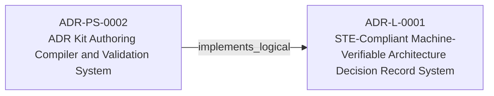

<!--
integrity_schema_version: 1
generated: deterministic_projection_v1
artifact_kind: rendered_adr_markdown
generator_id: adr-projection-markdown
generator_version: 3
hash_algorithm: sha256
source_hash: 0d66a9f2119fa60b07fb2a133f28aa47a59adbad04d53d5e727eb1fea84a0533
rendered_hash: d412d600bdd8eb6474a3200716c6592b9a9aae97b6eb7400316d604a7413b8d9
-->

# ADR-L-0001: STE-Compliant Machine-Verifiable Architecture Decision Record System

## Identity / Status

**Type:** logical  
**Status:** accepted  
**Alias:** ADR-L-0001  
**Alias name:** ste-compliant-machine-verifiable-architecture-decision-record-system  
**Created:** 2026-03-07  
**Authors:** erik.gallmann  
**Domains:** architecture, governance  

## Architecture Position

Logical architecture authority for this subject. Neighborhood paths use structural bridges plus exactly one semantic architecture edge; they never invent ADR-to-ADR verbs.

## Architecture Neighborhood




### Semantic architecture inventory

- `implements_logical`: ADR-PS-0002 → ADR-L-0001

## Neighbor Relationships

### ADR-PS-0002 — ADR Kit Authoring Compiler and Validation System

- ADR-PS-0002 -[:implements_logical]-> ADR-L-0001

**Context:** adr-architecture-kit operates as an authoring-time compiler and validation system rather
than a collection of unrelated generators. The implementation includes an
explicit compiler pipeline, contract validation, normalized repository/model
access, integrity verification, and CLI orchestration over those surfaces.

[Open projection](../physical-system/ADR-PS-0002-adr-kit-authoring-compiler-and-validation-system.md)

### Lifecycle / association

- ADR-L-0001 -[:references]-> ADR-L-0025
- ADR-L-0004 -[:references]-> ADR-L-0001
- ADR-L-0003 -[:references]-> ADR-L-0001
- ADR-L-0007 -[:references]-> ADR-L-0001
- ADR-L-0002 -[:references]-> ADR-L-0001
- ADR-L-0008 -[:references]-> ADR-L-0001
- ADR-L-0009 -[:references]-> ADR-L-0001
- ADR-L-0011 -[:references]-> ADR-L-0001
- ADR-L-0010 -[:references]-> ADR-L-0001
- ADR-L-0018 -[:references]-> ADR-L-0001
- ADR-L-0025 -[:references]-> ADR-L-0001

## Context

# ADR Architecture Kit — STE Authoring Subsystem

This ADR captures the design of the ADR Architecture Kit as the STE authoring
subsystem for canonical ADR encoding and authoring-time validation. ADR Kit is
subordinate to ste-spec (normative contracts), ste-runtime (runtime evidence),
and ste-kernel (admission and governance). It does not own those responsibilities.

## Problem Space

Architecture documentation suffers from fundamental problems:

1. **Implicit assumptions** - Architecture decisions rely on undocumented context
2. **Drift** - Documentation diverges from implementation without detection
3. **Narrative ambiguity** - Free-form markdown prevents deterministic reasoning
4. **Manual governance** - No automated validation of architectural compliance
5. **Disconnected artifacts** - Architecture docs don't participate in semantic reasoning

## Business Drivers

The System of Thought Engineering (STE) framework provides a normative specification for
governable AI cognition. ADR Kit provides the authoring-time layer for canonical ADR
encoding, enabling:

- **Deterministic architecture reasoning** - AI systems reason over structured artifacts
- **Automated governance** - Schema validation replaces manual review
- **Semantic graph integration** - Architecture participates in downstream graph extraction
- **Policy propagation** - Architectural decisions become enforceable constraints downstream
- **Authoring correctness** - Schema-validated ADRs before they enter the runtime pipeline

## Constraints

This system operates under STE invariants:

- **PRIME-1**: No implicit assumptions (all architecture explicit)
- **PRIME-2**: No undeclared state (all metadata in frontmatter)
- **SYS-2**: Deterministic cognition through constraints (schema validation)
- **SYS-4**: Drift prevention as first-class objective (violations halt execution)
- **SYS-5**: ADRs as authoritative authoring source (ADRs precede implementation)
- **SYS-6**: RECON completion prerequisite (architecture extracted before reasoning)
- **SYS-13**: Graph completeness (bidirectional relationships)
- **SYS-14**: Index currency (manifest generated from ADRs)

## STE Platform Position

ADR Kit is the authoring subsystem in the STE platform. Its authority is scoped
to authoring correctness and the adapter layer into the public Architecture IR contract:

```
ste-spec (normative contracts and public Architecture IR schema)
    ↓ governs
adr-architecture-kit (authoring subsystem — this project)
    ↓ emits ADR-derived IR fragments conforming to ste-spec contract
ste-runtime (runtime evidence extraction and composition)
    ↓ provides evidence to
ste-kernel (admission and governance over compiled inputs)
```


## Internal Structure

```mermaid
flowchart TB
  n_019fee89_e615_70a5_861b_b2dde147e5af["ADR-L-0001<br/>STE-Compliant Machine-Verifiable Architecture Decision Record System"]
  subgraph sg_capability["capability"]
    n_019fee89_e614_7c68_be36_2c84d4579279["CAP-0001<br/>Machine-Verifiable Architecture Documentation"]
    n_019fee89_e614_707f_8d3f_7a814d286ce6["CAP-0002<br/>Two-Layer Architecture Model"]
    n_019fee89_e614_7485_bb12_e90f01c3968e["CAP-0003<br/>Semantic Graph Integration"]
    n_019fee89_e614_733f_9e37_fbd70087182d["CAP-0004<br/>Explicit Gap Tracking"]
    n_019fee89_e615_7c41_b23f_a324d60b48e1["CAP-0005<br/>Derived Manifest Generation"]
    n_019fee89_e615_7946_a53f_af6bf655dc11["CAP-0006<br/>Policy Integration Readiness"]
    n_019fee89_e615_7b72_b72b_d07441bebf10["CAP-0007<br/>Correction Agent Context"]
  end
  subgraph sg_decision["decision"]
    n_019fee89_e615_7bb9_ad3b_93d12b0f65b6["DEC-0001<br/>Use YAML with embedded markdown, not markdown with YAML frontmatter"]
    n_019fee89_e615_76f6_a33f_33eef61e39a9["DEC-0002<br/>Separate logical and physical ADRs with distinct schemas"]
    n_019fee89_e615_7a31_b11f_daf8feef12d9["DEC-0003<br/>Rich frontmatter as authoritative metadata, manifest as derived view"]
    n_019fee89_e615_7899_8d3b_0ecfe4490994["DEC-0004<br/>Governed type-prefixed human-recognition aliases (ADR-L-XXXX / ADR-PS-XXXX / ADR-PC-XXXX) with 4-digit numbering; UUID is canonical machine identity"]
    n_019fee89_e615_7f04_931e_170f4cbef292["DEC-0005<br/>PROJECT.yaml for project-level metadata, separate from ADR metadata"]
    n_019fee89_e615_7d96_880f_40f6e38f3e88["DEC-0006<br/>Dogfooding strategy - document this project using ADR Kit"]
  end
  subgraph sg_invariant["invariant"]
    n_019fee89_e615_713e_b627_2ee4bf985295["INV-0001"]
    n_019fee89_e615_7ea2_bc3e_a0ef2ccfc13a["INV-0002"]
    n_019fee89_e615_798a_9837_f96eab766747["INV-0003"]
    n_019fee89_e615_76c9_932b_d2c94632b373["INV-0004"]
    n_019fee89_e615_7f6f_9b2e_d7c959fa8909["INV-0005"]
    n_019fee89_e615_7287_b737_ec91d4115b04["INV-0006"]
    n_019fee89_e615_7502_a52f_af65757c9fd2["INV-0007"]
  end
  subgraph sg_boundary["boundary"]
    n_019fee89_e614_7304_881c_fdc95e14e704["BOUND-0001<br/>Logical vs Physical Separation"]
    n_019fee89_e614_795f_a62b_d6d1ebcdd6ac["BOUND-0002<br/>ADR Kit vs ste-runtime Separation"]
    n_019fee89_e614_7a79_aa1e_8ad7395cf4f2["BOUND-0003<br/>Frontmatter as Authority"]
  end
  subgraph sg_contract["contract"]
    n_019fee89_e615_74df_8433_acb8769aa8a6["CONTRACT-0001"]
    n_019fee89_e615_70d2_ad37_4be4c7277ebc["CONTRACT-0002"]
  end
  n_019fee89_e614_707f_8d3f_7a814d286ce6 -->|"declared_in"| n_019fee89_e615_70a5_861b_b2dde147e5af
  n_019fee89_e614_7304_881c_fdc95e14e704 -->|"declared_in"| n_019fee89_e615_70a5_861b_b2dde147e5af
  n_019fee89_e614_733f_9e37_fbd70087182d -->|"declared_in"| n_019fee89_e615_70a5_861b_b2dde147e5af
  n_019fee89_e614_7485_bb12_e90f01c3968e -->|"declared_in"| n_019fee89_e615_70a5_861b_b2dde147e5af
  n_019fee89_e614_795f_a62b_d6d1ebcdd6ac -->|"declared_in"| n_019fee89_e615_70a5_861b_b2dde147e5af
  n_019fee89_e614_7a79_aa1e_8ad7395cf4f2 -->|"declared_in"| n_019fee89_e615_70a5_861b_b2dde147e5af
  n_019fee89_e614_7c68_be36_2c84d4579279 -->|"declared_in"| n_019fee89_e615_70a5_861b_b2dde147e5af
  n_019fee89_e615_70d2_ad37_4be4c7277ebc -->|"declared_in"| n_019fee89_e615_70a5_861b_b2dde147e5af
  n_019fee89_e615_713e_b627_2ee4bf985295 -->|"declared_in"| n_019fee89_e615_70a5_861b_b2dde147e5af
  n_019fee89_e615_7287_b737_ec91d4115b04 -->|"declared_in"| n_019fee89_e615_70a5_861b_b2dde147e5af
  n_019fee89_e615_74df_8433_acb8769aa8a6 -->|"declared_in"| n_019fee89_e615_70a5_861b_b2dde147e5af
  n_019fee89_e615_7502_a52f_af65757c9fd2 -->|"declared_in"| n_019fee89_e615_70a5_861b_b2dde147e5af
  n_019fee89_e615_76c9_932b_d2c94632b373 -->|"declared_in"| n_019fee89_e615_70a5_861b_b2dde147e5af
  n_019fee89_e615_76f6_a33f_33eef61e39a9 -->|"declared_in"| n_019fee89_e615_70a5_861b_b2dde147e5af
  n_019fee89_e615_7899_8d3b_0ecfe4490994 -->|"declared_in"| n_019fee89_e615_70a5_861b_b2dde147e5af
  n_019fee89_e615_7946_a53f_af6bf655dc11 -->|"declared_in"| n_019fee89_e615_70a5_861b_b2dde147e5af
  n_019fee89_e615_798a_9837_f96eab766747 -->|"declared_in"| n_019fee89_e615_70a5_861b_b2dde147e5af
  n_019fee89_e615_7a31_b11f_daf8feef12d9 -->|"declared_in"| n_019fee89_e615_70a5_861b_b2dde147e5af
  n_019fee89_e615_7b72_b72b_d07441bebf10 -->|"declared_in"| n_019fee89_e615_70a5_861b_b2dde147e5af
  n_019fee89_e615_7bb9_ad3b_93d12b0f65b6 -->|"declared_in"| n_019fee89_e615_70a5_861b_b2dde147e5af
  n_019fee89_e615_7c41_b23f_a324d60b48e1 -->|"declared_in"| n_019fee89_e615_70a5_861b_b2dde147e5af
  n_019fee89_e615_7d96_880f_40f6e38f3e88 -->|"declared_in"| n_019fee89_e615_70a5_861b_b2dde147e5af
  n_019fee89_e615_7ea2_bc3e_a0ef2ccfc13a -->|"declared_in"| n_019fee89_e615_70a5_861b_b2dde147e5af
  n_019fee89_e615_7f04_931e_170f4cbef292 -->|"declared_in"| n_019fee89_e615_70a5_861b_b2dde147e5af
  n_019fee89_e615_7f6f_9b2e_d7c959fa8909 -->|"declared_in"| n_019fee89_e615_70a5_861b_b2dde147e5af
  n_019fee89_e615_76f6_a33f_33eef61e39a9 -->|"enforces"| n_019fee89_e615_798a_9837_f96eab766747
  n_019fee89_e615_76f6_a33f_33eef61e39a9 -->|"enforces"| n_019fee89_e615_7ea2_bc3e_a0ef2ccfc13a
  n_019fee89_e615_7899_8d3b_0ecfe4490994 -->|"enforces"| n_019fee89_e615_7f6f_9b2e_d7c959fa8909
  n_019fee89_e615_7a31_b11f_daf8feef12d9 -->|"enforces"| n_019fee89_e615_76c9_932b_d2c94632b373
  n_019fee89_e615_7bb9_ad3b_93d12b0f65b6 -->|"enforces"| n_019fee89_e615_713e_b627_2ee4bf985295
```



- `boundary` BOUND-0001 — Logical vs Physical Separation
- `boundary` BOUND-0002 — ADR Kit vs ste-runtime Separation
- `boundary` BOUND-0003 — Frontmatter as Authority
- `capability` CAP-0001 — Machine-Verifiable Architecture Documentation
- `capability` CAP-0002 — Two-Layer Architecture Model
- `capability` CAP-0003 — Semantic Graph Integration
- `capability` CAP-0004 — Explicit Gap Tracking
- `capability` CAP-0005 — Derived Manifest Generation
- `capability` CAP-0006 — Policy Integration Readiness
- `capability` CAP-0007 — Correction Agent Context
- `contract` CONTRACT-0001 — CONTRACT-0001
- `contract` CONTRACT-0002 — CONTRACT-0002
- `decision` DEC-0001 — Use YAML with embedded markdown, not markdown with YAML frontmatter
- `decision` DEC-0002 — Separate logical and physical ADRs with distinct schemas
- `decision` DEC-0003 — Rich frontmatter as authoritative metadata, manifest as derived view
- `decision` DEC-0004 — Governed type-prefixed human-recognition aliases (ADR-L-XXXX / ADR-PS-XXXX / ADR-PC-XXXX) with 4-digit numbering; UUID is canonical machine identity
- `decision` DEC-0005 — PROJECT.yaml for project-level metadata, separate from ADR metadata
- `decision` DEC-0006 — Dogfooding strategy - document this project using ADR Kit
- `invariant` INV-0001 — INV-0001
- `invariant` INV-0002 — INV-0002
- `invariant` INV-0003 — INV-0003
- `invariant` INV-0004 — INV-0004
- `invariant` INV-0005 — INV-0005
- `invariant` INV-0006 — INV-0006
- `invariant` INV-0007 — INV-0007

## Capabilities

### CAP-0001: Machine-Verifiable Architecture Documentation

Enable AI systems to deterministically reason over architecture decisions through
structured, schema-validated artifacts. No ambiguous markdown parsing, no implicit
assumptions, no narrative drift.


### CAP-0002: Two-Layer Architecture Model

Separate conceptual design (logical ADRs) from implementation specifications
- Physical architecture is authored as ADR-PS (physical-system) and ADR-PC (physical-component) documents; generic ADR-P authoring is retired from current authority (historical identity preserved via retirement map)
invariants without implementation details. Physical ADRs operationalize logical
designs with technology choices and component specifications.


### CAP-0003: Semantic Graph Integration

Architecture artifacts participate in ste-runtime semantic graph through RECON
extraction. ADRs become graph nodes with typed edges (implements, relates_to,
enforces), enabling graph queries, blast radius analysis, and policy propagation.


### CAP-0004: Explicit Gap Tracking

Incomplete designs are first-class schema elements. Gaps are structured with
impact assessment, blocking status, and decision ownership. Convergence validation
ensures gaps are resolved or explicitly tracked.


### CAP-0005: Derived Manifest Generation

Manifest is generated from authoritative ADRs, never manually edited. Provides
fast discovery without reading all ADRs. CI validates manifest freshness (SYS-14).


### CAP-0006: Policy Integration Readiness

Schema includes policy_reference, enforcement_level, compliance_frameworks fields
to enable future Rules & Signal Service validation. Invariants can be extracted
into requirement registry and validated against organizational policy.


### CAP-0007: Correction Agent Context

Schema includes implementation_identifiers, ownership, automation flags to enable
future correction agents. Agents can locate code, understand boundaries, and
operate within safety constraints.


## Decisions

### DEC-0001: Use YAML with embedded markdown, not markdown with YAML frontmatter

**Rationale:**
**AI reasoning advantages:**
- Deterministic structure (no markdown parsing ambiguity)
- Direct field access (adr.decisions[0].rationale)
- Schema-validated before processing
- Clear separation of metadata vs content
- Graph extraction is straightforward

**Human advantages:**
- Readable source format
- Rich prose in markdown fields
- Version control friendly
- Generate beautiful views from structured data


**Alternatives Considered:**

- **Markdown with YAML frontmatter**: Markdown structure is ambiguous. Heading levels vary. Content parsing is
non-deterministic. Schema validation is difficult. Graph extraction requires
complex markdown parsing.

- **Pure JSON**: Not human-friendly for writing. No rich prose support. Verbose for long
text content. Poor version control diffs.


**Related Invariants:** 019fee89-e615-713e-b627-2ee4bf985295
### DEC-0002: Separate logical and physical ADRs with distinct schemas

**Rationale:**
**Architectural discipline:**
- Enforces separation of concerns (intent vs implementation)
- Prevents implementation bias in conceptual design
- Enables different validation rules per type
- Clear semantic distinction for AI reasoning

**Traceability:**
- Physical ADRs explicitly reference logical ADRs (implements_logical field)
- Graph edges from physical to logical (realization relationship)
- Impact analysis: "What implements ADR-L-0001?"

**Multiple implementations:**
- One logical design can have multiple physical implementations
- Technology migrations don't change logical architecture
- A/B testing of implementation approaches


**Alternatives Considered:**

- **Single unified ADR schema**: Cannot enforce logical/physical separation. Implementation details leak into
conceptual design. Validation rules conflict (logical forbids impl details,
physical requires them).

- **Separate document types (not ADRs)**: Loses semantic relationship. Traceability becomes manual. Graph extraction
more complex. Violates principle of unified architecture documentation.


**Related Invariants:** 019fee89-e615-7ea2-bc3e-a0ef2ccfc13a, 019fee89-e615-798a-9837-f96eab766747
### DEC-0003: Rich frontmatter as authoritative metadata, manifest as derived view

**Rationale:**
**Single source of truth:**
- All discovery metadata in ADR frontmatter
- No drift between ADR and manifest
- Atomic updates (metadata + content change together)
- Version controlled metadata
- Schema validated correctness

**Manifest governance:**
- Generated via `adr generate-manifest`
- Never manually edited
- CI validates freshness (SYS-14)
- Stale manifest = CI failure
- Regenerable anytime

**Fast discovery:**
- Query manifest for simple lookups
- Read ADRs only when needed
- Graph queries for complex reasoning


**Alternatives Considered:**

- **Lightweight frontmatter, rich manifest**: Manifest becomes authoritative. Drift risk (manifest not updated). Metadata
changes not version controlled. Schema validation only on manifest, not ADRs.

- **No manifest, always read ADRs**: Slow discovery (must read all ADRs). No fast lookup. Violates SYS-14
(Index Currency requirement).


**Related Invariants:** 019fee89-e615-76c9-932b-d2c94632b373
### DEC-0004: Governed type-prefixed human-recognition aliases (ADR-L-XXXX / ADR-PS-XXXX / ADR-PC-XXXX) with 4-digit numbering; UUID is canonical machine identity


**Rationale:**
**Human recognition aliases:**
- Type-prefixed IDs remain project-local governed `alias_id` surfaces
- Alias uniqueness and type visibility remain valuable for documentation
- Alias allocation never alters immutable UUID canonical machine identity

**Canonical machine identity:**
- Admitted identity-bearing records use lowercase RFC 9562 UUIDv7 in `id`
- Graph / machine operations resolve to UUID, not type-prefixed aliases


**Alternatives Considered:**

- **Shared numbering (ADR-0001, ADR-0002)**: Collision risk (logical and physical share namespace). Type not visible
in ID. Requires reading ADR to know type.

- **UUID-only human-facing identifiers**: UUIDs are poor human-recognition and documentation surfaces. UUID remains
canonical machine identity, while type-prefixed values continue as governed
human-recognition aliases rather than substitutes for UUID.


**Related Invariants:** 019fee89-e615-7f6f-9b2e-d7c959fa8909
### DEC-0005: PROJECT.yaml for project-level metadata, separate from ADR metadata

**Rationale:**
**Right level of granularity:**
- Ownership, automation, integrations belong at project level
- Not repeated in every ADR
- Single source of truth for operational metadata

**Executable configuration:**
- CI reads PROJECT.yaml → provisions infrastructure
- Datadog dashboards, PagerDuty schedules, IAM roles
- Self-service onboarding

**Correction agent context:**
- Agents read PROJECT.yaml to understand boundaries
- Automation flags define what agents can do
- Ownership metadata enables escalation

**Reduced duplication:**
- Team changes? Update one file, not 50 ADRs


**Alternatives Considered:**

- **Ownership in every ADR frontmatter**: Wrong granularity. Duplication across ADRs. Team changes require updating
all ADRs. Operational metadata mixed with architectural metadata.

- **Separate config files per concern**: Fragmentation. Multiple files to update. No single source of truth. Harder
for correction agents to understand context.


### DEC-0006: Dogfooding strategy - document this project using ADR Kit

**Rationale:**
**Real friction drives design:**
- If we can't document our decisions, schema is incomplete
- Actual usage reveals gaps and awkwardness
- Validates STE compliance through practice

**Living specification:**
- Project ADRs become reference implementation
- Future contributors understand WHY
- Evolves as system crystallizes

**Execution pressure:**
- Forces schema completeness
- Validates graph extraction
- Tests manifest generation
- Proves view generation works


**Alternatives Considered:**

- **Artificial examples only**: Examples don't reveal real friction. No execution pressure. Incomplete
validation of schema. Not a living specification.


## Invariants

### INV-0001

**Statement:** All ADRs must validate against JSON Schema before commit  
**Scope:** global  
**Enforcement:** must (policy)

**Rationale:**
Schema validation ensures structural integrity, STE compliance, and prevents
divergence. CI must fail on schema violations (SYS-4: Drift Prevention).


### INV-0002

**Statement:** Logical ADRs must not contain implementation details  
**Scope:** global  
**Enforcement:** must (design)

**Rationale:**
Enforces architectural discipline. Prevents implementation bias in conceptual
design. Enables multiple physical implementations of logical designs.


### INV-0003

**Statement:** Physical ADRs must reference at least one logical ADR  
**Scope:** global  
**Enforcement:** must (design)

**Rationale:**
Ensures traceability from implementation to intent. Every implementation must
have architectural rationale. Enables impact analysis via graph traversal.


### INV-0004

**Statement:** Manifest must be regenerated when ADRs change  
**Scope:** global  
**Enforcement:** must (policy)

**Rationale:**
SYS-14: Index Currency. Stale manifest = divergence. CI validates manifest
freshness. Manifest is derived, never manually edited.


### INV-0005

**Statement:** Project-local ADR alias IDs must be unique across the project while canonical machine identity remains UUID  
**Scope:** global  
**Enforcement:** must (design)

**Rationale:**
Governed type-prefixed aliases require project-local uniqueness for human recognition and documentation. Alias uniqueness does not make type-prefixed values graph node identity; machine identity and relationship targets use UUID.


### INV-0006

**Statement:** Schema changes must be documented in ADRs before implementation  
**Scope:** global  
**Enforcement:** must (policy)

**Rationale:**
ADR Kit is meta-system - schema authority. Schema changes affect all projects.
Changes must be documented with rationale, alternatives, and consequences.


### INV-0007

**Statement:** Schema evolution must maintain backward compatibility unless major version  
**Scope:** global  
**Enforcement:** must (design)

**Rationale:**
Enables gradual migration. Old tools read new ADRs (skip unknown fields).
New tools read old ADRs (provide defaults). Breaking changes only in v2.0+.


## Constraints

### CONST-0001

YAML with embedded markdown, not markdown with YAML frontmatter.


### CONST-0002

Type-prefixed IDs (ADR-L-XXXX, ADR-PS-XXXX, ADR-PC-XXXX) are governed human-recognition aliases with 4-digit numbering; canonical machine identity is UUID.


### CONST-0003

Dogfooding from day 1 - this project documents itself using ADR Kit.


### CONST-0004

Schema must support future use cases without breaking changes.


---

*Generated from ADR-L-0001 by ADR Architecture Kit (projection v3)*