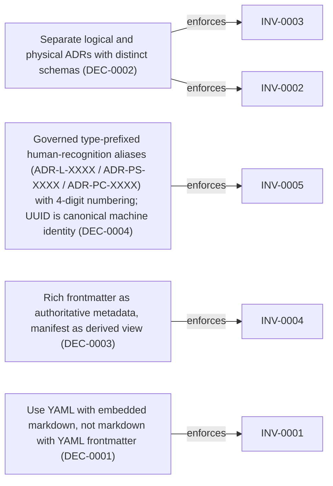

<!--
integrity_schema_version: 1
generated: deterministic_projection_v1
artifact_kind: rendered_adr_markdown
generator_id: adr-projection-markdown
generator_version: 3
hash_algorithm: sha256
source_hash: 893b4be9dfd0fc725e6ca7514bc18fb1d60d601cc96d0e189f9c4c367115bb64
rendered_hash: 82bb287bb088d9a133c500cdcc155d8568d30b915c400c65b60a62491dde4426
-->

# ADR-L-0001: STE-Compliant Machine-Verifiable Architecture Decision Record System

## Identity / Status

**Type:** logical  
**Status:** accepted  
**Alias:** ADR-L-0001  
**Authoring contract:** authoring v1.5  
**Created:** 2026-03-07  
**Authors:** erik.gallmann  
**Domains:** architecture, governance  
**Tags:** ste-compliance, machine-verifiable, ai-first, authoring-subsystem  

## Architecture at a Glance

| | |
| --- | --- |
| Logical authority | ADR-L-0001 |
| Status | accepted |
| Decisions | 6 |
| Capabilities | 7 |
| Invariants | 7 |
| Boundaries | 3 |
| Interaction contracts | 2 |
| Non-functional requirements | 4 |
| Physical realizations | [ADR-PS-0002](../physical-system/ADR-PS-0002-adr-kit-authoring-compiler-and-validation-system.md) |


## Context

# ADR Architecture Kit — STE Authoring Subsystem

This ADR captures the design of the ADR Architecture Kit as the STE authoring
subsystem for canonical ADR encoding and authoring-time validation. ADR Kit is
subordinate to ste-spec (normative contracts), ste-runtime (runtime evidence),
and ste-kernel (admission and governance). It does not own those responsibilities.

## Problem Space

Architecture documentation suffers from fundamental problems:

1. **Implicit assumptions** - Architecture decisions rely on undocumented context
2. **Drift** - Documentation diverges from implementation without detection
3. **Narrative ambiguity** - Free-form markdown prevents deterministic reasoning
4. **Manual governance** - No automated validation of architectural compliance
5. **Disconnected artifacts** - Architecture docs don't participate in semantic reasoning

## Business Drivers

The System of Thought Engineering (STE) framework provides a normative specification for
governable AI cognition. ADR Kit provides the authoring-time layer for canonical ADR
encoding, enabling:

- **Deterministic architecture reasoning** - AI systems reason over structured artifacts
- **Automated governance** - Schema validation replaces manual review
- **Semantic graph integration** - Architecture participates in downstream graph extraction
- **Policy propagation** - Architectural decisions become enforceable constraints downstream
- **Authoring correctness** - Schema-validated ADRs before they enter the runtime pipeline

## Constraints

This system operates under STE invariants:

- **PRIME-1**: No implicit assumptions (all architecture explicit)
- **PRIME-2**: No undeclared state (all metadata in frontmatter)
- **SYS-2**: Deterministic cognition through constraints (schema validation)
- **SYS-4**: Drift prevention as first-class objective (violations halt execution)
- **SYS-5**: ADRs as authoritative authoring source (ADRs precede implementation)
- **SYS-6**: RECON completion prerequisite (architecture extracted before reasoning)
- **SYS-13**: Graph completeness (bidirectional relationships)
- **SYS-14**: Index currency (manifest generated from ADRs)

## STE Platform Position

ADR Kit is the authoring subsystem in the STE platform. Its authority is scoped
to authoring correctness and the adapter layer into the public Architecture IR contract:

```
ste-spec (normative contracts and public Architecture IR schema)
    ↓ governs
adr-architecture-kit (authoring subsystem — this project)
    ↓ emits ADR-derived IR fragments conforming to ste-spec contract
ste-runtime (runtime evidence extraction and composition)
    ↓ provides evidence to
ste-kernel (admission and governance over compiled inputs)
```
## Architectural Decisions

| Decision | Choice | Traceability |
| --- | --- | --- |
| DEC-0001 | Use YAML with embedded markdown, not markdown with YAML frontmatter | Related INV-0001 |
| DEC-0002 | Separate logical and physical ADRs with distinct schemas | Related INV-0002, INV-0003 |
| DEC-0003 | Rich frontmatter as authoritative metadata, manifest as derived view | Related INV-0004 |
| DEC-0004 | Governed type-prefixed human-recognition aliases (ADR-L-XXXX / ADR-PS-XXXX / ADR-PC-XXXX) with 4-digit numbering; UUID is canonical machine identity | Related INV-0005 |
| DEC-0005 | PROJECT.yaml for project-level metadata, separate from ADR metadata | — |
| DEC-0006 | Dogfooding strategy - document this project using ADR Kit | — |

### DEC-0001 — Use YAML with embedded markdown, not markdown with YAML frontmatter

**Rationale**

**AI reasoning advantages:**
- Deterministic structure (no markdown parsing ambiguity)
- Direct field access (adr.decisions[0].rationale)
- Schema-validated before processing
- Clear separation of metadata vs content
- Graph extraction is straightforward

**Human advantages:**
- Readable source format
- Rich prose in markdown fields
- Version control friendly
- Generate beautiful views from structured data

**Alternatives Considered**

| Alternative | Rejected because |
| --- | --- |
| Markdown with YAML frontmatter | Markdown structure is ambiguous. Heading levels vary. Content parsing is<br>non-deterministic. Schema validation is difficult. Graph extraction requires<br>complex markdown parsing. |
| Pure JSON | Not human-friendly for writing. No rich prose support. Verbose for long<br>text content. Poor version control diffs. |

**Consequences**

Positive:
- Deterministic parsing and validation
- Direct field access for AI reasoning
- Schema validation before use
- Graph extraction is straightforward
- Human-readable source format

Negative:
- Learning curve for YAML syntax
- Requires tooling for view generation
- Less familiar than pure markdown

**Traceability**
- Related invariants: INV-0001

### DEC-0002 — Separate logical and physical ADRs with distinct schemas

**Rationale**

**Architectural discipline:**
- Enforces separation of concerns (intent vs implementation)
- Prevents implementation bias in conceptual design
- Enables different validation rules per type
- Clear semantic distinction for AI reasoning

**Traceability:**
- Physical ADRs explicitly reference logical ADRs (implements_logical field)
- Graph edges from physical to logical (realization relationship)
- Impact analysis: "What implements ADR-L-0001?"

**Multiple implementations:**
- One logical design can have multiple physical implementations
- Technology migrations don't change logical architecture
- A/B testing of implementation approaches

**Alternatives Considered**

| Alternative | Rejected because |
| --- | --- |
| Single unified ADR schema | Cannot enforce logical/physical separation. Implementation details leak into<br>conceptual design. Validation rules conflict (logical forbids impl details,<br>physical requires them). |
| Separate document types (not ADRs) | Loses semantic relationship. Traceability becomes manual. Graph extraction<br>more complex. Violates principle of unified architecture documentation. |

**Consequences**

Positive:
- Enforced architectural discipline
- Clear traceability (implements_logical edges)
- Supports multiple implementations
- Different validation rules per type

Negative:
- More complex schema (two types instead of one)
- Requires understanding of logical vs physical distinction

**Traceability**
- Related invariants: INV-0002
- Related invariants: INV-0003

### DEC-0003 — Rich frontmatter as authoritative metadata, manifest as derived view

**Rationale**

**Single source of truth:**
- All discovery metadata in ADR frontmatter
- No drift between ADR and manifest
- Atomic updates (metadata + content change together)
- Version controlled metadata
- Schema validated correctness

**Manifest governance:**
- Generated via `adr generate-manifest`
- Never manually edited
- CI validates freshness (SYS-14)
- Stale manifest = CI failure
- Regenerable anytime

**Fast discovery:**
- Query manifest for simple lookups
- Read ADRs only when needed
- Graph queries for complex reasoning

**Alternatives Considered**

| Alternative | Rejected because |
| --- | --- |
| Lightweight frontmatter, rich manifest | Manifest becomes authoritative. Drift risk (manifest not updated). Metadata<br>changes not version controlled. Schema validation only on manifest, not ADRs. |
| No manifest, always read ADRs | Slow discovery (must read all ADRs). No fast lookup. Violates SYS-14<br>(Index Currency requirement). |

**Consequences**

Positive:
- No drift possible (manifest derived from ADRs)
- Metadata version controlled
- Fast discovery via manifest
- ADRs remain authoritative

Negative:
- Must regenerate manifest after ADR changes
- CI complexity (validate manifest freshness)

**Traceability**
- Related invariants: INV-0004

### DEC-0004 — Governed type-prefixed human-recognition aliases (ADR-L-XXXX / ADR-PS-XXXX / ADR-PC-XXXX) with 4-digit numbering; UUID is canonical machine identity

**Rationale**

**Human recognition aliases:**
- Type-prefixed IDs remain project-local governed `alias_id` surfaces
- Alias uniqueness and type visibility remain valuable for documentation
- Alias allocation never alters immutable UUID canonical machine identity

**Canonical machine identity:**
- Admitted identity-bearing records use lowercase RFC 9562 UUIDv7 in `id`
- Graph / machine operations resolve to UUID, not type-prefixed aliases

**Alternatives Considered**

| Alternative | Rejected because |
| --- | --- |
| Shared numbering (ADR-0001, ADR-0002) | Collision risk (logical and physical share namespace). Type not visible<br>in ID. Requires reading ADR to know type. |
| UUID-only human-facing identifiers | UUIDs are poor human-recognition and documentation surfaces. UUID remains<br>canonical machine identity, while type-prefixed values continue as governed<br>human-recognition aliases rather than substitutes for UUID. |

**Consequences**

Positive:
- Project-local alias collisions are prevented by governed allocation
- Type remains visible in the human-recognition alias
- Human-facing references remain readable and memorable
- Canonical machine and graph identity remains stable when aliases change

Negative:
- Slightly longer IDs (ADR-L-0001 vs ADR-0001)

**Traceability**
- Related invariants: INV-0005

### DEC-0005 — PROJECT.yaml for project-level metadata, separate from ADR metadata

**Rationale**

**Right level of granularity:**
- Ownership, automation, integrations belong at project level
- Not repeated in every ADR
- Single source of truth for operational metadata

**Executable configuration:**
- CI reads PROJECT.yaml → provisions infrastructure
- Datadog dashboards, PagerDuty schedules, IAM roles
- Self-service onboarding

**Correction agent context:**
- Agents read PROJECT.yaml to understand boundaries
- Automation flags define what agents can do
- Ownership metadata enables escalation

**Reduced duplication:**
- Team changes? Update one file, not 50 ADRs

**Alternatives Considered**

| Alternative | Rejected because |
| --- | --- |
| Ownership in every ADR frontmatter | Wrong granularity. Duplication across ADRs. Team changes require updating<br>all ADRs. Operational metadata mixed with architectural metadata. |
| Separate config files per concern | Fragmentation. Multiple files to update. No single source of truth. Harder<br>for correction agents to understand context. |

**Consequences**

Positive:
- Single source of truth for project metadata
- Enables self-service infrastructure provisioning
- Correction agents have clear context
- Reduced duplication

Negative:
- Additional artifact type to maintain
- Schema complexity (one more schema)

### DEC-0006 — Dogfooding strategy - document this project using ADR Kit

**Rationale**

**Real friction drives design:**
- If we can't document our decisions, schema is incomplete
- Actual usage reveals gaps and awkwardness
- Validates STE compliance through practice

**Living specification:**
- Project ADRs become reference implementation
- Future contributors understand WHY
- Evolves as system crystallizes

**Execution pressure:**
- Forces schema completeness
- Validates graph extraction
- Tests manifest generation
- Proves view generation works

**Alternatives Considered**

| Alternative | Rejected because |
| --- | --- |
| Artificial examples only | Examples don't reveal real friction. No execution pressure. Incomplete<br>validation of schema. Not a living specification. |

**Consequences**

Positive:
- Real usage validates schema
- Friction reveals gaps
- Living specification
- Reference implementation

Negative:
- Bootstrap complexity (need minimal schema first)
- Iterative refinement required


## Capabilities

### CAP-0001 — Machine-Verifiable Architecture Documentation

Enable AI systems to deterministically reason over architecture decisions through
structured, schema-validated artifacts. No ambiguous markdown parsing, no implicit
assumptions, no narrative drift.

### CAP-0002 — Two-Layer Architecture Model

Separate conceptual design (logical ADRs) from implementation specifications
- Physical architecture is authored as ADR-PS (physical-system) and ADR-PC (physical-component) documents; generic ADR-P authoring is retired from current authority (historical identity preserved via retirement map)
invariants without implementation details. Physical ADRs operationalize logical
designs with technology choices and component specifications.

### CAP-0003 — Semantic Graph Integration

Architecture artifacts participate in ste-runtime semantic graph through RECON
extraction. ADRs become graph nodes with typed edges (implements, relates_to,
enforces), enabling graph queries, blast radius analysis, and policy propagation.

### CAP-0004 — Explicit Gap Tracking

Incomplete designs are first-class schema elements. Gaps are structured with
impact assessment, blocking status, and decision ownership. Convergence validation
ensures gaps are resolved or explicitly tracked.

### CAP-0005 — Derived Manifest Generation

Manifest is generated from authoritative ADRs, never manually edited. Provides
fast discovery without reading all ADRs. CI validates manifest freshness (SYS-14).

### CAP-0006 — Policy Integration Readiness

Schema includes policy_reference, enforcement_level, compliance_frameworks fields
to enable future Rules & Signal Service validation. Invariants can be extracted
into requirement registry and validated against organizational policy.

### CAP-0007 — Correction Agent Context

Schema includes implementation_identifiers, ownership, automation flags to enable
future correction agents. Agents can locate code, understand boundaries, and
operate within safety constraints.


## Architectural Boundaries

### BOUND-0001 — Logical vs Physical Separation

**Boundary**

Strict separation between conceptual design (logical) and implementation
specifications (physical). Enforced through distinct schemas and validation.

**Why this boundary exists**

Prevents implementation bias in architectural thinking. Enables architectural
decisions to be made independently of technology constraints. Supports multiple
physical implementations of a single logical design.

### BOUND-0002 — ADR Kit vs ste-runtime Separation

**Boundary**

ADR Kit defines structure and validates schema. ste-runtime extracts graph
via RECON. Clear separation of concerns.

**Why this boundary exists**

ADR Kit focuses on artifact structure and validation. Graph extraction is
ste-runtime's responsibility. Enables independent evolution of schema and
graph implementation.

### BOUND-0003 — Frontmatter as Authority

**Boundary**

All discovery metadata lives in ADR frontmatter (single source of truth).
Manifest is derived, never manually edited.

**Why this boundary exists**

Prevents drift between ADR and manifest. Atomic updates (metadata + content
change together). Version controlled metadata. Schema-validated correctness.


## Interaction Contracts

### CONTRACT-0001

**Parties:** adr-kit, ste-runtime

**Protocol:** YAML artifact structure

**Guarantees**

ADR Kit guarantees:
- Valid YAML with explicit structure
- Schema-validated before commit
- Type-prefixed human-recognition aliases (ADR-L-XXXX, ADR-PS-XXXX, ADR-PC-XXXX) distinct from canonical UUID machine identity
- Explicit relationships (array fields for graph edges)
- Rich frontmatter with all metadata

ste-runtime guarantees:
- RECON discovers adrs/ directory
- Parses YAML into graph nodes and edges
- Exposes graph via MCP for queries
- Validates graph extraction success

### CONTRACT-0002

**Parties:** adr-kit, json-schema

**Protocol:** JSON Schema validation

**Guarantees**

ADR Kit guarantees:
- All ADRs validate against schema before commit
- Schema violations = CI failure
- No ambiguous or optional validation

JSON Schema guarantees:
- Deterministic validation (same input = same result)
- Clear error messages with field paths
- Extensible for future schema evolution


## Invariants

| Invariant | Requirement | Enforcement | Verification |
| --- | --- | --- | --- |
| INV-0001 | All ADRs must validate against JSON Schema before commit | MUST / policy | automated |
| INV-0002 | Logical ADRs must not contain implementation details | MUST / design | manual |
| INV-0003 | Physical ADRs must reference at least one logical ADR | MUST / design | automated |
| INV-0004 | Manifest must be regenerated when ADRs change | MUST / policy | automated |
| INV-0005 | Project-local ADR alias IDs must be unique across the project while canonical machine identity remains UUID | MUST / design | automated |
| INV-0006 | Schema changes must be documented in ADRs before implementation | MUST / policy | manual |
| INV-0007 | Schema evolution must maintain backward compatibility unless major version | MUST / design | automated |

### INV-0001

**Statement**

All ADRs must validate against JSON Schema before commit

**Scope:** global

**Enforcement:** MUST (policy)
**Verification:** automated

**Rationale**

Schema validation ensures structural integrity, STE compliance, and prevents
divergence. CI must fail on schema violations (SYS-4: Drift Prevention).

### INV-0002

**Statement**

Logical ADRs must not contain implementation details

**Scope:** global

**Enforcement:** MUST (design)
**Verification:** manual

**Rationale**

Enforces architectural discipline. Prevents implementation bias in conceptual
design. Enables multiple physical implementations of logical designs.

### INV-0003

**Statement**

Physical ADRs must reference at least one logical ADR

**Scope:** global

**Enforcement:** MUST (design)
**Verification:** automated

**Rationale**

Ensures traceability from implementation to intent. Every implementation must
have architectural rationale. Enables impact analysis via graph traversal.

### INV-0004

**Statement**

Manifest must be regenerated when ADRs change

**Scope:** global

**Enforcement:** MUST (policy)
**Verification:** automated

**Rationale**

SYS-14: Index Currency. Stale manifest = divergence. CI validates manifest
freshness. Manifest is derived, never manually edited.

### INV-0005

**Statement**

Project-local ADR alias IDs must be unique across the project while canonical machine identity remains UUID

**Scope:** global

**Enforcement:** MUST (design)
**Verification:** automated

**Rationale**

Governed type-prefixed aliases require project-local uniqueness for human recognition and documentation. Alias uniqueness does not make type-prefixed values graph node identity; machine identity and relationship targets use UUID.

### INV-0006

**Statement**

Schema changes must be documented in ADRs before implementation

**Scope:** global

**Enforcement:** MUST (policy)
**Verification:** manual

**Rationale**

ADR Kit is meta-system - schema authority. Schema changes affect all projects.
Changes must be documented with rationale, alternatives, and consequences.

### INV-0007

**Statement**

Schema evolution must maintain backward compatibility unless major version

**Scope:** global

**Enforcement:** MUST (design)
**Verification:** automated

**Rationale**

Enables gradual migration. Old tools read new ADRs (skip unknown fields).
New tools read old ADRs (provide defaults). Breaking changes only in v2.0+.


## Non-Functional Requirements

| NFR | Category | Requirement | Acceptance |
| --- | --- | --- | --- |
| NFR-0001 | performance | Schema validation must complete in <100ms per ADR for files <100KB | Benchmark tests show p95 latency <100ms for typical ADR files |
| NFR-0002 | reliability | Parser must be deterministic (same input = same output every time) | Running parser 100 times on same ADR produces identical Pydantic models |
| NFR-0003 | maintainability | Schema must be extensible without breaking existing ADRs | Adding optional fields to schema doesn't invalidate existing ADRs |
| NFR-0004 | usability | Schema validation errors must be actionable (clear field path and expected format) | Error messages include field path, expected type/pattern, and actual value |


## Decision / Intent Traceability

### Decision Traceability




## Physical Realization

**Systems**
- [ADR-PS-0002](../physical-system/ADR-PS-0002-adr-kit-authoring-compiler-and-validation-system.md)


## Constraints

### CONST-0001 — technical

YAML with embedded markdown, not markdown with YAML frontmatter.

**Rationale**

Deterministic structure for AI reasoning. Direct field access without markdown
parsing ambiguity. Schema validation before processing. Clear separation of
metadata vs content.

### CONST-0002 — technical

Type-prefixed IDs (ADR-L-XXXX, ADR-PS-XXXX, ADR-PC-XXXX) are governed human-recognition aliases with 4-digit numbering; canonical machine identity is UUID.

**Rationale**

Prevents alias collision between logical and physical ADRs while keeping type visible in the human alias. Canonical machine operations and graph node identity resolve to UUID, not the type-prefixed alias.

### CONST-0003 — business

Dogfooding from day 1 - this project documents itself using ADR Kit.

**Rationale**

Real friction drives design. If we can't document our decisions, the schema is
incomplete. Validates STE compliance through actual usage. Living specification.

### CONST-0004 — technical

Schema must support future use cases without breaking changes.

**Rationale**

ADR Kit is meta-system - schema authority for architecture encoding. Schema
evolution must be backward compatible (optional fields, version signaling).
Enables PROJECT.yaml, Decision ADRs, policy validation, correction agents.


## Governance / Bindings / Evidence

### Ownership

**Architecture authority:** architecture-systems
**Implementation owners:** architecture-systems


## Lifecycle / Related Architecture

**Related ADRs**
- [ADR-L-0025](ADR-L-0025-topology-and-contract-succession-authority.md)

**References**
- [ADR-L-0025](ADR-L-0025-topology-and-contract-succession-authority.md)
- [ADR-L-0004](ADR-L-0004-adr-to-implementation-traceability-via-decorators-and-metadata-attribution.md)
- [ADR-L-0003](ADR-L-0003-quality-assurance-and-testing-strategy.md)
- [ADR-L-0007](ADR-L-0007-deterministic-documentation-projection.md)
- [ADR-L-0002](ADR-L-0002-multi-scope-adr-architecture-for-sub-module-development.md)
- [ADR-L-0008](ADR-L-0008-validation-modes-for-draft-and-complete-adrs.md)
- [ADR-L-0009](ADR-L-0009-derived-architecture-discovery-surfaces.md)
- [ADR-L-0011](ADR-L-0011-metadata-schemas-and-remediation-ledger-enforcement.md)
- [ADR-L-0010](ADR-L-0010-kernel-interface-contract-and-validation-profiles.md)
- [ADR-L-0018](ADR-L-0018-schema-v1-2-and-normalized-semantic-foundation.md)


## Architecture Relationships

| Neighbor | Relationship | Exact Path |
| --- | --- | --- |
| [ADR-PS-0002 — ADR Kit Authoring Compiler and Validation System](../physical-system/ADR-PS-0002-adr-kit-authoring-compiler-and-validation-system.md) | implements this logical authority | `ADR-PS-0002 -[:implements_logical]-> ADR-L-0001` |


---

*Generated from ADR-L-0001 by ADR Architecture Kit (projection v3)*