<!--
integrity_schema_version: 1
generated: deterministic_projection_v1
artifact_kind: rendered_adr_markdown
generator_id: adr-projection-markdown
generator_version: 2
hash_algorithm: sha256
source_hash: 750ddf0ac440127199e88152674baa8cde30a194275e55fe853cf5903f80f4a4
rendered_hash: 2d095b5d4dc702a10087b74512b56d3f1ea887099f17fdab7f4b43abaf236cec
-->

# ADR-L-0001: STE-Compliant Machine-Verifiable Architecture Decision Record System

**Status:** accepted  
**Created:** 2026-03-07  
**Authors:** erik.gallmann  
**Domains:** architecture, governance  
**Tags:** ste-compliance, machine-verifiable, ai-first, authoring-subsystem  
**Alias name:** ste-compliant-machine-verifiable-architecture-decision-record-system  

## Context

# ADR Architecture Kit — STE Authoring Subsystem

This ADR captures the design of the ADR Architecture Kit as the STE authoring
subsystem for canonical ADR encoding and authoring-time validation. ADR Kit is
subordinate to ste-spec (normative contracts), ste-runtime (runtime evidence),
and ste-kernel (admission and governance). It does not own those responsibilities.

## Problem Space

Architecture documentation suffers from fundamental problems:

1. **Implicit assumptions** - Architecture decisions rely on undocumented context
2. **Drift** - Documentation diverges from implementation without detection
3. **Narrative ambiguity** - Free-form markdown prevents deterministic reasoning
4. **Manual governance** - No automated validation of architectural compliance
5. **Disconnected artifacts** - Architecture docs don't participate in semantic reasoning

## Business Drivers

The System of Thought Engineering (STE) framework provides a normative specification for
governable AI cognition. ADR Kit provides the authoring-time layer for canonical ADR
encoding, enabling:

- **Deterministic architecture reasoning** - AI systems reason over structured artifacts
- **Automated governance** - Schema validation replaces manual review
- **Semantic graph integration** - Architecture participates in downstream graph extraction
- **Policy propagation** - Architectural decisions become enforceable constraints downstream
- **Authoring correctness** - Schema-validated ADRs before they enter the runtime pipeline

## Constraints

This system operates under STE invariants:

- **PRIME-1**: No implicit assumptions (all architecture explicit)
- **PRIME-2**: No undeclared state (all metadata in frontmatter)
- **SYS-2**: Deterministic cognition through constraints (schema validation)
- **SYS-4**: Drift prevention as first-class objective (violations halt execution)
- **SYS-5**: ADRs as authoritative authoring source (ADRs precede implementation)
- **SYS-6**: RECON completion prerequisite (architecture extracted before reasoning)
- **SYS-13**: Graph completeness (bidirectional relationships)
- **SYS-14**: Index currency (manifest generated from ADRs)

## STE Platform Position

ADR Kit is the authoring subsystem in the STE platform. Its authority is scoped
to authoring correctness and the adapter layer into the public Architecture IR contract:

```
ste-spec (normative contracts and public Architecture IR schema)
    ↓ governs
adr-architecture-kit (authoring subsystem — this project)
    ↓ emits ADR-derived IR fragments conforming to ste-spec contract
ste-runtime (runtime evidence extraction and composition)
    ↓ provides evidence to
ste-kernel (admission and governance over compiled inputs)
```


## Relationship graph

```mermaid
flowchart LR
  n_019fee89_e614_707f_8d3f_7a814d286ce6["CAP-0002"]
  n_019fee89_e614_7304_881c_fdc95e14e704["BOUND-0001"]
  n_019fee89_e614_733f_9e37_fbd70087182d["CAP-0004"]
  n_019fee89_e614_7485_bb12_e90f01c3968e["CAP-0003"]
  n_019fee89_e614_795f_a62b_d6d1ebcdd6ac["BOUND-0002"]
  n_019fee89_e614_7a79_aa1e_8ad7395cf4f2["BOUND-0003"]
  n_019fee89_e614_7c68_be36_2c84d4579279["CAP-0001"]
  n_019fee89_e615_70a5_861b_b2dde147e5af["ADR-L-0001"]
  n_019fee89_e615_70d2_ad37_4be4c7277ebc["CONTRACT-0002"]
  n_019fee89_e615_713e_b627_2ee4bf985295["INV-0001"]
  n_019fee89_e615_7287_b737_ec91d4115b04["INV-0006"]
  n_019fee89_e615_74df_8433_acb8769aa8a6["CONTRACT-0001"]
  n_019fee89_e615_7502_a52f_af65757c9fd2["INV-0007"]
  n_019fee89_e615_7577_8d37_dd0df031bec9["ADR-L-0004"]
  n_019fee89_e615_76c9_932b_d2c94632b373["INV-0004"]
  n_019fee89_e615_76f6_a33f_33eef61e39a9["DEC-0002"]
  n_019fee89_e615_77f6_9b1f_695732d25443["ADR-L-0003"]
  n_019fee89_e615_7899_8d3b_0ecfe4490994["DEC-0004"]
  n_019fee89_e615_7946_a53f_af6bf655dc11["CAP-0006"]
  n_019fee89_e615_798a_9837_f96eab766747["INV-0003"]
  n_019fee89_e615_7a31_b11f_daf8feef12d9["DEC-0003"]
  n_019fee89_e615_7b72_b72b_d07441bebf10["CAP-0007"]
  n_019fee89_e615_7b9c_8e3f_32ceeda01491["ADR-L-0007"]
  n_019fee89_e615_7bb9_ad3b_93d12b0f65b6["DEC-0001"]
  n_019fee89_e615_7c41_b23f_a324d60b48e1["CAP-0005"]
  n_019fee89_e615_7d96_880f_40f6e38f3e88["DEC-0006"]
  n_019fee89_e615_7ea2_bc3e_a0ef2ccfc13a["INV-0002"]
  n_019fee89_e615_7f04_931e_170f4cbef292["DEC-0005"]
  n_019fee89_e615_7f19_810b_c7b33a9d9e0d["ADR-L-0002"]
  n_019fee89_e615_7f6f_9b2e_d7c959fa8909["INV-0005"]
  n_019fee89_e616_7066_8d2f_3acc7f469f72["ADR-L-0008"]
  n_019fee89_e616_770c_a025_2c241a720730["ADR-L-0009"]
  n_019fee89_e616_7b97_971d_ae165d13bf9c["ADR-L-0011"]
  n_019fee89_e616_7d61_8e35_f11ba2ddd75d["ADR-L-0010"]
  n_019fee89_e617_7f4d_811d_4862645a55c5["ADR-L-0018"]
  n_019fee89_e618_79ed_9d2d_cc35c63bc99a["ADR-P-0001"]
  n_019fee89_e618_7a2f_aa3e_1f892cdf9410["ADR-P-0002"]
  n_019fee89_e618_7d04_9337_4aa2d3258507["ADR-PS-0002"]
  n_019fee89_e614_707f_8d3f_7a814d286ce6 -->|"declared_in"| n_019fee89_e615_70a5_861b_b2dde147e5af
  n_019fee89_e614_7304_881c_fdc95e14e704 -->|"declared_in"| n_019fee89_e615_70a5_861b_b2dde147e5af
  n_019fee89_e614_733f_9e37_fbd70087182d -->|"declared_in"| n_019fee89_e615_70a5_861b_b2dde147e5af
  n_019fee89_e614_7485_bb12_e90f01c3968e -->|"declared_in"| n_019fee89_e615_70a5_861b_b2dde147e5af
  n_019fee89_e614_795f_a62b_d6d1ebcdd6ac -->|"declared_in"| n_019fee89_e615_70a5_861b_b2dde147e5af
  n_019fee89_e614_7a79_aa1e_8ad7395cf4f2 -->|"declared_in"| n_019fee89_e615_70a5_861b_b2dde147e5af
  n_019fee89_e614_7c68_be36_2c84d4579279 -->|"declared_in"| n_019fee89_e615_70a5_861b_b2dde147e5af
  n_019fee89_e615_70d2_ad37_4be4c7277ebc -->|"declared_in"| n_019fee89_e615_70a5_861b_b2dde147e5af
  n_019fee89_e615_713e_b627_2ee4bf985295 -->|"declared_in"| n_019fee89_e615_70a5_861b_b2dde147e5af
  n_019fee89_e615_7287_b737_ec91d4115b04 -->|"declared_in"| n_019fee89_e615_70a5_861b_b2dde147e5af
  n_019fee89_e615_74df_8433_acb8769aa8a6 -->|"declared_in"| n_019fee89_e615_70a5_861b_b2dde147e5af
  n_019fee89_e615_7502_a52f_af65757c9fd2 -->|"declared_in"| n_019fee89_e615_70a5_861b_b2dde147e5af
  n_019fee89_e615_76c9_932b_d2c94632b373 -->|"declared_in"| n_019fee89_e615_70a5_861b_b2dde147e5af
  n_019fee89_e615_76f6_a33f_33eef61e39a9 -->|"declared_in"| n_019fee89_e615_70a5_861b_b2dde147e5af
  n_019fee89_e615_7899_8d3b_0ecfe4490994 -->|"declared_in"| n_019fee89_e615_70a5_861b_b2dde147e5af
  n_019fee89_e615_7946_a53f_af6bf655dc11 -->|"declared_in"| n_019fee89_e615_70a5_861b_b2dde147e5af
  n_019fee89_e615_798a_9837_f96eab766747 -->|"declared_in"| n_019fee89_e615_70a5_861b_b2dde147e5af
  n_019fee89_e615_7a31_b11f_daf8feef12d9 -->|"declared_in"| n_019fee89_e615_70a5_861b_b2dde147e5af
  n_019fee89_e615_7b72_b72b_d07441bebf10 -->|"declared_in"| n_019fee89_e615_70a5_861b_b2dde147e5af
  n_019fee89_e615_7bb9_ad3b_93d12b0f65b6 -->|"declared_in"| n_019fee89_e615_70a5_861b_b2dde147e5af
  n_019fee89_e615_7c41_b23f_a324d60b48e1 -->|"declared_in"| n_019fee89_e615_70a5_861b_b2dde147e5af
  n_019fee89_e615_7d96_880f_40f6e38f3e88 -->|"declared_in"| n_019fee89_e615_70a5_861b_b2dde147e5af
  n_019fee89_e615_7ea2_bc3e_a0ef2ccfc13a -->|"declared_in"| n_019fee89_e615_70a5_861b_b2dde147e5af
  n_019fee89_e615_7f04_931e_170f4cbef292 -->|"declared_in"| n_019fee89_e615_70a5_861b_b2dde147e5af
  n_019fee89_e615_7f6f_9b2e_d7c959fa8909 -->|"declared_in"| n_019fee89_e615_70a5_861b_b2dde147e5af
  n_019fee89_e615_76f6_a33f_33eef61e39a9 -->|"enforces"| n_019fee89_e615_798a_9837_f96eab766747
  n_019fee89_e615_76f6_a33f_33eef61e39a9 -->|"enforces"| n_019fee89_e615_7ea2_bc3e_a0ef2ccfc13a
  n_019fee89_e615_7899_8d3b_0ecfe4490994 -->|"enforces"| n_019fee89_e615_7f6f_9b2e_d7c959fa8909
  n_019fee89_e615_7a31_b11f_daf8feef12d9 -->|"enforces"| n_019fee89_e615_76c9_932b_d2c94632b373
  n_019fee89_e615_7bb9_ad3b_93d12b0f65b6 -->|"enforces"| n_019fee89_e615_713e_b627_2ee4bf985295
  n_019fee89_e618_79ed_9d2d_cc35c63bc99a -->|"implements_logical"| n_019fee89_e615_70a5_861b_b2dde147e5af
  n_019fee89_e618_7a2f_aa3e_1f892cdf9410 -->|"implements_logical"| n_019fee89_e615_70a5_861b_b2dde147e5af
  n_019fee89_e618_7d04_9337_4aa2d3258507 -->|"implements_logical"| n_019fee89_e615_70a5_861b_b2dde147e5af
  n_019fee89_e615_7577_8d37_dd0df031bec9 -->|"references"| n_019fee89_e615_70a5_861b_b2dde147e5af
  n_019fee89_e615_77f6_9b1f_695732d25443 -->|"references"| n_019fee89_e615_70a5_861b_b2dde147e5af
  n_019fee89_e615_7b9c_8e3f_32ceeda01491 -->|"references"| n_019fee89_e615_70a5_861b_b2dde147e5af
  n_019fee89_e615_7f19_810b_c7b33a9d9e0d -->|"references"| n_019fee89_e615_70a5_861b_b2dde147e5af
  n_019fee89_e616_7066_8d2f_3acc7f469f72 -->|"references"| n_019fee89_e615_70a5_861b_b2dde147e5af
  n_019fee89_e616_770c_a025_2c241a720730 -->|"references"| n_019fee89_e615_70a5_861b_b2dde147e5af
  n_019fee89_e616_7b97_971d_ae165d13bf9c -->|"references"| n_019fee89_e615_70a5_861b_b2dde147e5af
  n_019fee89_e616_7d61_8e35_f11ba2ddd75d -->|"references"| n_019fee89_e615_70a5_861b_b2dde147e5af
  n_019fee89_e617_7f4d_811d_4862645a55c5 -->|"references"| n_019fee89_e615_70a5_861b_b2dde147e5af
```



## Related ADRs

### ADR-L-0002 — Multi-Scope ADR Architecture for Sub-Module Development

**Relationships:**
- 019fee89-e615-7f19-810b-c7b33a9d9e0d -[:references]-> this ADR

**Context:** The adr-architecture-kit is being actively developed in a single workspace alongside
multiple sub-modules (ste-runtime, future services) that will eventually become
independent services. Each sub-module needs to leverage the ADR system for its own
architectural documentation while being developed in parallel within the monorepo.

[Open projection](ADR-L-0002-multi-scope-adr-architecture-for-sub-module-development.md)
### ADR-L-0003 — Quality Assurance and Testing Strategy

**Relationships:**
- 019fee89-e615-77f6-9b1f-695732d25443 -[:references]-> this ADR

**Context:** The ADR Architecture Kit is a foundational tool for machine-verifiable architecture
documentation. As such, it must maintain high quality standards to ensure reliability,
correctness, and trust in the architectural governance it provides.

[Open projection](ADR-L-0003-quality-assurance-and-testing-strategy.md)
### ADR-L-0004 — ADR-to-Implementation Traceability via Decorators and Metadata Attribution

**Relationships:**
- 019fee89-e615-7577-8d37-dd0df031bec9 -[:references]-> this ADR

**Context:** Architecture Decision Records document why implementation artifacts exist, but
the repo still lacks a universal, machine-verifiable way to trace code,
infrastructure, configuration, schemas, pipelines, and scripts back to the
ADRs that justify them.

[Open projection](ADR-L-0004-adr-to-implementation-traceability-via-decorators-and-metadata-attribution.md)
### ADR-L-0007 — Deterministic Documentation Projection

**Relationships:**
- 019fee89-e615-7b9c-8e3f-32ceeda01491 -[:references]-> this ADR

**Context:** The repository already treats several human-readable artifacts as derived state:
ADR human projections under adrs/adr-projection/, manifest summaries, and the AI-first SYSTEM-OVERVIEW
are generated from structured or code-defined sources. That behavior now needs
explicit architectural authority so future contributors do not reintroduce
manually maintained documentation that drifts from canonical artifacts.

[Open projection](ADR-L-0007-deterministic-documentation-projection.md)
### ADR-L-0008 — Validation Modes for Draft and Complete ADRs

**Relationships:**
- 019fee89-e616-7066-8d2f-3acc7f469f72 -[:references]-> this ADR

**Context:** The ADR Architecture Kit currently couples schema validation to completeness for
several ADR types. That behavior is useful for acceptance gates, but it is too
strict for the actual design workflow used in this workspace.

[Open projection](ADR-L-0008-validation-modes-for-draft-and-complete-adrs.md)
### ADR-L-0009 — Derived Architecture Discovery Surfaces

**Relationships:**
- 019fee89-e616-770c-a025-2c241a720730 -[:references]-> this ADR

**Context:** adr-architecture-kit is primarily machine-facing tooling used by agents to
reason over canonical architecture artifacts. Relying on agents to scan raw
ADR bodies for discovery is inconsistent with the toolkit's AI-first design
theory: discovery surfaces should be explicit, deterministic, cheap to query,
and derived from canonical authority.

[Open projection](ADR-L-0009-derived-architecture-discovery-surfaces.md)
### ADR-L-0010 — Kernel Interface Contract and Validation Profiles

**Relationships:**
- 019fee89-e616-7d61-8e35-f11ba2ddd75d -[:references]-> this ADR

**Context:** adr-architecture-kit is transitioning from an implicit generator toolkit into
an explicit architecture compiler with a defined contract boundary to the STE
kernel. The plan work established that the compiler's guaranteed contract
surface is broader than the kernel's minimal load subset: the contract family
is all generated artifacts under `adrs/index/` plus `manifest.yaml`, while
individual consumers may rely on narrower subsets.

[Open projection](ADR-L-0010-kernel-interface-contract-and-validation-profiles.md)
### ADR-L-0011 — Metadata Schemas and Remediation Ledger Enforcement

**Relationships:**
- 019fee89-e616-7b97-971d-ae165d13bf9c -[:references]-> this ADR

**Context:** The compiler contract now distinguishes fully compliant bundles from
sentinel-backed brownfield and migration bundles. That boundary is only safe
if sentinel use is narrow, explicitly tracked, and moved toward approved
canonical content through a monotonic workflow.

[Open projection](ADR-L-0011-metadata-schemas-and-remediation-ledger-enforcement.md)
### ADR-L-0018 — Schema v1.2 and Normalized Semantic Foundation

**Relationships:**
- 019fee89-e617-7f4d-811d-4862645a55c5 -[:references]-> this ADR

**Context:** Phase 1 established a narrow supported authoring SDK while explicitly deferring
schema expansion, normalized-model expansion, assertion identity, bindings, and
topology identity. The repository now needs those contracts as an additive
semantic foundation for future consumers, without implementing the Phase 3 graph
bundle or absorbing authority owned by runtime, rules, substrate, or admission
systems.

[Open projection](ADR-L-0018-schema-v1-2-and-normalized-semantic-foundation.md)
### ADR-P-0001 — Python Toolkit Implementation for ADR Kit

**Relationships:**
- 019fee89-e618-79ed-9d2d-cc35c63bc99a -[:implements_logical]-> this ADR

**Context:** This ADR specifies the implementation of ADR Kit using Python ecosystem and modern
Python tooling. The implementation must support schema validation, YAML parsing,
Pydantic models, and view generation.

[Open projection](../physical/ADR-P-0001-python-toolkit-implementation-for-adr-kit.md)
### ADR-P-0002 — JSON Schema Validation with YAML Document Format

**Relationships:**
- 019fee89-e618-7a2f-aa3e-1f892cdf9410 -[:implements_logical]-> this ADR

**Context:** This ADR specifies the use of JSON Schema for validation with YAML as the document
format. This combination provides deterministic validation (JSON Schema) with
human-readable authoring (YAML with embedded markdown).

[Open projection](../physical/ADR-P-0002-json-schema-validation-with-yaml-document-format.md)
### ADR-PS-0002 — ADR Kit Authoring Compiler and Validation System

**Relationships:**
- 019fee89-e618-7d04-9337-4aa2d3258507 -[:implements_logical]-> this ADR

**Context:** adr-architecture-kit operates as an authoring-time compiler and validation system rather
than a collection of unrelated generators. The implementation includes an
explicit compiler pipeline, contract validation, normalized repository/model
access, integrity verification, and CLI orchestration over those surfaces.

[Open projection](../physical-system/ADR-PS-0002-adr-kit-authoring-compiler-and-validation-system.md)

## Capabilities

### CAP-0001: Machine-Verifiable Architecture Documentation

Enable AI systems to deterministically reason over architecture decisions through
structured, schema-validated artifacts. No ambiguous markdown parsing, no implicit
assumptions, no narrative drift.


### CAP-0002: Two-Layer Architecture Model

Separate conceptual design (logical ADRs) from implementation specifications
(physical ADRs). Logical ADRs define capabilities, boundaries, contracts, and
invariants without implementation details. Physical ADRs operationalize logical
designs with technology choices and component specifications.


### CAP-0003: Semantic Graph Integration

Architecture artifacts participate in ste-runtime semantic graph through RECON
extraction. ADRs become graph nodes with typed edges (implements, relates_to,
enforces), enabling graph queries, blast radius analysis, and policy propagation.


### CAP-0004: Explicit Gap Tracking

Incomplete designs are first-class schema elements. Gaps are structured with
impact assessment, blocking status, and decision ownership. Convergence validation
ensures gaps are resolved or explicitly tracked.


### CAP-0005: Derived Manifest Generation

Manifest is generated from authoritative ADRs, never manually edited. Provides
fast discovery without reading all ADRs. CI validates manifest freshness (SYS-14).


### CAP-0006: Policy Integration Readiness

Schema includes policy_reference, enforcement_level, compliance_frameworks fields
to enable future Rules & Signal Service validation. Invariants can be extracted
into requirement registry and validated against organizational policy.


### CAP-0007: Correction Agent Context

Schema includes implementation_identifiers, ownership, automation flags to enable
future correction agents. Agents can locate code, understand boundaries, and
operate within safety constraints.


## Architectural Boundaries

### BOUND-0001: Logical vs Physical Separation

**Description:**
Strict separation between conceptual design (logical) and implementation
specifications (physical). Enforced through distinct schemas and validation.


**Rationale:**
Prevents implementation bias in architectural thinking. Enables architectural
decisions to be made independently of technology constraints. Supports multiple
physical implementations of a single logical design.


### BOUND-0002: ADR Kit vs ste-runtime Separation

**Description:**
ADR Kit defines structure and validates schema. ste-runtime extracts graph
via RECON. Clear separation of concerns.


**Rationale:**
ADR Kit focuses on artifact structure and validation. Graph extraction is
ste-runtime's responsibility. Enables independent evolution of schema and
graph implementation.


### BOUND-0003: Frontmatter as Authority

**Description:**
All discovery metadata lives in ADR frontmatter (single source of truth).
Manifest is derived, never manually edited.


**Rationale:**
Prevents drift between ADR and manifest. Atomic updates (metadata + content
change together). Version controlled metadata. Schema-validated correctness.


## Interaction Contracts

### CONTRACT-0001

**Parties:** adr-kit, ste-runtime  
**Protocol:** YAML artifact structure

**Guarantees:**
ADR Kit guarantees:
- Valid YAML with explicit structure
- Schema-validated before commit
- Type-prefixed human-recognition aliases (ADR-L-XXXX, ADR-P-XXXX) distinct from canonical UUID machine identity
- Explicit relationships (array fields for graph edges)
- Rich frontmatter with all metadata

ste-runtime guarantees:
- RECON discovers adrs/ directory
- Parses YAML into graph nodes and edges
- Exposes graph via MCP for queries
- Validates graph extraction success


### CONTRACT-0002

**Parties:** adr-kit, json-schema  
**Protocol:** JSON Schema validation

**Guarantees:**
ADR Kit guarantees:
- All ADRs validate against schema before commit
- Schema violations = CI failure
- No ambiguous or optional validation

JSON Schema guarantees:
- Deterministic validation (same input = same result)
- Clear error messages with field paths
- Extensible for future schema evolution


## Constraints

### CONST-0001 (technical)

**Description:**
YAML with embedded markdown, not markdown with YAML frontmatter.


**Rationale:**
Deterministic structure for AI reasoning. Direct field access without markdown
parsing ambiguity. Schema validation before processing. Clear separation of
metadata vs content.


### CONST-0002 (technical)

**Description:**
Type-prefixed IDs (ADR-L-XXXX, ADR-P-XXXX) are governed human-recognition aliases with 4-digit numbering; canonical machine identity is UUID.


**Rationale:**
Prevents alias collision between logical and physical ADRs while keeping type visible in the human alias. Canonical machine operations and graph node identity resolve to UUID, not the type-prefixed alias.


### CONST-0003 (business)

**Description:**
Dogfooding from day 1 - this project documents itself using ADR Kit.


**Rationale:**
Real friction drives design. If we can't document our decisions, the schema is
incomplete. Validates STE compliance through actual usage. Living specification.


### CONST-0004 (technical)

**Description:**
Schema must support future use cases without breaking changes.


**Rationale:**
ADR Kit is meta-system - schema authority for architecture encoding. Schema
evolution must be backward compatible (optional fields, version signaling).
Enables PROJECT.yaml, Decision ADRs, policy validation, correction agents.


## Invariants

### INV-0001

**Statement:** All ADRs must validate against JSON Schema before commit  
**Scope:** global  
**Enforcement:** must (policy)  
**Verification:** automated

**Rationale:**
Schema validation ensures structural integrity, STE compliance, and prevents
divergence. CI must fail on schema violations (SYS-4: Drift Prevention).


### INV-0002

**Statement:** Logical ADRs must not contain implementation details  
**Scope:** global  
**Enforcement:** must (design)  
**Verification:** manual

**Rationale:**
Enforces architectural discipline. Prevents implementation bias in conceptual
design. Enables multiple physical implementations of logical designs.


### INV-0003

**Statement:** Physical ADRs must reference at least one logical ADR  
**Scope:** global  
**Enforcement:** must (design)  
**Verification:** automated

**Rationale:**
Ensures traceability from implementation to intent. Every implementation must
have architectural rationale. Enables impact analysis via graph traversal.


### INV-0004

**Statement:** Manifest must be regenerated when ADRs change  
**Scope:** global  
**Enforcement:** must (policy)  
**Verification:** automated

**Rationale:**
SYS-14: Index Currency. Stale manifest = divergence. CI validates manifest
freshness. Manifest is derived, never manually edited.


### INV-0005

**Statement:** Project-local ADR alias IDs must be unique across the project while canonical machine identity remains UUID  
**Scope:** global  
**Enforcement:** must (design)  
**Verification:** automated

**Rationale:**
Governed type-prefixed aliases require project-local uniqueness for human recognition and documentation. Alias uniqueness does not make type-prefixed values graph node identity; machine identity and relationship targets use UUID.


### INV-0006

**Statement:** Schema changes must be documented in ADRs before implementation  
**Scope:** global  
**Enforcement:** must (policy)  
**Verification:** manual

**Rationale:**
ADR Kit is meta-system - schema authority. Schema changes affect all projects.
Changes must be documented with rationale, alternatives, and consequences.


### INV-0007

**Statement:** Schema evolution must maintain backward compatibility unless major version  
**Scope:** global  
**Enforcement:** must (design)  
**Verification:** automated

**Rationale:**
Enables gradual migration. Old tools read new ADRs (skip unknown fields).
New tools read old ADRs (provide defaults). Breaking changes only in v2.0+.


## Non-Functional Requirements

### NFR-0001: performance

**Requirement:**
Schema validation must complete in <100ms per ADR for files <100KB


**Acceptance Criteria:**
Benchmark tests show p95 latency <100ms for typical ADR files


### NFR-0002: reliability

**Requirement:**
Parser must be deterministic (same input = same output every time)


**Acceptance Criteria:**
Running parser 100 times on same ADR produces identical Pydantic models


### NFR-0003: maintainability

**Requirement:**
Schema must be extensible without breaking existing ADRs


**Acceptance Criteria:**
Adding optional fields to schema doesn't invalidate existing ADRs


### NFR-0004: usability

**Requirement:**
Schema validation errors must be actionable (clear field path and expected format)


**Acceptance Criteria:**
Error messages include field path, expected type/pattern, and actual value


## Decisions

### DEC-0001: Use YAML with embedded markdown, not markdown with YAML frontmatter

**Rationale:**
**AI reasoning advantages:**
- Deterministic structure (no markdown parsing ambiguity)
- Direct field access (adr.decisions[0].rationale)
- Schema-validated before processing
- Clear separation of metadata vs content
- Graph extraction is straightforward

**Human advantages:**
- Readable source format
- Rich prose in markdown fields
- Version control friendly
- Generate beautiful views from structured data


**Alternatives Considered:**

- **Markdown with YAML frontmatter**: Markdown structure is ambiguous. Heading levels vary. Content parsing is
non-deterministic. Schema validation is difficult. Graph extraction requires
complex markdown parsing.

- **Pure JSON**: Not human-friendly for writing. No rich prose support. Verbose for long
text content. Poor version control diffs.


**Consequences:**

**Positive:**
- Deterministic parsing and validation
- Direct field access for AI reasoning
- Schema validation before use
- Graph extraction is straightforward
- Human-readable source format

**Negative:**
- Learning curve for YAML syntax
- Requires tooling for view generation
- Less familiar than pure markdown

**Related Invariants:** 019fee89-e615-713e-b627-2ee4bf985295
### DEC-0002: Separate logical and physical ADRs with distinct schemas

**Rationale:**
**Architectural discipline:**
- Enforces separation of concerns (intent vs implementation)
- Prevents implementation bias in conceptual design
- Enables different validation rules per type
- Clear semantic distinction for AI reasoning

**Traceability:**
- Physical ADRs explicitly reference logical ADRs (implements_logical field)
- Graph edges from physical to logical (realization relationship)
- Impact analysis: "What implements ADR-L-0001?"

**Multiple implementations:**
- One logical design can have multiple physical implementations
- Technology migrations don't change logical architecture
- A/B testing of implementation approaches


**Alternatives Considered:**

- **Single unified ADR schema**: Cannot enforce logical/physical separation. Implementation details leak into
conceptual design. Validation rules conflict (logical forbids impl details,
physical requires them).

- **Separate document types (not ADRs)**: Loses semantic relationship. Traceability becomes manual. Graph extraction
more complex. Violates principle of unified architecture documentation.


**Consequences:**

**Positive:**
- Enforced architectural discipline
- Clear traceability (implements_logical edges)
- Supports multiple implementations
- Different validation rules per type

**Negative:**
- More complex schema (two types instead of one)
- Requires understanding of logical vs physical distinction

**Related Invariants:** 019fee89-e615-7ea2-bc3e-a0ef2ccfc13a, 019fee89-e615-798a-9837-f96eab766747
### DEC-0003: Rich frontmatter as authoritative metadata, manifest as derived view

**Rationale:**
**Single source of truth:**
- All discovery metadata in ADR frontmatter
- No drift between ADR and manifest
- Atomic updates (metadata + content change together)
- Version controlled metadata
- Schema validated correctness

**Manifest governance:**
- Generated via `adr generate-manifest`
- Never manually edited
- CI validates freshness (SYS-14)
- Stale manifest = CI failure
- Regenerable anytime

**Fast discovery:**
- Query manifest for simple lookups
- Read ADRs only when needed
- Graph queries for complex reasoning


**Alternatives Considered:**

- **Lightweight frontmatter, rich manifest**: Manifest becomes authoritative. Drift risk (manifest not updated). Metadata
changes not version controlled. Schema validation only on manifest, not ADRs.

- **No manifest, always read ADRs**: Slow discovery (must read all ADRs). No fast lookup. Violates SYS-14
(Index Currency requirement).


**Consequences:**

**Positive:**
- No drift possible (manifest derived from ADRs)
- Metadata version controlled
- Fast discovery via manifest
- ADRs remain authoritative

**Negative:**
- Must regenerate manifest after ADR changes
- CI complexity (validate manifest freshness)

**Related Invariants:** 019fee89-e615-76c9-932b-d2c94632b373
### DEC-0004: Governed type-prefixed human-recognition aliases (ADR-L-XXXX / ADR-P-XXXX) with 4-digit numbering; UUID is canonical machine identity


**Rationale:**
**Human recognition aliases:**
- Type-prefixed IDs remain project-local governed `alias_id` surfaces
- Alias uniqueness and type visibility remain valuable for documentation
- Alias allocation never alters immutable UUID canonical machine identity

**Canonical machine identity:**
- Admitted identity-bearing records use lowercase RFC 9562 UUIDv7 in `id`
- Graph / machine operations resolve to UUID, not type-prefixed aliases


**Alternatives Considered:**

- **Shared numbering (ADR-0001, ADR-0002)**: Collision risk (logical and physical share namespace). Type not visible
in ID. Requires reading ADR to know type.

- **UUID-only human-facing identifiers**: UUIDs are poor human-recognition and documentation surfaces. UUID remains
canonical machine identity, while type-prefixed values continue as governed
human-recognition aliases rather than substitutes for UUID.


**Consequences:**

**Positive:**
- Project-local alias collisions are prevented by governed allocation
- Type remains visible in the human-recognition alias
- Human-facing references remain readable and memorable
- Canonical machine and graph identity remains stable when aliases change

**Negative:**
- Slightly longer IDs (ADR-L-0001 vs ADR-0001)

**Related Invariants:** 019fee89-e615-7f6f-9b2e-d7c959fa8909
### DEC-0005: PROJECT.yaml for project-level metadata, separate from ADR metadata

**Rationale:**
**Right level of granularity:**
- Ownership, automation, integrations belong at project level
- Not repeated in every ADR
- Single source of truth for operational metadata

**Executable configuration:**
- CI reads PROJECT.yaml → provisions infrastructure
- Datadog dashboards, PagerDuty schedules, IAM roles
- Self-service onboarding

**Correction agent context:**
- Agents read PROJECT.yaml to understand boundaries
- Automation flags define what agents can do
- Ownership metadata enables escalation

**Reduced duplication:**
- Team changes? Update one file, not 50 ADRs


**Alternatives Considered:**

- **Ownership in every ADR frontmatter**: Wrong granularity. Duplication across ADRs. Team changes require updating
all ADRs. Operational metadata mixed with architectural metadata.

- **Separate config files per concern**: Fragmentation. Multiple files to update. No single source of truth. Harder
for correction agents to understand context.


**Consequences:**

**Positive:**
- Single source of truth for project metadata
- Enables self-service infrastructure provisioning
- Correction agents have clear context
- Reduced duplication

**Negative:**
- Additional artifact type to maintain
- Schema complexity (one more schema)


### DEC-0006: Dogfooding strategy - document this project using ADR Kit

**Rationale:**
**Real friction drives design:**
- If we can't document our decisions, schema is incomplete
- Actual usage reveals gaps and awkwardness
- Validates STE compliance through practice

**Living specification:**
- Project ADRs become reference implementation
- Future contributors understand WHY
- Evolves as system crystallizes

**Execution pressure:**
- Forces schema completeness
- Validates graph extraction
- Tests manifest generation
- Proves view generation works


**Alternatives Considered:**

- **Artificial examples only**: Examples don't reveal real friction. No execution pressure. Incomplete
validation of schema. Not a living specification.


**Consequences:**

**Positive:**
- Real usage validates schema
- Friction reveals gaps
- Living specification
- Reference implementation

**Negative:**
- Bootstrap complexity (need minimal schema first)
- Iterative refinement required


---

*Generated from ADR-L-0001 by ADR Architecture Kit*