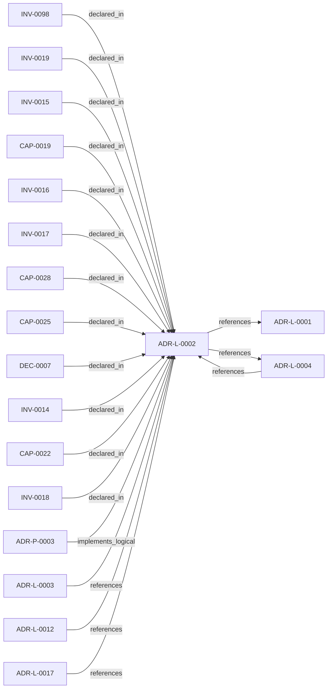

<!--
integrity_schema_version: 1
generated: deterministic_projection_v1
artifact_kind: rendered_adr_markdown
generator_id: adr-projection-markdown
generator_version: 2
hash_algorithm: sha256
source_hash: f0d9bd1352140b2c1536461df2ddf9766aac1c2339135ac61b8a581d16891ddb
rendered_hash: 5196bb600008c9e08ec33a85cf6315da633cd640479b75ed93265223a918b29e
-->

# ADR-L-0002: Multi-Scope ADR Architecture for Sub-Module Development

**Status:** proposed  
**Created:** 2026-03-08  
**Modified:** 2026-03-08  **Authors:** adr-architecture-kit  
**Domains:** adr, architecture, governance, multi-project  
**Tags:** adr, scope-resolution, multi-project, sub-modules, monorepo  **Alias name:** multi-scope-adr-architecture-for-sub-module-development  
## Context

The adr-architecture-kit is being actively developed in a single workspace alongside
multiple sub-modules (ste-runtime, future services) that will eventually become
independent services. Each sub-module needs to leverage the ADR system for its own
architectural documentation while being developed in parallel within the monorepo.

Current challenges:
1. ADR generators/validators are hardcoded to work at a single project scope
2. Sub-modules cannot maintain their own ADR directories independently
3. No mechanism to discover and validate ADRs at different project levels
4. Tooling assumes a single adrs/ directory at the workspace root

The ste-runtime already implements a sophisticated project scope resolution mechanism
(see src/config/index.ts) that:
- Auto-detects project boundaries via markers (package.json, pyproject.toml, etc.)
- Supports both self-analysis and external project modes
- Enforces workspace boundaries to prevent scanning outside intended scope
- Uses ste.config.json as authoritative project marker

We need similar scope resolution for ADR generation and validation to support:
- Workspace root ADRs (adr-architecture-kit itself)
- Sub-module ADRs (ste-runtime/adrs/, future-service/adrs/)
- Independent service ADRs (when modules are extracted)
- Parallel development with isolated documentation

## Relationship graph

## Related ADRs

### ADR-L-0001 — STE-Compliant Machine-Verifiable Architecture Decision Record System

**Relationships:**
- this ADR -[:references]-> 019fee89-e615-70a5-861b-b2dde147e5af

**Context:** # ADR Architecture Kit — STE Authoring Subsystem

[Open projection](ADR-L-0001-ste-compliant-machine-verifiable-architecture-decision-record-system.md)
### ADR-L-0003 — Quality Assurance and Testing Strategy

**Relationships:**
- 019fee89-e615-77f6-9b1f-695732d25443 -[:references]-> this ADR

**Context:** The ADR Architecture Kit is a foundational tool for machine-verifiable architecture
documentation. As such, it must maintain high quality standards to ensure reliability,
correctness, and trust in the architectural governance it provides.

[Open projection](ADR-L-0003-quality-assurance-and-testing-strategy.md)
### ADR-L-0004 — ADR-to-Implementation Traceability via Decorators and Metadata Attribution

**Relationships:**
- 019fee89-e615-7577-8d37-dd0df031bec9 -[:references]-> this ADR
- this ADR -[:references]-> 019fee89-e615-7577-8d37-dd0df031bec9

**Context:** Architecture Decision Records document why implementation artifacts exist, but
the repo still lacks a universal, machine-verifiable way to trace code,
infrastructure, configuration, schemas, pipelines, and scripts back to the
ADRs that justify them.

[Open projection](ADR-L-0004-adr-to-implementation-traceability-via-decorators-and-metadata-attribution.md)
### ADR-L-0012 — Federation Authority and Qualified Identity Model

**Relationships:**
- 019fee89-e616-744f-b63e-5ecddf344faa -[:references]-> this ADR

**Context:** The compiler and recursive multi-scope model preserve repository-local
compilation boundaries, while STE federation spans independently compiled
repositories. Federation therefore requires global identity without weakening
provider authority or allowing the aggregation layer to rewrite canonical
repository state.

[Open projection](ADR-L-0012-federation-authority-and-qualified-identity-model.md)
### ADR-L-0017 — Forward Authoring Ergonomics for Split Physical ADR Types

**Relationships:**
- 019fee89-e617-7ff5-863b-1eef71637b0f -[:references]-> this ADR

**Context:** adr-architecture-kit now supports multiple physical ADR shapes:
legacy `ADR-P-*`, current `ADR-PS-*`, and current `ADR-PC-*`. Upstream
authoring workflows need structured scaffolds, schema discovery, and next-ID
allocation that reinforce the current split physical taxonomy without breaking
existing legacy parsing and validation.

[Open projection](ADR-L-0017-forward-authoring-ergonomics-for-split-physical-adr-types.md)
### ADR-P-0003 — Multi-Scope Python Implementation for ADR Toolkit

**Relationships:**
- 019fee89-e618-742f-951d-d29401d56c19 -[:implements_logical]-> this ADR

**Context:** ADR-L-0002 defines the logical architecture for multi-scope ADR support.
This Physical ADR specifies the concrete Python implementation including
module structure, API design, and CLI interface.

[Open projection](../physical/ADR-P-0003-multi-scope-python-implementation-for-adr-toolkit.md)

## Capabilities

### CAP-0019: Automatic Project Scope Detection

Auto-detect project boundaries by searching for markers:
- ste.config.json (authoritative)
- PROJECT.yaml (ADR-specific marker)
- package.json, pyproject.toml (language markers)
- .git directory (repository root)

### CAP-0022: Scoped Manifest Generation

Generate manifest.yaml scoped to specific project, including only ADRs
within that project's adrs/ directory

### CAP-0025: Scoped Validation

Validate ADRs within specific project scope, with optional recursive
validation of sub-modules

### CAP-0028: Multi-Scope CLI Interface

Provide CLI commands that work at any scope level with consistent behavior

## Invariants

### INV-0014

**Statement:** ADR generators and validators MUST support explicit scope parameter to
override auto-detection when needed
  
**Scope:** global  
**Enforcement:** must (design)  
**Verification:** automated

**Rationale:**
While auto-detection handles most cases, explicit scope control is needed
for CI/CD, testing, and edge cases where auto-detection may be ambiguous

### INV-0015

**Statement:** Project scope resolution MUST use the same marker hierarchy as ste-runtime:
1. Explicit --scope parameter (highest priority)
2. ste.config.json in current or parent directories
3. Standard project markers (package.json, pyproject.toml, .git)
4. Current working directory (fallback)
  
**Scope:** global  
**Enforcement:** must (design)  
**Verification:** automated

**Rationale:**
Consistent scope resolution across STE tools prevents confusion and ensures
predictable behavior

### INV-0016

**Statement:** Each project scope MUST maintain its own adrs/ directory and manifest.yaml
  
**Scope:** global  
**Enforcement:** must (design)  
**Verification:** automated

**Rationale:**
Independent ADR directories enable sub-modules to document their own
architecture without interfering with parent or sibling projects

### INV-0017

**Statement:** ADR cross-references between different scopes MUST use fully-qualified
identifiers (e.g., "ste-runtime:ADR-L-0001")
  
**Scope:** global  
**Enforcement:** should (design)  
**Verification:** automated

**Rationale:**
Enables linking between workspace and sub-module ADRs while maintaining
clear scope boundaries

### INV-0018

**Statement:** Scope resolution MUST NOT traverse above workspace root to prevent
scanning unintended directories
  
**Scope:** global  
**Enforcement:** must (design)  
**Verification:** automated

**Rationale:**
Security and performance - prevents accidental scanning of home directory
or system directories

### INV-0019

**Statement:** ADR validation at workspace scope SHOULD validate all sub-module ADRs
recursively when --recursive flag is provided
  
**Scope:** global  
**Enforcement:** should (design)  
**Verification:** automated

**Rationale:**
Enables comprehensive validation of entire workspace architecture while
maintaining ability to validate individual scopes

### INV-0098

**Statement:** Recursive compilation must compile each resolved project scope independently and must not implicitly merge architecture state across scopes.  
**Scope:** global  
**Enforcement:** must (design)  
**Verification:** automated

**Rationale:**
Multi-scope support exists so each project root owns its canonical ADR state.
Recursive execution is orchestration, not authorization to collapse scopes.

## Decisions

### DEC-0007: Adopt Scope-Aware ADR Architecture

**Rationale:**
ADR generators and validators must support multiple project scopes to enable
sub-modules to maintain independent architectural documentation while being
developed in a shared workspace.

This mirrors the ste-runtime's project scope resolution pattern, providing
consistent behavior across the STE ecosystem.

**Consequences:**

**Positive:**
- ADR tools can work at any project level (workspace, sub-module, service)
- Sub-modules can maintain independent ADR directories
- Tooling auto-detects project boundaries using standard markers
- Manifest generation scoped to specific project context
- Validation can be run at different scopes independently

---

*Generated from ADR-L-0002 by ADR Architecture Kit*