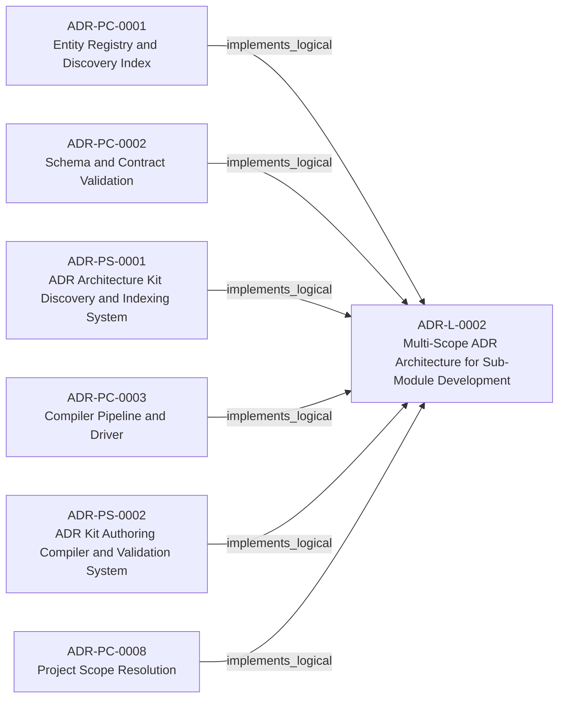

<!--
integrity_schema_version: 1
generated: deterministic_projection_v1
artifact_kind: rendered_adr_markdown
generator_id: adr-projection-markdown
generator_version: 3
hash_algorithm: sha256
source_hash: bcfa5488232ecc5aeba19ccc06fc0417e597e5db040914e227bf7107848e99a4
rendered_hash: 4cca3f27c01bcdb17b0c1ca626ba3439cc6e6291608ea5ab183a9593f2ed5c7f
-->

# ADR-L-0002: Multi-Scope ADR Architecture for Sub-Module Development

## Identity / Status

**Type:** logical  
**Status:** accepted  
**Alias:** ADR-L-0002  
**Alias name:** multi-scope-adr-architecture-for-sub-module-development  
**Created:** 2026-03-08  
**Modified:** 2026-03-08  
**Authors:** adr-architecture-kit  
**Domains:** adr, architecture, governance, multi-project  

## Architecture Position

Logical architecture authority for this subject. Neighborhood paths use structural bridges plus exactly one semantic architecture edge; they never invent ADR-to-ADR verbs.

## Architecture Neighborhood

### Semantic architecture inventory

- `implements_logical`: ADR-PC-0001 → ADR-L-0002
- `implements_logical`: ADR-PC-0002 → ADR-L-0002
- `implements_logical`: ADR-PS-0001 → ADR-L-0002
- `implements_logical`: ADR-PC-0003 → ADR-L-0002
- `implements_logical`: ADR-PS-0002 → ADR-L-0002
- `implements_logical`: ADR-PC-0008 → ADR-L-0002

## Neighbor Relationships

### ADR-PC-0001 — Entity Registry and Discovery Index

- ADR-PC-0001 -[:implements_logical]-> ADR-L-0002

**Context:** The discovery/indexing component now centers on the unified compiler path. It
generates the normalized discovery bundle under `adrs/index/`, emits the
legacy compatibility registry at `adrs/entities/registry.yaml`, generates
manifest and rendered ADR markdown outputs through the same compiler-owned
path for single-scope use, and exposes exact-ID and filtered CLI query
operations over generated registry state.

[Open projection](../physical-component/ADR-PC-0001-entity-registry-and-discovery-index.md)
### ADR-PC-0002 — Schema and Contract Validation

- ADR-PC-0002 -[:implements_logical]-> ADR-L-0002

**Context:** Schema and contract validation is now a stable component boundary rather than
a generic legacy physical slice. It validates canonical ADR structure,
profile-specific contract requirements, project metadata, and implementation
attribution evidence. Validation of that evidence is structural for schema shape and architecture-aware when claims must resolve to canonical UUIDs and entity types. Legacy 1.0/1.2 evidence normalizes to the v1.5 claim shape only with repository or model 2.0 context.

[Open projection](../physical-component/ADR-PC-0002-schema-and-contract-validation.md)
### ADR-PC-0003 — Compiler Pipeline and Driver

- ADR-PC-0003 -[:implements_logical]-> ADR-L-0002

**Context:** The compiler driver and explicit pipeline now own deterministic architecture
compilation across parse, analysis, emission, and recursive scope
orchestration. The command-line behavior is compatibility-relevant, while the
Python compiler pipeline, passes, `ArchModel`, emitters, and result plumbing are
internal reference implementation and are not a supported SDK facade.

[Open projection](../physical-component/ADR-PC-0003-compiler-pipeline-and-driver.md)
### ADR-PC-0008 — Project Scope Resolution

- ADR-PC-0008 -[:implements_logical]-> ADR-L-0002

**Context:** Permanent physical-component authority for multi-scope project-root detection,
scope boundary validation, and scope-resolution semantics per ADR-L-0002.
Rehomes preserved nested identity from retired ADR-P-0003 (COMP-0017) into
governed PS+PC authority without topology authoring in this document.

[Open projection](../physical-component/ADR-PC-0008-project-scope-resolution.md)
### ADR-PS-0001 — ADR Architecture Kit Discovery and Indexing System

- ADR-PS-0001 -[:implements_logical]-> ADR-L-0002

**Context:** The discovery and indexing subsystem provides the derived surfaces that agents
query instead of scanning raw ADR bodies by default. It now includes
normalized discovery bundle generation under `adrs/index/`, legacy
compatibility registry generation under `adrs/entities/registry.yaml`,
manifest generation, rendered ADR markdown generation, CLI query surfaces over
generated registry state, and the unified `adr compile` orchestration path
that emits these derived discovery artifacts together.

[Open projection](../physical-system/ADR-PS-0001-adr-architecture-kit-discovery-and-indexing-system.md)
### ADR-PS-0002 — ADR Kit Authoring Compiler and Validation System

- ADR-PS-0002 -[:implements_logical]-> ADR-L-0002

**Context:** adr-architecture-kit operates as an authoring-time compiler and validation system rather
than a collection of unrelated generators. The implementation includes an
explicit compiler pipeline, contract validation, normalized repository/model
access, integrity verification, and CLI orchestration over those surfaces.

[Open projection](../physical-system/ADR-PS-0002-adr-kit-authoring-compiler-and-validation-system.md)

### Lifecycle / association

- ADR-L-0004 -[:references]-> ADR-L-0002
- ADR-L-0003 -[:references]-> ADR-L-0002
- ADR-L-0002 -[:references]-> ADR-L-0001
- ADR-L-0002 -[:references]-> ADR-L-0004
- ADR-L-0012 -[:references]-> ADR-L-0002
- ADR-L-0017 -[:references]-> ADR-L-0002

## Context

The adr-architecture-kit is being actively developed in a single workspace alongside
multiple sub-modules (ste-runtime, future services) that will eventually become
independent services. Each sub-module needs to leverage the ADR system for its own
architectural documentation while being developed in parallel within the monorepo.

Current challenges:
1. ADR generators/validators are hardcoded to work at a single project scope
2. Sub-modules cannot maintain their own ADR directories independently
3. No mechanism to discover and validate ADRs at different project levels
4. Tooling assumes a single adrs/ directory at the workspace root

The ste-runtime already implements a sophisticated project scope resolution mechanism
(see src/config/index.ts) that:
- Auto-detects project boundaries via markers (package.json, pyproject.toml, etc.)
- Supports both self-analysis and external project modes
- Enforces workspace boundaries to prevent scanning outside intended scope
- Uses ste.config.json as authoritative project marker

We need similar scope resolution for ADR generation and validation to support:
- Workspace root ADRs (adr-architecture-kit itself)
- Sub-module ADRs (ste-runtime/adrs/, future-service/adrs/)
- Independent service ADRs (when modules are extracted)
- Parallel development with isolated documentation

## Internal Structure

```mermaid
flowchart TB
  n_019fee89_e615_7f19_810b_c7b33a9d9e0d["ADR-L-0002<br/>Multi-Scope ADR Architecture for Sub-Module Development"]
  subgraph sg_capability["capability"]
    n_019fee89_e615_78f5_903a_4c5d1bab8f38["CAP-0019<br/>Automatic Project Scope Detection"]
    n_019fee89_e615_7dc5_983a_beb68ed34cde["CAP-0022<br/>Scoped Manifest Generation"]
    n_019fee89_e615_7ba4_bd19_1d7abf1a3ed2["CAP-0025<br/>Scoped Validation"]
    n_019fee89_e615_7aa2_8817_c4f468c90b66["CAP-0028<br/>Multi-Scope CLI Interface"]
  end
  subgraph sg_decision["decision"]
    n_019fee89_e615_7d71_9517_aeb9fe601fd6["DEC-0007<br/>Adopt Scope-Aware ADR Architecture"]
  end
  subgraph sg_invariant["invariant"]
    n_019fee89_e615_7db0_a219_22110deb7ed0["INV-0014"]
    n_019fee89_e615_7478_ab17_36426863f751["INV-0015"]
    n_019fee89_e615_7911_ac25_c8772b55ffbb["INV-0016"]
    n_019fee89_e615_7a25_9d3f_1758c79a12e7["INV-0017"]
    n_019fee89_e615_7f59_842e_2dc1fcfbc380["INV-0018"]
    n_019fee89_e615_7169_8a2e_9192ab77b526["INV-0019"]
    n_019fee89_e615_70ae_af3e_bd510f15d321["INV-0098"]
  end
  n_019fee89_e615_70ae_af3e_bd510f15d321 -->|"declared_in"| n_019fee89_e615_7f19_810b_c7b33a9d9e0d
  n_019fee89_e615_7169_8a2e_9192ab77b526 -->|"declared_in"| n_019fee89_e615_7f19_810b_c7b33a9d9e0d
  n_019fee89_e615_7478_ab17_36426863f751 -->|"declared_in"| n_019fee89_e615_7f19_810b_c7b33a9d9e0d
  n_019fee89_e615_78f5_903a_4c5d1bab8f38 -->|"declared_in"| n_019fee89_e615_7f19_810b_c7b33a9d9e0d
  n_019fee89_e615_7911_ac25_c8772b55ffbb -->|"declared_in"| n_019fee89_e615_7f19_810b_c7b33a9d9e0d
  n_019fee89_e615_7a25_9d3f_1758c79a12e7 -->|"declared_in"| n_019fee89_e615_7f19_810b_c7b33a9d9e0d
  n_019fee89_e615_7aa2_8817_c4f468c90b66 -->|"declared_in"| n_019fee89_e615_7f19_810b_c7b33a9d9e0d
  n_019fee89_e615_7ba4_bd19_1d7abf1a3ed2 -->|"declared_in"| n_019fee89_e615_7f19_810b_c7b33a9d9e0d
  n_019fee89_e615_7d71_9517_aeb9fe601fd6 -->|"declared_in"| n_019fee89_e615_7f19_810b_c7b33a9d9e0d
  n_019fee89_e615_7db0_a219_22110deb7ed0 -->|"declared_in"| n_019fee89_e615_7f19_810b_c7b33a9d9e0d
  n_019fee89_e615_7dc5_983a_beb68ed34cde -->|"declared_in"| n_019fee89_e615_7f19_810b_c7b33a9d9e0d
  n_019fee89_e615_7f59_842e_2dc1fcfbc380 -->|"declared_in"| n_019fee89_e615_7f19_810b_c7b33a9d9e0d
```

- `capability` CAP-0019 — Automatic Project Scope Detection
- `capability` CAP-0022 — Scoped Manifest Generation
- `capability` CAP-0025 — Scoped Validation
- `capability` CAP-0028 — Multi-Scope CLI Interface
- `decision` DEC-0007 — Adopt Scope-Aware ADR Architecture
- `invariant` INV-0014 — INV-0014
- `invariant` INV-0015 — INV-0015
- `invariant` INV-0016 — INV-0016
- `invariant` INV-0017 — INV-0017
- `invariant` INV-0018 — INV-0018
- `invariant` INV-0019 — INV-0019
- `invariant` INV-0098 — INV-0098

## Capabilities

### CAP-0019: Automatic Project Scope Detection

Auto-detect project boundaries by searching for markers:
- ste.config.json (authoritative)
- PROJECT.yaml (ADR-specific marker)
- package.json, pyproject.toml (language markers)
- .git directory (repository root)

### CAP-0022: Scoped Manifest Generation

Generate manifest.yaml scoped to specific project, including only ADRs
within that project's adrs/ directory

### CAP-0025: Scoped Validation

Validate ADRs within specific project scope, with optional recursive
validation of sub-modules

### CAP-0028: Multi-Scope CLI Interface

Provide CLI commands that work at any scope level with consistent behavior

## Decisions

### DEC-0007: Adopt Scope-Aware ADR Architecture

**Rationale:**
ADR generators and validators must support multiple project scopes to enable
sub-modules to maintain independent architectural documentation while being
developed in a shared workspace.

This mirrors the ste-runtime's project scope resolution pattern, providing
consistent behavior across the STE ecosystem.

## Invariants

### INV-0014

**Statement:** ADR generators and validators MUST support explicit scope parameter to
override auto-detection when needed
  
**Scope:** global  
**Enforcement:** must (design)

**Rationale:**
While auto-detection handles most cases, explicit scope control is needed
for CI/CD, testing, and edge cases where auto-detection may be ambiguous

### INV-0015

**Statement:** Project scope resolution MUST use the same marker hierarchy as ste-runtime:
1. Explicit --scope parameter (highest priority)
2. ste.config.json in current or parent directories
3. Standard project markers (package.json, pyproject.toml, .git)
4. Current working directory (fallback)
  
**Scope:** global  
**Enforcement:** must (design)

**Rationale:**
Consistent scope resolution across STE tools prevents confusion and ensures
predictable behavior

### INV-0016

**Statement:** Each project scope MUST maintain its own adrs/ directory and manifest.yaml
  
**Scope:** global  
**Enforcement:** must (design)

**Rationale:**
Independent ADR directories enable sub-modules to document their own
architecture without interfering with parent or sibling projects

### INV-0017

**Statement:** ADR cross-references between different scopes MUST use fully-qualified
identifiers (e.g., "ste-runtime:ADR-L-0001")
  
**Scope:** global  
**Enforcement:** should (design)

**Rationale:**
Enables linking between workspace and sub-module ADRs while maintaining
clear scope boundaries

### INV-0018

**Statement:** Scope resolution MUST NOT traverse above workspace root to prevent
scanning unintended directories
  
**Scope:** global  
**Enforcement:** must (design)

**Rationale:**
Security and performance - prevents accidental scanning of home directory
or system directories

### INV-0019

**Statement:** ADR validation at workspace scope SHOULD validate all sub-module ADRs
recursively when --recursive flag is provided
  
**Scope:** global  
**Enforcement:** should (design)

**Rationale:**
Enables comprehensive validation of entire workspace architecture while
maintaining ability to validate individual scopes

### INV-0098

**Statement:** Recursive compilation must compile each resolved project scope independently and must not implicitly merge architecture state across scopes.  
**Scope:** global  
**Enforcement:** must (design)

**Rationale:**
Multi-scope support exists so each project root owns its canonical ADR state.
Recursive execution is orchestration, not authorization to collapse scopes.

---

*Generated from ADR-L-0002 by ADR Architecture Kit (projection v3)*