<!--
integrity_schema_version: 1
generated: deterministic_projection_v1
artifact_kind: rendered_adr_markdown
generator_id: adr-projection-markdown
generator_version: 3
hash_algorithm: sha256
source_hash: 4bdd918e6d4688efab2238ea89c93543aa6ff9009d723366b4662699aaa2a6b9
rendered_hash: 3e84d06ce3547a45ea7e0d2d0f23931cbd95b55f8b31573d83e9a87788674405
-->

# ADR-L-0003: Quality Assurance and Testing Strategy

## Identity / Status

**Type:** logical  
**Status:** accepted  
**Alias:** ADR-L-0003  
**Alias name:** quality-assurance-and-testing-strategy  
**Created:** 2026-03-08  
**Modified:** 2026-08-05  
**Authors:** adr-architecture-kit  
**Domains:** quality-assurance, testing, governance, reliability  

## Architecture Position

Logical architecture authority for this subject. Neighborhood paths use structural bridges plus exactly one semantic architecture edge; they never invent ADR-to-ADR verbs.

## Architecture Neighborhood

### Semantic architecture inventory

- None

## Neighbor Relationships

No grammatical peer neighborhood for this subject.

### Lifecycle / association

- ADR-L-0005 -[:references]-> ADR-L-0003
- ADR-L-0004 -[:references]-> ADR-L-0003
- ADR-L-0003 -[:references]-> ADR-L-0001
- ADR-L-0003 -[:references]-> ADR-L-0002
- ADR-L-0003 -[:references]-> ADR-PC-0001
- ADR-L-0003 -[:references]-> ADR-PS-0002
- ADR-L-0003 -[:references]-> ADR-PC-0008
- ADR-L-0007 -[:references]-> ADR-L-0003
- ADR-L-0008 -[:references]-> ADR-L-0003
- ADR-L-0018 -[:references]-> ADR-L-0003

## Context

The ADR Architecture Kit is a foundational tool for machine-verifiable architecture
documentation. As such, it must maintain high quality standards to ensure reliability,
correctness, and trust in the architectural governance it provides.

Current state:
- Validator tests exist for ADR schema/business rules, generated-doc integrity,
  system overview integrity, project metadata, and kernel contract validation
- Golden regression tests exist for committed registry outputs and manifest shape
- Compiler projection and builder parity tests exist to keep the compiler migration
  output-identical to the current generator path
- Multi-scope functionality is covered by CLI, scope resolver, validator, and
  manifest tests
- The repository has a unified governance bundle via `adr governance-checks`
  plus explicit CI gates for generated docs, system overview integrity, and
  project metadata validation
- Commit-at-meaningful-boundaries is now an explicit governance invariant

The system must be trustworthy because:
1. It validates architecture decisions that govern system behavior
2. Generated manifests are used by AI systems for reasoning
3. Schema validation failures can halt development workflows
4. Multi-scope functionality affects multiple projects simultaneously
5. Errors in ADR tooling can propagate to dependent systems

STE compliance requirements:
- **SYS-2**: Deterministic cognition requires deterministic validation
- **SYS-4**: Drift prevention requires reliable detection mechanisms
- **INV-0001**: Schema validation must be provably correct

Testing must balance:
- Comprehensive coverage vs. development velocity
- Isolated unit tests vs. real-world integration tests
- Fast feedback vs. thorough validation
- Maintainability vs. exhaustive edge case coverage

## Internal Structure

```mermaid
flowchart TB
  n_019fee89_e615_77f6_9b1f_695732d25443["ADR-L-0003"]
  subgraph sg_capability["capability"]
    n_019fee89_e615_7498_9825_b465a8830d8a["CAP-0020"]
    n_019fee89_e615_7958_822b_bbd40f3a5ebc["CAP-0023"]
    n_019fee89_e615_7d32_8d01_f61b4d7aae40["CAP-0026"]
    n_019fee89_e615_722d_bf3a_9ed33338beaf["CAP-0029"]
    n_019fee89_e615_7402_b43f_a03be950d0b3["CAP-0046"]
  end
  subgraph sg_decision["decision"]
    n_019fee89_e615_79a1_be3d_03af8c291326["DEC-0008"]
    n_019fee89_e615_7d1d_a33d_ca62fdaad0be["DEC-0015"]
    n_019fee89_e615_78ee_a53f_99d85ea925a3["DEC-0022"]
    n_019fee89_e615_7e99_8137_8ac8d0972e1b["DEC-0029"]
    n_019fee89_e615_760b_a43f_b3fe08e0d6ef["DEC-0033"]
    n_019fee89_e615_7e36_8e3f_c0e37def8629["DEC-0078"]
    n_019fee89_e615_713f_a73d_10442c1dc6b9["DEC-0081"]
  end
  subgraph sg_invariant["invariant"]
    n_019fee89_e615_7c97_a633_fbfd69ffa030["INV-0020"]
    n_019fee89_e615_74c8_a813_5f18ee19f9a8["INV-0021"]
    n_019fee89_e615_729d_873d_f2bf925d1846["INV-0022"]
    n_019fee89_e615_758b_a31f_a0dcb8d9d09a["INV-0023"]
    n_019fee89_e615_7871_b719_23a5128874ae["INV-0024"]
    n_019fee89_e615_75e2_a33f_645d3f0970a1["INV-0025"]
    n_019fee89_e615_7a08_8b0f_d2b2ed57eacb["INV-0026"]
    n_019fee89_e615_74af_a113_f1a7a9e5d49e["INV-0072"]
    n_019fee89_e615_7519_972f_504bac832107["INV-0073"]
    n_019fee89_e615_701c_8e3e_d463d56f89ce["INV-0075"]
    n_019fee89_e615_7235_8135_9a274f82afc8["INV-0083"]
    n_019fee89_e615_74f0_9826_fcaa4052cfdc["INV-0095"]
    n_019fee89_e615_792a_aa3e_a9f0f34c1b93["INV-0096"]
  end
  n_019fee89_e615_701c_8e3e_d463d56f89ce -->|"declared_in"| n_019fee89_e615_77f6_9b1f_695732d25443
  n_019fee89_e615_713f_a73d_10442c1dc6b9 -->|"declared_in"| n_019fee89_e615_77f6_9b1f_695732d25443
  n_019fee89_e615_722d_bf3a_9ed33338beaf -->|"declared_in"| n_019fee89_e615_77f6_9b1f_695732d25443
  n_019fee89_e615_7235_8135_9a274f82afc8 -->|"declared_in"| n_019fee89_e615_77f6_9b1f_695732d25443
  n_019fee89_e615_729d_873d_f2bf925d1846 -->|"declared_in"| n_019fee89_e615_77f6_9b1f_695732d25443
  n_019fee89_e615_7402_b43f_a03be950d0b3 -->|"declared_in"| n_019fee89_e615_77f6_9b1f_695732d25443
  n_019fee89_e615_7498_9825_b465a8830d8a -->|"declared_in"| n_019fee89_e615_77f6_9b1f_695732d25443
  n_019fee89_e615_74af_a113_f1a7a9e5d49e -->|"declared_in"| n_019fee89_e615_77f6_9b1f_695732d25443
  n_019fee89_e615_74c8_a813_5f18ee19f9a8 -->|"declared_in"| n_019fee89_e615_77f6_9b1f_695732d25443
  n_019fee89_e615_74f0_9826_fcaa4052cfdc -->|"declared_in"| n_019fee89_e615_77f6_9b1f_695732d25443
  n_019fee89_e615_7519_972f_504bac832107 -->|"declared_in"| n_019fee89_e615_77f6_9b1f_695732d25443
  n_019fee89_e615_758b_a31f_a0dcb8d9d09a -->|"declared_in"| n_019fee89_e615_77f6_9b1f_695732d25443
  n_019fee89_e615_75e2_a33f_645d3f0970a1 -->|"declared_in"| n_019fee89_e615_77f6_9b1f_695732d25443
  n_019fee89_e615_760b_a43f_b3fe08e0d6ef -->|"declared_in"| n_019fee89_e615_77f6_9b1f_695732d25443
  n_019fee89_e615_7871_b719_23a5128874ae -->|"declared_in"| n_019fee89_e615_77f6_9b1f_695732d25443
  n_019fee89_e615_78ee_a53f_99d85ea925a3 -->|"declared_in"| n_019fee89_e615_77f6_9b1f_695732d25443
  n_019fee89_e615_792a_aa3e_a9f0f34c1b93 -->|"declared_in"| n_019fee89_e615_77f6_9b1f_695732d25443
  n_019fee89_e615_7958_822b_bbd40f3a5ebc -->|"declared_in"| n_019fee89_e615_77f6_9b1f_695732d25443
  n_019fee89_e615_79a1_be3d_03af8c291326 -->|"declared_in"| n_019fee89_e615_77f6_9b1f_695732d25443
  n_019fee89_e615_7a08_8b0f_d2b2ed57eacb -->|"declared_in"| n_019fee89_e615_77f6_9b1f_695732d25443
  n_019fee89_e615_7c97_a633_fbfd69ffa030 -->|"declared_in"| n_019fee89_e615_77f6_9b1f_695732d25443
  n_019fee89_e615_7d1d_a33d_ca62fdaad0be -->|"declared_in"| n_019fee89_e615_77f6_9b1f_695732d25443
  n_019fee89_e615_7d32_8d01_f61b4d7aae40 -->|"declared_in"| n_019fee89_e615_77f6_9b1f_695732d25443
  n_019fee89_e615_7e36_8e3f_c0e37def8629 -->|"declared_in"| n_019fee89_e615_77f6_9b1f_695732d25443
  n_019fee89_e615_7e99_8137_8ac8d0972e1b -->|"declared_in"| n_019fee89_e615_77f6_9b1f_695732d25443
```

- `capability` CAP-0020 — Automated Quality Gates
- `capability` CAP-0023 — Test-Driven Development Support
- `capability` CAP-0026 — Regression Prevention
- `capability` CAP-0029 — Documentation via Tests
- `capability` CAP-0046 — Verified Build-Once Release Promotion
- `decision` DEC-0008 — Adopt Multi-Layer Testing Strategy
- `decision` DEC-0015 — Require Tests for All New Components
- `decision` DEC-0022 — Test Against Real Workspace ADRs
- `decision` DEC-0029 — Enforce Testing in CI/CD Pipeline
- `decision` DEC-0033 — Adopt Test-Driven Development (TDD) Methodology
- `decision` DEC-0078 — Require retained release-artifact testing and no-regression quality controls
- `decision` DEC-0081 — Make installed distribution metadata the runtime package-version authority
- `invariant` INV-0020 — INV-0020
- `invariant` INV-0021 — INV-0021
- `invariant` INV-0022 — INV-0022
- `invariant` INV-0023 — INV-0023
- `invariant` INV-0024 — INV-0024
- `invariant` INV-0025 — INV-0025
- `invariant` INV-0026 — INV-0026
- `invariant` INV-0072 — INV-0072
- `invariant` INV-0073 — INV-0073
- `invariant` INV-0075 — INV-0075
- `invariant` INV-0083 — INV-0083
- `invariant` INV-0095 — INV-0095
- `invariant` INV-0096 — INV-0096

## Capabilities

### CAP-0020: Automated Quality Gates

CI/CD pipeline automatically runs test suite on every commit and PR.
Prevents merging code that fails tests or reduces coverage.

### CAP-0023: Test-Driven Development Support

Test infrastructure supports TDD workflow - write failing test, implement
feature, test passes. Fast test execution enables rapid iteration.

### CAP-0026: Regression Prevention

Once a bug is fixed, a test is added to prevent reintroduction. Test
suite grows to cover discovered edge cases.

### CAP-0029: Documentation via Tests

Tests serve as executable documentation showing how to use components.
Examples in tests demonstrate API usage patterns.

### CAP-0046: Verified Build-Once Release Promotion

Build one release bundle, verify its metadata and identity, exercise the
retained wheel across the supported Python matrix, and publish that exact
bundle without a second build.

## Decisions

### DEC-0008: Adopt Multi-Layer Testing Strategy

**Rationale:**
Different types of tests serve different purposes. A layered approach provides
comprehensive coverage while maintaining fast feedback loops.

Layers:
1. **Unit tests**: Fast, isolated, test individual functions/methods
2. **Integration tests**: Test component interactions
3. **Real-world tests**: Test against actual workspace ADRs
4. **Regression tests**: Prevent reintroduction of fixed bugs

### DEC-0015: Require Tests for All New Components

**Rationale:**
Every new component must include tests before acceptance. This ensures
quality is built in from the start, not retrofitted later.

Prevents technical debt accumulation and ensures new features are
immediately verifiable.

### DEC-0022: Test Against Real Workspace ADRs

**Rationale:**
The toolkit must work with actual ADRs in the workspace. Testing against
synthetic fixtures alone is insufficient - real-world ADRs expose edge
cases and integration issues.

This provides dogfooding and ensures the toolkit works on its own
documentation.

### DEC-0029: Enforce Testing in CI/CD Pipeline

**Rationale:**
Automated testing in CI/CD prevents regressions and ensures all
contributors maintain quality standards. Manual testing is insufficient
for a governance tool.

### DEC-0033: Adopt Test-Driven Development (TDD) Methodology

**Rationale:**
TDD (Red-Green-Refactor) is architecturally aligned with STE principles:

**Alignment with STE**:
- SYS-2 (Deterministic Cognition): Tests enforce deterministic behavior
- SYS-4 (Drift Prevention): Tests detect drift immediately  
- PRIME-1 (No Implicit Assumptions): Tests make behavior explicit
- INV-0001 (Schema Validation): Tests prove validation correctness

**Why TDD for this system**:
1. This is a governance tool - it MUST be provably correct
2. Validation logic is complex - tests clarify expected behavior
3. Multi-scope functionality has many edge cases
4. Schema validation errors are costly (halt workflows)
5. Generated manifests are consumed by AI systems (must be reliable)

**TDD Cycle**:
1. Red: Write failing test (executable specification)
2. Green: Implement minimum code to pass (correctness proof)
3. Refactor: Improve design while maintaining tests (quality)

**Benefits for ADR Kit**:
- Tests become executable specifications of ADR behavior
- Validation logic is provably correct before deployment
- Refactoring is safe (tests prevent regressions)
- API design improves (testability forces good interfaces)
- Documentation via test examples

### DEC-0078: Require retained release-artifact testing and no-regression quality controls

**Rationale:**
Source-tree tests alone cannot prove that an installed distribution contains
the documented modules and package data, and rebuilding during publication
breaks the identity between tested and published artifacts. Existing Ruff,
strict-mypy, and Black debt must remain visible without permitting new debt.

CI therefore tests source installs and the exact retained wheel on every
supported Python version, measures coverage through the canonical `adr_kit`
namespace, ratchets legacy quality findings, and promotes a verified wheel
and sdist without rebuilding them in the publishing job.

Metadata renderability alone is insufficient for the PyPI-facing package
description: repository-relative README links resolve on GitHub but break
when rendered under the PyPI project page. Release qualification therefore
also requires portable link forms in the README used as `project.readme`.

Release qualification may complete for an exact source commit and its exact
retained distribution before a release tag exists, provided every required
qualification gate has already passed for that commit and artifact. Creating
`v<version>` does not, by itself, require a second independent qualification
of the same commit and artifact. Tag publication is the promotion boundary for
a previously qualified retained bundle.

### DEC-0081: Make installed distribution metadata the runtime package-version authority

**Rationale:**
A manually synchronized package literal can drift from build metadata and
from the artifact exercised by an installed consumer. Runtime package, CLI,
SDK result, and capability versions therefore resolve from installed
`adr-architecture-kit` metadata. Only `PackageNotFoundError` permits a
direct-source fallback to a name-verified `pyproject.toml`; an unavailable
or invalid source fallback returns the explicit non-release sentinel
`0+unknown`.

`pyproject.toml:[project].version` remains the sole manually edited package
version. Editable and wheel tests must prove metadata resolution rather than
silently relying on source-tree importability.

## Invariants

### INV-0020

**Statement:** Every component with public API MUST have unit tests covering:
- Happy path (valid inputs)
- Error cases (invalid inputs)
- Edge cases (boundary conditions)
- Backward compatibility (when applicable)
  
**Scope:** global  
**Enforcement:** must (test)

**Rationale:**
Public APIs are contracts. Tests document expected behavior and prevent
breaking changes.

### INV-0021

**Statement:** Schema validators MUST have tests proving correctness against:
- Valid ADRs (should pass)
- Invalid ADRs (should fail with clear errors)
- Edge cases (empty fields, special characters, etc.)
  
**Scope:** global  
**Enforcement:** must (test)

**Rationale:**
Schema validation is the foundation of machine-verifiable architecture.
Incorrect validation undermines the entire system.

### INV-0022

**Statement:** Multi-scope functionality MUST have tests covering:
- Single scope (backward compatibility)
- Multiple scopes (recursive operations)
- Scope boundary enforcement (security)
- Parent-child relationships
  
**Scope:** global  
**Enforcement:** must (test)

**Rationale:**
Multi-scope is complex and affects multiple projects. Comprehensive
testing prevents cross-project contamination and security issues.

### INV-0023

**Statement:** Test suite MUST complete in under 30 seconds for fast feedback
  
**Scope:** global  
**Enforcement:** should (test)

**Rationale:**
Slow tests discourage running them frequently. Fast feedback enables
test-driven development and rapid iteration.

### INV-0024

**Statement:** Tests MUST be deterministic - same input always produces same output
  
**Scope:** global  
**Enforcement:** must (test)

**Rationale:**
Non-deterministic tests (flaky tests) erode trust and waste time.
Aligns with SYS-2 (deterministic cognition).

### INV-0025

**Statement:** Breaking changes to public APIs MUST be detected by tests
  
**Scope:** global  
**Enforcement:** must (test)

**Rationale:**
Backward compatibility is critical for existing users. Tests should
fail when APIs change incompatibly.

### INV-0026

**Statement:** Test coverage SHOULD be measured and tracked, with minimum 80% coverage
for critical components (parsers, validators, generators)
  
**Scope:** global  
**Enforcement:** should (test)

**Rationale:**
Coverage metrics identify untested code paths. 80% is pragmatic balance
between thoroughness and diminishing returns.

### INV-0072

**Statement:** Pull-request and release validation MUST install the project before tests,
MUST measure canonical `adr_kit` namespace coverage at no less than 80%,
and MUST exercise both a source installation and the exact retained wheel
on every claimed Python version.
  
**Scope:** global  
**Enforcement:** must (test)

**Rationale:**
Source-package leakage and namespace aliases can produce misleading
coverage and allow incomplete wheels to pass repository-local tests.

### INV-0073

**Statement:** Release publication MUST promote exactly one previously tested wheel and
one previously tested sdist without rebuilding. Their filenames, sizes,
SHA-256 hashes, package version, source commit, and `v<version>` tag MUST
be verified before the privileged publish step. Ruff, strict-mypy, and
Black debt MUST be guarded by committed no-regression baselines that allow
removals but reject additions or count increases.

When a successful qualification already exists for the exact tagged source
commit and its retained release bundle, the tag publication path MUST act as
a promotion and identity-verification boundary only. It MUST NOT rebuild
distributions or re-run the independent qualification suite solely because a
tag was created. Publication MUST fail closed if successful qualification
evidence or the retained bundle for that exact commit cannot be proven.
  
**Scope:** global  
**Enforcement:** must (test)

**Rationale:**
Artifact identity and truthful quality measurements are required for a
trustworthy release chain while pre-existing debt is retired incrementally.

### INV-0075

**Statement:** Source, editable-install, and clean retained-wheel consumers MUST exercise
the supported SDK and MUST agree on package, CLI, SDK result, capability,
and installed-distribution versions wherever distribution metadata exists.
Direct-source fallback MUST occur only when metadata is absent and MUST NOT
hide invalid installed metadata or package-resource failures.
  
**Scope:** global  
**Enforcement:** must (test)

**Rationale:**
A supported SDK and release chain require equivalent behavior from the
checkout, editable installation, and the exact artifact selected for
promotion.

### INV-0083

**Statement:** The PyPI-facing package description (the file declared as `project.readme`)
MUST contain only Markdown link and image targets that resolve independently
of GitHub repository-relative rendering: same-document anchors, absolute
`https://` URLs (optional fragment), and `mailto:` URIs. Repository-relative
file or directory targets and `http://` URLs MUST be rejected by automated
release qualification before merge or publication.
  
**Scope:** global  
**Enforcement:** must (test)

**Rationale:**
Observed on the published `0.3.0` long description: GitHub-valid relative
README links became invalid PyPI package-description URLs. `twine check`
validates metadata renderability but not cross-surface link portability.

### INV-0095

**Statement:** adr_kit MUST not ship deprecated runtime API usage, and its direct dependencies MUST be audited for vulnerabilities and upgrade freshness  
**Scope:** global  
**Enforcement:** must (policy)

**Rationale:**
adr_kit is a governance and architecture-authority tool. If it relies on
deprecated modules, stale runtimes, or vulnerable packages, it undermines
its own authority. CI hooks include `scripts/check_runtime_hygiene.py` and
`adr audit-runtime`.

### INV-0096

**Statement:** Repository changes must be committed at meaningful verified boundaries rather than accumulated indefinitely.  
**Scope:** global  
**Enforcement:** must (policy)

**Rationale:**
Small, verified commits reduce review ambiguity and preserve architectural
intent. A meaningful boundary requires a coherent slice, relevant tests and
validation, and a reviewable repository state.

---

*Generated from ADR-L-0003 by ADR Architecture Kit (projection v3)*