<!--
integrity_schema_version: 1
generated: deterministic_projection_v1
artifact_kind: rendered_adr_markdown
generator_id: adr-projection-markdown
generator_version: 3
hash_algorithm: sha256
source_hash: f331711bff1ffed8cfcbbdf73e2b1996a47465495091c3d9e1857382f55dfd3b
rendered_hash: f80a54553f76b713fd5c3ee047b65ab2fc3bb6fcf5fed2a0675d7c5745d7bde5
-->

# ADR-L-0004: ADR-to-Implementation Traceability via Decorators and Metadata Attribution

## Identity / Status

**Type:** logical  
**Status:** accepted  
**Alias:** ADR-L-0004  
**Alias name:** adr-to-implementation-traceability-via-decorators-and-metadata-attribution  
**Created:** 2026-03-08  
**Modified:** 2026-08-20  
**Authors:** adr-architecture-kit  
**Domains:** architecture, traceability, governance, verification  

## Architecture Position

Logical architecture authority for this subject. Neighborhood paths use structural bridges plus exactly one semantic architecture edge; they never invent ADR-to-ADR verbs.

## Architecture Neighborhood

### Semantic architecture inventory

- `implements_logical`: ADR-PC-0007 → ADR-L-0004

## Neighbor Relationships

| Neighbor | Relationship | Exact Path |
| --- | --- | --- |
| [ADR-PC-0007 — Semantic Attribution Embodiment](../physical-component/ADR-PC-0007-semantic-attribution-embodiment.md) | ADR-PC-0007 -[:implements_logical]-> ADR-L-0004 | `ADR-PC-0007 -[:implements_logical]-> ADR-L-0004` |

### Lifecycle / association

- ADR-L-0005 -[:references]-> ADR-L-0004
- ADR-L-0004 -[:references]-> ADR-L-0001
- ADR-L-0004 -[:references]-> ADR-L-0003
- ADR-L-0004 -[:references]-> ADR-L-0002
- ADR-L-0004 -[:references]-> ADR-L-0012
- ADR-L-0004 -[:references]-> ADR-L-0010
- ADR-L-0004 -[:references]-> ADR-PC-0007
- ADR-L-0004 -[:references]-> ADR-L-0020
- ADR-L-0006 -[:references]-> ADR-L-0004
- ADR-L-0002 -[:references]-> ADR-L-0004
- ADR-L-0020 -[:references]-> ADR-L-0004

## Context

Architecture Decision Records document why implementation artifacts exist, but
the repo still lacks a universal, machine-verifiable way to trace code,
infrastructure, configuration, schemas, pipelines, and scripts back to the
ADRs that justify them.

Earlier design work in this ADR established decorator-based code traceability,
RECON extraction, and bidirectional verification as the right direction.
Since then, adr-architecture-kit has gained an explicit compiler pipeline,
profile-aware contract validation, and stronger governance around derived
architecture state. The traceability design now needs to be widened and
grounded in that current compiler/governance reality.

## Current State

- ADRs reference implementation via `implementation_identifiers`
- Code and infrastructure still lack a canonical reverse link to ADRs
- adr-architecture-kit owns canonical architecture authority, but not source
  extraction of implementation artifacts
- ste-runtime / RECON now extracts decorator metadata into implementation
  attribution evidence records for code paths it can parse
- Existing governance already distinguishes `greenfield`, `brownfield`, and
  `migration`, which should govern legacy onboarding instead of inventing a
  separate transition model

## Architecture Direction

This repository remains the authority for:
- the attribution rule itself
- the canonical decorator and metadata semantics
- the compiler-owned evidence contract that downstream extractors populate
- the validation posture for greenfield, brownfield, and migration use

This repository does not take on source-code parsing for this feature in the
current slice. That remains downstream work for ste-runtime / RECON.

## Problems Solved

1. **Orphaned implementation**: Artifacts exist with no architectural justification
2. **Incomplete implementation**: ADRs declare architecture that is not traced to implementation
3. **Drift**: Implementation evolves without architecture authority remaining explicit
4. **Legacy imports**: Existing codebases need staged onboarding without losing deterministic governance
5. **AI reasoning**: Agents need an explicit intent surface rather than heuristic code-to-ADR guesses
6. **EDR evidence**: Embodied decision records need provenance-rich implementation claims

## STE Principles

- **PRIME-1**: No implicit assumptions (implementation must declare its authority)
- **SYS-4**: Drift prevention (detect when code diverges from ADRs)
- **SYS-5**: Documentation-state as authoritative (ADRs govern code)
- **SYS-6**: RECON completion (architecture must be extractable)
- **Scope-aware onboarding**: Migration posture must be explicit rather than ad hoc

## Internal Structure

```mermaid
flowchart TB
  n_019fee89_e615_7577_8d37_dd0df031bec9["ADR-L-0004<br/>ADR-to-Implementation Traceability via Decorators and Metadata Attribution"]
  subgraph sg_capability["capability"]
    n_019fee89_e615_7dd6_b137_8546c4e74c22["CAP-0021<br/>Architecture Intent Attribution"]
    n_019fee89_e615_7804_ad2e_184eeaf6ea0f["CAP-0024<br/>Bidirectional Traceability Verification"]
    n_019fee89_e615_7e73_a30e_6f029c9cb1b3["CAP-0027<br/>Profile-Aware Legacy Onboarding for Intent Attribution"]
    n_019fee89_e615_7476_a31e_769637c9b7d1["CAP-0030<br/>Implementation Attribution Evidence Handoff"]
  end
  subgraph sg_decision["decision"]
    n_019fee89_e615_7e6c_8a2f_8bcd9c148dce["DEC-0009<br/>Adopt explicit architecture intent attribution for implementation artifacts"]
    n_019fee89_e615_727f_a31e_9b8f4c153dc3["DEC-0016<br/>Stage downstream extraction and rule activation after ADR-Kit authority is defined"]
    n_019fee89_e615_7a6b_843f_3cec701087f8["DEC-0023<br/>Support Bidirectional Verification"]
    n_019fee89_e615_7c19_b73f_0741bf060af1["DEC-0048<br/>Define a compiler-owned implementation attribution evidence contract"]
    n_019fee89_e615_7cdd_ad21_34d0a44bec33["DEC-0049<br/>Use existing contract profiles for legacy intent-attribution onboarding"]
    n_019fee89_e615_7332_892e_e723d9f13237["DEC-0076<br/>Treat runtime-emitted implementation attribution as downstream evidence"]
  end
  subgraph sg_invariant["invariant"]
    n_019fee89_e615_7129_ac3e_8120e0d7c106["INV-0027"]
    n_019fee89_e615_72db_8f32_3888e597d5c3["INV-0028"]
    n_019fee89_e615_75c7_aa3f_b6489db09c24["INV-0029"]
    n_019fee89_e615_7e2e_bf3f_577dc4ade891["INV-0030"]
    n_019fee89_e615_7361_b717_6a0aae8df756["INV-0031"]
    n_019fee89_e615_7288_b21b_9452d0e7faef["INV-0032"]
  end
  n_019fee89_e615_7129_ac3e_8120e0d7c106 -->|"declared_in"| n_019fee89_e615_7577_8d37_dd0df031bec9
  n_019fee89_e615_727f_a31e_9b8f4c153dc3 -->|"declared_in"| n_019fee89_e615_7577_8d37_dd0df031bec9
  n_019fee89_e615_7288_b21b_9452d0e7faef -->|"declared_in"| n_019fee89_e615_7577_8d37_dd0df031bec9
  n_019fee89_e615_72db_8f32_3888e597d5c3 -->|"declared_in"| n_019fee89_e615_7577_8d37_dd0df031bec9
  n_019fee89_e615_7332_892e_e723d9f13237 -->|"declared_in"| n_019fee89_e615_7577_8d37_dd0df031bec9
  n_019fee89_e615_7361_b717_6a0aae8df756 -->|"declared_in"| n_019fee89_e615_7577_8d37_dd0df031bec9
  n_019fee89_e615_7476_a31e_769637c9b7d1 -->|"declared_in"| n_019fee89_e615_7577_8d37_dd0df031bec9
  n_019fee89_e615_75c7_aa3f_b6489db09c24 -->|"declared_in"| n_019fee89_e615_7577_8d37_dd0df031bec9
  n_019fee89_e615_7804_ad2e_184eeaf6ea0f -->|"declared_in"| n_019fee89_e615_7577_8d37_dd0df031bec9
  n_019fee89_e615_7a6b_843f_3cec701087f8 -->|"declared_in"| n_019fee89_e615_7577_8d37_dd0df031bec9
  n_019fee89_e615_7c19_b73f_0741bf060af1 -->|"declared_in"| n_019fee89_e615_7577_8d37_dd0df031bec9
  n_019fee89_e615_7cdd_ad21_34d0a44bec33 -->|"declared_in"| n_019fee89_e615_7577_8d37_dd0df031bec9
  n_019fee89_e615_7dd6_b137_8546c4e74c22 -->|"declared_in"| n_019fee89_e615_7577_8d37_dd0df031bec9
  n_019fee89_e615_7e2e_bf3f_577dc4ade891 -->|"declared_in"| n_019fee89_e615_7577_8d37_dd0df031bec9
  n_019fee89_e615_7e6c_8a2f_8bcd9c148dce -->|"declared_in"| n_019fee89_e615_7577_8d37_dd0df031bec9
  n_019fee89_e615_7e73_a30e_6f029c9cb1b3 -->|"declared_in"| n_019fee89_e615_7577_8d37_dd0df031bec9
```

- `capability` CAP-0021 — Architecture Intent Attribution
- `capability` CAP-0024 — Bidirectional Traceability Verification
- `capability` CAP-0027 — Profile-Aware Legacy Onboarding for Intent Attribution
- `capability` CAP-0030 — Implementation Attribution Evidence Handoff
- `decision` DEC-0009 — Adopt explicit architecture intent attribution for implementation artifacts
- `decision` DEC-0016 — Stage downstream extraction and rule activation after ADR-Kit authority is defined
- `decision` DEC-0023 — Support Bidirectional Verification
- `decision` DEC-0048 — Define a compiler-owned implementation attribution evidence contract
- `decision` DEC-0049 — Use existing contract profiles for legacy intent-attribution onboarding
- `decision` DEC-0076 — Treat runtime-emitted implementation attribution as downstream evidence
- `invariant` INV-0027 — INV-0027
- `invariant` INV-0028 — INV-0028
- `invariant` INV-0029 — INV-0029
- `invariant` INV-0030 — INV-0030
- `invariant` INV-0031 — INV-0031
- `invariant` INV-0032 — INV-0032

## Capabilities

### CAP-0021: Architecture Intent Attribution

Explicit declaration of architectural authority across code and other
implementation artifacts through decorators or metadata-level attribution.

### CAP-0024: Bidirectional Traceability Verification

Automated verification that implementation attribution and ADR declarations
agree in both directions.

### CAP-0027: Profile-Aware Legacy Onboarding for Intent Attribution

Govern intent-attribution adoption with the existing greenfield,
brownfield, and migration profiles instead of a separate legacy mode.

### CAP-0030: Implementation Attribution Evidence Handoff

A compiler-owned evidence contract that downstream extractors populate with
implementation-to-ADR attribution claims and provenance.

## Decisions

### DEC-0009: Adopt explicit architecture intent attribution for implementation artifacts

**Rationale:**
Implementation surfaces need explicit, extractable architecture authority.
For code, decorators remain the canonical mechanism:
- `@implements_adr(...)`
- `@enforces_invariant(...)`
- `@implements(...)` / `@enforces(...)` / `@embodies(...)` for UUID-canonical semantic claims (ADR-L-0020)

For infrastructure and adjacent non-code artifacts, the same intent is
expressed through metadata-level declarations rather than per-resource
decoration.

This keeps attribution explicit while respecting artifact-type differences.

### DEC-0016: Stage downstream extraction and rule activation after ADR-Kit authority is defined

**Rationale:**
adr-architecture-kit should first define the canonical rule, evidence
contract, and profile-aware validation semantics. Source extraction,
runtime rule activation, and any shared ecosystem delivery should build on
that authority rather than forcing this repo to duplicate downstream logic.

### DEC-0076: Treat runtime-emitted implementation attribution as downstream evidence

**Rationale:**
ste-runtime now populates implementation attribution evidence from parsed
implementation artifacts. That closes the first downstream extraction gap
without moving attribution authority into ste-runtime. adr-architecture-kit
remains responsible for canonical decorator and metadata semantics, the
evidence contract shape, and profile-aware validation against canonical ADR
state.

### DEC-0023: Support Bidirectional Verification

**Rationale:**
Traceability must work in both directions:

**Forward (ADR -> Implementation)**:
- ADR declares component or system implementation identifiers
- Verify that downstream attribution evidence resolves to the declared authority

**Reverse (Implementation -> ADR)**:
- Code has `@implements_adr` or equivalent metadata-level attribution
- Verify that referenced ADR exists and is still a valid authority target

This bidirectional verification detects:
- Orphaned implementation (no ADR)
- Phantom declarations (ADR but no implementation evidence)
- Invalid references (implementation references non-existent ADR)
- Status mismatches (implementation references superseded ADRs)

### DEC-0048: Define a compiler-owned implementation attribution evidence contract

**Rationale:**
adr-architecture-kit needs a canonical handoff surface for implementation
attribution evidence without taking on source parsing itself. A small,
compiler-owned schema and model let downstream extractors emit consistent
attribution records that governance can validate deterministically.

### DEC-0049: Use existing contract profiles for legacy intent-attribution onboarding

**Rationale:**
Greenfield, brownfield, and migration already express the repo's adoption
postures. Intent attribution onboarding should use those same profiles
rather than creating a second transition taxonomy.

## Invariants

### INV-0027

**Statement:** Greenfield in-scope implementation artifacts MUST declare architectural
authority through @implements_adr, a UUID semantic claim decorator, or an
equivalent metadata-level attribution mechanism; equivalent semantic
declarations MUST NOT be dual-encoded on the same surface; brownfield and
migration may stage adoption under profile-specific governance
  
**Scope:** global  
**Enforcement:** must (design)

**Rationale:**
Explicit architecture intent is mandatory for new systems, but legacy
onboarding must be staged through the existing profile model.

### INV-0028

**Statement:** Implementation attribution references MUST resolve to existing ADRs, and
references to superseded ADRs MUST be surfaced as governance warnings
  
**Scope:** global  
**Enforcement:** must (design)

**Rationale:**
Invalid or stale authority references undermine machine traceability even
when the attribution syntax itself is present.

### INV-0029

**Statement:** Implementation attribution evidence MUST preserve provenance identifying
the source artifact and extractor responsible for the claim
  
**Scope:** global  
**Enforcement:** must (design)

**Rationale:**
Traceability without provenance is not auditable enough for EDR evidence,
drift analysis, or trustworthy agent reasoning.

### INV-0030

**Statement:** A declaration that code enforces an invariant is a claim of intent,
not kit-automated proof that the enforcement logic exists
  
**Scope:** global  
**Enforcement:** must (design)

**Rationale:**
adr-architecture-kit does not parse implementation source to prove
enforcement. Downstream extractors and human review may pursue proof;
the kit validates that the declared target exists and is an invariant.

### INV-0031

**Statement:** adr-architecture-kit MUST define the canonical architecture-intent
attribution rule and evidence contract without taking on direct source-code
parsing responsibilities for downstream repositories
  
**Scope:** global  
**Enforcement:** must (design)

**Rationale:**
This repository owns architecture authority, while downstream extractors own
language-specific parsing and evidence emission.

### INV-0032

**Statement:** Downstream extractors and rule-delivery systems SHOULD consume ADR-Kit
attribution contracts rather than redefining them independently
  
**Scope:** global  
**Enforcement:** should (design)

**Rationale:**
Reusing a single contract preserves deterministic semantics across the
ecosystem even when extraction and rule activation live elsewhere.

## Gaps

### GAP-0001: Decorator library not yet implemented

Classification: closed. adr_kit.decorators exists and is a Stable surface; UUID claim APIs are added under ADR-L-0020 / ADR-PC-0007.

### GAP-0002: Downstream implementation attribution evidence requires broader extractor coverage

Classification: narrowed gap. ste-runtime / RECON now emits architecture-intent attribution records for parsed decorator metadata, but coverage across all supported implementation artifact classes remains staged.

### GAP-0003: Legacy onboarding rollout for adr-architecture-kit itself is not yet started

Classification: narrowed gap. Selective high-authority dogfood is in place; remaining surfaces stay in attribution-negative-space rather than whole-repo decoration.

### GAP-0004: ste-rules-library activation for intent-attribution enforcement remains staged

Classification: deferred gap. Downstream rule activation may be useful later, but it should consume ADR-Kit authority rather than redefine it.

---

*Generated from ADR-L-0004 by ADR Architecture Kit (projection v3)*