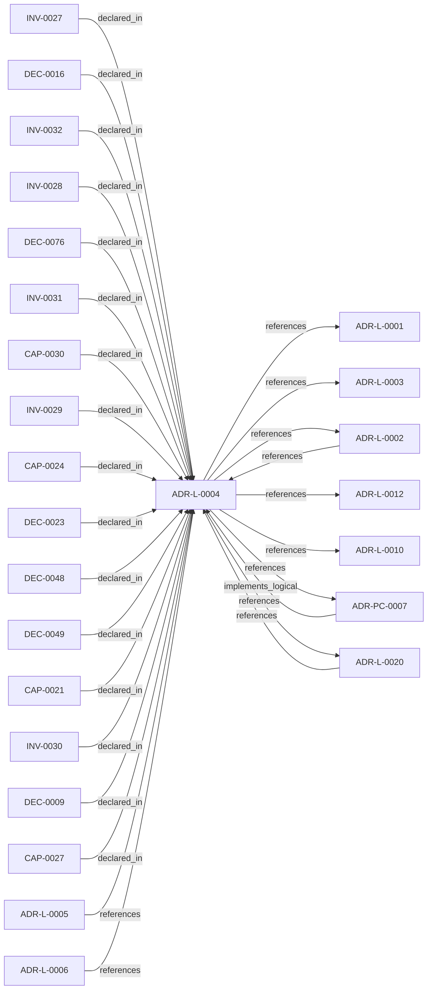

<!--
integrity_schema_version: 1
generated: deterministic_projection_v1
artifact_kind: rendered_adr_markdown
generator_id: adr-projection-markdown
generator_version: 2
hash_algorithm: sha256
source_hash: 80aa033bef374bed74c6a5c4191ae313f4d55dc769e0001353858ad3411b4a17
rendered_hash: a1280f909df4674dd717656882530f8c36f4f84b21ede89fad7560b59b0885d3
-->

# ADR-L-0004: ADR-to-Implementation Traceability via Decorators and Metadata Attribution

**Status:** accepted  
**Created:** 2026-03-08  
**Modified:** 2026-08-20  
**Authors:** adr-architecture-kit  
**Domains:** architecture, traceability, governance, verification  
**Tags:** traceability, decorators, verification, drift-detection, embodied-design  
**Alias name:** adr-to-implementation-traceability-via-decorators-and-metadata-attribution  

## Context

Architecture Decision Records document why implementation artifacts exist, but
the repo still lacks a universal, machine-verifiable way to trace code,
infrastructure, configuration, schemas, pipelines, and scripts back to the
ADRs that justify them.

Earlier design work in this ADR established decorator-based code traceability,
RECON extraction, and bidirectional verification as the right direction.
Since then, adr-architecture-kit has gained an explicit compiler pipeline,
profile-aware contract validation, and stronger governance around derived
architecture state. The traceability design now needs to be widened and
grounded in that current compiler/governance reality.

## Current State

- ADRs reference implementation via `implementation_identifiers`
- Code and infrastructure still lack a canonical reverse link to ADRs
- adr-architecture-kit owns canonical architecture authority, but not source
  extraction of implementation artifacts
- ste-runtime / RECON now extracts decorator metadata into implementation
  attribution evidence records for code paths it can parse
- Existing governance already distinguishes `greenfield`, `brownfield`, and
  `migration`, which should govern legacy onboarding instead of inventing a
  separate transition model

## Architecture Direction

This repository remains the authority for:
- the attribution rule itself
- the canonical decorator and metadata semantics
- the compiler-owned evidence contract that downstream extractors populate
- the validation posture for greenfield, brownfield, and migration use

This repository does not take on source-code parsing for this feature in the
current slice. That remains downstream work for ste-runtime / RECON.

## Problems Solved

1. **Orphaned implementation**: Artifacts exist with no architectural justification
2. **Incomplete implementation**: ADRs declare architecture that is not traced to implementation
3. **Drift**: Implementation evolves without architecture authority remaining explicit
4. **Legacy imports**: Existing codebases need staged onboarding without losing deterministic governance
5. **AI reasoning**: Agents need an explicit intent surface rather than heuristic code-to-ADR guesses
6. **EDR evidence**: Embodied decision records need provenance-rich implementation claims

## STE Principles

- **PRIME-1**: No implicit assumptions (implementation must declare its authority)
- **SYS-4**: Drift prevention (detect when code diverges from ADRs)
- **SYS-5**: Documentation-state as authoritative (ADRs govern code)
- **SYS-6**: RECON completion (architecture must be extractable)
- **Scope-aware onboarding**: Migration posture must be explicit rather than ad hoc

## Relationship graph

## Related ADRs

### ADR-L-0001 — STE-Compliant Machine-Verifiable Architecture Decision Record System

**Relationships:**
- this ADR -[:references]-> 019fee89-e615-70a5-861b-b2dde147e5af

**Context:** # ADR Architecture Kit — STE Authoring Subsystem

[Open projection](ADR-L-0001-ste-compliant-machine-verifiable-architecture-decision-record-system.md)
### ADR-L-0002 — Multi-Scope ADR Architecture for Sub-Module Development

**Relationships:**
- 019fee89-e615-7f19-810b-c7b33a9d9e0d -[:references]-> this ADR
- this ADR -[:references]-> 019fee89-e615-7f19-810b-c7b33a9d9e0d

**Context:** The adr-architecture-kit is being actively developed in a single workspace alongside
multiple sub-modules (ste-runtime, future services) that will eventually become
independent services. Each sub-module needs to leverage the ADR system for its own
architectural documentation while being developed in parallel within the monorepo.

[Open projection](ADR-L-0002-multi-scope-adr-architecture-for-sub-module-development.md)
### ADR-L-0003 — Quality Assurance and Testing Strategy

**Relationships:**
- this ADR -[:references]-> 019fee89-e615-77f6-9b1f-695732d25443

**Context:** The ADR Architecture Kit is a foundational tool for machine-verifiable architecture
documentation. As such, it must maintain high quality standards to ensure reliability,
correctness, and trust in the architectural governance it provides.

[Open projection](ADR-L-0003-quality-assurance-and-testing-strategy.md)
### ADR-L-0005 — ADR-to-Prompt Translation for AI Implementation

**Relationships:**
- 019fee89-e615-73a3-8d31-7a4721affae9 -[:references]-> this ADR

**Context:** The ADR Architecture Kit encodes architectural decisions in machine-readable YAML
format with explicit invariants, capabilities, and component specifications. These
structured ADRs contain all the information needed to guide AI implementation:

[Open projection](ADR-L-0005-adr-to-prompt-translation-for-ai-implementation.md)
### ADR-L-0006 — Rule Library Sub-Module with Cooperative Signals

**Relationships:**
- 019fee89-e615-7b66-b73a-3b99f7d92d4d -[:references]-> this ADR

**Context:** ADR-L-0004 defines a multi-tier governance architecture where a rule-library
sub-module activates and projects rules via MCP. The Rules & Signal Service
(Tier 2) parses ADRs and generates enforcement rules; the rule-library (Tier 3)
receives, activates, and serves those rules to consumers.

[Open projection](ADR-L-0006-rule-library-sub-module-with-cooperative-signals.md)
### ADR-L-0010 — Kernel Interface Contract and Validation Profiles

**Relationships:**
- this ADR -[:references]-> 019fee89-e616-7d61-8e35-f11ba2ddd75d

**Context:** adr-architecture-kit is transitioning from an implicit generator toolkit into
an explicit architecture compiler with a defined contract boundary to the STE
kernel. The plan work established that the compiler's guaranteed contract
surface is broader than the kernel's minimal load subset: the contract family
is all generated artifacts under `adrs/index/` plus `manifest.yaml`, while
individual consumers may rely on narrower subsets.

[Open projection](ADR-L-0010-kernel-interface-contract-and-validation-profiles.md)
### ADR-L-0012 — Federation Authority and Qualified Identity Model

**Relationships:**
- this ADR -[:references]-> 019fee89-e616-744f-b63e-5ecddf344faa

**Context:** The compiler and recursive multi-scope model preserve repository-local
compilation boundaries, while STE federation spans independently compiled
repositories. Federation therefore requires global identity without weakening
provider authority or allowing the aggregation layer to rewrite canonical
repository state.

[Open projection](ADR-L-0012-federation-authority-and-qualified-identity-model.md)
### ADR-L-0020 — Semantic Implementation Attribution and Cross-Layer Architecture Relationships

**Relationships:**
- 019ffdba-3c42-7c4a-a737-f6751a265d60 -[:references]-> this ADR
- this ADR -[:references]-> 019ffdba-3c42-7c4a-a737-f6751a265d60

**Context:** ADR-L-0004 established implementation attribution as an explicit intent
surface. ADR-L-0019 made canonical machine identity a lowercase UUIDv7.
Attribution evidence still cited human aliases (`ADR-L-*`, `INV-*`) and
could not name typed relationships to nested architecture entities.

[Open projection](ADR-L-0020-semantic-implementation-attribution-and-cross-layer-architecture-relationships.md)
### ADR-PC-0007 — Semantic Attribution Embodiment

**Relationships:**
- 019ffdba-3c42-70da-b33d-efc003269c42 -[:implements_logical]-> this ADR
- this ADR -[:references]-> 019ffdba-3c42-70da-b33d-efc003269c42

**Context:** Semantic attribution needs a kit-owned embodiment for vocabulary, evidence
models, UUID decorators, standalone shims, architecture-aware validation,
repository-aware versioned normalization, and a supported bidirectional
linkage facade. This component does not parse consumer source code, does not
own RECON extraction, and does not admit evidence to the architecture graph.

[Open projection](../physical-component/ADR-PC-0007-semantic-attribution-embodiment.md)

## Capabilities

### CAP-0021: Architecture Intent Attribution

Explicit declaration of architectural authority across code and other
implementation artifacts through decorators or metadata-level attribution.

### CAP-0024: Bidirectional Traceability Verification

Automated verification that implementation attribution and ADR declarations
agree in both directions.

### CAP-0027: Profile-Aware Legacy Onboarding for Intent Attribution

Govern intent-attribution adoption with the existing greenfield,
brownfield, and migration profiles instead of a separate legacy mode.

### CAP-0030: Implementation Attribution Evidence Handoff

A compiler-owned evidence contract that downstream extractors populate with
implementation-to-ADR attribution claims and provenance.

## Invariants

### INV-0027

**Statement:** Greenfield in-scope implementation artifacts MUST declare architectural
authority through @implements_adr, a UUID semantic claim decorator, or an
equivalent metadata-level attribution mechanism; equivalent semantic
declarations MUST NOT be dual-encoded on the same surface; brownfield and
migration may stage adoption under profile-specific governance
  
**Scope:** global  
**Enforcement:** must (design)  
**Verification:** automated

**Rationale:**
Explicit architecture intent is mandatory for new systems, but legacy
onboarding must be staged through the existing profile model.

### INV-0028

**Statement:** Implementation attribution references MUST resolve to existing ADRs, and
references to superseded ADRs MUST be surfaced as governance warnings
  
**Scope:** global  
**Enforcement:** must (design)  
**Verification:** automated

**Rationale:**
Invalid or stale authority references undermine machine traceability even
when the attribution syntax itself is present.

### INV-0029

**Statement:** Implementation attribution evidence MUST preserve provenance identifying
the source artifact and extractor responsible for the claim
  
**Scope:** global  
**Enforcement:** must (design)  
**Verification:** automated

**Rationale:**
Traceability without provenance is not auditable enough for EDR evidence,
drift analysis, or trustworthy agent reasoning.

### INV-0030

**Statement:** A declaration that code enforces an invariant is a claim of intent,
not kit-automated proof that the enforcement logic exists
  
**Scope:** global  
**Enforcement:** must (design)  
**Verification:** manual

**Rationale:**
adr-architecture-kit does not parse implementation source to prove
enforcement. Downstream extractors and human review may pursue proof;
the kit validates that the declared target exists and is an invariant.

### INV-0031

**Statement:** adr-architecture-kit MUST define the canonical architecture-intent
attribution rule and evidence contract without taking on direct source-code
parsing responsibilities for downstream repositories
  
**Scope:** global  
**Enforcement:** must (design)  
**Verification:** automated

**Rationale:**
This repository owns architecture authority, while downstream extractors own
language-specific parsing and evidence emission.

### INV-0032

**Statement:** Downstream extractors and rule-delivery systems SHOULD consume ADR-Kit
attribution contracts rather than redefining them independently
  
**Scope:** global  
**Enforcement:** should (design)  
**Verification:** automated

**Rationale:**
Reusing a single contract preserves deterministic semantics across the
ecosystem even when extraction and rule activation live elsewhere.

## Decisions

### DEC-0009: Adopt explicit architecture intent attribution for implementation artifacts

**Rationale:**
Implementation surfaces need explicit, extractable architecture authority.
For code, decorators remain the canonical mechanism:
- `@implements_adr(...)`
- `@enforces_invariant(...)`
- `@implements(...)` / `@enforces(...)` / `@embodies(...)` for UUID-canonical semantic claims (ADR-L-0020)

For infrastructure and adjacent non-code artifacts, the same intent is
expressed through metadata-level declarations rather than per-resource
decoration.

This keeps attribution explicit while respecting artifact-type differences.

**Consequences:**

**Positive:**
- New implementation can declare architectural authority deterministically
- Code and infrastructure use a consistent intent model
- Downstream extraction can remain language-specific without changing rule semantics
- AI reasoning gains explicit implementation-to-ADR provenance

### DEC-0016: Stage downstream extraction and rule activation after ADR-Kit authority is defined

**Rationale:**
adr-architecture-kit should first define the canonical rule, evidence
contract, and profile-aware validation semantics. Source extraction,
runtime rule activation, and any shared ecosystem delivery should build on
that authority rather than forcing this repo to duplicate downstream logic.

**Consequences:**

**Positive:**
- adr-architecture-kit remains the source of canonical architecture semantics
- ste-runtime can focus on extraction rather than architecture authority
- ste-rules-library can encode activation logic later without redefining the rule
- ste-spec only needs involvement if the evidence contract must become shared doctrine

### DEC-0076: Treat runtime-emitted implementation attribution as downstream evidence

**Rationale:**
ste-runtime now populates implementation attribution evidence from parsed
implementation artifacts. That closes the first downstream extraction gap
without moving attribution authority into ste-runtime. adr-architecture-kit
remains responsible for canonical decorator and metadata semantics, the
evidence contract shape, and profile-aware validation against canonical ADR
state.

**Consequences:**

**Positive:**
- RECON can supply extracted attribution claims for validation
- ADR-Kit validates raw attribution evidence against canonical ADR authoring state and exposes a non-authoritative linkage projection without writing Architecture IR
- Runtime extraction can evolve by language without redefining attribution semantics

### DEC-0023: Support Bidirectional Verification

**Rationale:**
Traceability must work in both directions:

**Forward (ADR -> Implementation)**:
- ADR declares component or system implementation identifiers
- Verify that downstream attribution evidence resolves to the declared authority

**Reverse (Implementation -> ADR)**:
- Code has `@implements_adr` or equivalent metadata-level attribution
- Verify that referenced ADR exists and is still a valid authority target

This bidirectional verification detects:
- Orphaned implementation (no ADR)
- Phantom declarations (ADR but no implementation evidence)
- Invalid references (implementation references non-existent ADR)
- Status mismatches (implementation references superseded ADRs)

**Consequences:**

**Positive:**
- Verification must check both directions
- Downstream extraction must preserve both ADR declarations and implementation attribution claims
- Drift detection becomes comprehensive
- CI/CD can enforce traceability

### DEC-0048: Define a compiler-owned implementation attribution evidence contract

**Rationale:**
adr-architecture-kit needs a canonical handoff surface for implementation
attribution evidence without taking on source parsing itself. A small,
compiler-owned schema and model let downstream extractors emit consistent
attribution records that governance can validate deterministically.

**Consequences:**

**Positive:**
- ste-runtime / RECON has a canonical handoff contract to populate
- Governance can validate implementation attribution without parsing source code here
- EDR and coverage work can build on a stable evidence shape

### DEC-0049: Use existing contract profiles for legacy intent-attribution onboarding

**Rationale:**
Greenfield, brownfield, and migration already express the repo's adoption
postures. Intent attribution onboarding should use those same profiles
rather than creating a second transition taxonomy.

**Consequences:**

**Positive:**
- Legacy onboarding remains aligned with existing governance
- Greenfield enforcement can be strict without blocking brownfield imports
- Migration tightening can happen without schema forks or one-off modes

## Gaps

### GAP-0001: Decorator library not yet implemented

**Impact:** low  
**Blocking:** No

**Context:**
Classification: closed. adr_kit.decorators exists and is a Stable surface; UUID claim APIs are added under ADR-L-0020 / ADR-PC-0007.

### GAP-0002: Downstream implementation attribution evidence requires broader extractor coverage

**Impact:** medium  
**Blocking:** No

**Context:**
Classification: narrowed gap. ste-runtime / RECON now emits architecture-intent attribution records for parsed decorator metadata, but coverage across all supported implementation artifact classes remains staged.

### GAP-0003: Legacy onboarding rollout for adr-architecture-kit itself is not yet started

**Impact:** low  
**Blocking:** No

**Context:**
Classification: narrowed gap. Selective high-authority dogfood is in place; remaining surfaces stay in attribution-negative-space rather than whole-repo decoration.

### GAP-0004: ste-rules-library activation for intent-attribution enforcement remains staged

**Impact:** medium  
**Blocking:** No

**Context:**
Classification: deferred gap. Downstream rule activation may be useful later, but it should consume ADR-Kit authority rather than redefine it.

---

*Generated from ADR-L-0004 by ADR Architecture Kit*