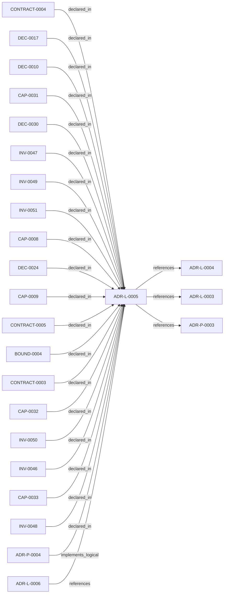

<!--
integrity_schema_version: 1
generated: deterministic_projection_v1
artifact_kind: rendered_adr_markdown
generator_id: adr-projection-markdown
generator_version: 2
hash_algorithm: sha256
source_hash: 6ab94e8fc5c09c6a35ee7b180ed2ac889723f62477bf3399d25fc0618c0674ba
rendered_hash: ce3c3484d021dd7c3e4b19bef60ca49bb0f49b64ea592fc0d66ca44f5bca6510
-->

# ADR-L-0005: ADR-to-Prompt Translation for AI Implementation

**Status:** proposed  
**Created:** 2026-03-08  
**Modified:** 2026-03-08  **Authors:** adr-architecture-kit  
**Domains:** adr, automation, ai-tooling, code-generation  
**Tags:** prompt-engineering, adr, automation, ai-agents, code-generation, llm  **Alias name:** adr-to-prompt-translation-for-ai-implementation  
## Context

The ADR Architecture Kit encodes architectural decisions in machine-readable YAML
format with explicit invariants, capabilities, and component specifications. These
structured ADRs contain all the information needed to guide AI implementation:

- **Invariants** define constraints (MUST/SHOULD/MAY enforcement levels)
- **Capabilities** define acceptance criteria
- **Component specifications** define interfaces, methods, parameters
- **Implementation decisions** define technology choices and patterns
- **Testing requirements** define verification strategy

Currently, translating ADRs into implementation prompts for AI agents (CODEX, Cursor,
etc.) is a manual process. A human reads the ADR and crafts prompts that capture
the constraints and specifications.

This manual translation has several problems:
1. **Inconsistent**: Different humans extract different information
2. **Incomplete**: Easy to miss invariants or requirements
3. **Time-consuming**: Requires careful reading and synthesis
4. **Error-prone**: Constraints may be misinterpreted
5. **Not scalable**: Doesn't scale to 100+ ADRs

Since ADRs are machine-readable, we can **automate prompt generation** from ADR
specifications. This creates a direct pipeline:

```
ADR (machine-readable spec)
    ↓ parse
Prompt Translator
    ↓ generate
Implementation Prompt (for AI agent)
    ↓ execute
AI Implementation
    ↓ validate
Validation (against original ADR)
```

This aligns with STE principles:
- **SYS-2 (Deterministic Cognition)**: Prompts generated deterministically from ADRs
- **PRIME-1 (No Implicit Assumptions)**: All constraints explicit in prompt
- **SYS-4 (Drift Prevention)**: Prompts always match current ADR state

The prompt translator becomes a **code generator for AI instructions**, ensuring
AI agents receive complete, accurate specifications.


## Relationship graph



## Related ADRs

### ADR-L-0003 — Quality Assurance and Testing Strategy

**Relationships:**
- this ADR -[:references]-> 019fee89-e615-77f6-9b1f-695732d25443

**Context:** The ADR Architecture Kit is a foundational tool for machine-verifiable architecture
documentation. As such, it must maintain high quality standards to ensure reliability,
correctness, and trust in the architectural governance it provides.

[Open projection](ADR-L-0003-quality-assurance-and-testing-strategy.md)
### ADR-L-0004 — ADR-to-Implementation Traceability via Decorators and Metadata Attribution

**Relationships:**
- this ADR -[:references]-> 019fee89-e615-7577-8d37-dd0df031bec9

**Context:** Architecture Decision Records document why implementation artifacts exist, but
the repo still lacks a universal, machine-verifiable way to trace code,
infrastructure, configuration, schemas, pipelines, and scripts back to the
ADRs that justify them.

[Open projection](ADR-L-0004-adr-to-implementation-traceability-via-decorators-and-metadata-attribution.md)
### ADR-L-0006 — Rule Library Sub-Module with Cooperative Signals

**Relationships:**
- 019fee89-e615-7b66-b73a-3b99f7d92d4d -[:references]-> this ADR

**Context:** ADR-L-0004 defines a multi-tier governance architecture where a rule-library
sub-module activates and projects rules via MCP. The Rules & Signal Service
(Tier 2) parses ADRs and generates enforcement rules; the rule-library (Tier 3)
receives, activates, and serves those rules to consumers.

[Open projection](ADR-L-0006-rule-library-sub-module-with-cooperative-signals.md)
### ADR-P-0003 — Multi-Scope Python Implementation for ADR Toolkit

**Relationships:**
- this ADR -[:references]-> 019fee89-e618-742f-951d-d29401d56c19

**Context:** ADR-L-0002 defines the logical architecture for multi-scope ADR support.
This Physical ADR specifies the concrete Python implementation including
module structure, API design, and CLI interface.

[Open projection](../physical/ADR-P-0003-multi-scope-python-implementation-for-adr-toolkit.md)
### ADR-P-0004 — Prompt Translator Implementation for AI-Driven Development

**Relationships:**
- 019fee89-e618-703b-a136-3cb5c991e3c4 -[:implements_logical]-> this ADR

**Context:** ADR-L-0005 defines the logical architecture for translating ADRs into
implementation prompts for AI agents. This Physical ADR specifies the
concrete Python implementation.

[Open projection](../physical/ADR-P-0004-prompt-translator-implementation-for-ai-driven-development.md)

## Capabilities

### CAP-0031: Parse Physical ADR Components

Parse Physical ADRs to extract component specifications, including:
- Component ID, name, type, description
- Responsibilities
- Interface definitions (methods, parameters, types)
- Implementation identifiers (file paths)
- Dependencies
- Testing requirements


### CAP-0032: Generate Implementation Prompt

Generate implementation prompt for a specific component that includes:
- Context (what is being built and why)
- Constraints (invariants to enforce)
- Specifications (what to build)
- Test requirements (what to verify)
- Implementation strategy (how to build)
- Validation criteria (how to verify correctness)


### CAP-0033: Generate Validation Checklist

Generate validation checklist for verifying implementation against ADR,
including checks for:
- Code structure (files, classes, methods exist)
- Invariant enforcement (constraints are enforced)
- Test coverage (all required tests exist)
- Integration testing (works in real environment)
- Documentation (docstrings, type hints)


### CAP-0008: Multi-Agent Prompt Generation

Generate prompts for multiple components that can be executed in parallel
by different AI agents, with clear dependency ordering


### CAP-0009: Prompt Format Adaptation

Adapt prompt format for different target AI agents (CODEX, Cursor, Claude, GPT)
while maintaining core content consistency


## Architectural Boundaries

### BOUND-0004: Prompt Translator

**Description:**
Translates ADRs into implementation prompts


**Rationale:**
Separates ADR parsing from prompt generation for single responsibility.


## Interaction Contracts

### CONTRACT-0004

**Parties:** ADR Parser, Prompt Generator  
**Protocol:** Structured component data transfer

**Guarantees:**
Parser extracts component specifications.
Parser validates ADR completeness.
Generator receives validated component data.
Generator produces structured prompt.


### CONTRACT-0005

**Parties:** Prompt Generator, AI Agent  
**Protocol:** Self-contained prompt delivery

**Guarantees:**
Prompt is self-contained (no external references needed).
Prompt includes validation criteria.
Prompt references source ADR for traceability.
Agent can execute prompt independently.


### CONTRACT-0003

**Parties:** AI Implementation, Validator  
**Protocol:** Checklist-based validation

**Guarantees:**
Validator uses generated checklist.
Validator verifies against ADR invariants.
Validator reports compliance status.
- Validator references specific ADR sections


## Invariants

### INV-0046

**Statement:** Generated prompts MUST include all invariants from the source ADR with
their enforcement levels (must/should/may)
  
**Scope:** global  
**Enforcement:** must (design)  
**Verification:** automated

**Rationale:**
Invariants are architectural constraints that MUST be enforced in implementation.
Missing invariants in prompts leads to non-compliant code.


### INV-0047

**Statement:** Generated prompts MUST include component specifications with complete
interface definitions (methods, parameters, return types)
  
**Scope:** global  
**Enforcement:** must (design)  
**Verification:** automated

**Rationale:**
Component specs define what to build. Incomplete specs lead to incorrect
implementations that don't match the architecture.


### INV-0048

**Statement:** Generated prompts MUST reference the source ADR ID and specific sections
(invariant IDs, component IDs) for traceability
  
**Scope:** global  
**Enforcement:** must (design)  
**Verification:** automated

**Rationale:**
Traceability enables validation of implementation against original ADR
and helps AI agents understand authority chain.


### INV-0049

**Statement:** Generated prompts MUST include test requirements from the ADR
  
**Scope:** global  
**Enforcement:** must (design)  
**Verification:** automated

**Rationale:**
Tests are part of the specification. Per ADR-L-0003, TDD methodology
requires tests to be specified before implementation.


### INV-0050

**Statement:** Generated prompts SHOULD include implementation strategy guidance
(e.g., TDD cycle, dependency injection patterns)
  
**Scope:** global  
**Enforcement:** should (design)  
**Verification:** automated

**Rationale:**
Implementation patterns help AI agents produce consistent, high-quality
code that follows project conventions.


### INV-0051

**Statement:** Prompt generator MUST be deterministic - same ADR input always produces
same prompt output
  
**Scope:** global  
**Enforcement:** must (design)  
**Verification:** automated

**Rationale:**
Non-deterministic generation violates SYS-2 (Deterministic Cognition).
Prompts must be reproducible for validation and debugging.


## Decisions

### DEC-0010: Create ADR-to-Prompt Translator

**Rationale:**
Automate the generation of implementation prompts from ADR specifications
to ensure consistency, completeness, and scalability.

Benefits:
- **Consistency**: Same ADR always generates same prompt structure
- **Completeness**: All invariants, capabilities, and specs included
- **Traceability**: Prompt explicitly references source ADR
- **Maintainability**: Update ADR → regenerate prompt automatically
- **Scalability**: Works for any number of ADRs
- **Quality**: Reduces human error in translation


**Alternatives Considered:**

- **Manual prompt crafting**: Not scalable, error-prone
- **Template-based generation**: Less flexible, hard to maintain
- **LLM-based translation**: Non-deterministic, requires validation

**Consequences:**

**Positive:**
- Prompts are generated, not hand-crafted
- ADR changes automatically propagate to prompts
- AI agents receive consistent, complete specifications
- Reduces cognitive load on architects
- Enables automated implementation pipelines


### DEC-0017: Generate Prompts Per Component

**Rationale:**
Physical ADRs contain multiple component specifications (COMP-*). Each
component should have its own implementation prompt to enable:
- Focused implementation (one component at a time)
- Parallel implementation (multiple agents)
- Incremental validation (per component)
- Clear scope boundaries


**Consequences:**

**Positive:**
- One Physical ADR → Multiple prompts (one per component)
- Prompts reference parent ADR for context
- Prompts can be executed independently or sequentially


### DEC-0024: Include Validation Criteria in Prompts

**Rationale:**
Each prompt should include explicit validation criteria so the implementing
agent knows when it's done and how to verify correctness. This enables
self-validation and reduces iteration cycles.


**Consequences:**

**Positive:**
- Prompts are self-contained with success criteria
- AI agents can self-validate before handoff
- Reduces back-and-forth between design and implementation


### DEC-0030: Support Multiple Target Agents

**Rationale:**
Different AI agents (CODEX, Cursor, Claude, GPT) have different capabilities
and prompt formats. The translator should support generating prompts optimized
for specific target agents.


**Alternatives Considered:**

- **Single universal prompt**: May not leverage agent-specific features
- **Manual per-agent prompts**: Not scalable

**Consequences:**

**Positive:**
- Translator has agent-specific formatters
- Can optimize for agent strengths
- Maintains core content consistency across formats


## Gaps

### GAP-0002: Prompt template design needed

**Impact:** medium  
**Blocking:** No

**Context:**
Classification: real gap. Prompt generation exists architecturally, but the production prompt-template set is not implemented in this repo yet.


### GAP-0003: Agent-specific formatters need definition

**Impact:** medium  
**Blocking:** No

**Context:**
Classification: deferred gap. Core prompt generation can proceed before per-agent optimizations are added.


### GAP-0004: Integration with CI/CD for automated implementation

**Impact:** medium  
**Blocking:** No

**Context:**
Classification: deferred gap. This is downstream workflow automation, not a blocker for the architecture-index subsystem.


---

*Generated from ADR-L-0005 by ADR Architecture Kit*