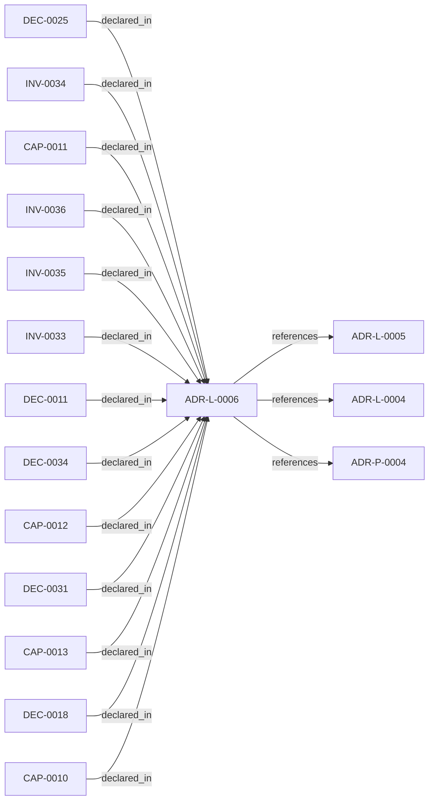

<!--
integrity_schema_version: 1
generated: deterministic_projection_v1
artifact_kind: rendered_adr_markdown
generator_id: adr-projection-markdown
generator_version: 2
hash_algorithm: sha256
source_hash: 1d4c69e20d26e527584915cb57a9aa9c0ac249b3b8b1fc4d61dc6f7a5a59f29e
rendered_hash: 826865804472be1d67c8ca6da169e488e40979e4eead0c7cd9bf640c31bf425b
-->

# ADR-L-0006: Rule Library Sub-Module with Cooperative Signals

**Status:** proposed  
**Created:** 2026-03-08  
**Modified:** 2026-03-08  **Authors:** adr-architecture-kit  
**Domains:** governance, rules, signals, integration  
**Tags:** rule-library, cooperative-signals, submodule, mcp  **Alias name:** rule-library-sub-module-with-cooperative-signals  
## Context

ADR-L-0004 defines a multi-tier governance architecture where a rule-library
sub-module activates and projects rules via MCP. The Rules & Signal Service
(Tier 2) parses ADRs and generates enforcement rules; the rule-library (Tier 3)
receives, activates, and serves those rules to consumers.

A proof-of-concept rules-library exists at _poc_rules-library with a three-layer
activation model, signal-driven rule selection, and submodule protocol. The POC
solves the "activation problem": rules exist but aren't applied consistently.

Separately, the prompt translator (ADR-L-0005, ADR-P-0004) generates cooperative
signals for parallel AI agent coordination: claim, progress, complete,
wave_complete, validation_ready. These file-based signals enable agents to
coordinate without a server until the Rules & Signal Service is built.

## The Opportunity

The rule-library can serve as the **coordination hub** for file-based tooling:
- Define canonical signal schema (cooperative + context)
- Provide signal emission patterns for prompt translator
- Read/validate signals from agent workspaces
- Eventually receive rules from Rules & Signal Service

Building from POC principles allows:
1. Correct integration with STE ecosystem (adr-architecture-kit, ste-runtime)
2. Cooperative signals as first-class capability
3. Prompt translator integration (signal instructions in generated prompts)
4. Independent repo and submodule for reuse across projects

## Problems Solved

1. **Activation problem**: Rules exist but aren't applied (POC insight)
2. **Coordination gap**: Agents need signals to coordinate (prompt translator)
3. **Schema authority**: Who defines signal format? (rule-library)
4. **Integration**: Prompt translator, decorators, ste-runtime need shared hub

## Relationship graph

## Related ADRs

### ADR-L-0004 — ADR-to-Implementation Traceability via Decorators and Metadata Attribution

**Relationships:**
- this ADR -[:references]-> 019fee89-e615-7577-8d37-dd0df031bec9

**Context:** Architecture Decision Records document why implementation artifacts exist, but
the repo still lacks a universal, machine-verifiable way to trace code,
infrastructure, configuration, schemas, pipelines, and scripts back to the
ADRs that justify them.

[Open projection](ADR-L-0004-adr-to-implementation-traceability-via-decorators-and-metadata-attribution.md)
### ADR-L-0005 — ADR-to-Prompt Translation for AI Implementation

**Relationships:**
- this ADR -[:references]-> 019fee89-e615-73a3-8d31-7a4721affae9

**Context:** The ADR Architecture Kit encodes architectural decisions in machine-readable YAML
format with explicit invariants, capabilities, and component specifications. These
structured ADRs contain all the information needed to guide AI implementation:

[Open projection](ADR-L-0005-adr-to-prompt-translation-for-ai-implementation.md)
### ADR-P-0004 — Prompt Translator Implementation for AI-Driven Development

**Relationships:**
- this ADR -[:references]-> 019fee89-e618-703b-a136-3cb5c991e3c4

**Context:** ADR-L-0005 defines the logical architecture for translating ADRs into
implementation prompts for AI agents. This Physical ADR specifies the
concrete Python implementation.

[Open projection](../physical/ADR-P-0004-prompt-translator-implementation-for-ai-driven-development.md)

## Capabilities

### CAP-0010: Signal Schema Authority

rule-library defines canonical schema for context and cooperative signals.

### CAP-0011: Signal Emission CLI

CLI for agents to emit cooperative signals without writing JSON manually.

### CAP-0012: Rule Activation and Projection

Context signals drive rule selection; rules projected for consumption.

### CAP-0013: Submodule Bootstrap

Bootstrap script for projects adding rule-library as submodule.

## Invariants

### INV-0033

**Statement:** rule-library MUST define canonical schema for cooperative signals
  
**Scope:** global  
**Enforcement:** must (design)  
**Verification:** automated

**Rationale:**
Signal format must be authoritative. Prompt translator and agents
consume this schema. Single source of truth.

### INV-0034

**Statement:** rule-library MUST support file-based rule and signal handling
  
**Scope:** global  
**Enforcement:** must (design)  
**Verification:** automated

**Rationale:**
Works without Rules & Signal Service or MCP. Enables development
and offline scenarios.

### INV-0035

**Statement:** rule-library MUST NOT self-govern; it is governed by ADRs
  
**Scope:** global  
**Enforcement:** must (policy)  
**Verification:** manual

**Rationale:**
Meta-governance: rules can be wrong. ADRs (in consuming project or
rule-library itself) define correctness. Aligns with POC ADR-003.

### INV-0036

**Statement:** Cooperative signal schema MUST include claim, progress, complete,
wave_complete, validation_ready types
  
**Scope:** global  
**Enforcement:** must (design)  
**Verification:** automated

**Rationale:**
These types enable parallel agent coordination per docs/COOPERATIVE-SIGNALS.md.
Prompt translator generates instructions for these.

## Decisions

### DEC-0011: Build from POC Principles

**Rationale:**
Build ste-rules-library from POC design principles.

Adopt from POC:
- Three-layer activation (context signals drive rule selection)
- Signal-driven projection (only relevant rules)
- Submodule protocol with bootstrap
- Meta-governance (ADRs govern rules, not self-governed)
- Conflict detection (escalate, never auto-resolve)

Adapt for STE:
- ADR-derived rules (from Rules & Signal Service when built)
- Cooperative signals (agent coordination)
- Integration with adr-architecture-kit decorators
- Integration with prompt translator

**Consequences:**

**Positive:**
- New standalone rule-library repo
- Design doc: docs/RULE-LIBRARY-DESIGN.md

### DEC-0018: Cooperative Signals as First-Class

**Rationale:**
rule-library defines and supports cooperative signals alongside context
signals. Two signal semantics:

**Context signals** (from POC): Drive rule selection
- file_pattern, language, domain
- "What rules apply to this context?"

**Cooperative signals** (from prompt translator): Agent coordination
- claim, progress, complete, wave_complete, validation_ready
- "Who is doing what? When can I start?"

rule-library provides:
- Canonical signal schema (schema/signal.schema.json)
- Signal emission CLI for agents
- Signal read/validate for monitoring

**Consequences:**

**Positive:**
- schema/signal.schema.json in rule-library
- scripts/emit-signal.py for agents
- File-based until MCP/RSS

### DEC-0025: Prompt Translator Integration

**Rationale:**
Prompt translator (adr-architecture-kit) generates implementation prompts
that include signal emission instructions. rule-library is the schema
authority for those instructions.

Flow:
1. rule-library defines signal.schema.json
2. Prompt translator templates reference schema
3. Generated prompts include "emit claim", "emit complete" instructions
4. Agents emit to .codex/signals/, .cursor/signals/
5. rule-library (or monitor) reads signals

This makes the prompt translator the "code generator" for cooperative
flow control until proper Rules & Signal Service exists.

**Consequences:**

**Positive:**
- rule-library schema consumed by prompt translator
- ADR-P-0004 templates include signal instructions
- docs/COOPERATIVE-SIGNALS.md aligns with rule-library schema

### DEC-0031: Standalone Repo, Submodule Consumption

**Rationale:**
rule-library as standalone repo enables:
- Independent versioning
- Clean dependency boundary
- Submodule into adr-architecture-kit, ste-runtime, any STE project
- No monorepo coupling

Consumption:
- git submodule add <rule-library-url> rule-library
- python rule-library/scripts/bootstrap.py
- Project gets rule index, signal schema, integration snippet

**Consequences:**

**Positive:**
- New GitHub/GitLab repo: rule-library
- Submodule protocol (adapted from POC ADR-008)
- Bootstrap generates project config

### DEC-0034: File-Based First, MCP Later

**Rationale:**
Phase 1: File-based rules and signals. No server. Works with existing
prompt translator, codex-implement.py, bootstrap prompts.

Phase 2: MCP server for rule projection. get_rules, emit_signal tools.
File-based remains fallback for offline/development.

This allows incremental adoption without blocking on infrastructure.

**Consequences:**

**Positive:**
- No MCP required for initial use
- MCP is enhancement, not dependency
- Offline/air-gapped scenarios supported

## Gaps

### GAP-0006: Prompt translator COMP-0009 (SignalGenerator) not implemented

**Impact:** medium  
**Blocking:** No

**Context:**
Classification: real gap. Prompt translator signal-emission integration is still not implemented in adr-architecture-kit.

### GAP-0007: Rules & Signal Service not built

**Impact:** medium  
**Blocking:** No

**Context:**
Classification: deferred gap. This remains a later workspace-level service, outside the current repo-local discovery implementation.

---

*Generated from ADR-L-0006 by ADR Architecture Kit*