<!--
integrity_schema_version: 1
generated: deterministic_projection_v1
artifact_kind: rendered_adr_markdown
generator_id: adr-projection-markdown
generator_version: 3
hash_algorithm: sha256
source_hash: 57e1edf99205cdc63bf7db815b6b53432d11cda84954ed35411c478ec5e94904
rendered_hash: 6902f57946fbfca73d3ae448b0ed2cbf4fc35fa4753d3d8c9e43f931672c62da
-->

# ADR-L-0006: Rule Library Sub-Module with Cooperative Signals

## Identity / Status

**Type:** logical  
**Status:** accepted  
**Alias:** ADR-L-0006  
**Alias name:** rule-library-sub-module-with-cooperative-signals  
**Created:** 2026-03-08  
**Modified:** 2026-03-08  
**Authors:** adr-architecture-kit  
**Domains:** governance, rules, signals, integration  

## Architecture Position

Logical architecture authority for this subject. Neighborhood paths use structural bridges plus exactly one semantic architecture edge; they never invent ADR-to-ADR verbs.

## Architecture Neighborhood

### Semantic architecture inventory

- None

## Neighbor Relationships

No grammatical peer neighborhood for this subject.

### Lifecycle / association

- ADR-L-0006 -[:references]-> ADR-L-0005
- ADR-L-0006 -[:references]-> ADR-L-0004

## Context

ADR-L-0004 defines a multi-tier governance architecture where a rule-library
sub-module activates and projects rules via MCP. The Rules & Signal Service
(Tier 2) parses ADRs and generates enforcement rules; the rule-library (Tier 3)
receives, activates, and serves those rules to consumers.

A proof-of-concept rules-library exists at _poc_rules-library with a three-layer
activation model, signal-driven rule selection, and submodule protocol. The POC
solves the "activation problem": rules exist but aren't applied consistently.

Separately, the prompt translator (ADR-L-0005) generates cooperative
signals for parallel AI agent coordination: claim, progress, complete,
wave_complete, validation_ready. These file-based signals enable agents to
coordinate without a server until the Rules & Signal Service is built.

## The Opportunity

The rule-library can serve as the **coordination hub** for file-based tooling:
- Define canonical signal schema (cooperative + context)
- Provide signal emission patterns for prompt translator
- Read/validate signals from agent workspaces
- Eventually receive rules from Rules & Signal Service

Building from POC principles allows:
1. Correct integration with STE ecosystem (adr-architecture-kit, ste-runtime)
2. Cooperative signals as first-class capability
3. Prompt translator integration (signal instructions in generated prompts)
4. Independent repo and submodule for reuse across projects

## Problems Solved

1. **Activation problem**: Rules exist but aren't applied (POC insight)
2. **Coordination gap**: Agents need signals to coordinate (prompt translator)
3. **Schema authority**: Who defines signal format? (rule-library)
4. **Integration**: Prompt translator, decorators, ste-runtime need shared hub

## Internal Structure

```mermaid
flowchart TB
  n_019fee89_e615_7b66_b73a_3b99f7d92d4d["ADR-L-0006<br/>Rule Library Sub-Module with Cooperative Signals"]
  subgraph sg_capability["capability"]
    n_019fee89_e615_7fef_a81d_ffbcc5c11de8["CAP-0010<br/>Signal Schema Authority"]
    n_019fee89_e615_7199_be3b_64c7a82f3c4c["CAP-0011<br/>Signal Emission CLI"]
    n_019fee89_e615_77b5_b73c_7db427c64a68["CAP-0012<br/>Rule Activation and Projection"]
    n_019fee89_e615_7ce1_aa20_4b16a485eb1a["CAP-0013<br/>Submodule Bootstrap"]
  end
  subgraph sg_decision["decision"]
    n_019fee89_e615_775e_8b3b_87bd8305b453["DEC-0011<br/>Build from POC Principles"]
    n_019fee89_e615_7e63_a71d_04283e66cb51["DEC-0018<br/>Cooperative Signals as First-Class"]
    n_019fee89_e615_70ab_bf3d_3a9879ef1fa3["DEC-0025<br/>Prompt Translator Integration"]
    n_019fee89_e615_7cbc_b53e_42784e9f3081["DEC-0031<br/>Standalone Repo, Submodule Consumption"]
    n_019fee89_e615_7762_a91e_f7d5d71acc18["DEC-0034<br/>File-Based First, MCP Later"]
  end
  subgraph sg_invariant["invariant"]
    n_019fee89_e615_7688_953b_19e6aae687a4["INV-0033"]
    n_019fee89_e615_70fd_9622_a4e35697ad39["INV-0034"]
    n_019fee89_e615_7602_8d3e_153b2a57947d["INV-0035"]
    n_019fee89_e615_71bc_a727_e0403c74783d["INV-0036"]
  end
  n_019fee89_e615_70ab_bf3d_3a9879ef1fa3 -->|"declared_in"| n_019fee89_e615_7b66_b73a_3b99f7d92d4d
  n_019fee89_e615_70fd_9622_a4e35697ad39 -->|"declared_in"| n_019fee89_e615_7b66_b73a_3b99f7d92d4d
  n_019fee89_e615_7199_be3b_64c7a82f3c4c -->|"declared_in"| n_019fee89_e615_7b66_b73a_3b99f7d92d4d
  n_019fee89_e615_71bc_a727_e0403c74783d -->|"declared_in"| n_019fee89_e615_7b66_b73a_3b99f7d92d4d
  n_019fee89_e615_7602_8d3e_153b2a57947d -->|"declared_in"| n_019fee89_e615_7b66_b73a_3b99f7d92d4d
  n_019fee89_e615_7688_953b_19e6aae687a4 -->|"declared_in"| n_019fee89_e615_7b66_b73a_3b99f7d92d4d
  n_019fee89_e615_775e_8b3b_87bd8305b453 -->|"declared_in"| n_019fee89_e615_7b66_b73a_3b99f7d92d4d
  n_019fee89_e615_7762_a91e_f7d5d71acc18 -->|"declared_in"| n_019fee89_e615_7b66_b73a_3b99f7d92d4d
  n_019fee89_e615_77b5_b73c_7db427c64a68 -->|"declared_in"| n_019fee89_e615_7b66_b73a_3b99f7d92d4d
  n_019fee89_e615_7cbc_b53e_42784e9f3081 -->|"declared_in"| n_019fee89_e615_7b66_b73a_3b99f7d92d4d
  n_019fee89_e615_7ce1_aa20_4b16a485eb1a -->|"declared_in"| n_019fee89_e615_7b66_b73a_3b99f7d92d4d
  n_019fee89_e615_7e63_a71d_04283e66cb51 -->|"declared_in"| n_019fee89_e615_7b66_b73a_3b99f7d92d4d
  n_019fee89_e615_7fef_a81d_ffbcc5c11de8 -->|"declared_in"| n_019fee89_e615_7b66_b73a_3b99f7d92d4d
```

- `capability` CAP-0010 — Signal Schema Authority
- `capability` CAP-0011 — Signal Emission CLI
- `capability` CAP-0012 — Rule Activation and Projection
- `capability` CAP-0013 — Submodule Bootstrap
- `decision` DEC-0011 — Build from POC Principles
- `decision` DEC-0018 — Cooperative Signals as First-Class
- `decision` DEC-0025 — Prompt Translator Integration
- `decision` DEC-0031 — Standalone Repo, Submodule Consumption
- `decision` DEC-0034 — File-Based First, MCP Later
- `invariant` INV-0033 — INV-0033
- `invariant` INV-0034 — INV-0034
- `invariant` INV-0035 — INV-0035
- `invariant` INV-0036 — INV-0036

## Capabilities

### CAP-0010: Signal Schema Authority

rule-library defines canonical schema for context and cooperative signals.

### CAP-0011: Signal Emission CLI

CLI for agents to emit cooperative signals without writing JSON manually.

### CAP-0012: Rule Activation and Projection

Context signals drive rule selection; rules projected for consumption.

### CAP-0013: Submodule Bootstrap

Bootstrap script for projects adding rule-library as submodule.

## Decisions

### DEC-0011: Build from POC Principles

**Rationale:**
Build ste-rules-library from POC design principles.

Adopt from POC:
- Three-layer activation (context signals drive rule selection)
- Signal-driven projection (only relevant rules)
- Submodule protocol with bootstrap
- Meta-governance (ADRs govern rules, not self-governed)
- Conflict detection (escalate, never auto-resolve)

Adapt for STE:
- ADR-derived rules (from Rules & Signal Service when built)
- Cooperative signals (agent coordination)
- Integration with adr-architecture-kit decorators
- Integration with prompt translator

### DEC-0018: Cooperative Signals as First-Class

**Rationale:**
rule-library defines and supports cooperative signals alongside context
signals. Two signal semantics:

**Context signals** (from POC): Drive rule selection
- file_pattern, language, domain
- "What rules apply to this context?"

**Cooperative signals** (from prompt translator): Agent coordination
- claim, progress, complete, wave_complete, validation_ready
- "Who is doing what? When can I start?"

rule-library provides:
- Canonical signal schema (schema/signal.schema.json)
- Signal emission CLI for agents
- Signal read/validate for monitoring

### DEC-0025: Prompt Translator Integration

**Rationale:**
Prompt translator (adr-architecture-kit) generates implementation prompts
that include signal emission instructions. rule-library is the schema
authority for those instructions.

Flow:
1. rule-library defines signal.schema.json
2. Prompt translator templates reference schema
3. Generated prompts include "emit claim", "emit complete" instructions
4. Agents emit to .codex/signals/, .cursor/signals/
5. rule-library (or monitor) reads signals

This makes the prompt translator the "code generator" for cooperative
flow control until proper Rules & Signal Service exists.

### DEC-0031: Standalone Repo, Submodule Consumption

**Rationale:**
rule-library as standalone repo enables:
- Independent versioning
- Clean dependency boundary
- Submodule into adr-architecture-kit, ste-runtime, any STE project
- No monorepo coupling

Consumption:
- git submodule add <rule-library-url> rule-library
- python rule-library/scripts/bootstrap.py
- Project gets rule index, signal schema, integration snippet

### DEC-0034: File-Based First, MCP Later

**Rationale:**
Phase 1: File-based rules and signals. No server. Works with existing
prompt translator, codex-implement.py, bootstrap prompts.

Phase 2: MCP server for rule projection. get_rules, emit_signal tools.
File-based remains fallback for offline/development.

This allows incremental adoption without blocking on infrastructure.

## Invariants

### INV-0033

**Statement:** rule-library MUST define canonical schema for cooperative signals
  
**Scope:** global  
**Enforcement:** must (design)

**Rationale:**
Signal format must be authoritative. Prompt translator and agents
consume this schema. Single source of truth.

### INV-0034

**Statement:** rule-library MUST support file-based rule and signal handling
  
**Scope:** global  
**Enforcement:** must (design)

**Rationale:**
Works without Rules & Signal Service or MCP. Enables development
and offline scenarios.

### INV-0035

**Statement:** rule-library MUST NOT self-govern; it is governed by ADRs
  
**Scope:** global  
**Enforcement:** must (policy)

**Rationale:**
Meta-governance: rules can be wrong. ADRs (in consuming project or
rule-library itself) define correctness. Aligns with POC ADR-003.

### INV-0036

**Statement:** Cooperative signal schema MUST include claim, progress, complete,
wave_complete, validation_ready types
  
**Scope:** global  
**Enforcement:** must (design)

**Rationale:**
These types enable parallel agent coordination per docs/COOPERATIVE-SIGNALS.md.
Prompt translator generates instructions for these.

## Gaps

### GAP-0006: Prompt translator COMP-0009 (SignalGenerator) not implemented

Classification: real gap. Prompt translator signal-emission integration is still not implemented in adr-architecture-kit.

### GAP-0007: Rules & Signal Service not built

Classification: deferred gap. This remains a later workspace-level service, outside the current repo-local discovery implementation.

---

*Generated from ADR-L-0006 by ADR Architecture Kit (projection v3)*