<!--
integrity_schema_version: 1
generated: deterministic_projection_v1
artifact_kind: rendered_adr_markdown
generator_id: adr-projection-markdown
generator_version: 2
hash_algorithm: sha256
source_hash: 43e9566d144d1ba7e2248c34f7b495ca918d4ca56e18f62d196e0219ad2a8e0a
rendered_hash: c3585a2a1e8eb10f5ee5714e901bfe7aebcfbd60938ce10e53710179c716b8ba
-->

# ADR-L-0007: Deterministic Documentation Projection

**Status:** accepted  
**Created:** 2026-03-12  
**Authors:** adr-architecture-kit  
**Domains:** documentation, governance, determinism, projection  
**Tags:** generated-documentation, deterministic, ai-first, drift-prevention  
**Alias name:** adr-l-0007-deterministic-documentation-projection  

## Context

The repository already treats several human-readable artifacts as derived state:
ADR human projections under adrs/adr-projection/, manifest summaries, and the AI-first SYSTEM-OVERVIEW
are generated from structured or code-defined sources. That behavior now needs
explicit architectural authority so future contributors do not reintroduce
manually maintained documentation that drifts from canonical artifacts.

The canonical source of truth in this system is structured architecture state:
ADR YAML, invariant YAML, project metadata, schema definitions, and generator
source code where projection rules are intentionally encoded. Human-readable
documentation exists to improve orientation and inspection, but it is not the
authoritative state.

Manual maintenance of generated documentation creates several risks:
- drift between canonical artifacts and human-readable views
- ambiguity over whether readers should trust rendered output or source artifacts
- AI contributors missing generators and editing rendered outputs directly
- inconsistent updates across manifest summaries, indexes, and overview files

This rule applies to all human-readable architecture documentation projections,
including:
- ADR human projections (adrs/adr-projection/)
- SYSTEM-OVERVIEW
- manifest summaries
- architecture diagrams
- documentation indexes
- future documentation projections introduced later

The repository therefore needs an explicit logical rule: structured artifacts
are canonical, documentation renderings are derived, and projection consistency
must be enforced through generators, validators, tests, and CI.

## Relationship graph

```mermaid
flowchart LR
  n_019fee89_e615_70a5_861b_b2dde147e5af["ADR-L-0001"]
  n_019fee89_e615_7564_933f_0bb0cbbcf41b["CAP-0014"]
  n_019fee89_e615_758b_b03f_e4a3dc338589["DEC-0012"]
  n_019fee89_e615_77f6_9b1f_695732d25443["ADR-L-0003"]
  n_019fee89_e615_796c_ae1d_a27f1fff021b["DEC-0026"]
  n_019fee89_e615_7b9c_8e3f_32ceeda01491["ADR-L-0007"]
  n_019fee89_e615_7e55_972f_14dd7da851c0["DEC-0019"]
  n_019fee89_e616_744f_b63e_5ecddf344faa["ADR-L-0012"]
  n_019fee89_e616_77e0_992d_25764a1ed5a2["INV-0039"]
  n_019fee89_e616_7abd_ad17_f29edbd30959["INV-0038"]
  n_019fee89_e616_7bf6_a63f_2fdbec175790["INV-0037"]
  n_019fee89_e616_7c4e_953c_b7349412a784["ADR-L-0013"]
  n_019fee89_e618_74b2_a83e_e41c7d8c9f37["ADR-PC-0005"]
  n_019fee89_e618_79ed_9d2d_cc35c63bc99a["ADR-P-0001"]
  n_019fee89_e618_7a2f_aa3e_1f892cdf9410["ADR-P-0002"]
  n_019fee89_e618_7b76_843f_cfe21ceb2ea6["ADR-PC-0003"]
  n_019fee89_e618_7d04_9337_4aa2d3258507["ADR-PS-0002"]
  n_019ff142_dd48_72ff_9e3f_81ca4a779db7["DEC-0108"]
  n_019ff142_dd48_7ef8_8d3e_576f4bb02dc3["DEC-0109"]
  n_019ff22a_bb5f_7214_8818_40820f8c553e["DEC-0111"]
  n_019ff22a_bb5f_76eb_8a31_546eeba55dcb["DEC-0113"]
  n_019ff22a_bb5f_7779_912f_040cdf1b54b8["INV-0100"]
  n_019ff22a_bb5f_77ed_a63f_98f0455fdd1e["DEC-0114"]
  n_019ff22a_bb5f_7926_a33c_b66f72343219["DEC-0115"]
  n_019ff22a_bb5f_7b93_a600_f587022aeffd["INV-0101"]
  n_019ff22a_bb5f_7bfc_851d_938bffc81281["DEC-0110"]
  n_019ff22a_bb5f_7c77_a223_1dab5e8c814d["INV-0099"]
  n_019ff22a_bb5f_7d9e_973f_b9008898a8c9["DEC-0112"]
  n_019ff22a_bb5f_7fca_b021_b3cbc68ddde2["INV-0102"]
  n_019fee89_e615_7564_933f_0bb0cbbcf41b -->|"declared_in"| n_019fee89_e615_7b9c_8e3f_32ceeda01491
  n_019fee89_e615_758b_b03f_e4a3dc338589 -->|"declared_in"| n_019fee89_e615_7b9c_8e3f_32ceeda01491
  n_019fee89_e615_796c_ae1d_a27f1fff021b -->|"declared_in"| n_019fee89_e615_7b9c_8e3f_32ceeda01491
  n_019fee89_e615_7e55_972f_14dd7da851c0 -->|"declared_in"| n_019fee89_e615_7b9c_8e3f_32ceeda01491
  n_019fee89_e616_77e0_992d_25764a1ed5a2 -->|"declared_in"| n_019fee89_e615_7b9c_8e3f_32ceeda01491
  n_019fee89_e616_7abd_ad17_f29edbd30959 -->|"declared_in"| n_019fee89_e615_7b9c_8e3f_32ceeda01491
  n_019fee89_e616_7bf6_a63f_2fdbec175790 -->|"declared_in"| n_019fee89_e615_7b9c_8e3f_32ceeda01491
  n_019ff142_dd48_72ff_9e3f_81ca4a779db7 -->|"declared_in"| n_019fee89_e615_7b9c_8e3f_32ceeda01491
  n_019ff142_dd48_7ef8_8d3e_576f4bb02dc3 -->|"declared_in"| n_019fee89_e615_7b9c_8e3f_32ceeda01491
  n_019ff22a_bb5f_7214_8818_40820f8c553e -->|"declared_in"| n_019fee89_e615_7b9c_8e3f_32ceeda01491
  n_019ff22a_bb5f_76eb_8a31_546eeba55dcb -->|"declared_in"| n_019fee89_e615_7b9c_8e3f_32ceeda01491
  n_019ff22a_bb5f_7779_912f_040cdf1b54b8 -->|"declared_in"| n_019fee89_e615_7b9c_8e3f_32ceeda01491
  n_019ff22a_bb5f_77ed_a63f_98f0455fdd1e -->|"declared_in"| n_019fee89_e615_7b9c_8e3f_32ceeda01491
  n_019ff22a_bb5f_7926_a33c_b66f72343219 -->|"declared_in"| n_019fee89_e615_7b9c_8e3f_32ceeda01491
  n_019ff22a_bb5f_7b93_a600_f587022aeffd -->|"declared_in"| n_019fee89_e615_7b9c_8e3f_32ceeda01491
  n_019ff22a_bb5f_7bfc_851d_938bffc81281 -->|"declared_in"| n_019fee89_e615_7b9c_8e3f_32ceeda01491
  n_019ff22a_bb5f_7c77_a223_1dab5e8c814d -->|"declared_in"| n_019fee89_e615_7b9c_8e3f_32ceeda01491
  n_019ff22a_bb5f_7d9e_973f_b9008898a8c9 -->|"declared_in"| n_019fee89_e615_7b9c_8e3f_32ceeda01491
  n_019ff22a_bb5f_7fca_b021_b3cbc68ddde2 -->|"declared_in"| n_019fee89_e615_7b9c_8e3f_32ceeda01491
  n_019fee89_e615_758b_b03f_e4a3dc338589 -->|"enforces"| n_019fee89_e616_77e0_992d_25764a1ed5a2
  n_019fee89_e615_758b_b03f_e4a3dc338589 -->|"enforces"| n_019fee89_e616_7abd_ad17_f29edbd30959
  n_019fee89_e615_758b_b03f_e4a3dc338589 -->|"enforces"| n_019fee89_e616_7bf6_a63f_2fdbec175790
  n_019fee89_e615_796c_ae1d_a27f1fff021b -->|"enforces"| n_019fee89_e616_77e0_992d_25764a1ed5a2
  n_019fee89_e615_796c_ae1d_a27f1fff021b -->|"enforces"| n_019fee89_e616_7abd_ad17_f29edbd30959
  n_019fee89_e615_7e55_972f_14dd7da851c0 -->|"enforces"| n_019fee89_e616_77e0_992d_25764a1ed5a2
  n_019fee89_e615_7e55_972f_14dd7da851c0 -->|"enforces"| n_019fee89_e616_7bf6_a63f_2fdbec175790
  n_019ff142_dd48_72ff_9e3f_81ca4a779db7 -->|"enforces"| n_019fee89_e616_77e0_992d_25764a1ed5a2
  n_019ff142_dd48_72ff_9e3f_81ca4a779db7 -->|"enforces"| n_019fee89_e616_7abd_ad17_f29edbd30959
  n_019ff142_dd48_72ff_9e3f_81ca4a779db7 -->|"enforces"| n_019fee89_e616_7bf6_a63f_2fdbec175790
  n_019ff142_dd48_7ef8_8d3e_576f4bb02dc3 -->|"enforces"| n_019fee89_e616_7abd_ad17_f29edbd30959
  n_019ff142_dd48_7ef8_8d3e_576f4bb02dc3 -->|"enforces"| n_019fee89_e616_7bf6_a63f_2fdbec175790
  n_019ff22a_bb5f_7214_8818_40820f8c553e -->|"enforces"| n_019fee89_e616_7abd_ad17_f29edbd30959
  n_019ff22a_bb5f_7214_8818_40820f8c553e -->|"enforces"| n_019ff22a_bb5f_7b93_a600_f587022aeffd
  n_019ff22a_bb5f_76eb_8a31_546eeba55dcb -->|"enforces"| n_019fee89_e616_7bf6_a63f_2fdbec175790
  n_019ff22a_bb5f_76eb_8a31_546eeba55dcb -->|"enforces"| n_019ff22a_bb5f_7779_912f_040cdf1b54b8
  n_019ff22a_bb5f_77ed_a63f_98f0455fdd1e -->|"enforces"| n_019ff22a_bb5f_7fca_b021_b3cbc68ddde2
  n_019ff22a_bb5f_7926_a33c_b66f72343219 -->|"enforces"| n_019ff22a_bb5f_7779_912f_040cdf1b54b8
  n_019ff22a_bb5f_7926_a33c_b66f72343219 -->|"enforces"| n_019ff22a_bb5f_7fca_b021_b3cbc68ddde2
  n_019ff22a_bb5f_7bfc_851d_938bffc81281 -->|"enforces"| n_019ff22a_bb5f_7779_912f_040cdf1b54b8
  n_019ff22a_bb5f_7bfc_851d_938bffc81281 -->|"enforces"| n_019ff22a_bb5f_7c77_a223_1dab5e8c814d
  n_019ff22a_bb5f_7d9e_973f_b9008898a8c9 -->|"enforces"| n_019fee89_e616_7abd_ad17_f29edbd30959
  n_019ff22a_bb5f_7d9e_973f_b9008898a8c9 -->|"enforces"| n_019ff22a_bb5f_7b93_a600_f587022aeffd
  n_019fee89_e618_74b2_a83e_e41c7d8c9f37 -->|"implements_logical"| n_019fee89_e615_7b9c_8e3f_32ceeda01491
  n_019fee89_e618_7b76_843f_cfe21ceb2ea6 -->|"implements_logical"| n_019fee89_e615_7b9c_8e3f_32ceeda01491
  n_019fee89_e618_7d04_9337_4aa2d3258507 -->|"implements_logical"| n_019fee89_e615_7b9c_8e3f_32ceeda01491
  n_019fee89_e615_7b9c_8e3f_32ceeda01491 -->|"references"| n_019fee89_e615_70a5_861b_b2dde147e5af
  n_019fee89_e615_7b9c_8e3f_32ceeda01491 -->|"references"| n_019fee89_e615_77f6_9b1f_695732d25443
  n_019fee89_e615_7b9c_8e3f_32ceeda01491 -->|"references"| n_019fee89_e616_7c4e_953c_b7349412a784
  n_019fee89_e615_7b9c_8e3f_32ceeda01491 -->|"references"| n_019fee89_e618_74b2_a83e_e41c7d8c9f37
  n_019fee89_e615_7b9c_8e3f_32ceeda01491 -->|"references"| n_019fee89_e618_79ed_9d2d_cc35c63bc99a
  n_019fee89_e615_7b9c_8e3f_32ceeda01491 -->|"references"| n_019fee89_e618_7a2f_aa3e_1f892cdf9410
  n_019fee89_e616_744f_b63e_5ecddf344faa -->|"references"| n_019fee89_e615_7b9c_8e3f_32ceeda01491
```

## Related ADRs

### ADR-L-0001 — STE-Compliant Machine-Verifiable Architecture Decision Record System

**Relationships:**
- this ADR -[:references]-> 019fee89-e615-70a5-861b-b2dde147e5af

**Context:** # ADR Architecture Kit — STE Authoring Subsystem

[Open projection](ADR-L-0001-ste-compliant-machine-verifiable-architecture-decision-record-system.md)
### ADR-L-0003 — Quality Assurance and Testing Strategy

**Relationships:**
- this ADR -[:references]-> 019fee89-e615-77f6-9b1f-695732d25443

**Context:** The ADR Architecture Kit is a foundational tool for machine-verifiable architecture
documentation. As such, it must maintain high quality standards to ensure reliability,
correctness, and trust in the architectural governance it provides.

[Open projection](ADR-L-0003-quality-assurance-and-testing-strategy.md)
### ADR-L-0012 — Federation Authority and Qualified Identity Model

**Relationships:**
- 019fee89-e616-744f-b63e-5ecddf344faa -[:references]-> this ADR

**Context:** The compiler and recursive multi-scope model preserve repository-local
compilation boundaries, while STE federation spans independently compiled
repositories. Federation therefore requires global identity without weakening
provider authority or allowing the aggregation layer to rewrite canonical
repository state.

[Open projection](ADR-L-0012-federation-authority-and-qualified-identity-model.md)
### ADR-L-0013 — Architecture Repository Boundary and Normalized Semantic Model

**Relationships:**
- this ADR -[:references]-> 019fee89-e616-7c4e-953c-b7349412a784

**Context:** adr-architecture-kit now has an explicit compiler pipeline, a compiler IR
(`ArchModel`), compiled registry bundles, and an additive architecture graph.
Those pieces are sufficient to produce deterministic machine-facing artifacts,
and ArchitectureRepository already defines the semantic in-process boundary.
Phase 1 adds a narrow supported authoring facade that reuses that seam without
expanding the normalized model or exposing compiler internals.

[Open projection](ADR-L-0013-architecture-repository-boundary-and-normalized-semantic-model.md)
### ADR-P-0001 — Python Toolkit Implementation for ADR Kit

**Relationships:**
- this ADR -[:references]-> 019fee89-e618-79ed-9d2d-cc35c63bc99a

**Context:** This ADR specifies the implementation of ADR Kit using Python ecosystem and modern
Python tooling. The implementation must support schema validation, YAML parsing,
Pydantic models, and view generation.

[Open projection](../physical/ADR-P-0001-python-toolkit-implementation-for-adr-kit.md)
### ADR-P-0002 — JSON Schema Validation with YAML Document Format

**Relationships:**
- this ADR -[:references]-> 019fee89-e618-7a2f-aa3e-1f892cdf9410

**Context:** This ADR specifies the use of JSON Schema for validation with YAML as the document
format. This combination provides deterministic validation (JSON Schema) with
human-readable authoring (YAML with embedded markdown).

[Open projection](../physical/ADR-P-0002-json-schema-validation-with-yaml-document-format.md)
### ADR-PC-0003 — Compiler Pipeline and Driver

**Relationships:**
- 019fee89-e618-7b76-843f-cfe21ceb2ea6 -[:implements_logical]-> this ADR

**Context:** The compiler driver and explicit pipeline now own deterministic architecture
compilation across parse, analysis, emission, and recursive scope
orchestration. The command-line behavior is compatibility-relevant, while the
Python compiler pipeline, passes, `ArchModel`, emitters, and result plumbing are
internal reference implementation and are not a supported SDK facade.

[Open projection](../physical-component/ADR-PC-0003-compiler-pipeline-and-driver.md)
### ADR-PC-0005 — Generated Artifact Integrity Validation

**Relationships:**
- 019fee89-e618-74b2-a83e-e41c7d8c9f37 -[:implements_logical]-> this ADR
- this ADR -[:references]-> 019fee89-e618-74b2-a83e-e41c7d8c9f37

**Context:** Generated artifact integrity validation verifies freshness, tamper status,
integrity headers, and scope-local generated outputs. It is a distinct public
subsystem used by validator and governance flows.

[Open projection](../physical-component/ADR-PC-0005-generated-artifact-integrity-validation.md)
### ADR-PS-0002 — ADR Kit Authoring Compiler and Validation System

**Relationships:**
- 019fee89-e618-7d04-9337-4aa2d3258507 -[:implements_logical]-> this ADR

**Context:** adr-architecture-kit operates as an authoring-time compiler and validation system rather
than a collection of unrelated generators. The implementation includes an
explicit compiler pipeline, contract validation, normalized repository/model
access, integrity verification, and CLI orchestration over those surfaces.

[Open projection](../physical-system/ADR-PS-0002-adr-kit-authoring-compiler-and-validation-system.md)

## Capabilities

### CAP-0014: Deterministic Documentation Projection

The system can generate human-readable architecture documentation from
structured source artifacts and verify that rendered output remains in sync.

## Constraints

### CONST-0001 (technical)

**Description:**
Human-readable architecture documentation must be produced from structured
artifacts or explicit projection code rather than maintained as an
independent source of truth.

**Rationale:**
Independent manual documentation introduces drift risk and authority
ambiguity in an architecture governance repository.

## Invariants

### INV-0037

**Statement:** INV-DOC-001: All human-readable architecture documentation must be generated
from structured artifacts or explicit projection code that is itself
governed as source state.
  
**Scope:** global  
**Enforcement:** must (design)  
**Verification:** automated

**Rationale:**
Documentation must remain a projection of canonical architecture state, not
a competing authority.

### INV-0038

**Statement:** INV-DOC-002: Generated documentation must be deterministic given identical
source artifacts and generator inputs.
  
**Scope:** global  
**Enforcement:** must (test)  
**Verification:** automated

**Rationale:**
Deterministic rendering is required for reliable drift detection, CI
enforcement, and reproducible AI orientation.

### INV-0039

**Statement:** INV-DOC-003: Rendered documentation must never be edited manually; changes
must be made through generators, templates, or structured source artifacts.
  
**Scope:** global  
**Enforcement:** must (policy)  
**Verification:** automated

**Rationale:**
Manual edits to generated documentation destroy traceability and create
ambiguity over what is authoritative.

### INV-0099

**Statement:** INV-DOC-004: A documentation projection must obtain machine-verifiable
facts from their owning structured or provider surfaces and must not establish
an independent authored duplicate of those facts.
  
**Scope:** global  
**Enforcement:** must (design)  
**Verification:** automated

**Rationale:**
Derived facts already have an owning machine-readable source. Duplicating
them in projection configuration creates silent drift.

### INV-0100

**Statement:** INV-DOC-005: Authored orientation used by a documentation projection must
remain explicit, non-authoritative, and unable to override canonical architecture
authority.
  
**Scope:** global  
**Enforcement:** must (design)  
**Verification:** manual

**Rationale:**
Explanatory orientation is legitimate only when it cannot become a hidden
second authority layer.

### INV-0101

**Statement:** INV-DOC-006: Generated documentation freshness must close over all governed
semantic inputs and projection-rule inputs capable of changing the rendered
artifact, and must not require whole-repository hashing.
  
**Scope:** global  
**Enforcement:** must (test)  
**Verification:** automated

**Rationale:**
Freshness must track true render dependencies, including templates and
projection rules, without invalidating on unrelated repository churn.

### INV-0102

**Statement:** INV-DOC-007: Repository-specific documentation-projection orientation must
not leak into an unrelated repository scope, including ADR Kit provider
semantics rendered into an arbitrary consuming repository.
  
**Scope:** global  
**Enforcement:** must (test)  
**Verification:** automated

**Rationale:**
Scope isolation prevents consumer repositories from being mis-oriented as
the authoring provider.

## Decisions

### DEC-0012: Treat human-readable architecture documentation as deterministic derived state

**Rationale:**
Structured architecture artifacts are the canonical source of truth in this
repository. Human-readable documentation is valuable for comprehension, but
it must be a deterministic rendering derived from those structured artifacts
rather than a parallel authority.

This preserves:
- doctrinal clarity about what is authoritative
- deterministic regeneration of documentation from source state
- drift prevention through validation and CI
- reliable AI target discovery, because generators remain the primary workflow

**Consequences:**

**Positive:**
- Canonical architecture state remains explicit and machine-verifiable
- Rendered documentation can be regenerated consistently
- Documentation drift becomes detectable and enforceable
- AI contributors are directed toward generators rather than manual edits

**Negative:**
- Documentation changes may require generator or template updates instead of direct edits
- Small wording changes in rendered documentation now require structured source changes

**Related Invariants:** 019fee89-e616-7bf6-a63f-2fdbec175790, 019fee89-e616-7abd-ad17-f29edbd30959, 019fee89-e616-77e0-992d-25764a1ed5a2
### DEC-0019: Prohibit manual edits to generated documentation

**Rationale:**
Once an artifact is declared generated, manual edits create ambiguity over
whether the generated output or the source artifact should be trusted. That
ambiguity is architecturally unacceptable in a governance repository.

Manual edits are therefore prohibited for generated documentation. Changes
must be made by editing the structured source, generator, template, or
projection rules, followed by regeneration and validation.

**Consequences:**

**Positive:**
- Rendered artifacts stay traceable to their generation pipeline
- Reviewers can reason about documentation changes from source changes
- CI can enforce freshness deterministically

**Negative:**
- Contributors must learn the generator path for documentation updates

**Related Invariants:** 019fee89-e616-7bf6-a63f-2fdbec175790, 019fee89-e616-77e0-992d-25764a1ed5a2
### DEC-0026: Require generator, validator, test, and CI enforcement for documentation projection

**Rationale:**
The rule is only durable if it is automated. Deterministic documentation
projection must therefore be enforced through:
- generators that produce rendered documentation
- validators that compare rendered output to generator output
- tests that prove deterministic generation
- CI checks that fail when rendered artifacts drift

This makes documentation projection a governed architectural pipeline rather
than a best-effort editorial process.

**Consequences:**

**Positive:**
- Projection consistency becomes automatically enforceable
- Drift is surfaced immediately in development and CI
- Future AI-first artifacts can adopt the same pattern

**Negative:**
- Additional generator and validator maintenance is required as documentation artifacts expand

**Related Invariants:** 019fee89-e616-7abd-ad17-f29edbd30959, 019fee89-e616-77e0-992d-25764a1ed5a2
### DEC-0108: Emit ADR human projections under typed adr-projection paths with stable SDK artifact identity

**Rationale:**
Human-facing ADR markdown must be navigable after UUID machine identity.
Projections live under adrs/adr-projection/{logical,physical,physical-system,physical-component}/
with filenames {alias_id}-{slug}.md. The SDK markdown group remains markdown;
artifact_kind remains rendered_adr_markdown; logical artifact_id is
rendered-adr:{adr.id} and must not become slug-dependent. relative_path values
migrate intentionally; generate-adr-projection is preferred with
generate-rendered-docs retained as a compatibility alias. Hard cutover replaces
adrs/rendered/ after the new tree validates. Projections remain disposable and
non-authoritative.

**Consequences:**

**Positive:**
- Humans can locate and navigate ADR projections by alias and type
- SDK logical identity stays stable across title/slug changes
- Path migration is explicit and regenerable

**Negative:**
- Existing relative_path consumers must accept the adr-projection layout

**Related Invariants:** 019fee89-e616-7bf6-a63f-2fdbec175790, 019fee89-e616-7abd-ad17-f29edbd30959, 019fee89-e616-77e0-992d-25764a1ed5a2
### DEC-0109: Human ADR projections render compiler-derived relationship semantics only

**Rationale:**
The human projection must not invent a second relationship ontology.
Mermaid edges and peer-card relationship verbs come from shared compiler
derivation (RelGraph / RelationshipType). Required gap closes include ADR-level
supersedes/superseded_by and implements_logical as a first-class RelationshipType
(implementing ADR to logical ADR). HumanAdrProjectionContext may enrich with
prose and aliases but must not reinterpret source fields into alternate graph
meaning. Presentation-only nesting is limited to the subject ADR authored body.

**Consequences:**

**Positive:**
- One relationship ontology for registries, graphs, and human projections
- Peer cards explain how ADRs relate using compiled verbs
- Integrity hashes cover the actual render dependency set

**Negative:**
- Derivation and relationship-type surfaces must stay aligned when fields change

**Related Invariants:** 019fee89-e616-7bf6-a63f-2fdbec175790, 019fee89-e616-7abd-ad17-f29edbd30959
### DEC-0110: Classify documentation-projection inputs as derived facts or authored orientation

**Rationale:**
A generated documentation projection must not establish a second authored
copy of machine-verifiable facts when an owning structured or provider surface
already exists. Those facts must be obtained from their owning machine-readable
source.

Some orientation is inherently explanatory and cannot reasonably be mechanically
inferred. That authored orientation may be intentional projection input only when
it is explicit, governed as source state, non-authoritative, distinguishable from
derived facts, and unable to silently override canonical architecture.

Authored orientation must not become a hidden second authority layer.

**Consequences:**

**Positive:**
- Overview and other projections stay aligned with owning provider/schema surfaces
- Explanatory guidance remains intentional without competing with canonical ADRs

**Negative:**
- Projection authors must classify each input as derived or authored

**Related Invariants:** 019ff22a-bb5f-7c77-a223-1dab5e8c814d, 019ff22a-bb5f-7779-912f-040cdf1b54b8
### DEC-0111: Allow a deterministic semantic intermediate model for documentation projection

**Rationale:**
Projection generation may assemble governed inputs into an explicit deterministic
intermediate model that represents the complete semantic basis of the rendered
artifact. That model is derived projection state, not independent architecture
authority. It must be deterministic and must not carry environmental noise such
as timestamps or machine-specific absolute paths unless those are part of the
projection contract.

The intermediate model is the complete semantic basis of rendered content. It is
not necessarily the complete integrity or freshness basis, because governed
projection-rule inputs can also change the rendered artifact.

**Consequences:**

**Positive:**
- Projection pipelines can separate semantic assembly from presentation
- Tests can assert semantic completeness without treating the model as authority

**Negative:**
- Implementers must keep semantic model and projection-rule inputs distinct

**Related Invariants:** 019fee89-e616-7abd-ad17-f29edbd30959, 019ff22a-bb5f-7b93-a600-f587022aeffd
### DEC-0112: Require projection-source closure for generated documentation freshness

**Rationale:**
Generated documentation freshness must close over all governed inputs capable
of changing the rendered artifact. That includes semantic inputs that determine
document meaning and projection-rule inputs that can change rendering from the
same semantic model (templates, generator or renderer rules, and profile
interpretation logic).

Changing a semantic or projection-rule input must invalidate the projection.
Unrelated repository changes must not. Whole-repository hashing is not required
or desirable. Aggregate sources such as a full manifest need not invalidate a
projection when an unrelated record changes if that record is not part of the
selected semantic input.

**Consequences:**

**Positive:**
- Freshness tracks true render dependencies rather than coarse repository churn
- Template and projection-rule changes remain detectable as stale projections

**Negative:**
- Source-basis declarations must enumerate semantic and projection-rule inputs

**Related Invariants:** 019ff22a-bb5f-7b93-a600-f587022aeffd, 019fee89-e616-7abd-ad17-f29edbd30959
### DEC-0113: Documentation projections reflect supported boundaries without redefining them

**Rationale:**
A documentation projection may describe and route consumers to existing
supported interfaces, authority boundaries, and lifecycle surfaces. It must not
create, promote, or redefine those interfaces or authorities. Ownership remains
with the existing accepted authority for each surface.

**Consequences:**

**Positive:**
- Orientation stays subordinate to provider, repository, and stewardship authority
- Overview content cannot silently invent public surfaces

**Negative:**
- Projection authors must cite existing authority rather than invent boundaries

**Related Invariants:** 019fee89-e616-7bf6-a63f-2fdbec175790, 019ff22a-bb5f-7779-912f-040cdf1b54b8
### DEC-0114: Isolate repository-specific documentation-projection orientation by scope

**Rationale:**
Repository-specific orientation semantics must not leak into an unrelated
repository scope. When ADR Kit generates SYSTEM-OVERVIEW for a consuming
repository, ADR Kit provider orientation must not be rendered into that consumer
merely because ADR Kit produced the file.

Explicit repository profiles may specialize orientation. Unsupported or
non-profiled scopes must follow the supported projection-scope rule rather than
silently inheriting another repository's provider identity.

**Consequences:**

**Positive:**
- Consumer repositories are not mis-oriented as ADR Kit itself
- Profile and scope routing become architecturally mandatory

**Negative:**
- Generators must select profile or compatibility path by project identity

**Related Invariants:** 019ff22a-bb5f-7fca-b021-b3cbc68ddde2
### DEC-0115: Preserve legacy generic SYSTEM-OVERVIEW generation as compatibility-only

**Rationale:**
Evidence on the active branch shows generate-system-overview currently succeeds
for non-kit, non-runtime project identities and is listed among generation
commands whose success/failure behavior is preserved. Fail-closed unsupported
routing would change that observable CLI behavior.

Therefore generic-project generation remains a compatibility obligation for this
refinement. The legacy generic path must preserve emission success without ADR
Kit provider framing, without becoming a third product-level generic consumer
overview design, and without new semantic inference beyond the minimum needed to
keep the existing contract. Richer corpus-driven generic assembly remains
deferred. Absence of SYSTEM-OVERVIEW remains valid; integrity validates the file
only when present.

**Consequences:**

**Positive:**
- Existing CLI success behavior for generic scopes is preserved
- Provider isolation remains enforceable for non-kit scopes
- Future generic-consumer design stays explicitly deferred

**Negative:**
- A bounded legacy path must be maintained until replaced by later design

**Related Invariants:** 019ff22a-bb5f-7fca-b021-b3cbc68ddde2, 019ff22a-bb5f-7779-912f-040cdf1b54b8

---

*Generated from ADR-L-0007 by ADR Architecture Kit*