<!--
integrity_schema_version: 1
generated: deterministic_projection_v1
artifact_kind: rendered_adr_markdown
generator_id: adr-projection-markdown
generator_version: 3
hash_algorithm: sha256
source_hash: 5d01ccb256f082d408bae467f0dbcafaacb09f2ebadfa9f6026e5a82024eea2f
rendered_hash: a7c7eb5408311bff0666f124491d97a5c289033f53face95d322c8e79b1da996
-->

# ADR-L-0008: Validation Modes for Draft and Complete ADRs

## Identity / Status

**Type:** logical  
**Status:** accepted  
**Alias:** ADR-L-0008  
**Alias name:** validation-modes-for-draft-and-complete-adrs  
**Created:** 2026-03-13  
**Authors:** adr-architecture-kit  
**Domains:** validation, adr, workflow, governance  

## Architecture Position

Logical architecture authority for this subject. Neighborhood paths use structural bridges plus exactly one semantic architecture edge; they never invent ADR-to-ADR verbs.

## Architecture Neighborhood

### Semantic architecture inventory

- `implements_logical`: ADR-PC-0002 → ADR-L-0008
- `implements_logical`: ADR-PS-0002 → ADR-L-0008

## Neighbor Relationships

| Neighbor | Relationship | Exact Path |
| --- | --- | --- |
| [ADR-PC-0002 — Schema and Contract Validation](../physical-component/ADR-PC-0002-schema-and-contract-validation.md) | ADR-PC-0002 -[:implements_logical]-> ADR-L-0008 | `ADR-PC-0002 -[:implements_logical]-> ADR-L-0008` |
| [ADR-PS-0002 — ADR Kit Authoring Compiler and Validation System](../physical-system/ADR-PS-0002-adr-kit-authoring-compiler-and-validation-system.md) | ADR-PS-0002 -[:implements_logical]-> ADR-L-0008 | `ADR-PS-0002 -[:implements_logical]-> ADR-L-0008` |

### Lifecycle / association

- ADR-L-0008 -[:references]-> ADR-L-0001
- ADR-L-0008 -[:references]-> ADR-L-0003
- ADR-L-0008 -[:references]-> ADR-PC-0001
- ADR-L-0008 -[:references]-> ADR-PC-0002
- ADR-L-0008 -[:references]-> ADR-PC-0003
- ADR-L-0008 -[:references]-> ADR-PS-0002
- ADR-L-0008 -[:references]-> ADR-PC-0008
- ADR-L-0009 -[:references]-> ADR-L-0008
- ADR-L-0011 -[:references]-> ADR-L-0008
- ADR-L-0010 -[:references]-> ADR-L-0008
- ADR-L-0015 -[:references]-> ADR-L-0008

## Context

The ADR Architecture Kit currently couples schema validation to completeness for
several ADR types. That behavior is useful for acceptance gates, but it is too
strict for the actual design workflow used in this workspace.

The intended workflow is:
1. Generate or author partially pinned ADRs while a design is still forming
2. Preserve explicit empty sections so missing content remains visible
3. Validate structural alignment separately from completeness
4. Run steelman review as a correctness pass over the draft
5. Enforce complete population only when the artifact is ready for stronger gates

Today the implementation prunes empty collections during generation and relies on
strict schema/model requirements for validation. That collapses two distinct
states into one:
- structurally aligned draft
- complete artifact ready for stronger downstream use

This makes draft ADR authoring less transparent and prevents empty sections from
acting as fast review signals.

## Internal Structure

```mermaid
flowchart TB
  n_019fee89_e616_7066_8d2f_3acc7f469f72["ADR-L-0008<br/>Validation Modes for Draft and Complete ADRs"]
  subgraph sg_capability["capability"]
    n_019fee89_e616_7abc_a63c_13e917ef49d8["CAP-0015<br/>Mode-Aware ADR Validation"]
    n_019fee89_e616_705d_9a3d_4341d19e1541["CAP-0016<br/>Draft-Preserving Source Generation"]
  end
  subgraph sg_decision["decision"]
    n_019fee89_e616_7ede_823e_bf6a70fc3814["DEC-0013<br/>Use one validator with explicit validation modes"]
    n_019fee89_e616_78cd_b936_3357c12efad1["DEC-0020<br/>Define structural mode for schema-aligned drafts"]
    n_019fee89_e616_7ef2_8f0f_5593e9025be3["DEC-0027<br/>Define complete mode for population readiness"]
    n_019fee89_e616_72f3_943b_62146272e78f["DEC-0032<br/>Keep steelman review separate from deterministic validation"]
    n_019fee89_e616_7172_a93e_95eb4cac9011["DEC-0035<br/>Allow generators to preserve explicit empty sections when requested"]
  end
  subgraph sg_invariant["invariant"]
    n_019fee89_e616_7868_b425_c7f5680872b7["INV-0040"]
    n_019fee89_e616_78b2_8f3d_005067fed51f["INV-0041"]
    n_019fee89_e616_7385_a83e_931f9da2d4db["INV-0042"]
  end
  n_019fee89_e616_705d_9a3d_4341d19e1541 -->|"declared_in"| n_019fee89_e616_7066_8d2f_3acc7f469f72
  n_019fee89_e616_7172_a93e_95eb4cac9011 -->|"declared_in"| n_019fee89_e616_7066_8d2f_3acc7f469f72
  n_019fee89_e616_72f3_943b_62146272e78f -->|"declared_in"| n_019fee89_e616_7066_8d2f_3acc7f469f72
  n_019fee89_e616_7385_a83e_931f9da2d4db -->|"declared_in"| n_019fee89_e616_7066_8d2f_3acc7f469f72
  n_019fee89_e616_7868_b425_c7f5680872b7 -->|"declared_in"| n_019fee89_e616_7066_8d2f_3acc7f469f72
  n_019fee89_e616_78b2_8f3d_005067fed51f -->|"declared_in"| n_019fee89_e616_7066_8d2f_3acc7f469f72
  n_019fee89_e616_78cd_b936_3357c12efad1 -->|"declared_in"| n_019fee89_e616_7066_8d2f_3acc7f469f72
  n_019fee89_e616_7abc_a63c_13e917ef49d8 -->|"declared_in"| n_019fee89_e616_7066_8d2f_3acc7f469f72
  n_019fee89_e616_7ede_823e_bf6a70fc3814 -->|"declared_in"| n_019fee89_e616_7066_8d2f_3acc7f469f72
  n_019fee89_e616_7ef2_8f0f_5593e9025be3 -->|"declared_in"| n_019fee89_e616_7066_8d2f_3acc7f469f72
```

- `capability` CAP-0015 — Mode-Aware ADR Validation
- `capability` CAP-0016 — Draft-Preserving Source Generation
- `decision` DEC-0013 — Use one validator with explicit validation modes
- `decision` DEC-0020 — Define structural mode for schema-aligned drafts
- `decision` DEC-0027 — Define complete mode for population readiness
- `decision` DEC-0032 — Keep steelman review separate from deterministic validation
- `decision` DEC-0035 — Allow generators to preserve explicit empty sections when requested
- `invariant` INV-0040 — INV-0040
- `invariant` INV-0041 — INV-0041
- `invariant` INV-0042 — INV-0042

## Capabilities

### CAP-0015: Mode-Aware ADR Validation

The validator accepts a mode argument and returns findings appropriate to
structural or complete validation.

### CAP-0016: Draft-Preserving Source Generation

Source ADR generators can preserve explicit empty sections when generating
draft artifacts for review.

## Decisions

### DEC-0013: Use one validator with explicit validation modes

**Rationale:**
The artifact type does not change across the workflow; only the validation
gate changes. A single validator with an explicit mode argument keeps the
API coherent and avoids duplicating parsing and reporting logic.

### DEC-0020: Define structural mode for schema-aligned drafts

**Rationale:**
Structural validation should answer whether an ADR is shaped correctly
enough to participate in review, even if required sections are intentionally
empty while decisions are still being pinned down.

Structural mode keeps section presence and schema shape checks, but it does
not fail solely because a required collection is empty.

### DEC-0027: Define complete mode for population readiness

**Rationale:**
Complete validation should answer whether the ADR is sufficiently populated
for stricter downstream use. This is still a structural/content-presence
gate, not a correctness gate.

### DEC-0032: Keep steelman review separate from deterministic validation

**Rationale:**
Steelman review evaluates correctness, coherence, missing reasoning, and
architectural quality. That is not the same concern as schema alignment or
section population, and it should remain a separate LLM-backed review pass.

### DEC-0035: Allow generators to preserve explicit empty sections when requested

**Rationale:**
If draft ADRs are expected to surface incompleteness, generators must not
erase those signals unconditionally. Empty sections should be preservable
when the author is intentionally emitting a draft artifact.

## Invariants

### INV-0040

**Statement:** ADR validation MUST support a structural mode that accepts intentionally
incomplete drafts when their schema shape is otherwise valid.
  
**Scope:** global  
**Enforcement:** must (design)

**Rationale:**
Draft ADRs are first-class artifacts in the design workflow and must be
distinguishable from malformed YAML or invalid schemas.

### INV-0041

**Statement:** Complete validation MUST remain deterministic and MUST NOT depend on LLM
reasoning.
  
**Scope:** global  
**Enforcement:** must (design)

**Rationale:**
Completeness is a workflow gate, not a correctness judgment.

### INV-0042

**Statement:** Steelman review MUST remain a separate correctness-oriented review layer
and MUST NOT be conflated with schema validation.
  
**Scope:** global  
**Enforcement:** must (design)

**Rationale:**
Correctness and coherence require semantic judgment that differs from
deterministic structural validation.

---

*Generated from ADR-L-0008 by ADR Architecture Kit (projection v3)*