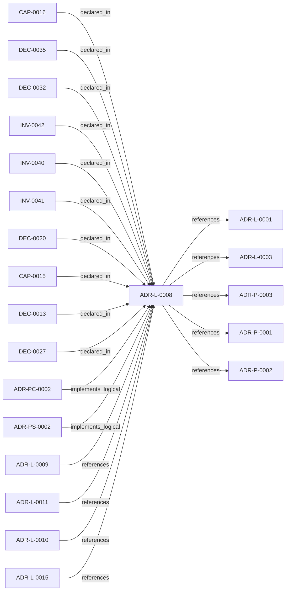

<!--
integrity_schema_version: 1
generated: deterministic_projection_v1
artifact_kind: rendered_adr_markdown
generator_id: adr-projection-markdown
generator_version: 2
hash_algorithm: sha256
source_hash: 2abde5cbc7505bc74f1592667271ff91631ba72da6314de46889c95d6dd4bcca
rendered_hash: c99ef9da9f3392bacfc75e8b82e752b54f8e4b78d1578c5fc577c11db734c912
-->

# ADR-L-0008: Validation Modes for Draft and Complete ADRs

**Status:** proposed  
**Created:** 2026-03-13  
**Authors:** adr-architecture-kit  
**Domains:** validation, adr, workflow, governance  
**Tags:** draft, completeness, schema, steelman  
**Alias name:** validation-modes-for-draft-and-complete-adrs  

## Context

The ADR Architecture Kit currently couples schema validation to completeness for
several ADR types. That behavior is useful for acceptance gates, but it is too
strict for the actual design workflow used in this workspace.

The intended workflow is:
1. Generate or author partially pinned ADRs while a design is still forming
2. Preserve explicit empty sections so missing content remains visible
3. Validate structural alignment separately from completeness
4. Run steelman review as a correctness pass over the draft
5. Enforce complete population only when the artifact is ready for stronger gates

Today the implementation prunes empty collections during generation and relies on
strict schema/model requirements for validation. That collapses two distinct
states into one:
- structurally aligned draft
- complete artifact ready for stronger downstream use

This makes draft ADR authoring less transparent and prevents empty sections from
acting as fast review signals.

## Relationship graph

## Related ADRs

### ADR-L-0001 — STE-Compliant Machine-Verifiable Architecture Decision Record System

**Relationships:**
- this ADR -[:references]-> 019fee89-e615-70a5-861b-b2dde147e5af

**Context:** # ADR Architecture Kit — STE Authoring Subsystem

[Open projection](ADR-L-0001-ste-compliant-machine-verifiable-architecture-decision-record-system.md)
### ADR-L-0003 — Quality Assurance and Testing Strategy

**Relationships:**
- this ADR -[:references]-> 019fee89-e615-77f6-9b1f-695732d25443

**Context:** The ADR Architecture Kit is a foundational tool for machine-verifiable architecture
documentation. As such, it must maintain high quality standards to ensure reliability,
correctness, and trust in the architectural governance it provides.

[Open projection](ADR-L-0003-quality-assurance-and-testing-strategy.md)
### ADR-L-0009 — Derived Architecture Discovery Surfaces

**Relationships:**
- 019fee89-e616-770c-a025-2c241a720730 -[:references]-> this ADR

**Context:** adr-architecture-kit is primarily machine-facing tooling used by agents to
reason over canonical architecture artifacts. Relying on agents to scan raw
ADR bodies for discovery is inconsistent with the toolkit's AI-first design
theory: discovery surfaces should be explicit, deterministic, cheap to query,
and derived from canonical authority.

[Open projection](ADR-L-0009-derived-architecture-discovery-surfaces.md)
### ADR-L-0010 — Kernel Interface Contract and Validation Profiles

**Relationships:**
- 019fee89-e616-7d61-8e35-f11ba2ddd75d -[:references]-> this ADR

**Context:** adr-architecture-kit is transitioning from an implicit generator toolkit into
an explicit architecture compiler with a defined contract boundary to the STE
kernel. The plan work established that the compiler's guaranteed contract
surface is broader than the kernel's minimal load subset: the contract family
is all generated artifacts under `adrs/index/` plus `manifest.yaml`, while
individual consumers may rely on narrower subsets.

[Open projection](ADR-L-0010-kernel-interface-contract-and-validation-profiles.md)
### ADR-L-0011 — Metadata Schemas and Remediation Ledger Enforcement

**Relationships:**
- 019fee89-e616-7b97-971d-ae165d13bf9c -[:references]-> this ADR

**Context:** The compiler contract now distinguishes fully compliant bundles from
sentinel-backed brownfield and migration bundles. That boundary is only safe
if sentinel use is narrow, explicitly tracked, and moved toward approved
canonical content through a monotonic workflow.

[Open projection](ADR-L-0011-metadata-schemas-and-remediation-ledger-enforcement.md)
### ADR-L-0015 — ADR Governance State and Override Semantics

**Relationships:**
- 019fee89-e617-7e69-861a-f3040f70c2d9 -[:references]-> this ADR

**Context:** The repository now has a first-pass governance block on ADRs and a canonical
objection override artifact. That initial implementation made the metadata
available, but it left several important questions under-specified:

[Open projection](ADR-L-0015-adr-governance-state-and-override-semantics.md)
### ADR-P-0001 — Python Toolkit Implementation for ADR Kit

**Relationships:**
- this ADR -[:references]-> 019fee89-e618-79ed-9d2d-cc35c63bc99a

**Context:** This ADR specifies the implementation of ADR Kit using Python ecosystem and modern
Python tooling. The implementation must support schema validation, YAML parsing,
Pydantic models, and view generation.

[Open projection](../physical/ADR-P-0001-python-toolkit-implementation-for-adr-kit.md)
### ADR-P-0002 — JSON Schema Validation with YAML Document Format

**Relationships:**
- this ADR -[:references]-> 019fee89-e618-7a2f-aa3e-1f892cdf9410

**Context:** This ADR specifies the use of JSON Schema for validation with YAML as the document
format. This combination provides deterministic validation (JSON Schema) with
human-readable authoring (YAML with embedded markdown).

[Open projection](../physical/ADR-P-0002-json-schema-validation-with-yaml-document-format.md)
### ADR-P-0003 — Multi-Scope Python Implementation for ADR Toolkit

**Relationships:**
- this ADR -[:references]-> 019fee89-e618-742f-951d-d29401d56c19

**Context:** ADR-L-0002 defines the logical architecture for multi-scope ADR support.
This Physical ADR specifies the concrete Python implementation including
module structure, API design, and CLI interface.

[Open projection](../physical/ADR-P-0003-multi-scope-python-implementation-for-adr-toolkit.md)
### ADR-PC-0002 — Schema and Contract Validation

**Relationships:**
- 019fee89-e617-7d2b-8325-cd85ff814477 -[:implements_logical]-> this ADR

**Context:** Schema and contract validation is now a stable component boundary rather than
a generic legacy physical slice. It validates canonical ADR structure,
profile-specific contract requirements, project metadata, and implementation
attribution evidence. Validation of that evidence is structural for schema shape and architecture-aware when claims must resolve to canonical UUIDs and entity types. Legacy 1.0/1.2 evidence normalizes to the v1.5 claim shape only with repository or model 2.0 context.

[Open projection](../physical-component/ADR-PC-0002-schema-and-contract-validation.md)
### ADR-PS-0002 — ADR Kit Authoring Compiler and Validation System

**Relationships:**
- 019fee89-e618-7d04-9337-4aa2d3258507 -[:implements_logical]-> this ADR

**Context:** adr-architecture-kit operates as an authoring-time compiler and validation system rather
than a collection of unrelated generators. The implementation includes an
explicit compiler pipeline, contract validation, normalized repository/model
access, integrity verification, and CLI orchestration over those surfaces.

[Open projection](../physical-system/ADR-PS-0002-adr-kit-authoring-compiler-and-validation-system.md)

## Capabilities

### CAP-0015: Mode-Aware ADR Validation

The validator accepts a mode argument and returns findings appropriate to
structural or complete validation.

### CAP-0016: Draft-Preserving Source Generation

Source ADR generators can preserve explicit empty sections when generating
draft artifacts for review.

## Invariants

### INV-0040

**Statement:** ADR validation MUST support a structural mode that accepts intentionally
incomplete drafts when their schema shape is otherwise valid.
  
**Scope:** global  
**Enforcement:** must (design)  
**Verification:** automated

**Rationale:**
Draft ADRs are first-class artifacts in the design workflow and must be
distinguishable from malformed YAML or invalid schemas.

### INV-0041

**Statement:** Complete validation MUST remain deterministic and MUST NOT depend on LLM
reasoning.
  
**Scope:** global  
**Enforcement:** must (design)  
**Verification:** automated

**Rationale:**
Completeness is a workflow gate, not a correctness judgment.

### INV-0042

**Statement:** Steelman review MUST remain a separate correctness-oriented review layer
and MUST NOT be conflated with schema validation.
  
**Scope:** global  
**Enforcement:** must (design)  
**Verification:** manual

**Rationale:**
Correctness and coherence require semantic judgment that differs from
deterministic structural validation.

## Decisions

### DEC-0013: Use one validator with explicit validation modes

**Rationale:**
The artifact type does not change across the workflow; only the validation
gate changes. A single validator with an explicit mode argument keeps the
API coherent and avoids duplicating parsing and reporting logic.

**Consequences:**

**Positive:**
- One validation entrypoint for all workflow stages
- CLI and API semantics stay consistent
- Different gates can share reporting structures

### DEC-0020: Define structural mode for schema-aligned drafts

**Rationale:**
Structural validation should answer whether an ADR is shaped correctly
enough to participate in review, even if required sections are intentionally
empty while decisions are still being pinned down.

Structural mode keeps section presence and schema shape checks, but it does
not fail solely because a required collection is empty.

**Consequences:**

**Positive:**
- Draft ADRs can validate without pretending to be complete
- Empty sections remain visible as review targets
- Tooling can distinguish malformed artifacts from incomplete ones

### DEC-0027: Define complete mode for population readiness

**Rationale:**
Complete validation should answer whether the ADR is sufficiently populated
for stricter downstream use. This is still a structural/content-presence
gate, not a correctness gate.

**Consequences:**

**Positive:**
- Current strict validation behavior remains available
- Downstream generation and acceptance gates can depend on populated inputs
- Completeness remains deterministic and non-LLM-based

### DEC-0032: Keep steelman review separate from deterministic validation

**Rationale:**
Steelman review evaluates correctness, coherence, missing reasoning, and
architectural quality. That is not the same concern as schema alignment or
section population, and it should remain a separate LLM-backed review pass.

**Consequences:**

**Positive:**
- Deterministic validation remains deterministic
- Steelman review can focus on correctness rather than syntax
- Failure modes are easier to interpret

### DEC-0035: Allow generators to preserve explicit empty sections when requested

**Rationale:**
If draft ADRs are expected to surface incompleteness, generators must not
erase those signals unconditionally. Empty sections should be preservable
when the author is intentionally emitting a draft artifact.

**Consequences:**

**Positive:**
- Generated drafts remain inspectable
- Review tooling can use empties as fast signals
- Complete-mode generation can still emit pruned, stricter artifacts when desired

---

*Generated from ADR-L-0008 by ADR Architecture Kit*