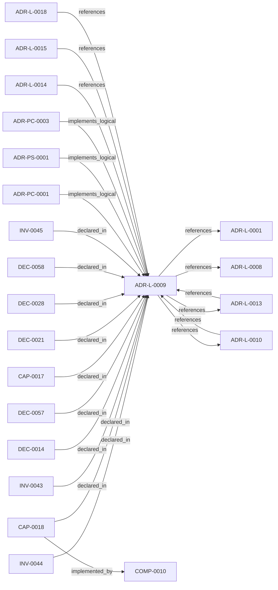

<!--
integrity_schema_version: 1
generated: deterministic_projection_v1
artifact_kind: rendered_adr_markdown
generator_id: adr-projection-markdown
generator_version: 2
hash_algorithm: sha256
source_hash: 185cbf1bf6ebf1fa9c31518de5afc3dedf28bd3a0025b674fbe7c4c150eb3b41
rendered_hash: 2d9c74e823c2917161bc3f4401bb2857c14249027d061258de5b22f1d0b0f677
-->

# ADR-L-0009: Derived Architecture Discovery Surfaces

**Status:** accepted  
**Created:** 2026-03-13  
**Authors:** adr-architecture-kit  
**Domains:** discovery, indexing, governance, ai-first  
**Tags:** entity-registry, manifest, discovery, agent-tooling  **Alias name:** derived-architecture-discovery-surfaces  
## Context

adr-architecture-kit is primarily machine-facing tooling used by agents to
reason over canonical architecture artifacts. Relying on agents to scan raw
ADR bodies for discovery is inconsistent with the toolkit's AI-first design
theory: discovery surfaces should be explicit, deterministic, cheap to query,
and derived from canonical authority.

The kit already provides `manifest.yaml`, the normalized index family under
`adrs/index/`, and a legacy compatibility registry. What was missing was an
explicit architectural decision that separates broad discovery, normalized
lookup, guaranteed contract outputs, and compatibility-only projections so
downstream consumers do not guess which generated surfaces are authoritative.

## Relationship graph

## Related ADRs

### ADR-L-0001 — STE-Compliant Machine-Verifiable Architecture Decision Record System

**Relationships:**
- this ADR -[:references]-> 019fee89-e615-70a5-861b-b2dde147e5af

**Context:** # ADR Architecture Kit — STE Authoring Subsystem

[Open projection](ADR-L-0001-ste-compliant-machine-verifiable-architecture-decision-record-system.md)
### ADR-L-0008 — Validation Modes for Draft and Complete ADRs

**Relationships:**
- this ADR -[:references]-> 019fee89-e616-7066-8d2f-3acc7f469f72

**Context:** The ADR Architecture Kit currently couples schema validation to completeness for
several ADR types. That behavior is useful for acceptance gates, but it is too
strict for the actual design workflow used in this workspace.

[Open projection](ADR-L-0008-validation-modes-for-draft-and-complete-adrs.md)
### ADR-L-0010 — Kernel Interface Contract and Validation Profiles

**Relationships:**
- 019fee89-e616-7d61-8e35-f11ba2ddd75d -[:references]-> this ADR
- this ADR -[:references]-> 019fee89-e616-7d61-8e35-f11ba2ddd75d

**Context:** adr-architecture-kit is transitioning from an implicit generator toolkit into
an explicit architecture compiler with a defined contract boundary to the STE
kernel. The plan work established that the compiler's guaranteed contract
surface is broader than the kernel's minimal load subset: the contract family
is all generated artifacts under `adrs/index/` plus `manifest.yaml`, while
individual consumers may rely on narrower subsets.

[Open projection](ADR-L-0010-kernel-interface-contract-and-validation-profiles.md)
### ADR-L-0013 — Architecture Repository Boundary and Normalized Semantic Model

**Relationships:**
- 019fee89-e616-7c4e-953c-b7349412a784 -[:references]-> this ADR
- this ADR -[:references]-> 019fee89-e616-7c4e-953c-b7349412a784

**Context:** adr-architecture-kit now has an explicit compiler pipeline, a compiler IR
(`ArchModel`), compiled registry bundles, and an additive architecture graph.
Those pieces are sufficient to produce deterministic machine-facing artifacts,
and ArchitectureRepository already defines the semantic in-process boundary.
Phase 1 adds a narrow supported authoring facade that reuses that seam without
expanding the normalized model or exposing compiler internals.

[Open projection](ADR-L-0013-architecture-repository-boundary-and-normalized-semantic-model.md)
### ADR-L-0014 — Brownfield Onboarding and Canonicalization Workflow

**Relationships:**
- 019fee89-e616-7628-913b-a059c1057c36 -[:references]-> this ADR

**Context:** STE adoption often begins after meaningful architecture and implementation
decisions already exist. In that stage, the problem is not blank-slate design;
it is brownfield onboarding: discover current architecture state, normalize
legacy identifiers and metadata, formalize already-made decisions into
canonical ADRs, and regenerate deterministic derived artifacts without
treating derived state as authority.

[Open projection](ADR-L-0014-brownfield-onboarding-and-canonicalization-workflow.md)
### ADR-L-0015 — ADR Governance State and Override Semantics

**Relationships:**
- 019fee89-e617-7e69-861a-f3040f70c2d9 -[:references]-> this ADR

**Context:** The repository now has a first-pass governance block on ADRs and a canonical
objection override artifact. That initial implementation made the metadata
available, but it left several important questions under-specified:

[Open projection](ADR-L-0015-adr-governance-state-and-override-semantics.md)
### ADR-L-0018 — Schema v1.2 and Normalized Semantic Foundation

**Relationships:**
- 019fee89-e617-7f4d-811d-4862645a55c5 -[:references]-> this ADR

**Context:** Phase 1 established a narrow supported authoring SDK while explicitly deferring
schema expansion, normalized-model expansion, assertion identity, bindings, and
topology identity. The repository now needs those contracts as an additive
semantic foundation for future consumers, without implementing the Phase 3 graph
bundle or absorbing authority owned by runtime, rules, substrate, or admission
systems.

[Open projection](ADR-L-0018-schema-v1-2-and-normalized-semantic-foundation.md)
### ADR-PC-0001 — Entity Registry and Discovery Index

**Relationships:**
- 019fee89-e617-7270-ab2f-58a756d2530e -[:implements_logical]-> this ADR

**Context:** The discovery/indexing component now centers on the unified compiler path. It
generates the normalized discovery bundle under `adrs/index/`, emits the
legacy compatibility registry at `adrs/entities/registry.yaml`, generates
manifest and rendered ADR markdown outputs through the same compiler-owned
path for single-scope use, and exposes exact-ID and filtered CLI query
operations over generated registry state.

[Open projection](../physical-component/ADR-PC-0001-entity-registry-and-discovery-index.md)
### ADR-PC-0003 — Compiler Pipeline and Driver

**Relationships:**
- 019fee89-e618-7b76-843f-cfe21ceb2ea6 -[:implements_logical]-> this ADR

**Context:** The compiler driver and explicit pipeline now own deterministic architecture
compilation across parse, analysis, emission, and recursive scope
orchestration. The command-line behavior is compatibility-relevant, while the
Python compiler pipeline, passes, `ArchModel`, emitters, and result plumbing are
internal reference implementation and are not a supported SDK facade.

[Open projection](../physical-component/ADR-PC-0003-compiler-pipeline-and-driver.md)
### ADR-PS-0001 — ADR Architecture Kit Discovery and Indexing System

**Relationships:**
- 019fee89-e618-7b3e-813b-a449881b6adb -[:implements_logical]-> this ADR

**Context:** The discovery and indexing subsystem provides the derived surfaces that agents
query instead of scanning raw ADR bodies by default. It now includes
normalized discovery bundle generation under `adrs/index/`, legacy
compatibility registry generation under `adrs/entities/registry.yaml`,
manifest generation, rendered ADR markdown generation, CLI query surfaces over
generated registry state, and the unified `adr compile` orchestration path
that emits these derived discovery artifacts together.

[Open projection](../physical-system/ADR-PS-0001-adr-architecture-kit-discovery-and-indexing-system.md)

## Capabilities

### CAP-0017: Summary Discovery Surface

Provide a broad summary-oriented discovery artifact for ADR and scope
metadata through `manifest.yaml`.

### CAP-0018: Normalized Entity Lookup Surface

Provide deterministic lookup for normalized architecture entities through
`adrs/index/entity-registry.yaml`.

## Invariants

### INV-0043

**Statement:** Canonical architectural authority MUST remain in ADR artifacts (including
invariants established in logical ADRs). Derived discovery artifacts
including adrs/index/invariant-registry.yaml MUST NOT independently define
or redefine invariants. The adrs/invariants/ authoring directory is retired.
  
**Scope:** global  
**Enforcement:** must (design)  
**Verification:** automated

**Rationale:**
Derived discovery surfaces are indexes of canonical architecture state,
not the source of truth. The invariant-registry is a complete derived
projection of ADR-L invariants only.

### INV-0044

**Statement:** Derived architecture discovery artifacts MUST be deterministic,
reproducible, and disposable.
  
**Scope:** global  
**Enforcement:** must (design)  
**Verification:** automated

**Rationale:**
Deterministic regeneration is required for machine trust, CI validation,
and drift detection.

### INV-0045

**Statement:** Agent-facing ADR toolkit workflows MUST prefer indexed lookup surfaces
over raw ADR body traversal by default.
  
**Scope:** global  
**Enforcement:** must (design)  
**Verification:** automated

**Rationale:**
Explicit, cheap-to-query indexes are more aligned with AI-first design
than repeated ad hoc document scans.

## Decisions

### DEC-0014: Use derived discovery artifacts for agent-facing architecture lookup

**Rationale:**
Canonical authority remains in ADR artifacts (including ADR-established
invariant entities). Agents should interact with derived, machine-stable
discovery artifacts (including the invariant-registry) by default.
Standalone invariant files are not authority. This reduces scan cost,
ambiguity, and ad hoc parsing logic.

### DEC-0021: Treat manifest as a guaranteed discovery surface within the compiler contract family

**Rationale:**
The manifest is the first discovery surface used by humans and agents for
scope inventory, freshness checks, and lifecycle summaries. It remains a
discovery artifact rather than a normalized semantic payload, but its
presence and format are guaranteed within the compiler contract family.

### DEC-0028: Use `adrs/index/entity-registry.yaml` as the normalized lookup surface and keep legacy registry as compatibility-only

**Rationale:**
The normalized entity registry in `adrs/index/` is the current machine
lookup surface for deterministic entity access. The legacy
`adrs/entities/registry.yaml` path remains compatibility-only and should
not gain new consumers.

### DEC-0057: Classify compiler discovery outputs by guaranteed, optional, and deprecated stability tiers

**Rationale:**
Downstream consumers need to know which generated surfaces are guaranteed
contract outputs, which are optional human conveniences, and which remain
transitional compatibility artifacts.

### DEC-0058: Deprecate `adrs/entities/registry.yaml` as a legacy compatibility projection

**Rationale:**
The normalized index family supersedes the legacy registry for new
consumers. Keeping the legacy path for compatibility is acceptable, but it
must be explicitly marked deprecated to prevent contract ambiguity.

---

*Generated from ADR-L-0009 by ADR Architecture Kit*