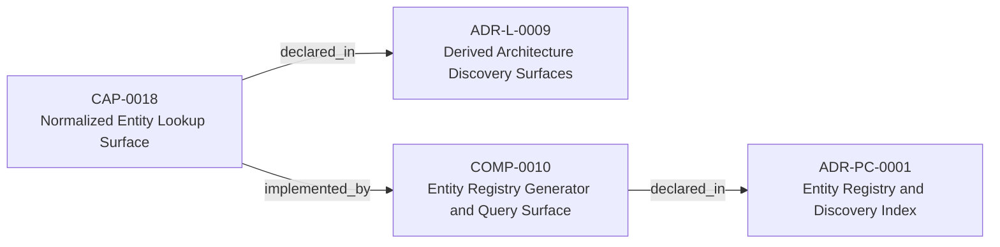
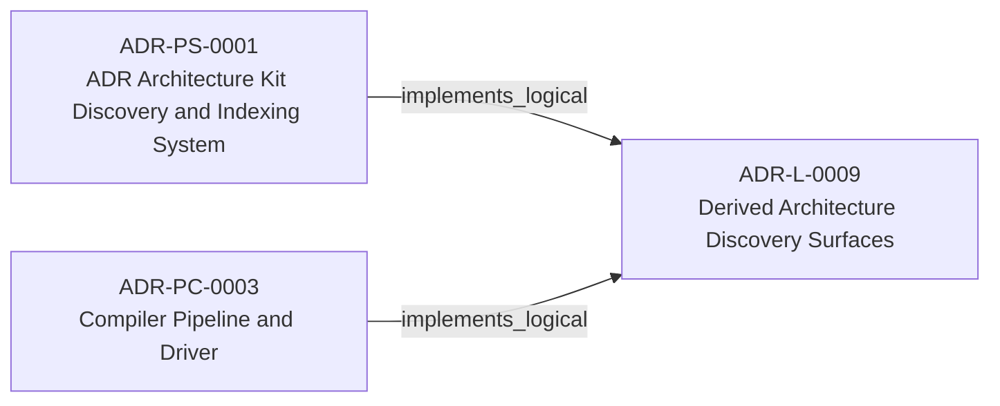

<!--
integrity_schema_version: 1
generated: deterministic_projection_v1
artifact_kind: rendered_adr_markdown
generator_id: adr-projection-markdown
generator_version: 3
hash_algorithm: sha256
source_hash: 4171c0232c227811bbae0694ac87d14e540bc42c4022d682072344dbe3caec4f
rendered_hash: 37c3f8edf8921f3491e9e5902149cd8e7b6943c313f206bacb6bbcc6685645b8
-->

# ADR-L-0009: Derived Architecture Discovery Surfaces

## Identity / Status

**Type:** logical  
**Status:** accepted  
**Alias:** ADR-L-0009  
**Alias name:** derived-architecture-discovery-surfaces  
**Created:** 2026-03-13  
**Authors:** adr-architecture-kit  
**Domains:** discovery, indexing, governance, ai-first  

## Architecture Position

Logical architecture authority for this subject. Neighborhood paths use structural bridges plus exactly one semantic architecture edge; they never invent ADR-to-ADR verbs.

## Architecture Neighborhood

### Semantic architecture inventory

- `implemented_by`: CAP-0018 → COMP-0010
- `implements_logical`: ADR-PS-0001 → ADR-L-0009
- `implements_logical`: ADR-PC-0003 → ADR-L-0009

## Neighbor Relationships

### ADR-PC-0001 — Entity Registry and Discovery Index

- CAP-0018 -[:implemented_by]-> COMP-0010

**Context:** The discovery/indexing component now centers on the unified compiler path. It
generates the normalized discovery bundle under `adrs/index/`, emits the
legacy compatibility registry at `adrs/entities/registry.yaml`, generates
manifest and rendered ADR markdown outputs through the same compiler-owned
path for single-scope use, and exposes exact-ID and filtered CLI query
operations over generated registry state.

[Open projection](../physical-component/ADR-PC-0001-entity-registry-and-discovery-index.md)
### ADR-PC-0003 — Compiler Pipeline and Driver

- ADR-PC-0003 -[:implements_logical]-> ADR-L-0009

**Context:** The compiler driver and explicit pipeline now own deterministic architecture
compilation across parse, analysis, emission, and recursive scope
orchestration. The command-line behavior is compatibility-relevant, while the
Python compiler pipeline, passes, `ArchModel`, emitters, and result plumbing are
internal reference implementation and are not a supported SDK facade.

[Open projection](../physical-component/ADR-PC-0003-compiler-pipeline-and-driver.md)
### ADR-PS-0001 — ADR Architecture Kit Discovery and Indexing System

- ADR-PS-0001 -[:implements_logical]-> ADR-L-0009

**Context:** The discovery and indexing subsystem provides the derived surfaces that agents
query instead of scanning raw ADR bodies by default. It now includes
normalized discovery bundle generation under `adrs/index/`, legacy
compatibility registry generation under `adrs/entities/registry.yaml`,
manifest generation, rendered ADR markdown generation, CLI query surfaces over
generated registry state, and the unified `adr compile` orchestration path
that emits these derived discovery artifacts together.

[Open projection](../physical-system/ADR-PS-0001-adr-architecture-kit-discovery-and-indexing-system.md)

### Lifecycle / association

- ADR-L-0014 -[:references]-> ADR-L-0009
- ADR-L-0009 -[:references]-> ADR-L-0001
- ADR-L-0009 -[:references]-> ADR-L-0008
- ADR-L-0009 -[:references]-> ADR-L-0013
- ADR-L-0009 -[:references]-> ADR-L-0010
- ADR-L-0013 -[:references]-> ADR-L-0009
- ADR-L-0010 -[:references]-> ADR-L-0009
- ADR-L-0015 -[:references]-> ADR-L-0009
- ADR-L-0018 -[:references]-> ADR-L-0009

## Context

adr-architecture-kit is primarily machine-facing tooling used by agents to
reason over canonical architecture artifacts. Relying on agents to scan raw
ADR bodies for discovery is inconsistent with the toolkit's AI-first design
theory: discovery surfaces should be explicit, deterministic, cheap to query,
and derived from canonical authority.

The kit already provides `manifest.yaml`, the normalized index family under
`adrs/index/`, and a legacy compatibility registry. What was missing was an
explicit architectural decision that separates broad discovery, normalized
lookup, guaranteed contract outputs, and compatibility-only projections so
downstream consumers do not guess which generated surfaces are authoritative.

## Internal Structure

```mermaid
flowchart TB
  n_019fee89_e616_770c_a025_2c241a720730["ADR-L-0009<br/>Derived Architecture Discovery Surfaces"]
  subgraph sg_capability["capability"]
    n_019fee89_e616_7607_9312_8aa8d1816be9["CAP-0017<br/>Summary Discovery Surface"]
    n_019fee89_e616_7121_a63e_0baad0a61fb3["CAP-0018<br/>Normalized Entity Lookup Surface"]
  end
  subgraph sg_decision["decision"]
    n_019fee89_e616_71a7_b73f_33795a11494e["DEC-0014<br/>Use derived discovery artifacts for agent-facing architecture lookup"]
    n_019fee89_e616_7763_be39_197b4590ca50["DEC-0021<br/>Treat manifest as a guaranteed discovery surface within the compiler contract family"]
    n_019fee89_e616_77a2_8a1b_ad4d3a7e4265["DEC-0028<br/>Use `adrs/index/entity-registry.yaml` as the normalized lookup surface and keep legacy registry as compatibility-only"]
    n_019fee89_e616_74a6_ae3d_39c2dacd91ae["DEC-0057<br/>Classify compiler discovery outputs by guaranteed, optional, and deprecated stability tiers"]
    n_019fee89_e616_79f5_a127_b16d5485af23["DEC-0058<br/>Deprecate `adrs/entities/registry.yaml` as a legacy compatibility projection"]
  end
  subgraph sg_invariant["invariant"]
    n_019fee89_e616_7196_a92f_bec6b05d3d47["INV-0043"]
    n_019fee89_e616_7037_8f0f_52c403f9f539["INV-0044"]
    n_019fee89_e616_7dc8_bd2e_10db13af0951["INV-0045"]
  end
  n_019fee89_e616_7037_8f0f_52c403f9f539 -->|"declared_in"| n_019fee89_e616_770c_a025_2c241a720730
  n_019fee89_e616_7121_a63e_0baad0a61fb3 -->|"declared_in"| n_019fee89_e616_770c_a025_2c241a720730
  n_019fee89_e616_7196_a92f_bec6b05d3d47 -->|"declared_in"| n_019fee89_e616_770c_a025_2c241a720730
  n_019fee89_e616_71a7_b73f_33795a11494e -->|"declared_in"| n_019fee89_e616_770c_a025_2c241a720730
  n_019fee89_e616_74a6_ae3d_39c2dacd91ae -->|"declared_in"| n_019fee89_e616_770c_a025_2c241a720730
  n_019fee89_e616_7607_9312_8aa8d1816be9 -->|"declared_in"| n_019fee89_e616_770c_a025_2c241a720730
  n_019fee89_e616_7763_be39_197b4590ca50 -->|"declared_in"| n_019fee89_e616_770c_a025_2c241a720730
  n_019fee89_e616_77a2_8a1b_ad4d3a7e4265 -->|"declared_in"| n_019fee89_e616_770c_a025_2c241a720730
  n_019fee89_e616_79f5_a127_b16d5485af23 -->|"declared_in"| n_019fee89_e616_770c_a025_2c241a720730
  n_019fee89_e616_7dc8_bd2e_10db13af0951 -->|"declared_in"| n_019fee89_e616_770c_a025_2c241a720730
```

- `capability` CAP-0017 — Summary Discovery Surface
- `capability` CAP-0018 — Normalized Entity Lookup Surface
- `decision` DEC-0014 — Use derived discovery artifacts for agent-facing architecture lookup
- `decision` DEC-0021 — Treat manifest as a guaranteed discovery surface within the compiler contract family
- `decision` DEC-0028 — Use `adrs/index/entity-registry.yaml` as the normalized lookup surface and keep legacy registry as compatibility-only
- `decision` DEC-0057 — Classify compiler discovery outputs by guaranteed, optional, and deprecated stability tiers
- `decision` DEC-0058 — Deprecate `adrs/entities/registry.yaml` as a legacy compatibility projection
- `invariant` INV-0043 — INV-0043
- `invariant` INV-0044 — INV-0044
- `invariant` INV-0045 — INV-0045

## Capabilities

### CAP-0017: Summary Discovery Surface

Provide a broad summary-oriented discovery artifact for ADR and scope
metadata through `manifest.yaml`.

### CAP-0018: Normalized Entity Lookup Surface

Provide deterministic lookup for normalized architecture entities through
`adrs/index/entity-registry.yaml`.

## Decisions

### DEC-0014: Use derived discovery artifacts for agent-facing architecture lookup

**Rationale:**
Canonical authority remains in ADR artifacts (including ADR-established
invariant entities). Agents should interact with derived, machine-stable
discovery artifacts (including the invariant-registry) by default.
Standalone invariant files are not authority. This reduces scan cost,
ambiguity, and ad hoc parsing logic.

### DEC-0021: Treat manifest as a guaranteed discovery surface within the compiler contract family

**Rationale:**
The manifest is the first discovery surface used by humans and agents for
scope inventory, freshness checks, and lifecycle summaries. It remains a
discovery artifact rather than a normalized semantic payload, but its
presence and format are guaranteed within the compiler contract family.

### DEC-0028: Use `adrs/index/entity-registry.yaml` as the normalized lookup surface and keep legacy registry as compatibility-only

**Rationale:**
The normalized entity registry in `adrs/index/` is the current machine
lookup surface for deterministic entity access. The legacy
`adrs/entities/registry.yaml` path remains compatibility-only and should
not gain new consumers.

### DEC-0057: Classify compiler discovery outputs by guaranteed, optional, and deprecated stability tiers

**Rationale:**
Downstream consumers need to know which generated surfaces are guaranteed
contract outputs, which are optional human conveniences, and which remain
transitional compatibility artifacts.

### DEC-0058: Deprecate `adrs/entities/registry.yaml` as a legacy compatibility projection

**Rationale:**
The normalized index family supersedes the legacy registry for new
consumers. Keeping the legacy path for compatibility is acceptable, but it
must be explicitly marked deprecated to prevent contract ambiguity.

## Invariants

### INV-0043

**Statement:** Canonical architectural authority MUST remain in ADR artifacts (including
invariants established in logical ADRs). Derived discovery artifacts
including adrs/index/invariant-registry.yaml MUST NOT independently define
or redefine invariants. The adrs/invariants/ authoring directory is retired.
  
**Scope:** global  
**Enforcement:** must (design)

**Rationale:**
Derived discovery surfaces are indexes of canonical architecture state,
not the source of truth. The invariant-registry is a complete derived
projection of ADR-L invariants only.

### INV-0044

**Statement:** Derived architecture discovery artifacts MUST be deterministic,
reproducible, and disposable.
  
**Scope:** global  
**Enforcement:** must (design)

**Rationale:**
Deterministic regeneration is required for machine trust, CI validation,
and drift detection.

### INV-0045

**Statement:** Agent-facing ADR toolkit workflows MUST prefer indexed lookup surfaces
over raw ADR body traversal by default.
  
**Scope:** global  
**Enforcement:** must (design)

**Rationale:**
Explicit, cheap-to-query indexes are more aligned with AI-first design
than repeated ad hoc document scans.

---

*Generated from ADR-L-0009 by ADR Architecture Kit (projection v3)*