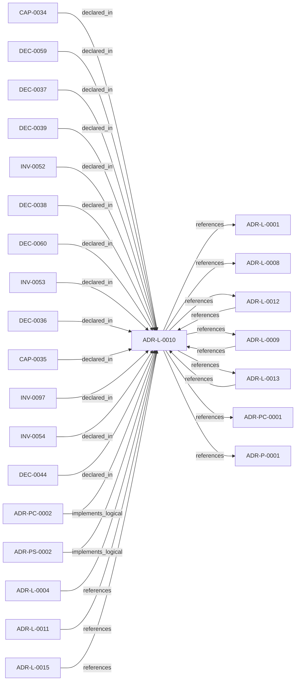

<!--
integrity_schema_version: 1
generated: deterministic_projection_v1
artifact_kind: rendered_adr_markdown
generator_id: adr-projection-markdown
generator_version: 2
hash_algorithm: sha256
source_hash: 15a1c31fc17c9dc52d5bdad1d07d0e74610a85c8f5703c8f9bd12ed4001a8f89
rendered_hash: c61b0538e40d000a078e505165a79ad38d416ea46f16a2f0b43253de214185e3
-->

# ADR-L-0010: Kernel Interface Contract and Validation Profiles

**Status:** accepted  
**Created:** 2026-03-14  
**Authors:** adr-architecture-kit  
**Domains:** kernel, contract, governance, validation  
**Tags:** contract, registries, brownfield, migration, sentinel  
**Alias name:** kernel-interface-contract-and-validation-profiles  

## Context

adr-architecture-kit is transitioning from an implicit generator toolkit into
an explicit architecture compiler with a defined contract boundary to the STE
kernel. The plan work established that the compiler's guaranteed contract
surface is broader than the kernel's minimal load subset: the contract family
is all generated artifacts under `adrs/index/` plus `manifest.yaml`, while
individual consumers may rely on narrower subsets.

The same plan work also established that legacy onboarding must be tolerated
without collapsing schema structure. Brownfield architectures need a way to
remain structurally valid while carrying explicit machine-readable placeholders
for unavailable content. At the same time, production kernel loading must not
silently accept incomplete architecture knowledge as fully compliant.

What is needed is a formal contract ADR that defines:
1. The minimal compiler-to-kernel contract surface
2. The pre-stable versioning policy for that contract
3. Validation profiles for greenfield, brownfield, and migration use
4. The meaning of `sentinel_compliant` for compilation, CI, and kernel load

## Relationship graph

## Related ADRs

### ADR-L-0001 — STE-Compliant Machine-Verifiable Architecture Decision Record System

**Relationships:**
- this ADR -[:references]-> 019fee89-e615-70a5-861b-b2dde147e5af

**Context:** # ADR Architecture Kit — STE Authoring Subsystem

[Open projection](ADR-L-0001-ste-compliant-machine-verifiable-architecture-decision-record-system.md)
### ADR-L-0004 — ADR-to-Implementation Traceability via Decorators and Metadata Attribution

**Relationships:**
- 019fee89-e615-7577-8d37-dd0df031bec9 -[:references]-> this ADR

**Context:** Architecture Decision Records document why implementation artifacts exist, but
the repo still lacks a universal, machine-verifiable way to trace code,
infrastructure, configuration, schemas, pipelines, and scripts back to the
ADRs that justify them.

[Open projection](ADR-L-0004-adr-to-implementation-traceability-via-decorators-and-metadata-attribution.md)
### ADR-L-0008 — Validation Modes for Draft and Complete ADRs

**Relationships:**
- this ADR -[:references]-> 019fee89-e616-7066-8d2f-3acc7f469f72

**Context:** The ADR Architecture Kit currently couples schema validation to completeness for
several ADR types. That behavior is useful for acceptance gates, but it is too
strict for the actual design workflow used in this workspace.

[Open projection](ADR-L-0008-validation-modes-for-draft-and-complete-adrs.md)
### ADR-L-0009 — Derived Architecture Discovery Surfaces

**Relationships:**
- 019fee89-e616-770c-a025-2c241a720730 -[:references]-> this ADR
- this ADR -[:references]-> 019fee89-e616-770c-a025-2c241a720730

**Context:** adr-architecture-kit is primarily machine-facing tooling used by agents to
reason over canonical architecture artifacts. Relying on agents to scan raw
ADR bodies for discovery is inconsistent with the toolkit's AI-first design
theory: discovery surfaces should be explicit, deterministic, cheap to query,
and derived from canonical authority.

[Open projection](ADR-L-0009-derived-architecture-discovery-surfaces.md)
### ADR-L-0011 — Metadata Schemas and Remediation Ledger Enforcement

**Relationships:**
- 019fee89-e616-7b97-971d-ae165d13bf9c -[:references]-> this ADR

**Context:** The compiler contract now distinguishes fully compliant bundles from
sentinel-backed brownfield and migration bundles. That boundary is only safe
if sentinel use is narrow, explicitly tracked, and moved toward approved
canonical content through a monotonic workflow.

[Open projection](ADR-L-0011-metadata-schemas-and-remediation-ledger-enforcement.md)
### ADR-L-0012 — Federation Authority and Qualified Identity Model

**Relationships:**
- 019fee89-e616-744f-b63e-5ecddf344faa -[:references]-> this ADR
- this ADR -[:references]-> 019fee89-e616-744f-b63e-5ecddf344faa

**Context:** The compiler and recursive multi-scope model preserve repository-local
compilation boundaries, while STE federation spans independently compiled
repositories. Federation therefore requires global identity without weakening
provider authority or allowing the aggregation layer to rewrite canonical
repository state.

[Open projection](ADR-L-0012-federation-authority-and-qualified-identity-model.md)
### ADR-L-0013 — Architecture Repository Boundary and Normalized Semantic Model

**Relationships:**
- 019fee89-e616-7c4e-953c-b7349412a784 -[:references]-> this ADR
- this ADR -[:references]-> 019fee89-e616-7c4e-953c-b7349412a784

**Context:** adr-architecture-kit now has an explicit compiler pipeline, a compiler IR
(`ArchModel`), compiled registry bundles, and an additive architecture graph.
Those pieces are sufficient to produce deterministic machine-facing artifacts,
and ArchitectureRepository already defines the semantic in-process boundary.
Phase 1 adds a narrow supported authoring facade that reuses that seam without
expanding the normalized model or exposing compiler internals.

[Open projection](ADR-L-0013-architecture-repository-boundary-and-normalized-semantic-model.md)
### ADR-L-0015 — ADR Governance State and Override Semantics

**Relationships:**
- 019fee89-e617-7e69-861a-f3040f70c2d9 -[:references]-> this ADR

**Context:** The repository now has a first-pass governance block on ADRs and a canonical
objection override artifact. That initial implementation made the metadata
available, but it left several important questions under-specified:

[Open projection](ADR-L-0015-adr-governance-state-and-override-semantics.md)
### ADR-P-0001 — Python Toolkit Implementation for ADR Kit

**Relationships:**
- this ADR -[:references]-> 019fee89-e618-79ed-9d2d-cc35c63bc99a

**Context:** This ADR specifies the implementation of ADR Kit using Python ecosystem and modern
Python tooling. The implementation must support schema validation, YAML parsing,
Pydantic models, and view generation.

[Open projection](../physical/ADR-P-0001-python-toolkit-implementation-for-adr-kit.md)
### ADR-PC-0001 — Entity Registry and Discovery Index

**Relationships:**
- this ADR -[:references]-> 019fee89-e617-7270-ab2f-58a756d2530e

**Context:** The discovery/indexing component now centers on the unified compiler path. It
generates the normalized discovery bundle under `adrs/index/`, emits the
legacy compatibility registry at `adrs/entities/registry.yaml`, generates
manifest and rendered ADR markdown outputs through the same compiler-owned
path for single-scope use, and exposes exact-ID and filtered CLI query
operations over generated registry state.

[Open projection](../physical-component/ADR-PC-0001-entity-registry-and-discovery-index.md)
### ADR-PC-0002 — Schema and Contract Validation

**Relationships:**
- 019fee89-e617-7d2b-8325-cd85ff814477 -[:implements_logical]-> this ADR

**Context:** Schema and contract validation is now a stable component boundary rather than
a generic legacy physical slice. It validates canonical ADR structure,
profile-specific contract requirements, project metadata, and implementation
attribution evidence. Validation of that evidence is structural for schema shape and architecture-aware when claims must resolve to canonical UUIDs and entity types. Legacy 1.0/1.2 evidence normalizes to the v1.5 claim shape only with repository or model 2.0 context.

[Open projection](../physical-component/ADR-PC-0002-schema-and-contract-validation.md)
### ADR-PS-0002 — ADR Kit Authoring Compiler and Validation System

**Relationships:**
- 019fee89-e618-7d04-9337-4aa2d3258507 -[:implements_logical]-> this ADR

**Context:** adr-architecture-kit operates as an authoring-time compiler and validation system rather
than a collection of unrelated generators. The implementation includes an
explicit compiler pipeline, contract validation, normalized repository/model
access, integrity verification, and CLI orchestration over those surfaces.

[Open projection](../physical-system/ADR-PS-0002-adr-kit-authoring-compiler-and-validation-system.md)

## Capabilities

### CAP-0034: Profile-Aware Contract Validation

Validate compiled registry bundles against a single contract schema with
profile-specific enforcement for greenfield, brownfield, and migration.

### CAP-0035: Production-Safe Kernel Admission

Distinguish between contract-valid bundles that are production-safe and
bundles that are inspection-safe only.

## Invariants

### INV-0052

**Statement:** The compiler's guaranteed machine-readable contract surface MUST be defined
as all generated artifacts under `adrs/index/` plus `adrs/manifest.yaml`.
Consumers MAY define narrower minimal load subsets, but those subsets MUST
NOT be treated as the full guaranteed contract surface.
  
**Scope:** global  
**Enforcement:** must (design)  
**Verification:** automated

**Rationale:**
The contract boundary must remain explicit without collapsing the broader
generated bundle into one consumer's minimal load subset.

### INV-0053

**Statement:** Contract validation MUST support profile-based enforcement for greenfield,
brownfield, and migration without forking the registry schema.
  
**Scope:** global  
**Enforcement:** must (design)  
**Verification:** automated

**Rationale:**
Enforcement posture changes across adoption stages, but the contract surface
must remain one schema.

### INV-0054

**Statement:** Bundles classified as sentinel compliant MUST NOT be admitted to production
kernel loads by default, but MAY be loaded by inspection-only or remediation
tooling.
  
**Scope:** global  
**Enforcement:** must (runtime)  
**Verification:** automated

**Rationale:**
Sentinel-backed content preserves structure, not full operational readiness.

### INV-0097

**Statement:** Compiler projection from canonical architecture state to kernel-facing registry artifacts must be deterministic and contract-valid.  
**Scope:** global  
**Enforcement:** must (test)  
**Verification:** automated

**Rationale:**
Equivalent canonical inputs must produce equivalent registry outputs that
continue to satisfy the explicit kernel contract.

## Decisions

### DEC-0036: Use the indexed compiler bundle as the contract surface, with four core artifacts as the minimal kernel load subset

**Rationale:**
The full guaranteed compiler contract includes all generated artifacts in
`adrs/index/` plus `manifest.yaml`. The kernel may rely on a narrower
minimal load subset for bootstrap loading, but that subset must not be
mistaken for the entire guaranteed contract family.

**Consequences:**

**Positive:**
- Kernel loading surface can stay small and explicit
- The broader guaranteed contract family remains available to downstream consumers
- Minimal load subset and full contract family are separated cleanly

### DEC-0037: Treat the compiler-kernel contract as pre-stable 0.x until intentionally frozen

**Rationale:**
The contract is not yet open as a stable external surface. Using 0.x avoids
pretending the boundary is already semantically frozen while still keeping a
versioned contract and explicit upgrade path.

**Consequences:**

**Positive:**
- Breaking changes remain allowed while the boundary is still internal
- The transition to 1.0 can be made explicit and intentional
- Contract drift can still be tracked through version numbers

### DEC-0044: Promote the contract to 1.0 only through an explicit readiness gate

**Rationale:**
Stable status should reflect implemented and verified behavior, not elapsed
time or confidence. The transition from 0.x to 1.0 must therefore be tied
to concrete conditions across compiler output, schema conformance, and
actual kernel consumption.

**Consequences:**

**Positive:**
- Stable contract status remains meaningful
- The kernel boundary is frozen intentionally rather than accidentally
- Promotion becomes auditable through governance

### DEC-0038: Validate compiled output through explicit greenfield, brownfield, and migration profiles

**Rationale:**
A single contract schema is not enough to represent the enforcement posture
across new systems, legacy imports, and active remediation states. Profiles
allow strict integrity rules to remain universal while allowing quality and
completeness expectations to vary by adoption stage.

**Consequences:**

**Positive:**
- Brownfield import can be structurally valid without pretending to be complete
- Greenfield enforcement remains strict
- Migration can tighten policy gradually without schema forks

### DEC-0039: Classify sentinel-backed bundles as sentinel compliant rather than compliant

**Rationale:**
Sentinel-backed content is valid under the right profile, but it is not the
same as fully populated architecture knowledge. A separate validator outcome
preserves honesty while keeping the system operational.

**Consequences:**

**Positive:**
- Compile success and contract honesty are both preserved
- CI behavior can follow the active profile explicitly
- Production kernel loads can reject sentinel-backed bundles by default

### DEC-0059: Treat all `adrs/index/*` artifacts and `manifest.yaml` as the guaranteed contract family

**Rationale:**
Downstream bridge and kernel work already depend on the wider indexed
bundle, the manifest, and the additive graph artifact. Guaranteeing the
full family prevents downstream consumers from inventing different notions
of what the compiler publishes.

### DEC-0060: Treat `architecture-graph.yaml` as an additive indexed artifact rather than a second architecture authority

**Rationale:**
The graph is consumed downstream and belongs to the generated contract
family, but it remains a projection artifact over the same architecture
authority rather than a separate source of meaning.

---

*Generated from ADR-L-0010 by ADR Architecture Kit*