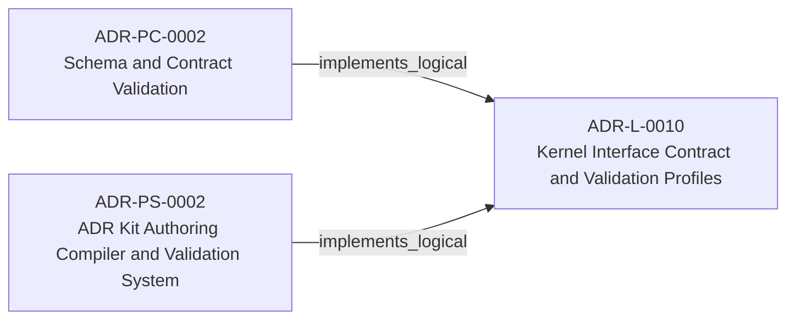

<!--
integrity_schema_version: 1
generated: deterministic_projection_v1
artifact_kind: rendered_adr_markdown
generator_id: adr-projection-markdown
generator_version: 3
hash_algorithm: sha256
source_hash: cf3e24e21919b101269f74fee0e658b1939c024d2c9f4694e2cfdaf9ff64041d
rendered_hash: 4f9296cb137fe7260f7a8bb3d515713e509f429d5b071e2f1df9e46778e87e41
-->

# ADR-L-0010: Kernel Interface Contract and Validation Profiles

## Identity / Status

**Type:** logical  
**Status:** accepted  
**Alias:** ADR-L-0010  
**Alias name:** kernel-interface-contract-and-validation-profiles  
**Created:** 2026-03-14  
**Authors:** adr-architecture-kit  
**Domains:** kernel, contract, governance, validation  

## Architecture Position

Logical architecture authority for this subject. Neighborhood paths use structural bridges plus exactly one semantic architecture edge; they never invent ADR-to-ADR verbs.

## Architecture Neighborhood

### Semantic architecture inventory

- `implements_logical`: ADR-PC-0002 → ADR-L-0010
- `implements_logical`: ADR-PS-0002 → ADR-L-0010

## Neighbor Relationships

### ADR-PC-0002 — Schema and Contract Validation

- ADR-PC-0002 -[:implements_logical]-> ADR-L-0010

**Context:** Schema and contract validation is now a stable component boundary rather than
a generic legacy physical slice. It validates canonical ADR structure,
profile-specific contract requirements, project metadata, and implementation
attribution evidence. Validation of that evidence is structural for schema shape and architecture-aware when claims must resolve to canonical UUIDs and entity types. Legacy 1.0/1.2 evidence normalizes to the v1.5 claim shape only with repository or model 2.0 context.

[Open projection](../physical-component/ADR-PC-0002-schema-and-contract-validation.md)
### ADR-PS-0002 — ADR Kit Authoring Compiler and Validation System

- ADR-PS-0002 -[:implements_logical]-> ADR-L-0010

**Context:** adr-architecture-kit operates as an authoring-time compiler and validation system rather
than a collection of unrelated generators. The implementation includes an
explicit compiler pipeline, contract validation, normalized repository/model
access, integrity verification, and CLI orchestration over those surfaces.

[Open projection](../physical-system/ADR-PS-0002-adr-kit-authoring-compiler-and-validation-system.md)

### Lifecycle / association

- ADR-L-0004 -[:references]-> ADR-L-0010
- ADR-L-0012 -[:references]-> ADR-L-0010
- ADR-L-0009 -[:references]-> ADR-L-0010
- ADR-L-0011 -[:references]-> ADR-L-0010
- ADR-L-0013 -[:references]-> ADR-L-0010
- ADR-L-0010 -[:references]-> ADR-L-0001
- ADR-L-0010 -[:references]-> ADR-L-0008
- ADR-L-0010 -[:references]-> ADR-L-0012
- ADR-L-0010 -[:references]-> ADR-L-0009
- ADR-L-0010 -[:references]-> ADR-L-0013
- ADR-L-0010 -[:references]-> ADR-PC-0001
- ADR-L-0010 -[:references]-> ADR-PS-0002
- ADR-L-0015 -[:references]-> ADR-L-0010

## Context

adr-architecture-kit is transitioning from an implicit generator toolkit into
an explicit architecture compiler with a defined contract boundary to the STE
kernel. The plan work established that the compiler's guaranteed contract
surface is broader than the kernel's minimal load subset: the contract family
is all generated artifacts under `adrs/index/` plus `manifest.yaml`, while
individual consumers may rely on narrower subsets.

The same plan work also established that legacy onboarding must be tolerated
without collapsing schema structure. Brownfield architectures need a way to
remain structurally valid while carrying explicit machine-readable placeholders
for unavailable content. At the same time, production kernel loading must not
silently accept incomplete architecture knowledge as fully compliant.

What is needed is a formal contract ADR that defines:
1. The minimal compiler-to-kernel contract surface
2. The pre-stable versioning policy for that contract
3. Validation profiles for greenfield, brownfield, and migration use
4. The meaning of `sentinel_compliant` for compilation, CI, and kernel load

## Internal Structure

```mermaid
flowchart TB
  n_019fee89_e616_7d61_8e35_f11ba2ddd75d["ADR-L-0010<br/>Kernel Interface Contract and Validation Profiles"]
  subgraph sg_capability["capability"]
    n_019fee89_e616_718c_8f1f_c75e9bc215bc["CAP-0034<br/>Profile-Aware Contract Validation"]
    n_019fee89_e616_7ca5_af3e_0dcd80fe2f9f["CAP-0035<br/>Production-Safe Kernel Admission"]
  end
  subgraph sg_decision["decision"]
    n_019fee89_e616_79ec_9432_43a1c8ecc104["DEC-0036<br/>Use the indexed compiler bundle as the contract surface, with four core artifacts as the minimal kernel load subset"]
    n_019fee89_e616_73b2_9139_746451998656["DEC-0037<br/>Treat the compiler-kernel contract as pre-stable 0.x until intentionally frozen"]
    n_019fee89_e616_75b8_ba2f_700f93515f95["DEC-0038<br/>Validate compiled output through explicit greenfield, brownfield, and migration profiles"]
    n_019fee89_e616_7469_aa0f_66411a33dc10["DEC-0039<br/>Classify sentinel-backed bundles as sentinel compliant rather than compliant"]
    n_019fee89_e616_7e82_8a0f_2c4c6bd0c326["DEC-0044<br/>Promote the contract to 1.0 only through an explicit readiness gate"]
    n_019fee89_e616_735c_bd3d_c9e51b259031["DEC-0059<br/>Treat all `adrs/index/*` artifacts and `manifest.yaml` as the guaranteed contract family"]
    n_019fee89_e616_793e_9b16_ae66725cf5ec["DEC-0060<br/>Treat `architecture-graph.yaml` as an additive indexed artifact rather than a second architecture authority"]
  end
  subgraph sg_invariant["invariant"]
    n_019fee89_e616_7522_9b1f_8befdee2cbf5["INV-0052"]
    n_019fee89_e616_7944_ae13_b64c510fc3f4["INV-0053"]
    n_019fee89_e616_7e1b_8e1e_f150845bbf0e["INV-0054"]
    n_019fee89_e616_7cb0_813b_b2651827c986["INV-0097"]
  end
  n_019fee89_e616_718c_8f1f_c75e9bc215bc -->|"declared_in"| n_019fee89_e616_7d61_8e35_f11ba2ddd75d
  n_019fee89_e616_735c_bd3d_c9e51b259031 -->|"declared_in"| n_019fee89_e616_7d61_8e35_f11ba2ddd75d
  n_019fee89_e616_73b2_9139_746451998656 -->|"declared_in"| n_019fee89_e616_7d61_8e35_f11ba2ddd75d
  n_019fee89_e616_7469_aa0f_66411a33dc10 -->|"declared_in"| n_019fee89_e616_7d61_8e35_f11ba2ddd75d
  n_019fee89_e616_7522_9b1f_8befdee2cbf5 -->|"declared_in"| n_019fee89_e616_7d61_8e35_f11ba2ddd75d
  n_019fee89_e616_75b8_ba2f_700f93515f95 -->|"declared_in"| n_019fee89_e616_7d61_8e35_f11ba2ddd75d
  n_019fee89_e616_793e_9b16_ae66725cf5ec -->|"declared_in"| n_019fee89_e616_7d61_8e35_f11ba2ddd75d
  n_019fee89_e616_7944_ae13_b64c510fc3f4 -->|"declared_in"| n_019fee89_e616_7d61_8e35_f11ba2ddd75d
  n_019fee89_e616_79ec_9432_43a1c8ecc104 -->|"declared_in"| n_019fee89_e616_7d61_8e35_f11ba2ddd75d
  n_019fee89_e616_7ca5_af3e_0dcd80fe2f9f -->|"declared_in"| n_019fee89_e616_7d61_8e35_f11ba2ddd75d
  n_019fee89_e616_7cb0_813b_b2651827c986 -->|"declared_in"| n_019fee89_e616_7d61_8e35_f11ba2ddd75d
  n_019fee89_e616_7e1b_8e1e_f150845bbf0e -->|"declared_in"| n_019fee89_e616_7d61_8e35_f11ba2ddd75d
  n_019fee89_e616_7e82_8a0f_2c4c6bd0c326 -->|"declared_in"| n_019fee89_e616_7d61_8e35_f11ba2ddd75d
```

- `capability` CAP-0034 — Profile-Aware Contract Validation
- `capability` CAP-0035 — Production-Safe Kernel Admission
- `decision` DEC-0036 — Use the indexed compiler bundle as the contract surface, with four core artifacts as the minimal kernel load subset
- `decision` DEC-0037 — Treat the compiler-kernel contract as pre-stable 0.x until intentionally frozen
- `decision` DEC-0038 — Validate compiled output through explicit greenfield, brownfield, and migration profiles
- `decision` DEC-0039 — Classify sentinel-backed bundles as sentinel compliant rather than compliant
- `decision` DEC-0044 — Promote the contract to 1.0 only through an explicit readiness gate
- `decision` DEC-0059 — Treat all `adrs/index/*` artifacts and `manifest.yaml` as the guaranteed contract family
- `decision` DEC-0060 — Treat `architecture-graph.yaml` as an additive indexed artifact rather than a second architecture authority
- `invariant` INV-0052 — INV-0052
- `invariant` INV-0053 — INV-0053
- `invariant` INV-0054 — INV-0054
- `invariant` INV-0097 — INV-0097

## Capabilities

### CAP-0034: Profile-Aware Contract Validation

Validate compiled registry bundles against a single contract schema with
profile-specific enforcement for greenfield, brownfield, and migration.

### CAP-0035: Production-Safe Kernel Admission

Distinguish between contract-valid bundles that are production-safe and
bundles that are inspection-safe only.

## Decisions

### DEC-0036: Use the indexed compiler bundle as the contract surface, with four core artifacts as the minimal kernel load subset

**Rationale:**
The full guaranteed compiler contract includes all generated artifacts in
`adrs/index/` plus `manifest.yaml`. The kernel may rely on a narrower
minimal load subset for bootstrap loading, but that subset must not be
mistaken for the entire guaranteed contract family.

### DEC-0037: Treat the compiler-kernel contract as pre-stable 0.x until intentionally frozen

**Rationale:**
The contract is not yet open as a stable external surface. Using 0.x avoids
pretending the boundary is already semantically frozen while still keeping a
versioned contract and explicit upgrade path.

### DEC-0044: Promote the contract to 1.0 only through an explicit readiness gate

**Rationale:**
Stable status should reflect implemented and verified behavior, not elapsed
time or confidence. The transition from 0.x to 1.0 must therefore be tied
to concrete conditions across compiler output, schema conformance, and
actual kernel consumption.

### DEC-0038: Validate compiled output through explicit greenfield, brownfield, and migration profiles

**Rationale:**
A single contract schema is not enough to represent the enforcement posture
across new systems, legacy imports, and active remediation states. Profiles
allow strict integrity rules to remain universal while allowing quality and
completeness expectations to vary by adoption stage.

### DEC-0039: Classify sentinel-backed bundles as sentinel compliant rather than compliant

**Rationale:**
Sentinel-backed content is valid under the right profile, but it is not the
same as fully populated architecture knowledge. A separate validator outcome
preserves honesty while keeping the system operational.

### DEC-0059: Treat all `adrs/index/*` artifacts and `manifest.yaml` as the guaranteed contract family

**Rationale:**
Downstream bridge and kernel work already depend on the wider indexed
bundle, the manifest, and the additive graph artifact. Guaranteeing the
full family prevents downstream consumers from inventing different notions
of what the compiler publishes.

### DEC-0060: Treat `architecture-graph.yaml` as an additive indexed artifact rather than a second architecture authority

**Rationale:**
The graph is consumed downstream and belongs to the generated contract
family, but it remains a projection artifact over the same architecture
authority rather than a separate source of meaning.

## Invariants

### INV-0052

**Statement:** The compiler's guaranteed machine-readable contract surface MUST be defined
as all generated artifacts under `adrs/index/` plus `adrs/manifest.yaml`.
Consumers MAY define narrower minimal load subsets, but those subsets MUST
NOT be treated as the full guaranteed contract surface.
  
**Scope:** global  
**Enforcement:** must (design)

**Rationale:**
The contract boundary must remain explicit without collapsing the broader
generated bundle into one consumer's minimal load subset.

### INV-0053

**Statement:** Contract validation MUST support profile-based enforcement for greenfield,
brownfield, and migration without forking the registry schema.
  
**Scope:** global  
**Enforcement:** must (design)

**Rationale:**
Enforcement posture changes across adoption stages, but the contract surface
must remain one schema.

### INV-0054

**Statement:** Bundles classified as sentinel compliant MUST NOT be admitted to production
kernel loads by default, but MAY be loaded by inspection-only or remediation
tooling.
  
**Scope:** global  
**Enforcement:** must (runtime)

**Rationale:**
Sentinel-backed content preserves structure, not full operational readiness.

### INV-0097

**Statement:** Compiler projection from canonical architecture state to kernel-facing registry artifacts must be deterministic and contract-valid.  
**Scope:** global  
**Enforcement:** must (test)

**Rationale:**
Equivalent canonical inputs must produce equivalent registry outputs that
continue to satisfy the explicit kernel contract.

---

*Generated from ADR-L-0010 by ADR Architecture Kit (projection v3)*