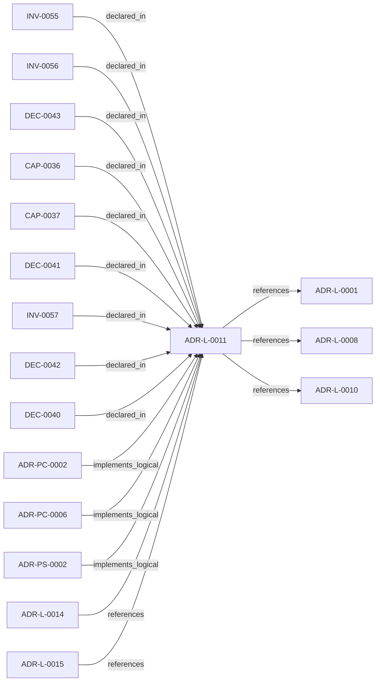

<!--
integrity_schema_version: 1
generated: deterministic_projection_v1
artifact_kind: rendered_adr_markdown
generator_id: adr-projection-markdown
generator_version: 2
hash_algorithm: sha256
source_hash: 705d7e3535cb7ed830c063294d0bb8a43918aeb9e80b1fb10bbec361e059bf3a
rendered_hash: f149409e7a67d1da19a94f96acb818982644e12c7cf53bf135cfcdb676ac8278
-->

# ADR-L-0011: Metadata Schemas and Remediation Ledger Enforcement

**Status:** proposed  
**Created:** 2026-03-14  
**Authors:** adr-architecture-kit  
**Domains:** governance, metadata, migration, brownfield  
**Tags:** metadata, remediation-ledger, sentinel, approval  
**Alias name:** metadata-schemas-and-remediation-ledger-enforcement  

## Context

The compiler contract now distinguishes fully compliant bundles from
sentinel-backed brownfield and migration bundles. That boundary is only safe
if sentinel use is narrow, explicitly tracked, and moved toward approved
canonical content through a monotonic workflow.

The plan work established several key rules:
1. Sentinel values are allowed only in narrative content fields
2. Structural, referential, and governance fields may never contain sentinels
3. Remediation state should live in a separate governance artifact rather than
   be embedded in ADR content
4. Approved content must not regress back to sentinel-backed state

What remains is to formalize those rules as an architectural decision that
binds metadata schema work, sentinel usage, and remediation workflow together.

## Relationship graph

## Related ADRs

### ADR-L-0001 — STE-Compliant Machine-Verifiable Architecture Decision Record System

**Relationships:**
- this ADR -[:references]-> 019fee89-e615-70a5-861b-b2dde147e5af

**Context:** # ADR Architecture Kit — STE Authoring Subsystem

[Open projection](ADR-L-0001-ste-compliant-machine-verifiable-architecture-decision-record-system.md)
### ADR-L-0008 — Validation Modes for Draft and Complete ADRs

**Relationships:**
- this ADR -[:references]-> 019fee89-e616-7066-8d2f-3acc7f469f72

**Context:** The ADR Architecture Kit currently couples schema validation to completeness for
several ADR types. That behavior is useful for acceptance gates, but it is too
strict for the actual design workflow used in this workspace.

[Open projection](ADR-L-0008-validation-modes-for-draft-and-complete-adrs.md)
### ADR-L-0010 — Kernel Interface Contract and Validation Profiles

**Relationships:**
- this ADR -[:references]-> 019fee89-e616-7d61-8e35-f11ba2ddd75d

**Context:** adr-architecture-kit is transitioning from an implicit generator toolkit into
an explicit architecture compiler with a defined contract boundary to the STE
kernel. The plan work established that the compiler's guaranteed contract
surface is broader than the kernel's minimal load subset: the contract family
is all generated artifacts under `adrs/index/` plus `manifest.yaml`, while
individual consumers may rely on narrower subsets.

[Open projection](ADR-L-0010-kernel-interface-contract-and-validation-profiles.md)
### ADR-L-0014 — Brownfield Onboarding and Canonicalization Workflow

**Relationships:**
- 019fee89-e616-7628-913b-a059c1057c36 -[:references]-> this ADR

**Context:** STE adoption often begins after meaningful architecture and implementation
decisions already exist. In that stage, the problem is not blank-slate design;
it is brownfield onboarding: discover current architecture state, normalize
legacy identifiers and metadata, formalize already-made decisions into
canonical ADRs, and regenerate deterministic derived artifacts without
treating derived state as authority.

[Open projection](ADR-L-0014-brownfield-onboarding-and-canonicalization-workflow.md)
### ADR-L-0015 — ADR Governance State and Override Semantics

**Relationships:**
- 019fee89-e617-7e69-861a-f3040f70c2d9 -[:references]-> this ADR

**Context:** The repository now has a first-pass governance block on ADRs and a canonical
objection override artifact. That initial implementation made the metadata
available, but it left several important questions under-specified:

[Open projection](ADR-L-0015-adr-governance-state-and-override-semantics.md)
### ADR-PC-0002 — Schema and Contract Validation

**Relationships:**
- 019fee89-e617-7d2b-8325-cd85ff814477 -[:implements_logical]-> this ADR

**Context:** Schema and contract validation is now a stable component boundary rather than
a generic legacy physical slice. It validates canonical ADR structure,
profile-specific contract requirements, project metadata, and implementation
attribution evidence.

[Open projection](../physical-component/ADR-PC-0002-schema-and-contract-validation.md)
### ADR-PC-0006 — Brownfield Onboarding and Canonical Normalization

**Relationships:**
- 019fee89-e618-7787-b43f-a3e5cb264dd5 -[:implements_logical]-> this ADR

**Context:** adr-architecture-kit already includes migration and normalization behavior in
its migrator and CLI surfaces. This component makes brownfield onboarding and
canonical normalization an explicit part of the compiler/validation runtime.

[Open projection](../physical-component/ADR-PC-0006-brownfield-onboarding-and-canonical-normalization.md)
### ADR-PS-0002 — ADR Kit Authoring Compiler and Validation System

**Relationships:**
- 019fee89-e618-7d04-9337-4aa2d3258507 -[:implements_logical]-> this ADR

**Context:** adr-architecture-kit operates as an authoring-time compiler and validation system rather
than a collection of unrelated generators. The implementation includes an
explicit compiler pipeline, contract validation, normalized repository/model
access, integrity verification, and CLI orchestration over those surfaces.

[Open projection](../physical-system/ADR-PS-0002-adr-kit-authoring-compiler-and-validation-system.md)

## Capabilities

### CAP-0036: Typed Metadata Contract Enforcement

Validate entity metadata against entity-type-specific schema expectations
under the active enforcement profile.

### CAP-0037: Remediation Ledger Governance

Track sentinel usage, replacement, approval, and no-regression state in a
canonical governance artifact.

## Invariants

### INV-0055

**Statement:** Reserved sentinel values MUST be allowed only in narrative fields or
sections explicitly designated as sentinel-capable by schema or policy.
  
**Scope:** global  
**Enforcement:** must (policy)  
**Verification:** automated

**Rationale:**
Sentinel tolerance must preserve narrative structure without weakening
structural semantics.

### INV-0056

**Statement:** Remediation workflow state MUST be recorded in a separate canonical
remediation ledger rather than in ADR content fields.
  
**Scope:** global  
**Enforcement:** must (design)  
**Verification:** automated

**Rationale:**
Workflow state and architecture state must remain distinct.

### INV-0057

**Statement:** Once a field or section has an approved remediation-ledger entry for
non-sentinel canonical content, that field or section MUST NOT regress to a
sentinel state under normal validation.
  
**Scope:** global  
**Enforcement:** must (policy)  
**Verification:** automated

**Rationale:**
Brownfield tolerance must ratchet toward stronger compliance rather than
remain a permanent escape hatch.

## Decisions

### DEC-0040: Define per-entity metadata through typed schemas rather than an unconstrained metadata bag

**Rationale:**
Registry metadata is currently too weak as a contract surface. Different
entity types carry different keys, and without typed expectations the kernel
and compiler can drift silently.

**Consequences:**

**Positive:**
- Metadata becomes part of the contract rather than convention
- Profile-aware validation can reason about missingness explicitly
- Kernel consumers gain predictable field expectations
- The initial 0.x contract can be anchored to currently generated metadata keys

### DEC-0041: Restrict sentinel values to narrative fields and sections only

**Rationale:**
Sentinel values are useful for preserving structure where knowledge is
missing, but they are dangerous in identifiers, references, enums, or
governance fields. Narrow placement keeps them honest and machine-safe.

**Consequences:**

**Positive:**
- Referential integrity remains trustworthy
- Brownfield tolerance does not degrade structural meaning
- Validator behavior stays deterministic

### DEC-0042: Enforce remediation through a separate canonical remediation ledger

**Rationale:**
Current architecture content and remediation workflow state should not be
mixed. A separate remediation ledger preserves auditability, avoids process
leakage into ADR text, and provides a stable mechanism for no-regression
enforcement.

**Consequences:**

**Positive:**
- Approval state is queryable without mutating architecture semantics
- Legacy recovery history remains visible
- The system can prove changes were not shaped solely by encoding pressure

### DEC-0043: Require staged approval before replacement content becomes protected canonical content

**Rationale:**
Non-sentinel replacement content may be better than a sentinel without yet
being authoritative. Staged approval prevents accidental promotion and keeps
the no-regression rule tied to explicit governance.

**Consequences:**

**Positive:**
- Replacement content can be introduced before final approval
- Approval remains explicit and auditable
- Monotonic remediation protects only governed content

---

*Generated from ADR-L-0011 by ADR Architecture Kit*