<!--
integrity_schema_version: 1
generated: deterministic_projection_v1
artifact_kind: rendered_adr_markdown
generator_id: adr-projection-markdown
generator_version: 3
hash_algorithm: sha256
source_hash: 3da3c58fa80310951277abb7b14833077943faad4fdf424fbbd2c63c3df28cec
rendered_hash: 6fa64fc4125e4b3cff52a4a56741ece263fe742130bc6e3b5c0ff478a839ce4e
-->

# ADR-L-0011: Metadata Schemas and Remediation Ledger Enforcement

## Identity / Status

**Type:** logical  
**Status:** accepted  
**Alias:** ADR-L-0011  
**Alias name:** metadata-schemas-and-remediation-ledger-enforcement  
**Created:** 2026-03-14  
**Authors:** adr-architecture-kit  
**Domains:** governance, metadata, migration, brownfield  

## Architecture Position

Logical architecture authority for this subject. Neighborhood paths use structural bridges plus exactly one semantic architecture edge; they never invent ADR-to-ADR verbs.

## Architecture Neighborhood

### Semantic architecture inventory

- `implements_logical`: ADR-PC-0002 → ADR-L-0011
- `implements_logical`: ADR-PC-0006 → ADR-L-0011
- `implements_logical`: ADR-PS-0002 → ADR-L-0011

## Neighbor Relationships

| Neighbor | Relationship | Exact Path |
| --- | --- | --- |
| [ADR-PC-0002 — Schema and Contract Validation](../physical-component/ADR-PC-0002-schema-and-contract-validation.md) | ADR-PC-0002 -[:implements_logical]-> ADR-L-0011 | `ADR-PC-0002 -[:implements_logical]-> ADR-L-0011` |
| [ADR-PC-0006 — Brownfield Onboarding and Canonical Normalization](../physical-component/ADR-PC-0006-brownfield-onboarding-and-canonical-normalization.md) | ADR-PC-0006 -[:implements_logical]-> ADR-L-0011 | `ADR-PC-0006 -[:implements_logical]-> ADR-L-0011` |
| [ADR-PS-0002 — ADR Kit Authoring Compiler and Validation System](../physical-system/ADR-PS-0002-adr-kit-authoring-compiler-and-validation-system.md) | ADR-PS-0002 -[:implements_logical]-> ADR-L-0011 | `ADR-PS-0002 -[:implements_logical]-> ADR-L-0011` |

### Lifecycle / association

- ADR-L-0014 -[:references]-> ADR-L-0011
- ADR-L-0011 -[:references]-> ADR-L-0001
- ADR-L-0011 -[:references]-> ADR-L-0008
- ADR-L-0011 -[:references]-> ADR-L-0010
- ADR-L-0015 -[:references]-> ADR-L-0011

## Context

The compiler contract now distinguishes fully compliant bundles from
sentinel-backed brownfield and migration bundles. That boundary is only safe
if sentinel use is narrow, explicitly tracked, and moved toward approved
canonical content through a monotonic workflow.

The plan work established several key rules:
1. Sentinel values are allowed only in narrative content fields
2. Structural, referential, and governance fields may never contain sentinels
3. Remediation state should live in a separate governance artifact rather than
   be embedded in ADR content
4. Approved content must not regress back to sentinel-backed state

What remains is to formalize those rules as an architectural decision that
binds metadata schema work, sentinel usage, and remediation workflow together.

## Internal Structure

```mermaid
flowchart TB
  n_019fee89_e616_7b97_971d_ae165d13bf9c["ADR-L-0011<br/>Metadata Schemas and Remediation Ledger Enforcement"]
  subgraph sg_capability["capability"]
    n_019fee89_e616_7755_bd39_ab6dde87eb86["CAP-0036<br/>Typed Metadata Contract Enforcement"]
    n_019fee89_e616_79ea_b43e_32a8705441ec["CAP-0037<br/>Remediation Ledger Governance"]
  end
  subgraph sg_decision["decision"]
    n_019fee89_e616_7de2_b63b_577b2c2d53f4["DEC-0040<br/>Define per-entity metadata through typed schemas rather than an unconstrained metadata bag"]
    n_019fee89_e616_7a04_a927_19a373014476["DEC-0041<br/>Restrict sentinel values to narrative fields and sections only"]
    n_019fee89_e616_7d89_8e31_8090d0f91310["DEC-0042<br/>Enforce remediation through a separate canonical remediation ledger"]
    n_019fee89_e616_748c_a114_227a14f5fef8["DEC-0043<br/>Require staged approval before replacement content becomes protected canonical content"]
  end
  subgraph sg_invariant["invariant"]
    n_019fee89_e616_713a_b73d_fec9a62b6bfb["INV-0055"]
    n_019fee89_e616_71a8_bd3f_d739b5ccf91e["INV-0056"]
    n_019fee89_e616_7a17_850f_ce32ede3c9c5["INV-0057"]
  end
  n_019fee89_e616_713a_b73d_fec9a62b6bfb -->|"declared_in"| n_019fee89_e616_7b97_971d_ae165d13bf9c
  n_019fee89_e616_71a8_bd3f_d739b5ccf91e -->|"declared_in"| n_019fee89_e616_7b97_971d_ae165d13bf9c
  n_019fee89_e616_748c_a114_227a14f5fef8 -->|"declared_in"| n_019fee89_e616_7b97_971d_ae165d13bf9c
  n_019fee89_e616_7755_bd39_ab6dde87eb86 -->|"declared_in"| n_019fee89_e616_7b97_971d_ae165d13bf9c
  n_019fee89_e616_79ea_b43e_32a8705441ec -->|"declared_in"| n_019fee89_e616_7b97_971d_ae165d13bf9c
  n_019fee89_e616_7a04_a927_19a373014476 -->|"declared_in"| n_019fee89_e616_7b97_971d_ae165d13bf9c
  n_019fee89_e616_7a17_850f_ce32ede3c9c5 -->|"declared_in"| n_019fee89_e616_7b97_971d_ae165d13bf9c
  n_019fee89_e616_7d89_8e31_8090d0f91310 -->|"declared_in"| n_019fee89_e616_7b97_971d_ae165d13bf9c
  n_019fee89_e616_7de2_b63b_577b2c2d53f4 -->|"declared_in"| n_019fee89_e616_7b97_971d_ae165d13bf9c
```

- `capability` CAP-0036 — Typed Metadata Contract Enforcement
- `capability` CAP-0037 — Remediation Ledger Governance
- `decision` DEC-0040 — Define per-entity metadata through typed schemas rather than an unconstrained metadata bag
- `decision` DEC-0041 — Restrict sentinel values to narrative fields and sections only
- `decision` DEC-0042 — Enforce remediation through a separate canonical remediation ledger
- `decision` DEC-0043 — Require staged approval before replacement content becomes protected canonical content
- `invariant` INV-0055 — INV-0055
- `invariant` INV-0056 — INV-0056
- `invariant` INV-0057 — INV-0057

## Capabilities

### CAP-0036: Typed Metadata Contract Enforcement

Validate entity metadata against entity-type-specific schema expectations
under the active enforcement profile.

### CAP-0037: Remediation Ledger Governance

Track sentinel usage, replacement, approval, and no-regression state in a
canonical governance artifact.

## Decisions

### DEC-0040: Define per-entity metadata through typed schemas rather than an unconstrained metadata bag

**Rationale:**
Registry metadata is currently too weak as a contract surface. Different
entity types carry different keys, and without typed expectations the kernel
and compiler can drift silently.

### DEC-0041: Restrict sentinel values to narrative fields and sections only

**Rationale:**
Sentinel values are useful for preserving structure where knowledge is
missing, but they are dangerous in identifiers, references, enums, or
governance fields. Narrow placement keeps them honest and machine-safe.

### DEC-0042: Enforce remediation through a separate canonical remediation ledger

**Rationale:**
Current architecture content and remediation workflow state should not be
mixed. A separate remediation ledger preserves auditability, avoids process
leakage into ADR text, and provides a stable mechanism for no-regression
enforcement.

### DEC-0043: Require staged approval before replacement content becomes protected canonical content

**Rationale:**
Non-sentinel replacement content may be better than a sentinel without yet
being authoritative. Staged approval prevents accidental promotion and keeps
the no-regression rule tied to explicit governance.

## Invariants

### INV-0055

**Statement:** Reserved sentinel values MUST be allowed only in narrative fields or
sections explicitly designated as sentinel-capable by schema or policy.
  
**Scope:** global  
**Enforcement:** must (policy)

**Rationale:**
Sentinel tolerance must preserve narrative structure without weakening
structural semantics.

### INV-0056

**Statement:** Remediation workflow state MUST be recorded in a separate canonical
remediation ledger rather than in ADR content fields.
  
**Scope:** global  
**Enforcement:** must (design)

**Rationale:**
Workflow state and architecture state must remain distinct.

### INV-0057

**Statement:** Once a field or section has an approved remediation-ledger entry for
non-sentinel canonical content, that field or section MUST NOT regress to a
sentinel state under normal validation.
  
**Scope:** global  
**Enforcement:** must (policy)

**Rationale:**
Brownfield tolerance must ratchet toward stronger compliance rather than
remain a permanent escape hatch.

---

*Generated from ADR-L-0011 by ADR Architecture Kit (projection v3)*