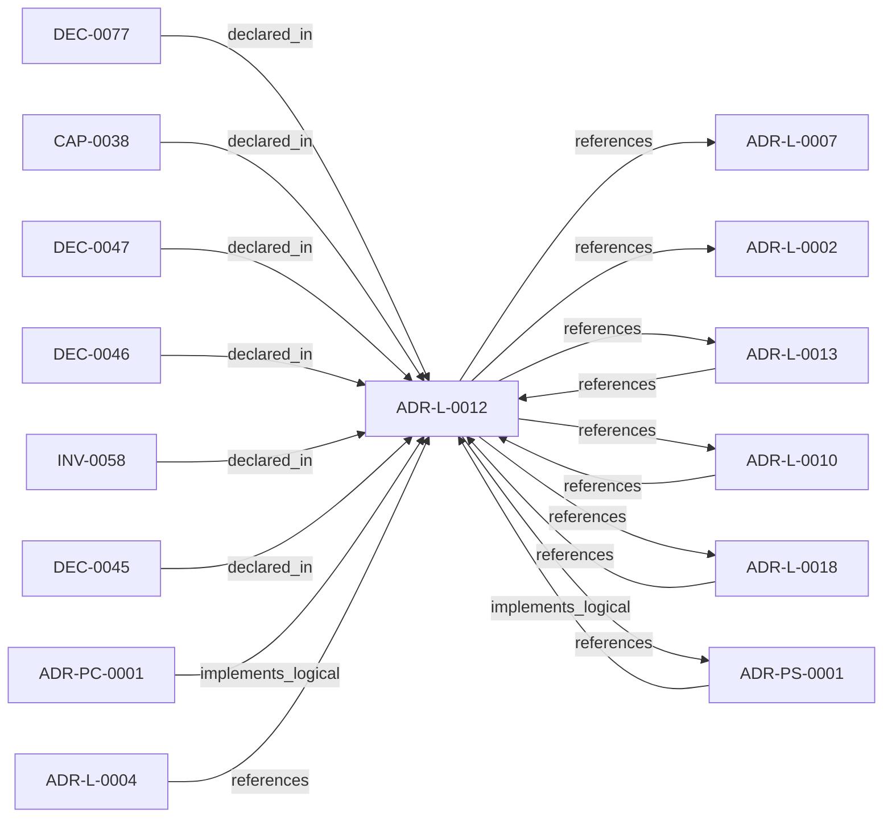

<!--
integrity_schema_version: 1
generated: deterministic_projection_v1
artifact_kind: rendered_adr_markdown
generator_id: adr-projection-markdown
generator_version: 2
hash_algorithm: sha256
source_hash: 8a6f7c8a3e51a93ccdf24669051c04fb766aed1cd27e63341e535fa905ccad16
rendered_hash: d833552c2d8c7004c8ca8baecc5b8c9960e50aab5b00e5cac4a2808594a3caf3
-->

# ADR-L-0012: Federation Authority and Qualified Identity Model

**Status:** accepted  
**Created:** 2026-03-14  
**Modified:** 2026-06-02  
**Authors:** adr-architecture-kit  
**Domains:** federation, identity, governance, multi-repo  
**Tags:** federation, qualified-id, namespace, authority  
**Alias name:** federation-authority-and-qualified-identity-model  

## Context

The compiler and recursive multi-scope model preserve repository-local
compilation boundaries, while STE federation spans independently compiled
repositories. Federation therefore requires global identity without weakening
provider authority or allowing the aggregation layer to rewrite canonical
repository state.

Earlier authoring treated bare local identifiers as sufficient within a
repository and introduced namespace qualification only when crossing repository
boundaries. Canonical v1.3 identity separates those concerns more precisely:
authored entity references use UUIDs, provider-authoritative external identity
is `(architecture_namespace, UUID)`, human aliases remain recognition surfaces,
and workspace repository keys are used only for registration, routing, and
attribution.

This ADR establishes federation as read-only aggregation, preserves each
provider as authority over its entities, and defines the identity boundary used
when architecture is resolved across repositories.

## Relationship graph

## Related ADRs

### ADR-L-0002 — Multi-Scope ADR Architecture for Sub-Module Development

**Relationships:**
- this ADR -[:references]-> 019fee89-e615-7f19-810b-c7b33a9d9e0d

**Context:** The adr-architecture-kit is being actively developed in a single workspace alongside
multiple sub-modules (ste-runtime, future services) that will eventually become
independent services. Each sub-module needs to leverage the ADR system for its own
architectural documentation while being developed in parallel within the monorepo.

[Open projection](ADR-L-0002-multi-scope-adr-architecture-for-sub-module-development.md)
### ADR-L-0004 — ADR-to-Implementation Traceability via Decorators and Metadata Attribution

**Relationships:**
- 019fee89-e615-7577-8d37-dd0df031bec9 -[:references]-> this ADR

**Context:** Architecture Decision Records document why implementation artifacts exist, but
the repo still lacks a universal, machine-verifiable way to trace code,
infrastructure, configuration, schemas, pipelines, and scripts back to the
ADRs that justify them.

[Open projection](ADR-L-0004-adr-to-implementation-traceability-via-decorators-and-metadata-attribution.md)
### ADR-L-0007 — Deterministic Documentation Projection

**Relationships:**
- this ADR -[:references]-> 019fee89-e615-7b9c-8e3f-32ceeda01491

**Context:** The repository already treats several human-readable artifacts as derived state:
ADR human projections under adrs/adr-projection/, manifest summaries, and the AI-first SYSTEM-OVERVIEW
are generated from structured or code-defined sources. That behavior now needs
explicit architectural authority so future contributors do not reintroduce
manually maintained documentation that drifts from canonical artifacts.

[Open projection](ADR-L-0007-deterministic-documentation-projection.md)
### ADR-L-0010 — Kernel Interface Contract and Validation Profiles

**Relationships:**
- 019fee89-e616-7d61-8e35-f11ba2ddd75d -[:references]-> this ADR
- this ADR -[:references]-> 019fee89-e616-7d61-8e35-f11ba2ddd75d

**Context:** adr-architecture-kit is transitioning from an implicit generator toolkit into
an explicit architecture compiler with a defined contract boundary to the STE
kernel. The plan work established that the compiler's guaranteed contract
surface is broader than the kernel's minimal load subset: the contract family
is all generated artifacts under `adrs/index/` plus `manifest.yaml`, while
individual consumers may rely on narrower subsets.

[Open projection](ADR-L-0010-kernel-interface-contract-and-validation-profiles.md)
### ADR-L-0013 — Architecture Repository Boundary and Normalized Semantic Model

**Relationships:**
- 019fee89-e616-7c4e-953c-b7349412a784 -[:references]-> this ADR
- this ADR -[:references]-> 019fee89-e616-7c4e-953c-b7349412a784

**Context:** adr-architecture-kit now has an explicit compiler pipeline, a compiler IR
(`ArchModel`), compiled registry bundles, and an additive architecture graph.
Those pieces are sufficient to produce deterministic machine-facing artifacts,
and ArchitectureRepository already defines the semantic in-process boundary.
Phase 1 adds a narrow supported authoring facade that reuses that seam without
expanding the normalized model or exposing compiler internals.

[Open projection](ADR-L-0013-architecture-repository-boundary-and-normalized-semantic-model.md)
### ADR-L-0018 — Schema v1.2 and Normalized Semantic Foundation

**Relationships:**
- 019fee89-e617-7f4d-811d-4862645a55c5 -[:references]-> this ADR
- this ADR -[:references]-> 019fee89-e617-7f4d-811d-4862645a55c5

**Context:** Phase 1 established a narrow supported authoring SDK while explicitly deferring
schema expansion, normalized-model expansion, assertion identity, bindings, and
topology identity. The repository now needs those contracts as an additive
semantic foundation for future consumers, without implementing the Phase 3 graph
bundle or absorbing authority owned by runtime, rules, substrate, or admission
systems.

[Open projection](ADR-L-0018-schema-v1-2-and-normalized-semantic-foundation.md)
### ADR-PC-0001 — Entity Registry and Discovery Index

**Relationships:**
- 019fee89-e617-7270-ab2f-58a756d2530e -[:implements_logical]-> this ADR

**Context:** The discovery/indexing component now centers on the unified compiler path. It
generates the normalized discovery bundle under `adrs/index/`, emits the
legacy compatibility registry at `adrs/entities/registry.yaml`, generates
manifest and rendered ADR markdown outputs through the same compiler-owned
path for single-scope use, and exposes exact-ID and filtered CLI query
operations over generated registry state.

[Open projection](../physical-component/ADR-PC-0001-entity-registry-and-discovery-index.md)
### ADR-PS-0001 — ADR Architecture Kit Discovery and Indexing System

**Relationships:**
- 019fee89-e618-7b3e-813b-a449881b6adb -[:implements_logical]-> this ADR
- this ADR -[:references]-> 019fee89-e618-7b3e-813b-a449881b6adb

**Context:** The discovery and indexing subsystem provides the derived surfaces that agents
query instead of scanning raw ADR bodies by default. It now includes
normalized discovery bundle generation under `adrs/index/`, legacy
compatibility registry generation under `adrs/entities/registry.yaml`,
manifest generation, rendered ADR markdown generation, CLI query surfaces over
generated registry state, and the unified `adr compile` orchestration path
that emits these derived discovery artifacts together.

[Open projection](../physical-system/ADR-PS-0001-adr-architecture-kit-discovery-and-indexing-system.md)

## Capabilities

### CAP-0038: Federated Qualified Identity Resolution

Support unambiguous multi-repository entity references using architecture_namespace and UUID identity while retaining read-only provider authority and derived human alias qualification.

## Invariants

### INV-0058

**Statement:** Federation and aggregation layers MUST treat each repository as
authoritative over its own canonical registries and MUST NOT mutate those
registries during federation.
  
**Scope:** global  
**Enforcement:** must (design)  
**Verification:** automated

**Rationale:**
Multi-repository architecture reasoning depends on repository ownership and
read-only aggregation remaining explicit.

## Decisions

### DEC-0045: Treat federation as a read-only aggregation layer over per-repo canonical registries

**Rationale:**
Per-repository registries remain the canonical architecture outputs for
their owning repository. Federation exists to read, index, merge, and query
across those outputs; it must not rewrite or mutate them.

**Consequences:**

**Positive:**
- Repository ownership boundaries remain explicit
- Federation can be added or evolved without changing local compiler output
- Global analysis stays traceable to per-repo canonical state

### DEC-0046: Use provider-authoritative conflict resolution for federated entity definitions

**Rationale:**
When one repository references an entity defined by another repository, the
defining repository is the authority on that entity's name, status, and
metadata. Consumers may declare relationships to the entity, but they do
not redefine it.

**Consequences:**

**Positive:**
- Entity ownership remains unambiguous across repository boundaries
- Consumer references cannot silently override provider truth
- Conflict handling remains deterministic

### DEC-0047: Qualify machine identity as (architecture_namespace, UUID); keep human alias qualification derived

**Rationale:**
V1.3 canonical external identity is the pair (architecture_namespace, UUID). Local v1.3 authored references use UUIDs. Human-recognition aliases may be namespace-qualified for display, but alias qualification remains derived and is not provider namespace identity authority.

**Consequences:**

**Positive:**
- Pre-v1.3 local authoring remains readable and compatible
- Cross-repo references become explicit and machine-parseable
- Global identity does not require a central ID allocator

### DEC-0077: Emit workspace-attribution-federation.yaml as read-only cross-repo attribution index keyed by workspace routing identity that resolves to architecture_namespace

**Rationale:**
Workspace repository keys remain local registration/routing/attribution handles. They resolve to the provider's architecture_namespace and must not be treated as the provider identity namespace. Canonical external identity remains (architecture_namespace, UUID), not a workspace-key-qualified local ADR alias.

**Consequences:**

**Positive:**
- Agents and workspace tools resolve ADR embodiment without bare-id collapse
- Federation remains derived and does not mutate per-repo evidence

**Negative:**
- Workspace manifest repo keys remain stable for routing/attribution resolution to architecture_namespace, not as UUID identity namespaces

---

*Generated from ADR-L-0012 by ADR Architecture Kit*