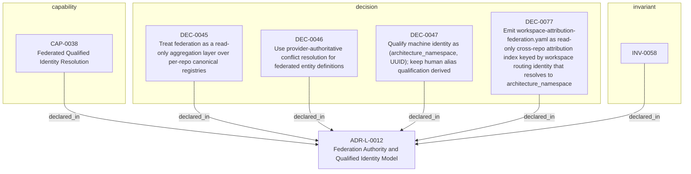

<!--
integrity_schema_version: 1
generated: deterministic_projection_v1
artifact_kind: rendered_adr_markdown
generator_id: adr-projection-markdown
generator_version: 3
hash_algorithm: sha256
source_hash: 6c9cdd7554d9938385ad5f7d7fe8d90b197eb045766c064c93be916792f20d14
rendered_hash: f0617cac39b876453e94528792da8452108080658a8ec4fe2e1a135ee13d1801
-->

# ADR-L-0012: Federation Authority and Qualified Identity Model

## Identity / Status

**Type:** logical  
**Status:** accepted  
**Alias:** ADR-L-0012  
**Alias name:** federation-authority-and-qualified-identity-model  
**Created:** 2026-03-14  
**Modified:** 2026-06-02  
**Authors:** adr-architecture-kit  
**Domains:** federation, identity, governance, multi-repo  

## Architecture Position

Logical architecture authority for this subject. Neighborhood paths use structural bridges plus exactly one semantic architecture edge; they never invent ADR-to-ADR verbs.

## Architecture Neighborhood

### Semantic architecture inventory

- `implements_logical`: ADR-PC-0001 → ADR-L-0012
- `implements_logical`: ADR-PS-0001 → ADR-L-0012

## Neighbor Relationships

| Neighbor | Relationship | Exact Path |
| --- | --- | --- |
| [ADR-PC-0001 — Entity Registry and Discovery Index](../physical-component/ADR-PC-0001-entity-registry-and-discovery-index.md) | ADR-PC-0001 -[:implements_logical]-> ADR-L-0012 | `ADR-PC-0001 -[:implements_logical]-> ADR-L-0012` |
| [ADR-PS-0001 — ADR Architecture Kit Discovery and Indexing System](../physical-system/ADR-PS-0001-adr-architecture-kit-discovery-and-indexing-system.md) | ADR-PS-0001 -[:implements_logical]-> ADR-L-0012 | `ADR-PS-0001 -[:implements_logical]-> ADR-L-0012` |

### Lifecycle / association

- ADR-L-0004 -[:references]-> ADR-L-0012
- ADR-L-0012 -[:references]-> ADR-L-0007
- ADR-L-0012 -[:references]-> ADR-L-0002
- ADR-L-0012 -[:references]-> ADR-L-0013
- ADR-L-0012 -[:references]-> ADR-L-0010
- ADR-L-0012 -[:references]-> ADR-L-0018
- ADR-L-0012 -[:references]-> ADR-PS-0001
- ADR-L-0013 -[:references]-> ADR-L-0012
- ADR-L-0010 -[:references]-> ADR-L-0012
- ADR-L-0018 -[:references]-> ADR-L-0012

## Context

The compiler and recursive multi-scope model preserve repository-local
compilation boundaries, while STE federation spans independently compiled
repositories. Federation therefore requires global identity without weakening
provider authority or allowing the aggregation layer to rewrite canonical
repository state.

Earlier authoring treated bare local identifiers as sufficient within a
repository and introduced namespace qualification only when crossing repository
boundaries. Canonical v1.3 identity separates those concerns more precisely:
authored entity references use UUIDs, provider-authoritative external identity
is `(architecture_namespace, UUID)`, human aliases remain recognition surfaces,
and workspace repository keys are used only for registration, routing, and
attribution.

This ADR establishes federation as read-only aggregation, preserves each
provider as authority over its entities, and defines the identity boundary used
when architecture is resolved across repositories.

## Internal Structure

- `capability` CAP-0038 — Federated Qualified Identity Resolution
- `decision` DEC-0045 — Treat federation as a read-only aggregation layer over per-repo canonical registries
- `decision` DEC-0046 — Use provider-authoritative conflict resolution for federated entity definitions
- `decision` DEC-0047 — Qualify machine identity as (architecture_namespace, UUID); keep human alias qualification derived
- `decision` DEC-0077 — Emit workspace-attribution-federation.yaml as read-only cross-repo attribution index keyed by workspace routing identity that resolves to architecture_namespace
- `invariant` INV-0058 — INV-0058

## Capabilities

### CAP-0038: Federated Qualified Identity Resolution

Support unambiguous multi-repository entity references using architecture_namespace and UUID identity while retaining read-only provider authority and derived human alias qualification.

## Decisions

### DEC-0045: Treat federation as a read-only aggregation layer over per-repo canonical registries

**Rationale:**
Per-repository registries remain the canonical architecture outputs for
their owning repository. Federation exists to read, index, merge, and query
across those outputs; it must not rewrite or mutate them.

### DEC-0046: Use provider-authoritative conflict resolution for federated entity definitions

**Rationale:**
When one repository references an entity defined by another repository, the
defining repository is the authority on that entity's name, status, and
metadata. Consumers may declare relationships to the entity, but they do
not redefine it.

### DEC-0047: Qualify machine identity as (architecture_namespace, UUID); keep human alias qualification derived

**Rationale:**
V1.3 canonical external identity is the pair (architecture_namespace, UUID). Local v1.3 authored references use UUIDs. Human-recognition aliases may be namespace-qualified for display, but alias qualification remains derived and is not provider namespace identity authority.

### DEC-0077: Emit workspace-attribution-federation.yaml as read-only cross-repo attribution index keyed by workspace routing identity that resolves to architecture_namespace

**Rationale:**
Workspace repository keys remain local registration/routing/attribution handles. They resolve to the provider's architecture_namespace and must not be treated as the provider identity namespace. Canonical external identity remains (architecture_namespace, UUID), not a workspace-key-qualified local ADR alias.

## Invariants

### INV-0058

**Statement:** Federation and aggregation layers MUST treat each repository as
authoritative over its own canonical registries and MUST NOT mutate those
registries during federation.
  
**Scope:** global  
**Enforcement:** must (design)

**Rationale:**
Multi-repository architecture reasoning depends on repository ownership and
read-only aggregation remaining explicit.

---

*Generated from ADR-L-0012 by ADR Architecture Kit (projection v3)*