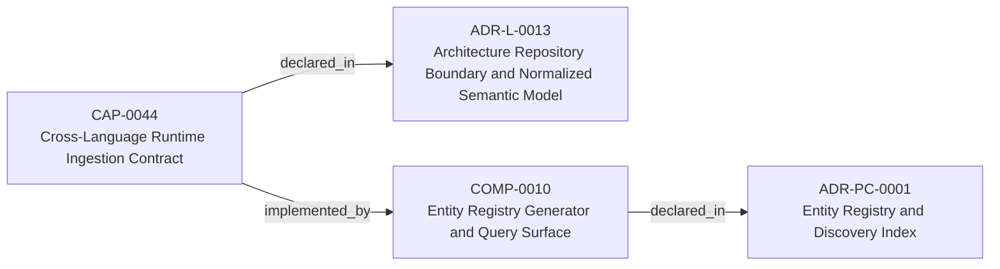
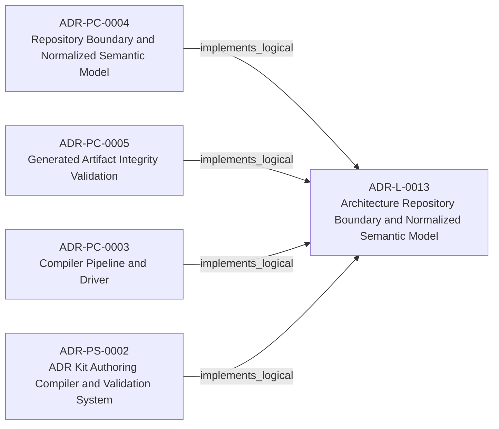

<!--
integrity_schema_version: 1
generated: deterministic_projection_v1
artifact_kind: rendered_adr_markdown
generator_id: adr-projection-markdown
generator_version: 3
hash_algorithm: sha256
source_hash: c1614ef7fd2770b4f865df4a5aed3d9d34e30126661cd74fc930e2b16ebee7a6
rendered_hash: 554227474a28973c5127da9f52ff271372d1736a7c6889c99f0ab01987ade188
-->

# ADR-L-0013: Architecture Repository Boundary and Normalized Semantic Model

## Identity / Status

**Type:** logical  
**Status:** accepted  
**Alias:** ADR-L-0013  
**Alias name:** architecture-repository-boundary-and-normalized-semantic-model  
**Created:** 2026-03-14  
**Modified:** 2026-08-06  
**Authors:** adr-architecture-kit  
**Domains:** repository, discovery, compiler, kernel  

## Architecture Position

Logical architecture authority for this subject. Neighborhood paths use structural bridges plus exactly one semantic architecture edge; they never invent ADR-to-ADR verbs.

## Architecture Neighborhood

### Semantic architecture inventory

- `implemented_by`: CAP-0044 → COMP-0010
- `implements_logical`: ADR-PC-0004 → ADR-L-0013
- `implements_logical`: ADR-PC-0005 → ADR-L-0013
- `implements_logical`: ADR-PC-0003 → ADR-L-0013
- `implements_logical`: ADR-PS-0002 → ADR-L-0013

## Neighbor Relationships

### ADR-PC-0001 — Entity Registry and Discovery Index

- CAP-0044 -[:implemented_by]-> COMP-0010

**Context:** The discovery/indexing component now centers on the unified compiler path. It
generates the normalized discovery bundle under `adrs/index/`, emits the
legacy compatibility registry at `adrs/entities/registry.yaml`, generates
manifest and rendered ADR markdown outputs through the same compiler-owned
path for single-scope use, and exposes exact-ID and filtered CLI query
operations over generated registry state.

[Open projection](../physical-component/ADR-PC-0001-entity-registry-and-discovery-index.md)
### ADR-PC-0003 — Compiler Pipeline and Driver

- ADR-PC-0003 -[:implements_logical]-> ADR-L-0013

**Context:** The compiler driver and explicit pipeline now own deterministic architecture
compilation across parse, analysis, emission, and recursive scope
orchestration. The command-line behavior is compatibility-relevant, while the
Python compiler pipeline, passes, `ArchModel`, emitters, and result plumbing are
internal reference implementation and are not a supported SDK facade.

[Open projection](../physical-component/ADR-PC-0003-compiler-pipeline-and-driver.md)
### ADR-PC-0004 — Repository Boundary and Normalized Semantic Model

- ADR-PC-0004 -[:implements_logical]-> ADR-L-0013

**Context:** ArchitectureRepository and NormalizedArchitectureModel are the stable
in-process semantic boundary for consumers. Phase 1 adds a narrow supported
authoring facade that reuses those contracts without wrapping or changing the
normalized model and without making registry loaders or path helpers public.

[Open projection](../physical-component/ADR-PC-0004-repository-boundary-and-normalized-semantic-model.md)
### ADR-PC-0005 — Generated Artifact Integrity Validation

- ADR-PC-0005 -[:implements_logical]-> ADR-L-0013

**Context:** Generated artifact integrity validation verifies freshness, tamper status,
integrity headers, and scope-local generated outputs. It is a distinct public
subsystem used by validator and governance flows.

[Open projection](../physical-component/ADR-PC-0005-generated-artifact-integrity-validation.md)
### ADR-PS-0002 — ADR Kit Authoring Compiler and Validation System

- ADR-PS-0002 -[:implements_logical]-> ADR-L-0013

**Context:** adr-architecture-kit operates as an authoring-time compiler and validation system rather
than a collection of unrelated generators. The implementation includes an
explicit compiler pipeline, contract validation, normalized repository/model
access, integrity verification, and CLI orchestration over those surfaces.

[Open projection](../physical-system/ADR-PS-0002-adr-kit-authoring-compiler-and-validation-system.md)

### Lifecycle / association

- ADR-L-0007 -[:references]-> ADR-L-0013
- ADR-L-0012 -[:references]-> ADR-L-0013
- ADR-L-0014 -[:references]-> ADR-L-0013
- ADR-L-0009 -[:references]-> ADR-L-0013
- ADR-L-0013 -[:references]-> ADR-L-0012
- ADR-L-0013 -[:references]-> ADR-L-0009
- ADR-L-0013 -[:references]-> ADR-L-0010
- ADR-L-0013 -[:references]-> ADR-PC-0001
- ADR-L-0013 -[:references]-> ADR-L-0018
- ADR-L-0013 -[:references]-> ADR-PC-0005
- ADR-L-0010 -[:references]-> ADR-L-0013
- ADR-L-0015 -[:references]-> ADR-L-0013
- ADR-L-0018 -[:references]-> ADR-L-0013
- ADR-L-0016 -[:references]-> ADR-L-0013
- ADR-L-0020 -[:references]-> ADR-L-0013
- ADR-L-0024 -[:references]-> ADR-L-0013

## Context

adr-architecture-kit now has an explicit compiler pipeline, a compiler IR
(`ArchModel`), compiled registry bundles, and an additive architecture graph.
Those pieces are sufficient to produce deterministic machine-facing artifacts,
and ArchitectureRepository already defines the semantic in-process boundary.
Phase 1 adds a narrow supported authoring facade that reuses that seam without
expanding the normalized model or exposing compiler internals.

Without that boundary, in-process tools can drift into reading raw registries
directly, interpreting relationships independently, and coupling future
kernel or graph consumers to current file layouts and registry schemas. That
would undermine determinism, make schema evolution expensive, and allow
semantic drift between canonical ADR authority and downstream machine
consumers.

A stabilizing move is needed now while the system is still small enough to
evolve safely: one repository boundary that loads compiled artifacts and
exposes one stable semantic model to in-process consumers, while still making
the cross-language file-format contract explicit for consumers that cannot
call Python repository APIs.

## Internal Structure

```mermaid
flowchart TB
  n_019fee89_e616_7c4e_953c_b7349412a784["ADR-L-0013<br/>Architecture Repository Boundary and Normalized Semantic Model"]
  subgraph sg_capability["capability"]
    n_019fee89_e616_7140_bb3f_8b78ab40d018["CAP-0039<br/>Stable Repository Semantic Boundary"]
    n_019fee89_e616_7d30_ae2e_6fee1dbb2712["CAP-0044<br/>Cross-Language Runtime Ingestion Contract"]
    n_019fee89_e616_73a1_9d27_96afd11520ad["CAP-0047<br/>Narrow Supported Authoring SDK"]
  end
  subgraph sg_decision["decision"]
    n_019fee89_e616_7c74_922b_f871dc663b59["DEC-0050<br/>Use ArchitectureRepository as the supported in-process semantic entry point with UUID, governed alias, and logical URI lookup"]
    n_019fee89_e616_7da4_9e1f_eb49b97c42ca["DEC-0051<br/>Adopt NormalizedArchitectureModel 2.0 as the v1.3 repository semantic payload"]
    n_019fee89_e616_7b02_9c1e_5028e84c85e1["DEC-0052<br/>Keep ArchModel compiler-internal and do not promote it to the public consumer API"]
    n_019fee89_e616_7153_930f_595ce3d9f96d["DEC-0061<br/>Permit direct `adrs/index/*` consumption for cross-language or out-of-process consumers"]
    n_019fee89_e616_7340_a61b_57b9c79eca96["DEC-0062<br/>Treat repository-backed graph access as the intended Python graph seam"]
    n_019fee89_e616_755b_843e_689f9ffa2091["DEC-0067<br/>Define an index-first minimal runtime ingestion subset for cross-language architecture consumers"]
    n_019fee89_e616_77c3_9137_1750a4d9bca5["DEC-0068<br/>Require cross-language runtime ingestion to remain index-first, manifest-aware, and additive-safe"]
    n_019fee89_e616_7018_982f_d3d703f29db7["DEC-0079<br/>Preserve the present repository seam and defer any narrow consumer facade"]
    n_019fee89_e616_7c36_b43f_6e4c45a4faf4["DEC-0080<br/>Establish adr_kit.api as the narrow supported authoring SDK facade"]
    n_019fee89_e616_7a7c_883f_b36edf94a1d8["DEC-0082<br/>Keep repository-local authoring projections separate from workspace runtime state"]
  end
  subgraph sg_invariant["invariant"]
    n_019fee89_e616_72be_b22f_784bf7f19434["INV-0059"]
    n_019fee89_e616_71e8_8619_6d6dde59a698["INV-0067"]
    n_019fee89_e616_765f_a51d_a19f2cfa383b["INV-0074"]
    n_019fee89_e616_7174_bc0f_0812c51d1d0c["INV-0076"]
  end
  n_019fee89_e616_7018_982f_d3d703f29db7 -->|"declared_in"| n_019fee89_e616_7c4e_953c_b7349412a784
  n_019fee89_e616_7140_bb3f_8b78ab40d018 -->|"declared_in"| n_019fee89_e616_7c4e_953c_b7349412a784
  n_019fee89_e616_7153_930f_595ce3d9f96d -->|"declared_in"| n_019fee89_e616_7c4e_953c_b7349412a784
  n_019fee89_e616_7174_bc0f_0812c51d1d0c -->|"declared_in"| n_019fee89_e616_7c4e_953c_b7349412a784
  n_019fee89_e616_71e8_8619_6d6dde59a698 -->|"declared_in"| n_019fee89_e616_7c4e_953c_b7349412a784
  n_019fee89_e616_72be_b22f_784bf7f19434 -->|"declared_in"| n_019fee89_e616_7c4e_953c_b7349412a784
  n_019fee89_e616_7340_a61b_57b9c79eca96 -->|"declared_in"| n_019fee89_e616_7c4e_953c_b7349412a784
  n_019fee89_e616_73a1_9d27_96afd11520ad -->|"declared_in"| n_019fee89_e616_7c4e_953c_b7349412a784
  n_019fee89_e616_755b_843e_689f9ffa2091 -->|"declared_in"| n_019fee89_e616_7c4e_953c_b7349412a784
  n_019fee89_e616_765f_a51d_a19f2cfa383b -->|"declared_in"| n_019fee89_e616_7c4e_953c_b7349412a784
  n_019fee89_e616_77c3_9137_1750a4d9bca5 -->|"declared_in"| n_019fee89_e616_7c4e_953c_b7349412a784
  n_019fee89_e616_7a7c_883f_b36edf94a1d8 -->|"declared_in"| n_019fee89_e616_7c4e_953c_b7349412a784
  n_019fee89_e616_7b02_9c1e_5028e84c85e1 -->|"declared_in"| n_019fee89_e616_7c4e_953c_b7349412a784
  n_019fee89_e616_7c36_b43f_6e4c45a4faf4 -->|"declared_in"| n_019fee89_e616_7c4e_953c_b7349412a784
  n_019fee89_e616_7c74_922b_f871dc663b59 -->|"declared_in"| n_019fee89_e616_7c4e_953c_b7349412a784
  n_019fee89_e616_7d30_ae2e_6fee1dbb2712 -->|"declared_in"| n_019fee89_e616_7c4e_953c_b7349412a784
  n_019fee89_e616_7da4_9e1f_eb49b97c42ca -->|"declared_in"| n_019fee89_e616_7c4e_953c_b7349412a784
```

- `capability` CAP-0039 — Stable Repository Semantic Boundary
- `capability` CAP-0044 — Cross-Language Runtime Ingestion Contract
- `capability` CAP-0047 — Narrow Supported Authoring SDK
- `decision` DEC-0050 — Use ArchitectureRepository as the supported in-process semantic entry point with UUID, governed alias, and logical URI lookup
- `decision` DEC-0051 — Adopt NormalizedArchitectureModel 2.0 as the v1.3 repository semantic payload
- `decision` DEC-0052 — Keep ArchModel compiler-internal and do not promote it to the public consumer API
- `decision` DEC-0061 — Permit direct `adrs/index/*` consumption for cross-language or out-of-process consumers
- `decision` DEC-0062 — Treat repository-backed graph access as the intended Python graph seam
- `decision` DEC-0067 — Define an index-first minimal runtime ingestion subset for cross-language architecture consumers
- `decision` DEC-0068 — Require cross-language runtime ingestion to remain index-first, manifest-aware, and additive-safe
- `decision` DEC-0079 — Preserve the present repository seam and defer any narrow consumer facade
- `decision` DEC-0080 — Establish adr_kit.api as the narrow supported authoring SDK facade
- `decision` DEC-0082 — Keep repository-local authoring projections separate from workspace runtime state
- `invariant` INV-0059 — INV-0059
- `invariant` INV-0067 — INV-0067
- `invariant` INV-0074 — INV-0074
- `invariant` INV-0076 — INV-0076

## Capabilities

### CAP-0039: Stable Repository Semantic Boundary

Provide one scope-safe, deterministic in-process interface that loads
compiled architecture bundles and exposes the authorized
NormalizedArchitectureModel 2.0 semantic payload with UUID, alias, and
logical URI resolution.

### CAP-0044: Cross-Language Runtime Ingestion Contract

Provide one explicit file-format ingestion posture for cross-language or
out-of-process runtime consumers so they can consume compiler-owned
Architecture IR without redefining architecture semantics locally.

### CAP-0047: Narrow Supported Authoring SDK

Provide a deterministic Python facade for explicit-root validation,
authoring compilation of registries, manifest, and markdown, repository
loading, normalized-model consumption, and local capability discovery. The facade remains a narrow supported authoring SDK and admits only explicitly authorized public symbols for the current API contract, including additive promotion-provider operations once separately authorized. Bounded model 2.0 compatibility adapters may be exposed without exposing compiler internals and without advertising schema/model embodiment as complete.

## Decisions

### DEC-0050: Use ArchitectureRepository as the supported in-process semantic entry point with UUID, governed alias, and logical URI lookup

**Rationale:**
The repository boundary centralizes scope-safe loading, contract
validation, path hiding, and registry compatibility adaptation. This keeps
consumers from binding directly to registry files and current layout.

Repository lookup/resolution supports UUID, governed aliases, and logical URI forms while canonical machine operations resolve to UUID.

### DEC-0051: Adopt NormalizedArchitectureModel 2.0 as the v1.3 repository semantic payload

**Rationale:**
A semantic model is needed so consumers depend on architecture meaning
rather than current registry document shapes. The model must preserve
entities, relationships, unresolved records, provenance, scope identity,
and deterministic fingerprinting.

V1.3 authority advances normalized semantics to model 2.0 with UUID
identities and endpoints, explicit UUID/alias lookup, and versioned
compatibility adapters. Embodiment of that contract is subsequent v1.3
implementation work.

### DEC-0052: Keep ArchModel compiler-internal and do not promote it to the public consumer API

**Rationale:**
The current `ArchModel` is the compiler IR. It reflects pass orchestration
and extraction concerns and may evolve as compiler internals change. Making
it the public consumer contract would freeze the wrong abstraction too
early.

### DEC-0061: Permit direct `adrs/index/*` consumption for cross-language or out-of-process consumers

**Rationale:**
Cross-language consumers such as `ste-runtime` cannot call a Python
repository API directly. They still consume the same generated authority
surface, but through the file-format contract rather than the in-process
repository seam.

### DEC-0062: Treat repository-backed graph access as the intended Python graph seam

**Rationale:**
Python consumers should not hardcode the graph artifact path once the
repository boundary can expose it as part of the indexed contract family.
This preserves a coherent semantic seam for in-process consumers.

### DEC-0067: Define an index-first minimal runtime ingestion subset for cross-language architecture consumers

**Rationale:**
Cross-language consumers such as `ste-runtime` need an explicit baseline
ingestion contract so they do not guess which generated artifacts are
required for architecture-aware operation. The baseline subset is
`architecture-index.yaml`, `entity-registry.yaml`,
`relationship-registry.yaml`, `unresolved-registry.yaml`, and
`manifest.yaml`.

### DEC-0068: Require cross-language runtime ingestion to remain index-first, manifest-aware, and additive-safe

**Rationale:**
The runtime bridge must preserve compiler authority even when a consumer
uses file-format contracts directly. Cross-language consumers should
bootstrap from the architecture index, treat manifest as a discovery and
freshness aid, treat subset registries and `architecture-graph.yaml` as
additive, and refuse to reconstruct authority by reparsing source ADR YAML.

### DEC-0079: Preserve the present repository seam and defer any narrow consumer facade

**Rationale:**
Phase 0 production hardening does not authorize a new SDK, root export,
replacement compilation result, normalized-model revision, or graph API.
`ArchitectureRepository` and `NormalizedArchitectureModel` remain the
supported in-process seam. The historical `ArchModel` export is retained
for compatibility but remains compiler-internal and unsuitable as a new
consumer dependency.

A later phase may introduce a narrow facade over supported interfaces only.
Any future Assembler must call that supported boundary and must not bind to
`ArchModel`, compiler passes, raw source ADR parsing, or generated-file layout.

### DEC-0080: Establish adr_kit.api as the narrow supported authoring SDK facade

**Rationale:**
Phase 1 now has sufficient compatibility, packaging, and release controls to
add a deliberately bounded facade. The facade supports single-scope
validation, authoring compilation for registries, manifest, and markdown,
repository opening, normalized-model consumption, and deterministic local
capability discovery. It reuses the existing repository and normalized model
contracts while translating compiler results into independent immutable
public contracts.

The Phase 0 deferral in DEC-0079 is therefore complete for this exact facade.
Root re-exports, graph or Architecture IR operations, recursive workspaces,
runtime evidence, rules, substrate, admission, Assembler, MCP, and LLM
capabilities remain unauthorized.

The supported facade evolves repository/model consumption for model 2.0 compatibility adapters without exposing compiler internals or ArchModel.

### DEC-0082: Keep repository-local authoring projections separate from workspace runtime state

**Rationale:**
Every artifact stored inside the `adr-architecture-kit` repository is owned
and written by ADR Kit. External systems may read its canonical ADRs and
supported authoring projections, but they must not target the repository as
an output location. Runtime-derived graphs, evidence, registries, manifests,
and other workspace state belong under the workspace-root `.ste-workspace`
directory, which is outside every repository.

Phase 1 therefore validates only ADR Kit's own deterministic authoring
outputs. A repository-targeted runtime refresh is not part of the SDK
authority gate. Any runtime command that writes into this repository violates
the workspace state boundary and is an external implementation defect rather
than authoring output to accept or baseline.

## Invariants

### INV-0059

**Statement:** In-process architecture consumers MUST use the ArchitectureRepository
boundary instead of inventing ad hoc compiled-registry interpretation when
a repository boundary is available. Cross-language or out-of-process
consumers MAY consume generated `adrs/index/*` artifacts directly when the
repository boundary is not available to them.
  
**Scope:** global  
**Enforcement:** must (design)

**Rationale:**
Centralized loading and semantic adaptation are required to prevent
consumer fragmentation and long-term registry drift.

### INV-0067

**Statement:** Cross-language or out-of-process architecture consumers that rely on the
file-format contract MUST bootstrap from `adrs/index/architecture-index.yaml`,
MUST require the minimal ingestion subset of `entity-registry.yaml`,
`relationship-registry.yaml`, `unresolved-registry.yaml`, and
`adrs/manifest.yaml`, and MUST NOT recreate architecture authority by
reparsing ADR source YAML when the generated contract bundle is expected.
Subset registries and `architecture-graph.yaml` MAY be consumed only as
additive artifacts, and `adrs/entities/registry.yaml` MUST remain
compatibility-only.
  
**Scope:** global  
**Enforcement:** must (design)

**Rationale:**
Cross-language consumers need an explicit ingestion posture that preserves
compiler authority, keeps required versus additive surfaces distinct, and
prevents fallback drift into source-level reinterpretation.

### INV-0074

**Statement:** The supported `adr_kit.api` facade MUST NOT expose `ArchModel`, compiler
configuration, compiler passes, frontend or backend objects, emitters,
internal output artifacts, mutable diagnostic logs, compiler caches, or
other compiler-internal types through public annotations or runtime result
object graphs.
  
**Scope:** global  
**Enforcement:** must (test)

**Rationale:**
The facade is a stable consumer contract, while compiler orchestration and
intermediate representation remain implementation details that must be able
to evolve independently.

### INV-0076

**Statement:** Only ADR Kit tooling MAY create or modify canonical artifacts, authoring
projections, compatibility outputs, or other files inside the
`adr-architecture-kit` repository. External runtime or workspace tooling MAY
read supported repository contracts but MUST NOT write anywhere inside any
repository tree. All runtime-derived and workspace-derived state MUST be
written beneath the workspace-root `.ste-workspace` directory.
  
**Scope:** global  
**Enforcement:** must (design)

**Rationale:**
Separate write domains prevent derived runtime state from corrupting
canonical authoring state, compatibility bytes, integrity metadata, and
repository-local governance evidence.

---

*Generated from ADR-L-0013 by ADR Architecture Kit (projection v3)*