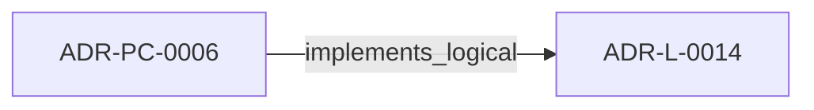
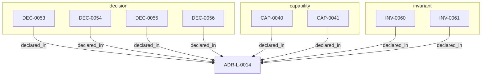

<!--
integrity_schema_version: 1
generated: deterministic_projection_v1
artifact_kind: rendered_adr_markdown
generator_id: adr-projection-markdown
generator_version: 3
hash_algorithm: sha256
source_hash: 1a3745e1f540d0607587c3d9755ba95bac4b3d17382e672b6b153e987c710162
rendered_hash: b557f5831562c57ec972f47765b364864e5b559b0ba0e55db540fbb5dac457fa
-->

# ADR-L-0014: Brownfield Onboarding and Canonicalization Workflow

## Identity / Status

**Type:** logical  
**Status:** accepted  
**Alias:** ADR-L-0014  
**Alias name:** brownfield-onboarding-and-canonicalization-workflow  
**Created:** 2026-03-15  
**Authors:** adr-architecture-kit  
**Domains:** migration, onboarding, governance, brownfield  

## Architecture Position

Logical architecture authority for this subject. Neighborhood paths use structural bridges plus exactly one semantic architecture edge; they never invent ADR-to-ADR verbs.

## Architecture Neighborhood

### Semantic architecture inventory

- `implements_logical`: ADR-PC-0006 → ADR-L-0014

## Neighbor Relationships

### ADR-PC-0006 — Brownfield Onboarding and Canonical Normalization

- ADR-PC-0006 -[:implements_logical]-> ADR-L-0014 (peer ADR-PC-0006)

**Context:** adr-architecture-kit already includes migration and normalization behavior in
its migrator and CLI surfaces. This component makes brownfield onboarding and
canonical normalization an explicit part of the compiler/validation runtime.

[Open projection](../physical-component/ADR-PC-0006-brownfield-onboarding-and-canonical-normalization.md)

### Lifecycle / association

- ADR-L-0014 -[:references]-> ADR-L-0009
- ADR-L-0014 -[:references]-> ADR-L-0011
- ADR-L-0014 -[:references]-> ADR-L-0013

## Context

STE adoption often begins after meaningful architecture and implementation
decisions already exist. In that stage, the problem is not blank-slate design;
it is brownfield onboarding: discover current architecture state, normalize
legacy identifiers and metadata, formalize already-made decisions into
canonical ADRs, and regenerate deterministic derived artifacts without
treating derived state as authority.

adr-architecture-kit already contains pieces of this workflow:
- canonical ID normalization with migration ledgers
- remediation-ledger and metadata enforcement
- compiler-owned derived artifact regeneration
- repository and discovery surfaces for post-onboarding use

What is missing is one explicit logical decision that defines onboarding and
migration as a first-class STE workflow rather than an ad hoc repair pass.

## Internal Structure

- `capability` CAP-0040 — Brownfield Onboarding Workflow
- `capability` CAP-0041 — Canonical Migration Evidence
- `decision` DEC-0053 — Treat brownfield onboarding as a first-class canonicalization workflow
- `decision` DEC-0054 — Separate onboarding into discovery, normalization, canonization, regeneration, and validation phases
- `decision` DEC-0055 — Record deterministic brownfield remaps and cleanup transitions in canonical migration artifacts
- `decision` DEC-0056 — Keep rendered artifacts as disposable human projections and forbid them as semantic authority when canonical YAML exists
- `invariant` INV-0060 — INV-0060
- `invariant` INV-0061 — INV-0061

## Capabilities

### CAP-0040: Brownfield Onboarding Workflow

Provide an explicit workflow for migrating existing repositories into STE
canonical architecture authority through phased discovery, normalization,
canonization, regeneration, and validation.

### CAP-0041: Canonical Migration Evidence

Record deterministic remaps, onboarding cleanup results, and legacy-to-
canonical transitions in machine-readable migration artifacts.

## Decisions

### DEC-0053: Treat brownfield onboarding as a first-class canonicalization workflow

**Rationale:**
Existing architecture can be informally decided but not yet canonicalized.
STE needs an explicit workflow for converting that state into canonical ADR
authority without pretending the implementation invented the architecture.

### DEC-0054: Separate onboarding into discovery, normalization, canonization, regeneration, and validation phases

**Rationale:**
Brownfield onboarding mixes several concerns that should not be collapsed:
discovery identifies what exists, normalization resolves collisions and
missing metadata, canonization creates or updates canonical ADRs,
regeneration rebuilds derived artifacts, and validation verifies the result.

### DEC-0055: Record deterministic brownfield remaps and cleanup transitions in canonical migration artifacts

**Rationale:**
Canonical ID remaps, onboarding normalization, and controlled cleanup
transitions should produce durable evidence so future consumers can explain
how legacy identifiers and structures map into current canonical state.

### DEC-0056: Keep rendered artifacts as disposable human projections and forbid them as semantic authority when canonical YAML exists

**Rationale:**
Rendered markdown is useful for review and browsing, but it is structurally
weaker than canonical YAML and should never become the semantic source of
truth when canonical ADR artifacts are available.

## Invariants

### INV-0060

**Statement:** STE onboarding workflows MUST treat discovery, normalization, canonization,
regeneration, and validation as distinct phases with canonical artifacts
updated before derived artifacts are refreshed.
  
**Scope:** global  
**Enforcement:** must (design)

**Rationale:**
Canonical artifacts must remain the source of truth throughout brownfield
onboarding and cleanup.

### INV-0061

**Statement:** Rendered markdown artifacts MUST be treated as derived human-facing
projections and MUST NOT be used as semantic authority when canonical YAML
source artifacts are available.
  
**Scope:** global  
**Enforcement:** must (policy)

**Rationale:**
Rendered markdown is a convenience surface, not a trustworthy semantic
contract when canonical structured artifacts exist.

---

*Generated from ADR-L-0014 by ADR Architecture Kit (projection v3)*