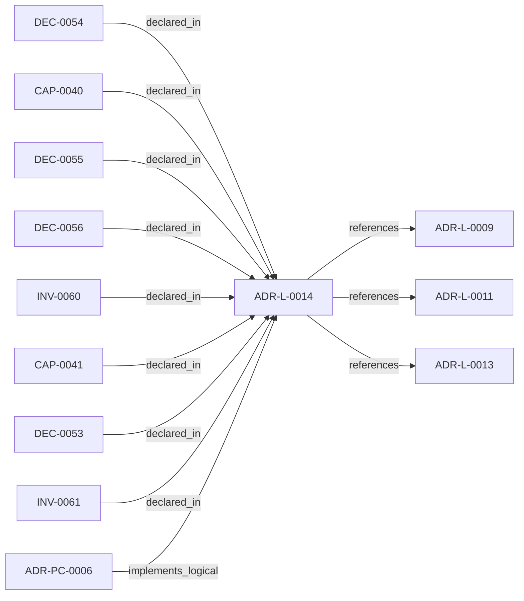

<!--
integrity_schema_version: 1
generated: deterministic_projection_v1
artifact_kind: rendered_adr_markdown
generator_id: adr-projection-markdown
generator_version: 2
hash_algorithm: sha256
source_hash: 75e311d511957096e664c0723eaf88adcb34902a751c118b628ec20e00382960
rendered_hash: c6c472cff6141b1cc8cfc7de60057b752af3c3622ebe52058b11c2a3366939ff
-->

# ADR-L-0014: Brownfield Onboarding and Canonicalization Workflow

**Status:** proposed  
**Created:** 2026-03-15  
**Authors:** adr-architecture-kit  
**Domains:** migration, onboarding, governance, brownfield  
**Tags:** onboarding, migration, canonicalization, cleanup  
**Alias name:** brownfield-onboarding-and-canonicalization-workflow  

## Context

STE adoption often begins after meaningful architecture and implementation
decisions already exist. In that stage, the problem is not blank-slate design;
it is brownfield onboarding: discover current architecture state, normalize
legacy identifiers and metadata, formalize already-made decisions into
canonical ADRs, and regenerate deterministic derived artifacts without
treating derived state as authority.

adr-architecture-kit already contains pieces of this workflow:
- canonical ID normalization with migration ledgers
- remediation-ledger and metadata enforcement
- compiler-owned derived artifact regeneration
- repository and discovery surfaces for post-onboarding use

What is missing is one explicit logical decision that defines onboarding and
migration as a first-class STE workflow rather than an ad hoc repair pass.

## Relationship graph

## Related ADRs

### ADR-L-0009 — Derived Architecture Discovery Surfaces

**Relationships:**
- this ADR -[:references]-> 019fee89-e616-770c-a025-2c241a720730

**Context:** adr-architecture-kit is primarily machine-facing tooling used by agents to
reason over canonical architecture artifacts. Relying on agents to scan raw
ADR bodies for discovery is inconsistent with the toolkit's AI-first design
theory: discovery surfaces should be explicit, deterministic, cheap to query,
and derived from canonical authority.

[Open projection](ADR-L-0009-derived-architecture-discovery-surfaces.md)
### ADR-L-0011 — Metadata Schemas and Remediation Ledger Enforcement

**Relationships:**
- this ADR -[:references]-> 019fee89-e616-7b97-971d-ae165d13bf9c

**Context:** The compiler contract now distinguishes fully compliant bundles from
sentinel-backed brownfield and migration bundles. That boundary is only safe
if sentinel use is narrow, explicitly tracked, and moved toward approved
canonical content through a monotonic workflow.

[Open projection](ADR-L-0011-metadata-schemas-and-remediation-ledger-enforcement.md)
### ADR-L-0013 — Architecture Repository Boundary and Normalized Semantic Model

**Relationships:**
- this ADR -[:references]-> 019fee89-e616-7c4e-953c-b7349412a784

**Context:** adr-architecture-kit now has an explicit compiler pipeline, a compiler IR
(`ArchModel`), compiled registry bundles, and an additive architecture graph.
Those pieces are sufficient to produce deterministic machine-facing artifacts,
and ArchitectureRepository already defines the semantic in-process boundary.
Phase 1 adds a narrow supported authoring facade that reuses that seam without
expanding the normalized model or exposing compiler internals.

[Open projection](ADR-L-0013-architecture-repository-boundary-and-normalized-semantic-model.md)
### ADR-PC-0006 — Brownfield Onboarding and Canonical Normalization

**Relationships:**
- 019fee89-e618-7787-b43f-a3e5cb264dd5 -[:implements_logical]-> this ADR

**Context:** adr-architecture-kit already includes migration and normalization behavior in
its migrator and CLI surfaces. This component makes brownfield onboarding and
canonical normalization an explicit part of the compiler/validation runtime.

[Open projection](../physical-component/ADR-PC-0006-brownfield-onboarding-and-canonical-normalization.md)

## Capabilities

### CAP-0040: Brownfield Onboarding Workflow

Provide an explicit workflow for migrating existing repositories into STE
canonical architecture authority through phased discovery, normalization,
canonization, regeneration, and validation.

### CAP-0041: Canonical Migration Evidence

Record deterministic remaps, onboarding cleanup results, and legacy-to-
canonical transitions in machine-readable migration artifacts.

## Invariants

### INV-0060

**Statement:** STE onboarding workflows MUST treat discovery, normalization, canonization,
regeneration, and validation as distinct phases with canonical artifacts
updated before derived artifacts are refreshed.
  
**Scope:** global  
**Enforcement:** must (design)  
**Verification:** automated

**Rationale:**
Canonical artifacts must remain the source of truth throughout brownfield
onboarding and cleanup.

### INV-0061

**Statement:** Rendered markdown artifacts MUST be treated as derived human-facing
projections and MUST NOT be used as semantic authority when canonical YAML
source artifacts are available.
  
**Scope:** global  
**Enforcement:** must (policy)  
**Verification:** automated

**Rationale:**
Rendered markdown is a convenience surface, not a trustworthy semantic
contract when canonical structured artifacts exist.

## Decisions

### DEC-0053: Treat brownfield onboarding as a first-class canonicalization workflow

**Rationale:**
Existing architecture can be informally decided but not yet canonicalized.
STE needs an explicit workflow for converting that state into canonical ADR
authority without pretending the implementation invented the architecture.

**Consequences:**

**Positive:**
- Legacy-to-canonical onboarding gains a governed path
- Architecture capture can proceed without redesigning already-made decisions
- Cleanup work becomes auditable rather than ad hoc

### DEC-0054: Separate onboarding into discovery, normalization, canonization, regeneration, and validation phases

**Rationale:**
Brownfield onboarding mixes several concerns that should not be collapsed:
discovery identifies what exists, normalization resolves collisions and
missing metadata, canonization creates or updates canonical ADRs,
regeneration rebuilds derived artifacts, and validation verifies the result.

**Consequences:**

**Positive:**
- Automation can be applied safely to the normalization phase
- Human review remains focused on architectural classification decisions
- Migration evidence can be attached to the correct stage

### DEC-0055: Record deterministic brownfield remaps and cleanup transitions in canonical migration artifacts

**Rationale:**
Canonical ID remaps, onboarding normalization, and controlled cleanup
transitions should produce durable evidence so future consumers can explain
how legacy identifiers and structures map into current canonical state.

**Consequences:**

**Positive:**
- Historical continuity is preserved
- Query surfaces can explain old-to-new mappings
- Cleanup automation gains an auditable output

### DEC-0056: Keep rendered artifacts as disposable human projections and forbid them as semantic authority when canonical YAML exists

**Rationale:**
Rendered markdown is useful for review and browsing, but it is structurally
weaker than canonical YAML and should never become the semantic source of
truth when canonical ADR artifacts are available.

**Consequences:**

**Positive:**
- Human-friendly projections remain useful without weakening authority
- Discovery and graphing stay grounded in canonical YAML and controlled registries
- Agents are less likely to reintroduce narrative ambiguity through markdown parsing

---

*Generated from ADR-L-0014 by ADR Architecture Kit*