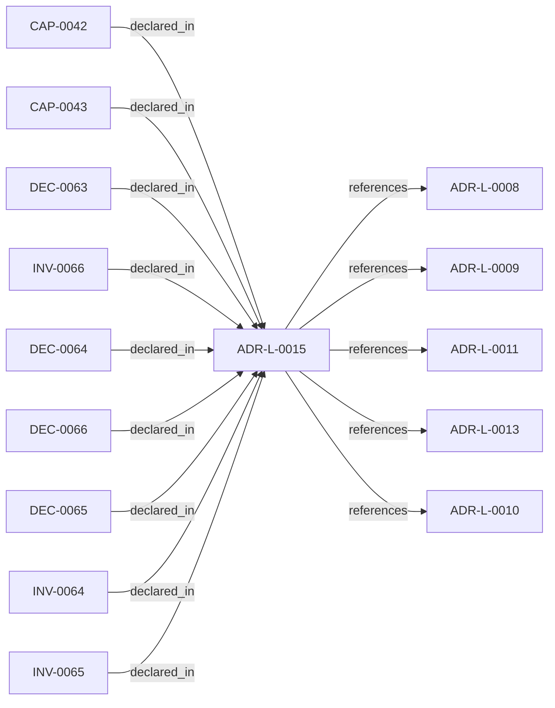

<!--
integrity_schema_version: 1
generated: deterministic_projection_v1
artifact_kind: rendered_adr_markdown
generator_id: adr-projection-markdown
generator_version: 2
hash_algorithm: sha256
source_hash: 0ffc1be8463cdd1d621bb28b35f2f81eff5dd5907f0a5fb1bed41bc47c3f17e9
rendered_hash: fcdced01b1eb807514d0a48af74a13e2f560275cab277554a745a81c04937280
-->

# ADR-L-0015: ADR Governance State and Override Semantics

**Status:** proposed  
**Created:** 2026-03-18  
**Authors:** adr-architecture-kit  
**Domains:** governance, validation, approval, overrides  
**Tags:** governance, override, steelman, approval  **Alias name:** adr-governance-state-and-override-semantics  
## Context

The repository now has a first-pass governance block on ADRs and a canonical
objection override artifact. That initial implementation made the metadata
available, but it left several important questions under-specified:

1. whether implementation authority is boolean or tiered
2. how approval metadata is paired and interpreted
3. how overrides relate to ADR meaning versus implementation allowance
4. how override validity is coupled to later ADR revision
5. how projections may expose governance state without inventing meaning

Those questions materially affect acceptance gating, implementation behavior,
and deterministic validation. They need a single canonical decision so schema,
validator, and projection behavior stay aligned.

## Relationship graph

## Related ADRs

### ADR-L-0008 — Validation Modes for Draft and Complete ADRs

**Relationships:**
- this ADR -[:references]-> 019fee89-e616-7066-8d2f-3acc7f469f72

**Context:** The ADR Architecture Kit currently couples schema validation to completeness for
several ADR types. That behavior is useful for acceptance gates, but it is too
strict for the actual design workflow used in this workspace.

[Open projection](ADR-L-0008-validation-modes-for-draft-and-complete-adrs.md)
### ADR-L-0009 — Derived Architecture Discovery Surfaces

**Relationships:**
- this ADR -[:references]-> 019fee89-e616-770c-a025-2c241a720730

**Context:** adr-architecture-kit is primarily machine-facing tooling used by agents to
reason over canonical architecture artifacts. Relying on agents to scan raw
ADR bodies for discovery is inconsistent with the toolkit's AI-first design
theory: discovery surfaces should be explicit, deterministic, cheap to query,
and derived from canonical authority.

[Open projection](ADR-L-0009-derived-architecture-discovery-surfaces.md)
### ADR-L-0010 — Kernel Interface Contract and Validation Profiles

**Relationships:**
- this ADR -[:references]-> 019fee89-e616-7d61-8e35-f11ba2ddd75d

**Context:** adr-architecture-kit is transitioning from an implicit generator toolkit into
an explicit architecture compiler with a defined contract boundary to the STE
kernel. The plan work established that the compiler's guaranteed contract
surface is broader than the kernel's minimal load subset: the contract family
is all generated artifacts under `adrs/index/` plus `manifest.yaml`, while
individual consumers may rely on narrower subsets.

[Open projection](ADR-L-0010-kernel-interface-contract-and-validation-profiles.md)
### ADR-L-0011 — Metadata Schemas and Remediation Ledger Enforcement

**Relationships:**
- this ADR -[:references]-> 019fee89-e616-7b97-971d-ae165d13bf9c

**Context:** The compiler contract now distinguishes fully compliant bundles from
sentinel-backed brownfield and migration bundles. That boundary is only safe
if sentinel use is narrow, explicitly tracked, and moved toward approved
canonical content through a monotonic workflow.

[Open projection](ADR-L-0011-metadata-schemas-and-remediation-ledger-enforcement.md)
### ADR-L-0013 — Architecture Repository Boundary and Normalized Semantic Model

**Relationships:**
- this ADR -[:references]-> 019fee89-e616-7c4e-953c-b7349412a784

**Context:** adr-architecture-kit now has an explicit compiler pipeline, a compiler IR
(`ArchModel`), compiled registry bundles, and an additive architecture graph.
Those pieces are sufficient to produce deterministic machine-facing artifacts,
and ArchitectureRepository already defines the semantic in-process boundary.
Phase 1 adds a narrow supported authoring facade that reuses that seam without
expanding the normalized model or exposing compiler internals.

[Open projection](ADR-L-0013-architecture-repository-boundary-and-normalized-semantic-model.md)

## Capabilities

### CAP-0042: Deterministic ADR Governance Validation

Validate ADR governance metadata, approval pairings, implementation
authority, override references, and stale revision coupling through
deterministic rules.

### CAP-0043: Governance Summary Projection

Expose ADR governance references and override summaries in manifest and
discovery surfaces without leaking rationale or accepted risk text.

## Invariants

### INV-0064

**Statement:** Absence of ADR governance approval fields MUST NOT be interpreted as
approval or implementation authority.
  
**Scope:** global  
**Enforcement:** must (policy)  
**Verification:** automated

**Rationale:**
Governance state must be explicit, not inferred by omission.

### INV-0065

**Statement:** Objection override artifacts MUST NOT change ADR architectural meaning and
MUST govern implementation allowance only.
  
**Scope:** global  
**Enforcement:** must (design)  
**Verification:** automated

**Rationale:**
Override records are exception control, not alternate architecture authority.

### INV-0066

**Statement:** Derived projections MUST expose only governance IDs and summary metadata and
MUST NOT invent approvals, risks, or authority-altering interpretations.
  
**Scope:** global  
**Enforcement:** must (policy)  
**Verification:** automated

**Rationale:**
Lookup surfaces must remain projections over canonical governance state.

## Decisions

### DEC-0063: Define ADR governance as a canonical nested metadata block with explicit implementation-authority levels

**Rationale:**
Governance state is part of canonical ADR meaning, but it is not the same
thing as ADR lifecycle or architecture intent. A nested governance block
keeps approval and implementation gating explicit without turning derived
projections into authority.

**Consequences:**

**Positive:**
- Approval and implementation status become machine-detectable
- Authority stays on the ADR rather than migrating into indexes
- Future governance fields can be extended without overloading lifecycle status

### DEC-0064: Record implementation exceptions in separate objection override artifacts

**Rationale:**
Override rationale, risk, and exception posture should remain canonical, but
they should not bloat ADR text or rewrite architecture intent. Separate
override artifacts keep exception handling explicit and auditable.

**Consequences:**

**Positive:**
- ADR meaning remains stable while implementation exceptions are recorded separately
- Override approval and accepted risk are queryable
- ADRs can reference overrides by ID without carrying inline exception prose

### DEC-0065: Bind override review validity to ADR modified_date and warn on stale coupling

**Rationale:**
Overrides should not silently continue applying after the ADR they depend on
has materially changed. Using ADR modified_date provides a minimal canonical
coupling point that works with the current schema line.

**Consequences:**

**Positive:**
- Validators can detect likely stale exceptions deterministically
- The MVP avoids inventing a new ADR revision field prematurely
- Governance review remains visible when ADR meaning evolves

### DEC-0066: Allow projections to expose governance references and summary metadata only

**Rationale:**
Projections need to support lookup and orchestration, but they must not
synthesize approvals, risks, or override semantics beyond what the canonical
artifacts explicitly say.

**Consequences:**

**Positive:**
- Manifests and indexes stay useful for tooling
- Projections do not become alternate governance authority
- Validation can compare projection output directly to canonical sources

---

*Generated from ADR-L-0015 by ADR Architecture Kit*