<!--
integrity_schema_version: 1
generated: deterministic_projection_v1
artifact_kind: rendered_adr_markdown
generator_id: adr-projection-markdown
generator_version: 3
hash_algorithm: sha256
source_hash: 01224fd8d0a31836664113c88b79cc818a4a3785a8dea00d2a271f505ded8322
rendered_hash: 940fc7b917e1302a0af94560fd78b74641431e53708fb3d3118f56253521e633
-->

# ADR-L-0015: ADR Governance State and Override Semantics

## Identity / Status

**Type:** logical  
**Status:** accepted  
**Alias:** ADR-L-0015  
**Alias name:** adr-governance-state-and-override-semantics  
**Created:** 2026-03-18  
**Authors:** adr-architecture-kit  
**Domains:** governance, validation, approval, overrides  

## Architecture Position

Logical architecture authority for this subject. Neighborhood paths use structural bridges plus exactly one semantic architecture edge; they never invent ADR-to-ADR verbs.

## Architecture Neighborhood

### Semantic architecture inventory

- None

## Neighbor Relationships

No grammatical peer neighborhood for this subject.

### Lifecycle / association

- ADR-L-0015 -[:references]-> ADR-L-0008
- ADR-L-0015 -[:references]-> ADR-L-0009
- ADR-L-0015 -[:references]-> ADR-L-0011
- ADR-L-0015 -[:references]-> ADR-L-0013
- ADR-L-0015 -[:references]-> ADR-L-0010

## Context

The repository now has a first-pass governance block on ADRs and a canonical
objection override artifact. That initial implementation made the metadata
available, but it left several important questions under-specified:

1. whether implementation authority is boolean or tiered
2. how approval metadata is paired and interpreted
3. how overrides relate to ADR meaning versus implementation allowance
4. how override validity is coupled to later ADR revision
5. how projections may expose governance state without inventing meaning

Those questions materially affect acceptance gating, implementation behavior,
and deterministic validation. They need a single canonical decision so schema,
validator, and projection behavior stay aligned.

## Internal Structure

```mermaid
flowchart TB
  n_019fee89_e617_7e69_861a_f3040f70c2d9["ADR-L-0015<br/>ADR Governance State and Override Semantics"]
  subgraph sg_capability["capability"]
    n_019fee89_e616_7ee9_9b0f_2da3ee16636b["CAP-0042<br/>Deterministic ADR Governance Validation"]
    n_019fee89_e616_7f80_903e_36b6d56f86fe["CAP-0043<br/>Governance Summary Projection"]
  end
  subgraph sg_decision["decision"]
    n_019fee89_e616_7fa2_a13f_a0bab2411ff7["DEC-0063<br/>Define ADR governance as a canonical nested metadata block with explicit implementation-authority levels"]
    n_019fee89_e617_77cf_a43e_5f0912b04a8a["DEC-0064<br/>Record implementation exceptions in separate objection override artifacts"]
    n_019fee89_e617_7dbb_b23f_872b9ffc75d8["DEC-0065<br/>Bind override review validity to ADR modified_date and warn on stale coupling"]
    n_019fee89_e617_7aae_ac34_86b62c25289b["DEC-0066<br/>Allow projections to expose governance references and summary metadata only"]
  end
  subgraph sg_invariant["invariant"]
    n_019fee89_e617_7ec8_b235_dda998054d7c["INV-0064"]
    n_019fee89_e617_7f99_930b_dee9dcfa8a1f["INV-0065"]
    n_019fee89_e617_7761_9a2a_5f1cd94d2de5["INV-0066"]
  end
  n_019fee89_e616_7ee9_9b0f_2da3ee16636b -->|"declared_in"| n_019fee89_e617_7e69_861a_f3040f70c2d9
  n_019fee89_e616_7f80_903e_36b6d56f86fe -->|"declared_in"| n_019fee89_e617_7e69_861a_f3040f70c2d9
  n_019fee89_e616_7fa2_a13f_a0bab2411ff7 -->|"declared_in"| n_019fee89_e617_7e69_861a_f3040f70c2d9
  n_019fee89_e617_7761_9a2a_5f1cd94d2de5 -->|"declared_in"| n_019fee89_e617_7e69_861a_f3040f70c2d9
  n_019fee89_e617_77cf_a43e_5f0912b04a8a -->|"declared_in"| n_019fee89_e617_7e69_861a_f3040f70c2d9
  n_019fee89_e617_7aae_ac34_86b62c25289b -->|"declared_in"| n_019fee89_e617_7e69_861a_f3040f70c2d9
  n_019fee89_e617_7dbb_b23f_872b9ffc75d8 -->|"declared_in"| n_019fee89_e617_7e69_861a_f3040f70c2d9
  n_019fee89_e617_7ec8_b235_dda998054d7c -->|"declared_in"| n_019fee89_e617_7e69_861a_f3040f70c2d9
  n_019fee89_e617_7f99_930b_dee9dcfa8a1f -->|"declared_in"| n_019fee89_e617_7e69_861a_f3040f70c2d9
```

- `capability` CAP-0042 — Deterministic ADR Governance Validation
- `capability` CAP-0043 — Governance Summary Projection
- `decision` DEC-0063 — Define ADR governance as a canonical nested metadata block with explicit implementation-authority levels
- `decision` DEC-0064 — Record implementation exceptions in separate objection override artifacts
- `decision` DEC-0065 — Bind override review validity to ADR modified_date and warn on stale coupling
- `decision` DEC-0066 — Allow projections to expose governance references and summary metadata only
- `invariant` INV-0064 — INV-0064
- `invariant` INV-0065 — INV-0065
- `invariant` INV-0066 — INV-0066

## Capabilities

### CAP-0042: Deterministic ADR Governance Validation

Validate ADR governance metadata, approval pairings, implementation
authority, override references, and stale revision coupling through
deterministic rules.

### CAP-0043: Governance Summary Projection

Expose ADR governance references and override summaries in manifest and
discovery surfaces without leaking rationale or accepted risk text.

## Decisions

### DEC-0063: Define ADR governance as a canonical nested metadata block with explicit implementation-authority levels

**Rationale:**
Governance state is part of canonical ADR meaning, but it is not the same
thing as ADR lifecycle or architecture intent. A nested governance block
keeps approval and implementation gating explicit without turning derived
projections into authority.

### DEC-0064: Record implementation exceptions in separate objection override artifacts

**Rationale:**
Override rationale, risk, and exception posture should remain canonical, but
they should not bloat ADR text or rewrite architecture intent. Separate
override artifacts keep exception handling explicit and auditable.

### DEC-0065: Bind override review validity to ADR modified_date and warn on stale coupling

**Rationale:**
Overrides should not silently continue applying after the ADR they depend on
has materially changed. Using ADR modified_date provides a minimal canonical
coupling point that works with the current schema line.

### DEC-0066: Allow projections to expose governance references and summary metadata only

**Rationale:**
Projections need to support lookup and orchestration, but they must not
synthesize approvals, risks, or override semantics beyond what the canonical
artifacts explicitly say.

## Invariants

### INV-0064

**Statement:** Absence of ADR governance approval fields MUST NOT be interpreted as
approval or implementation authority.
  
**Scope:** global  
**Enforcement:** must (policy)

**Rationale:**
Governance state must be explicit, not inferred by omission.

### INV-0065

**Statement:** Objection override artifacts MUST NOT change ADR architectural meaning and
MUST govern implementation allowance only.
  
**Scope:** global  
**Enforcement:** must (design)

**Rationale:**
Override records are exception control, not alternate architecture authority.

### INV-0066

**Statement:** Derived projections MUST expose only governance IDs and summary metadata and
MUST NOT invent approvals, risks, or authority-altering interpretations.
  
**Scope:** global  
**Enforcement:** must (policy)

**Rationale:**
Lookup surfaces must remain projections over canonical governance state.

---

*Generated from ADR-L-0015 by ADR Architecture Kit (projection v3)*