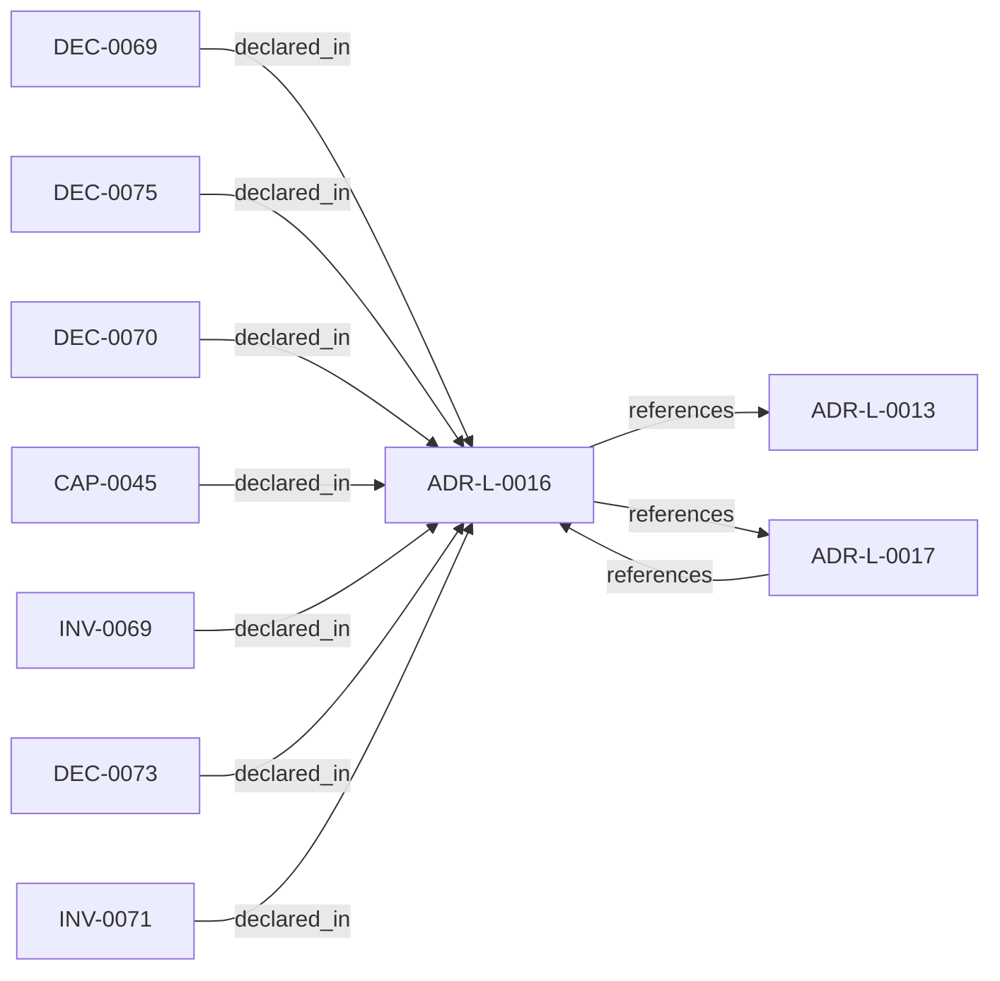

<!--
integrity_schema_version: 1
generated: deterministic_projection_v1
artifact_kind: rendered_adr_markdown
generator_id: adr-projection-markdown
generator_version: 2
hash_algorithm: sha256
source_hash: e5a68100a0cd0b17d501baf978fccc98c287ee7e1bcb4d1d0905df941e05efe4
rendered_hash: f49c0951c8037b1110d2220ebc4c3dfab8760f59398f8bbd2eaa47a2125e3c19
-->

# ADR-L-0016: Deterministic Corpus Query and Authoring Orientation APIs

**Status:** accepted  
**Created:** 2026-04-14  
**Authors:** adr-architecture-kit  
**Domains:** repository, discovery, authoring  
**Tags:** repository-api, corpus-query, authoring-orientation  
**Alias name:** deterministic-corpus-query-and-authoring-orientation-apis  

## Context

Upstream authoring workflows need deterministic ways to inspect the compiled
corpus, orient themselves within a scope, and allocate governed human-facing
ADR aliases without reparsing registry YAML or hand-implementing directory
scans.

ArchitectureRepository already exposes typed entity and relationship access,
but forward authoring also needs a compact orientation summary,
first-class manifest/index accessors, explicit UUID and alias resolution, and
a supported helper for monotonic ADR alias allocation.

Under v1.3, those allocation helpers govern `alias_id` recognition surfaces;
they do not allocate or replace canonical UUID machine identity.

## Relationship graph

## Related ADRs

### ADR-L-0013 — Architecture Repository Boundary and Normalized Semantic Model

**Relationships:**
- this ADR -[:references]-> 019fee89-e616-7c4e-953c-b7349412a784

**Context:** adr-architecture-kit now has an explicit compiler pipeline, a compiler IR
(`ArchModel`), compiled registry bundles, and an additive architecture graph.
Those pieces are sufficient to produce deterministic machine-facing artifacts,
and ArchitectureRepository already defines the semantic in-process boundary.
Phase 1 adds a narrow supported authoring facade that reuses that seam without
expanding the normalized model or exposing compiler internals.

[Open projection](ADR-L-0013-architecture-repository-boundary-and-normalized-semantic-model.md)
### ADR-L-0017 — Forward Authoring Ergonomics for Split Physical ADR Types

**Relationships:**
- 019fee89-e617-7ff5-863b-1eef71637b0f -[:references]-> this ADR
- this ADR -[:references]-> 019fee89-e617-7ff5-863b-1eef71637b0f

**Context:** adr-architecture-kit now supports multiple physical ADR shapes:
legacy `ADR-P-*`, current `ADR-PS-*`, and current `ADR-PC-*`. Upstream
authoring workflows need structured scaffolds, schema discovery, and next-ID
allocation that reinforce the current split physical taxonomy without breaking
existing legacy parsing and validation.

[Open projection](ADR-L-0017-forward-authoring-ergonomics-for-split-physical-adr-types.md)

## Capabilities

### CAP-0045: Deterministic Corpus Orientation Surface

Provide one supported API and CLI surface for manifest/index/summary access, UUID and alias lookup/resolve paths, alias inventory, and scope-local governed alias_id allocation.

## Invariants

### INV-0069

**Statement:** Forward-authoring governed alias_id allocation MUST be monotonic and non-reusable. Previously allocated aliases and historical gaps remain consumed history and MUST NOT be reissued or used to replace UUID identity.
  
**Scope:** global  
**Enforcement:** must (design)  
**Verification:** automated

**Rationale:**
Reusing ADR identities corrupts provenance, historical references, and
deterministic traceability.

### INV-0071

**Statement:** Reserved ADR alias IDs `9000-9999` MUST NOT participate in standard forward alias allocation and MUST NOT be treated as UUID machine-identity allocation.
  
**Scope:** global  
**Enforcement:** must (design)  
**Verification:** automated

**Rationale:**
Exceptional identities need a governed range that does not distort the
normal forward allocation sequence.

## Decisions

### DEC-0069: Extend ArchitectureRepository with deterministic orientation helpers for UUID, alias_id, alias_ref, and URI lookup

**Rationale:**
Repository consumers use one in-process boundary for manifest/index/summary access, entity-reference lookup whose canonical result is UUID, explicit UUID/alias_id/alias_ref/URI resolve paths, alias inventory, and governed alias_id allocation for forward authoring.

**Consequences:**

**Positive:**
- Upstream tools stop duplicating manifest and index loading logic
- Corpus orientation becomes one stable typed API instead of ad hoc YAML reads
- Alias-ID allocation stays scope-aware, deterministic, and monotonic

### DEC-0070: Expose corpus summary and relationships through supported CLI commands

**Rationale:**
Human and script consumers need stable CLI ergonomics that mirror the
repository boundary without treating raw registry files as the user-facing
interface.

**Consequences:**

**Positive:**
- `adr entities summary` provides one deterministic orientation surface
- `adr entities relationships` exposes graph-level inspection without custom parsing
- CLI and Python APIs stay aligned around the same repository boundary

### DEC-0073: Make forward-authoring type-prefixed ADR alias_id allocation monotonic and non-reusable

**Rationale:**
Forward type-prefixed ADR IDs are governed alias_id allocation handles for human recognition, not canonical machine identity. UUID remains canonical entity identity. Alias allocation stays monotonic and non-reusable and must never replace UUIDs or rewrite UUID references.

**Consequences:**

**Positive:**
- Historical traceability is preserved
- Allocation remains deterministic without gap filling
- Deleted artifacts cannot silently reactivate old identities

### DEC-0075: Exclude reserved ADR alias IDs 9000-9999 from standard forward alias allocation

**Rationale:**
The reserved 9000-9999 range preserves governed alias allocation history for exceptional records. It is not a UUID identity range and must not be treated as canonical machine-identity allocation.

**Consequences:**

**Positive:**
- Standard allocation remains predictable below 9000
- Brownfield or imported records have a governed preserved-identity range
- Reserved-range artifacts do not pollute the normal forward sequence

---

*Generated from ADR-L-0016 by ADR Architecture Kit*