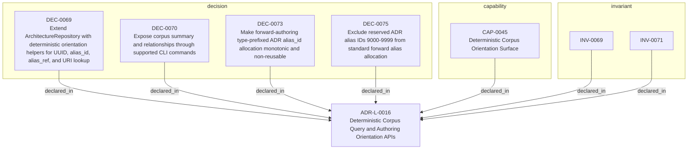

<!--
integrity_schema_version: 1
generated: deterministic_projection_v1
artifact_kind: rendered_adr_markdown
generator_id: adr-projection-markdown
generator_version: 3
hash_algorithm: sha256
source_hash: bef8f9984e020df6bb0f37f5375142fac3aaa63d8aa1c4689cdc61ccacc1872e
rendered_hash: 4bdb577225c10b34841ecb770d661d1297b9747bd6a4c286418e612b2bdf9f91
-->

# ADR-L-0016: Deterministic Corpus Query and Authoring Orientation APIs

## Identity / Status

**Type:** logical  
**Status:** accepted  
**Alias:** ADR-L-0016  
**Alias name:** deterministic-corpus-query-and-authoring-orientation-apis  
**Created:** 2026-04-14  
**Authors:** adr-architecture-kit  
**Domains:** repository, discovery, authoring  

## Architecture Position

Logical architecture authority for this subject. Neighborhood paths use structural bridges plus exactly one semantic architecture edge; they never invent ADR-to-ADR verbs.

## Architecture Neighborhood

### Semantic architecture inventory

- None

## Neighbor Relationships

No grammatical peer neighborhood for this subject.

### Lifecycle / association

- ADR-L-0016 -[:references]-> ADR-L-0013
- ADR-L-0016 -[:references]-> ADR-L-0017
- ADR-L-0017 -[:references]-> ADR-L-0016

## Context

Upstream authoring workflows need deterministic ways to inspect the compiled
corpus, orient themselves within a scope, and allocate governed human-facing
ADR aliases without reparsing registry YAML or hand-implementing directory
scans.

ArchitectureRepository already exposes typed entity and relationship access,
but forward authoring also needs a compact orientation summary,
first-class manifest/index accessors, explicit UUID and alias resolution, and
a supported helper for monotonic ADR alias allocation.

Under v1.3, those allocation helpers govern `alias_id` recognition surfaces;
they do not allocate or replace canonical UUID machine identity.

## Internal Structure

- `capability` CAP-0045 — Deterministic Corpus Orientation Surface
- `decision` DEC-0069 — Extend ArchitectureRepository with deterministic orientation helpers for UUID, alias_id, alias_ref, and URI lookup
- `decision` DEC-0070 — Expose corpus summary and relationships through supported CLI commands
- `decision` DEC-0073 — Make forward-authoring type-prefixed ADR alias_id allocation monotonic and non-reusable
- `decision` DEC-0075 — Exclude reserved ADR alias IDs 9000-9999 from standard forward alias allocation
- `invariant` INV-0069 — INV-0069
- `invariant` INV-0071 — INV-0071

## Capabilities

### CAP-0045: Deterministic Corpus Orientation Surface

Provide one supported API and CLI surface for manifest/index/summary access, UUID and alias lookup/resolve paths, alias inventory, and scope-local governed alias_id allocation.

## Decisions

### DEC-0069: Extend ArchitectureRepository with deterministic orientation helpers for UUID, alias_id, alias_ref, and URI lookup

**Rationale:**
Repository consumers use one in-process boundary for manifest/index/summary access, entity-reference lookup whose canonical result is UUID, explicit UUID/alias_id/alias_ref/URI resolve paths, alias inventory, and governed alias_id allocation for forward authoring.

### DEC-0070: Expose corpus summary and relationships through supported CLI commands

**Rationale:**
Human and script consumers need stable CLI ergonomics that mirror the
repository boundary without treating raw registry files as the user-facing
interface.

### DEC-0073: Make forward-authoring type-prefixed ADR alias_id allocation monotonic and non-reusable

**Rationale:**
Forward type-prefixed ADR IDs are governed alias_id allocation handles for human recognition, not canonical machine identity. UUID remains canonical entity identity. Alias allocation stays monotonic and non-reusable and must never replace UUIDs or rewrite UUID references.

### DEC-0075: Exclude reserved ADR alias IDs 9000-9999 from standard forward alias allocation

**Rationale:**
The reserved 9000-9999 range preserves governed alias allocation history for exceptional records. It is not a UUID identity range and must not be treated as canonical machine-identity allocation.

## Invariants

### INV-0069

**Statement:** Forward-authoring governed alias_id allocation MUST be monotonic and non-reusable. Previously allocated aliases and historical gaps remain consumed history and MUST NOT be reissued or used to replace UUID identity.
  
**Scope:** global  
**Enforcement:** must (design)

**Rationale:**
Reusing ADR identities corrupts provenance, historical references, and
deterministic traceability.

### INV-0071

**Statement:** Reserved ADR alias IDs `9000-9999` MUST NOT participate in standard forward alias allocation and MUST NOT be treated as UUID machine-identity allocation.
  
**Scope:** global  
**Enforcement:** must (design)

**Rationale:**
Exceptional identities need a governed range that does not distort the
normal forward allocation sequence.

---

*Generated from ADR-L-0016 by ADR Architecture Kit (projection v3)*