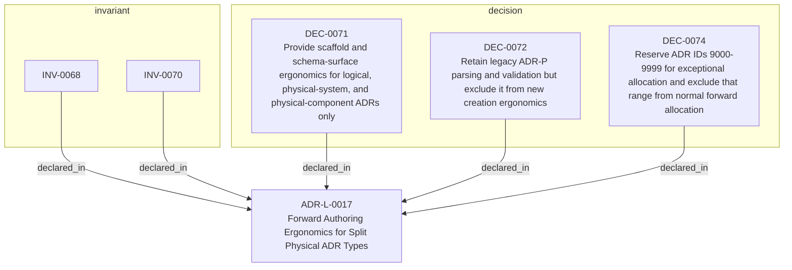

<!--
integrity_schema_version: 1
generated: deterministic_projection_v1
artifact_kind: rendered_adr_markdown
generator_id: adr-projection-markdown
generator_version: 3
hash_algorithm: sha256
source_hash: e923a5390753c872f54e93f3388f0c5a9b339c80144a3f8db7d073fe688747c6
rendered_hash: b33f45dcb6dae3f05af6c9523c075866fffbbf6789b073aba9e0de07783f90b4
-->

# ADR-L-0017: Forward Authoring Ergonomics for Split Physical ADR Types

## Identity / Status

**Type:** logical  
**Status:** accepted  
**Alias:** ADR-L-0017  
**Alias name:** forward-authoring-ergonomics-for-split-physical-adr-types  
**Created:** 2026-04-14  
**Authors:** adr-architecture-kit  
**Domains:** authoring, adr-taxonomy  

## Architecture Position

Logical architecture authority for this subject. Neighborhood paths use structural bridges plus exactly one semantic architecture edge; they never invent ADR-to-ADR verbs.

## Architecture Neighborhood

### Semantic architecture inventory

- None

## Neighbor Relationships

No grammatical peer neighborhood for this subject.

### Lifecycle / association

- ADR-L-0018 -[:references]-> ADR-L-0017
- ADR-L-0016 -[:references]-> ADR-L-0017
- ADR-L-0017 -[:references]-> ADR-L-0002
- ADR-L-0017 -[:references]-> ADR-L-0016

## Context

adr-architecture-kit now supports multiple physical ADR shapes:
legacy `ADR-P-*`, current `ADR-PS-*`, and current `ADR-PC-*`. Upstream
authoring workflows need structured scaffolds, schema discovery, and next-ID
allocation that reinforce the current split physical taxonomy without breaking
existing legacy parsing and validation.

If new ergonomics continue treating legacy `ADR-P-*` as a first-class
creation path, upstream tools will keep steering new authoring toward an
outdated taxonomy even while the repository supports more precise
physical-system and physical-component artifacts.

## Internal Structure

- `decision` DEC-0071 — Provide scaffold and schema-surface ergonomics for logical, physical-system, and physical-component ADRs only
- `decision` DEC-0072 — Retain legacy ADR-P parsing and validation but exclude it from new creation ergonomics
- `decision` DEC-0074 — Reserve ADR IDs 9000-9999 for exceptional allocation and exclude that range from normal forward allocation
- `invariant` INV-0068 — INV-0068
- `invariant` INV-0070 — INV-0070

## Decisions

### DEC-0071: Provide scaffold and schema-surface ergonomics for logical, physical-system, and physical-component ADRs only

**Rationale:**
New authoring ergonomics should reinforce the forward taxonomy and expose
deterministic structured inputs for the ADR types the repository wants new
work to use.

### DEC-0072: Retain legacy ADR-P parsing and validation but exclude it from new creation ergonomics

**Rationale:**
Existing repositories and tests still contain `ADR-P-*` artifacts, so
backward compatibility remains necessary. That compatibility does not
require adding new forward-authoring affordances for the legacy type.

### DEC-0074: Reserve ADR IDs 9000-9999 for exceptional allocation and exclude that range from normal forward allocation

**Rationale:**
The high ADR ID range is needed for exceptional cases such as brownfield
imports, retained legacy artifacts pending migration, and other imported
records whose identity must be preserved. Normal authoring allocation
should stay below 9000 so it does not drift into that exceptional space.

## Invariants

### INV-0068

**Statement:** Forward authoring ergonomics in adr-architecture-kit MUST target logical,
physical-system, and physical-component ADRs, while legacy `ADR-P-*`
support remains compatibility-only.
  
**Scope:** global  
**Enforcement:** must (design)

**Rationale:**
The ergonomic surface must preserve the intended ADR taxonomy instead of
accidentally reopening the legacy flat physical path for new authoring.

### INV-0070

**Statement:** ADR IDs `9000-9999` MUST be treated as a reserved exceptional allocation
range for cases such as brownfield imports, retained legacy artifacts
pending migration, and other imported records requiring preserved
identity. Standard forward authoring allocation MUST exclude that range.
  
**Scope:** global  
**Enforcement:** must (design)

**Rationale:**
The allocator must remain aware of the reserved namespace so normal
authoring does not collide with imported or exceptional identities.

---

*Generated from ADR-L-0017 by ADR Architecture Kit (projection v3)*