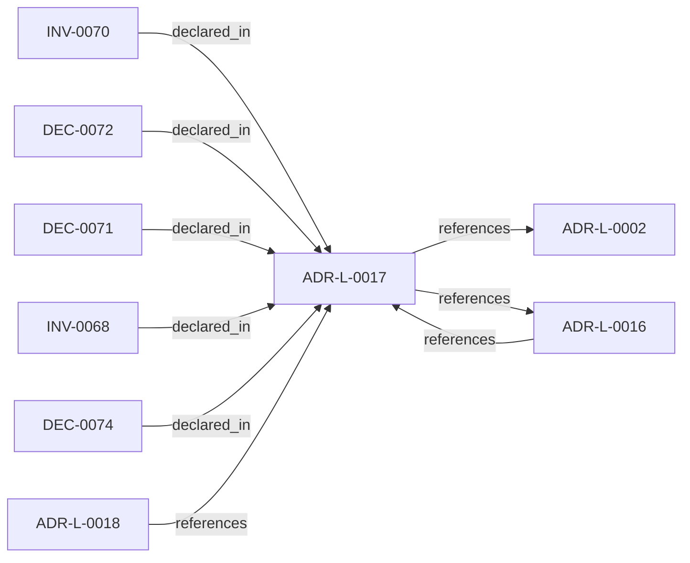

<!--
integrity_schema_version: 1
generated: deterministic_projection_v1
artifact_kind: rendered_adr_markdown
generator_id: adr-projection-markdown
generator_version: 2
hash_algorithm: sha256
source_hash: 765096ba7950df772833dc86718da7079600f5bfc295d6a75a1d22a1fc93bfb3
rendered_hash: 62fa43c1d265aa3a71724816e2b4b23dfcca4bdeddaa4707e88e5c4bc20d6c0d
-->

# ADR-L-0017: Forward Authoring Ergonomics for Split Physical ADR Types

**Status:** accepted  
**Created:** 2026-04-14  
**Authors:** adr-architecture-kit  
**Domains:** authoring, adr-taxonomy  
**Tags:** scaffolding, next-id, physical-types  
**Alias name:** forward-authoring-ergonomics-for-split-physical-adr-types  

## Context

adr-architecture-kit now supports multiple physical ADR shapes:
legacy `ADR-P-*`, current `ADR-PS-*`, and current `ADR-PC-*`. Upstream
authoring workflows need structured scaffolds, schema discovery, and next-ID
allocation that reinforce the current split physical taxonomy without breaking
existing legacy parsing and validation.

If new ergonomics continue treating legacy `ADR-P-*` as a first-class
creation path, upstream tools will keep steering new authoring toward an
outdated taxonomy even while the repository supports more precise
physical-system and physical-component artifacts.

## Relationship graph

## Related ADRs

### ADR-L-0002 — Multi-Scope ADR Architecture for Sub-Module Development

**Relationships:**
- this ADR -[:references]-> 019fee89-e615-7f19-810b-c7b33a9d9e0d

**Context:** The adr-architecture-kit is being actively developed in a single workspace alongside
multiple sub-modules (ste-runtime, future services) that will eventually become
independent services. Each sub-module needs to leverage the ADR system for its own
architectural documentation while being developed in parallel within the monorepo.

[Open projection](ADR-L-0002-multi-scope-adr-architecture-for-sub-module-development.md)
### ADR-L-0016 — Deterministic Corpus Query and Authoring Orientation APIs

**Relationships:**
- 019fee89-e617-7fe1-8d2c-cc2745c31674 -[:references]-> this ADR
- this ADR -[:references]-> 019fee89-e617-7fe1-8d2c-cc2745c31674

**Context:** Upstream authoring workflows need deterministic ways to inspect the compiled
corpus, orient themselves within a scope, and allocate governed human-facing
ADR aliases without reparsing registry YAML or hand-implementing directory
scans.

[Open projection](ADR-L-0016-deterministic-corpus-query-and-authoring-orientation-apis.md)
### ADR-L-0018 — Schema v1.2 and Normalized Semantic Foundation

**Relationships:**
- 019fee89-e617-7f4d-811d-4862645a55c5 -[:references]-> this ADR

**Context:** Phase 1 established a narrow supported authoring SDK while explicitly deferring
schema expansion, normalized-model expansion, assertion identity, bindings, and
topology identity. The repository now needs those contracts as an additive
semantic foundation for future consumers, without implementing the Phase 3 graph
bundle or absorbing authority owned by runtime, rules, substrate, or admission
systems.

[Open projection](ADR-L-0018-schema-v1-2-and-normalized-semantic-foundation.md)

## Invariants

### INV-0068

**Statement:** Forward authoring ergonomics in adr-architecture-kit MUST target logical,
physical-system, and physical-component ADRs, while legacy `ADR-P-*`
support remains compatibility-only.
  
**Scope:** global  
**Enforcement:** must (design)  
**Verification:** automated

**Rationale:**
The ergonomic surface must preserve the intended ADR taxonomy instead of
accidentally reopening the legacy flat physical path for new authoring.

### INV-0070

**Statement:** ADR IDs `9000-9999` MUST be treated as a reserved exceptional allocation
range for cases such as brownfield imports, retained legacy artifacts
pending migration, and other imported records requiring preserved
identity. Standard forward authoring allocation MUST exclude that range.
  
**Scope:** global  
**Enforcement:** must (design)  
**Verification:** automated

**Rationale:**
The allocator must remain aware of the reserved namespace so normal
authoring does not collide with imported or exceptional identities.

## Decisions

### DEC-0071: Provide scaffold and schema-surface ergonomics for logical, physical-system, and physical-component ADRs only

**Rationale:**
New authoring ergonomics should reinforce the forward taxonomy and expose
deterministic structured inputs for the ADR types the repository wants new
work to use.

**Consequences:**

**Positive:**
- New workflows are nudged toward `ADR-L-*`, `ADR-PS-*`, and `ADR-PC-*`
- Scaffold and schema discovery stay aligned with the current generator surface

### DEC-0072: Retain legacy ADR-P parsing and validation but exclude it from new creation ergonomics

**Rationale:**
Existing repositories and tests still contain `ADR-P-*` artifacts, so
backward compatibility remains necessary. That compatibility does not
require adding new forward-authoring affordances for the legacy type.

**Consequences:**

**Positive:**
- Existing legacy artifacts remain readable and validatable
- New ergonomic surfaces do not regress the taxonomy split

### DEC-0074: Reserve ADR IDs 9000-9999 for exceptional allocation and exclude that range from normal forward allocation

**Rationale:**
The high ADR ID range is needed for exceptional cases such as brownfield
imports, retained legacy artifacts pending migration, and other imported
records whose identity must be preserved. Normal authoring allocation
should stay below 9000 so it does not drift into that exceptional space.

**Consequences:**

**Positive:**
- Normal authoring remains in a predictable ID range below 9000
- The reserved high range stays available for exceptional/manual use
- Imported or retained legacy identities do not advance normal allocation counters

---

*Generated from ADR-L-0017 by ADR Architecture Kit*