<!--
integrity_schema_version: 1
generated: deterministic_projection_v1
artifact_kind: rendered_adr_markdown
generator_id: adr-projection-markdown
generator_version: 3
hash_algorithm: sha256
source_hash: 65a6f95d8971a2e99eb020e0ea1978bf74726bd93bea86c6f017ecf38689d102
rendered_hash: c7295b9f1801b986538639c6382b3dad594be287a32d935a1eb70dc4cb713546
-->

# ADR-L-0018: Schema v1.2 and Normalized Semantic Foundation

## Identity / Status

**Type:** logical  
**Status:** accepted  
**Alias:** ADR-L-0018  
**Alias name:** schema-v1-2-and-normalized-semantic-foundation  
**Created:** 2026-08-07  
**Modified:** 2026-08-07  
**Authors:** adr-architecture-kit  
**Domains:** authoring, schema, semantic-model, identity, migration  

## Architecture Position

Logical architecture authority for this subject. Neighborhood paths use structural bridges plus exactly one semantic architecture edge; they never invent ADR-to-ADR verbs.

## Architecture Neighborhood

### Semantic architecture inventory

- None

## Neighbor Relationships

No grammatical peer neighborhood for this subject.

### Lifecycle / association

- ADR-L-0012 -[:references]-> ADR-L-0018
- ADR-L-0013 -[:references]-> ADR-L-0018
- ADR-L-0018 -[:references]-> ADR-L-0001
- ADR-L-0018 -[:references]-> ADR-L-0003
- ADR-L-0018 -[:references]-> ADR-L-0012
- ADR-L-0018 -[:references]-> ADR-L-0009
- ADR-L-0018 -[:references]-> ADR-L-0013
- ADR-L-0018 -[:references]-> ADR-PC-0002
- ADR-L-0018 -[:references]-> ADR-L-0017
- ADR-L-0018 -[:references]-> ADR-PC-0004
- ADR-L-0018 -[:references]-> ADR-PC-0003
- ADR-L-0018 -[:references]-> ADR-PS-0002

## Context

Phase 1 established a narrow supported authoring SDK while explicitly deferring
schema expansion, normalized-model expansion, assertion identity, bindings, and
topology identity. The repository now needs those contracts as an additive
semantic foundation for future consumers, without implementing the Phase 3 graph
bundle or absorbing authority owned by runtime, rules, substrate, or admission
systems.

Schema v1.0 is the frozen stable ADR encoding. Schema v1.1 is an existing
provisional discovery, ledger, remediation, and attribution line and must not be
repurposed. The next ADR authoring line is therefore v1.2. Existing source models
already identify boundaries, contracts, interfaces, implementation decisions,
and name-keyed topology, but their normalized identity and migration behavior are
not yet authoritative.

That description captures the Phase-2 starting point. ADR-L-0019 subsequently
establishes canonical v1.3 UUID/alias identity and migration semantics. This
ADR preserves the v1.2/model-1.1 foundation and records how that foundation
transitions into the v1.3/model-2.0 compatibility event.

## Internal Structure

```mermaid
flowchart TB
  n_019fee89_e617_7f4d_811d_4862645a55c5["ADR-L-0018<br/>Schema v1.2 and Normalized Semantic Foundation"]
  subgraph sg_capability["capability"]
    n_019fee89_e617_710a_b91f_e749ebab9a95["CAP-0048<br/>Additive ADR Schema v1.2 Authoring"]
    n_019fee89_e617_7fcb_b717_247f38d13206["CAP-0049<br/>Expanded Normalized Semantic Model"]
    n_019fee89_e617_74cd_9331_2954d78dccf3["CAP-0050<br/>Bind-Only External Authority Contracts"]
    n_019fee89_e617_7ac8_803e_e3514c4e329a["CAP-0051<br/>Stable Physical Topology Identity Migration"]
    n_019fee89_e617_7bff_b43f_2fae0178d1be["CAP-0052<br/>Governed Alias Allocation and UUID Integrity"]
  end
  subgraph sg_decision["decision"]
    n_019fee89_e617_7736_a637_e6e472c4d4e6["DEC-0083<br/>Introduce provisional additive ADR authoring schema v1.2"]
    n_019fee89_e617_7c51_b52d_b348897b7c3d["DEC-0084<br/>Represent external bindings as architecture_namespace + UUID references with canonical fingerprint comparability"]
    n_019fee89_e617_7727_a81f_08c3a998a85c["DEC-0085<br/>Retain Phase-2 normalized model 1.1 promotion history and admit model 2.0 as the v1.3 compatibility event"]
    n_019fee89_e617_7bd0_9d3c_066089251acd["DEC-0086<br/>Add deterministic source-sensitive assertion identity without replacing relationship identity"]
    n_019fee89_e617_7f8c_813f_95975602bd7d["DEC-0087<br/>Add optional stable topology IDs and deterministic dry-run-first migration"]
    n_019fee89_e617_7a8f_823b_debcf147e747["DEC-0088<br/>Split UUID integrity corruption (fail closed) from governed alias collision repair"]
  end
  subgraph sg_invariant["invariant"]
    n_019fee89_e617_7aef_9f37_6e9c557332b3["INV-0077"]
    n_019fee89_e617_7127_b03e_cb2f18ab6f9f["INV-0078"]
    n_019fee89_e617_7285_b13f_2450ad706244["INV-0079"]
    n_019fee89_e617_7e19_b51f_c06c900905ec["INV-0080"]
    n_019fee89_e617_7692_822b_3df6136ce156["INV-0081"]
    n_019fee89_e617_7abf_8f16_a6ad1f38722c["INV-0082"]
  end
  n_019fee89_e617_710a_b91f_e749ebab9a95 -->|"declared_in"| n_019fee89_e617_7f4d_811d_4862645a55c5
  n_019fee89_e617_7127_b03e_cb2f18ab6f9f -->|"declared_in"| n_019fee89_e617_7f4d_811d_4862645a55c5
  n_019fee89_e617_7285_b13f_2450ad706244 -->|"declared_in"| n_019fee89_e617_7f4d_811d_4862645a55c5
  n_019fee89_e617_74cd_9331_2954d78dccf3 -->|"declared_in"| n_019fee89_e617_7f4d_811d_4862645a55c5
  n_019fee89_e617_7692_822b_3df6136ce156 -->|"declared_in"| n_019fee89_e617_7f4d_811d_4862645a55c5
  n_019fee89_e617_7727_a81f_08c3a998a85c -->|"declared_in"| n_019fee89_e617_7f4d_811d_4862645a55c5
  n_019fee89_e617_7736_a637_e6e472c4d4e6 -->|"declared_in"| n_019fee89_e617_7f4d_811d_4862645a55c5
  n_019fee89_e617_7a8f_823b_debcf147e747 -->|"declared_in"| n_019fee89_e617_7f4d_811d_4862645a55c5
  n_019fee89_e617_7abf_8f16_a6ad1f38722c -->|"declared_in"| n_019fee89_e617_7f4d_811d_4862645a55c5
  n_019fee89_e617_7ac8_803e_e3514c4e329a -->|"declared_in"| n_019fee89_e617_7f4d_811d_4862645a55c5
  n_019fee89_e617_7aef_9f37_6e9c557332b3 -->|"declared_in"| n_019fee89_e617_7f4d_811d_4862645a55c5
  n_019fee89_e617_7bd0_9d3c_066089251acd -->|"declared_in"| n_019fee89_e617_7f4d_811d_4862645a55c5
  n_019fee89_e617_7bff_b43f_2fae0178d1be -->|"declared_in"| n_019fee89_e617_7f4d_811d_4862645a55c5
  n_019fee89_e617_7c51_b52d_b348897b7c3d -->|"declared_in"| n_019fee89_e617_7f4d_811d_4862645a55c5
  n_019fee89_e617_7e19_b51f_c06c900905ec -->|"declared_in"| n_019fee89_e617_7f4d_811d_4862645a55c5
  n_019fee89_e617_7f8c_813f_95975602bd7d -->|"declared_in"| n_019fee89_e617_7f4d_811d_4862645a55c5
  n_019fee89_e617_7fcb_b717_247f38d13206 -->|"declared_in"| n_019fee89_e617_7f4d_811d_4862645a55c5
```

- `capability` CAP-0048 — Additive ADR Schema v1.2 Authoring
- `capability` CAP-0049 — Expanded Normalized Semantic Model
- `capability` CAP-0050 — Bind-Only External Authority Contracts
- `capability` CAP-0051 — Stable Physical Topology Identity Migration
- `capability` CAP-0052 — Governed Alias Allocation and UUID Integrity
- `decision` DEC-0083 — Introduce provisional additive ADR authoring schema v1.2
- `decision` DEC-0084 — Represent external bindings as architecture_namespace + UUID references with canonical fingerprint comparability
- `decision` DEC-0085 — Retain Phase-2 normalized model 1.1 promotion history and admit model 2.0 as the v1.3 compatibility event
- `decision` DEC-0086 — Add deterministic source-sensitive assertion identity without replacing relationship identity
- `decision` DEC-0087 — Add optional stable topology IDs and deterministic dry-run-first migration
- `decision` DEC-0088 — Split UUID integrity corruption (fail closed) from governed alias collision repair
- `invariant` INV-0077 — INV-0077
- `invariant` INV-0078 — INV-0078
- `invariant` INV-0079 — INV-0079
- `invariant` INV-0080 — INV-0080
- `invariant` INV-0081 — INV-0081
- `invariant` INV-0082 — INV-0082

## Capabilities

### CAP-0048: Additive ADR Schema v1.2 Authoring

Validate, parse, package, and compile provisional v1.2 ADR authoring while
preserving frozen v1.0 and the existing provisional v1.1 artifact family.

### CAP-0049: Expanded Normalized Semantic Model

Expose the Phase-2/pre-v1.3 expanded normalized model 1.1 contract and admit model 2.0 as the v1.3 UUID/alias compatibility event.

### CAP-0050: Bind-Only External Authority Contracts

Author deterministic substrate, rule, and evidence-expectation bindings without
ingesting external semantic bodies or observed evidence.

### CAP-0051: Stable Physical Topology Identity Migration

Add optional topology component IDs and migrate uniquely resolvable legacy names
to stable IDs with deterministic diagnostics and output.

### CAP-0052: Governed Alias Allocation and UUID Integrity

Detect UUID identity collisions and fail closed; limit automatic repair to governed alias allocation/history.

## Decisions

### DEC-0083: Introduce provisional additive ADR authoring schema v1.2

**Rationale:**
Schema v1.2 extends the existing ADR authoring shapes with external-reference,
binding, evidence-expectation, and topology-ID fields. Version dispatch must be
explicit. Schema v1.0 files remain byte-for-byte frozen and valid; v1.1 retains
its current provisional discovery and ledger role. Unsupported future versions
fail closed rather than falling back to v1.0.

### DEC-0084: Represent external bindings as architecture_namespace + UUID references with canonical fingerprint comparability

**Rationale:**
External v1.3 references use provider-authoritative architecture_namespace, UUID, kind, and sha256:<64 lowercase hexadecimal> fingerprint. The fingerprint is SHA-256 over the provider's complete schema-normalized canonical identity-bearing entity record serialized with RFC 8785 JCS. Local human aliases remain non-canonical recognition surfaces.

### DEC-0085: Retain Phase-2 normalized model 1.1 promotion history and admit model 2.0 as the v1.3 compatibility event

**Rationale:**
`boundary`, `contract`, `interface`, and `implementation_decision` are already
independently identified in canonical ADRs and are useful through repository
queries. They join the existing `adr`, `system`, `component`, `decision`,
`capability`, and `invariant` types. `constraint`, `nfr`, `gap`, and
`integration` remain embedded. Data flow is not promoted in Phase 2.

This materially expands the normalized model, so the model reports additive
schema version `1.1`. Existing query helpers keep their previous selection
semantics; new typed helpers are additive.

Model 1.1 remains the Phase-2/pre-v1.3 contract. V1.3 UUID identity advances normalized semantics to model 2.0 without erasing the Phase-2 promotion history.

### DEC-0086: Add deterministic source-sensitive assertion identity without replacing relationship identity

**Rationale:**
V1.3 relationship endpoints are UUIDs. relationship_id is recomputed from relationship type, source UUID, and target UUID. Content-derived assertion_id hashes those UUID endpoint values plus exactly one canonical source-owner UUID and source_pointer_or_empty. Validation and migration preflight fail closed on ambiguous ownership.

### DEC-0087: Add optional stable topology IDs and deterministic dry-run-first migration

**Rationale:**
V1.2 topology component IDs use the closed pattern
`TOPO-[A-Z0-9][A-Z0-9-]*`. Endpoints and data-flow paths may use IDs or legacy
names, but every reference must resolve exactly once. Migration preserves
existing IDs, allocates first-free sequential `TOPO-0001` identifiers in
canonical component-list order, rewrites uniquely resolvable names, retains
display names, and updates the document to schema v1.2. It is non-destructive
unless explicitly asked to write and is idempotent after a successful write.

### DEC-0088: Split UUID integrity corruption (fail closed) from governed alias collision repair

**Rationale:**
Distinct entities claiming one UUID fail closed as integrity corruption and are never auto-repaired. Distinct UUIDs contesting one local alias preserve an admitted incumbent or otherwise fail pending explicit reviewed alias allocation. Automatic repair is limited to governed alias allocation/history and never changes UUIDs or UUID relationship endpoints.

## Invariants

### INV-0077

**Statement:** ADR schema v1.0 MUST remain byte-for-byte frozen. Parser dispatch MUST resolve
v1.0 and v1.2 authoring explicitly, MUST preserve the existing provisional
v1.1 artifact behavior, and MUST reject unsupported future versions without
falling back to another schema line.
  
**Scope:** global  
**Enforcement:** must (test)

**Rationale:**
Additive schema evolution is safe only when version identity and the frozen
compatibility line remain truthful.

### INV-0078

**Statement:** Substrate bindings, rule bindings, evidence expectations, and external
references MUST remain authored references. ADR Kit MUST NOT load, copy,
execute, infer over, or admit external semantic bodies or observed evidence
as local architecture authority.
  
**Scope:** global  
**Enforcement:** must (design)

**Rationale:**
Binding external authority is not ownership of that authority.

### INV-0079

**Statement:** Every newly projected relationship assertion MUST receive an assertion_id using UUID endpoint and single source-owner inputs from DEC-0086, while compatibility relationship_id semantics remain endpoint-derived from UUIDs.
  
**Scope:** global  
**Enforcement:** must (test)

**Rationale:**
Source identity is needed now, but final multi-source graph behavior belongs to
the next phase.

### INV-0080

**Statement:** Topology migration MUST be deterministic, idempotent, non-destructive by
default, explicit about rewritten references, and fail closed on duplicate IDs,
ambiguous names, or dangling endpoints. It MUST NOT use probabilistic or LLM
resolution.
  
**Scope:** global  
**Enforcement:** must (test)

**Rationale:**
A migration that guesses changes canonical architecture authority incorrectly.

### INV-0081

**Statement:** The normalized projectable entity vocabulary MUST be exactly `adr`, `system`,
`component`, `decision`, `capability`, `invariant`, `boundary`, `contract`,
`interface`, and `implementation_decision` for Phase 2. The relationship
vocabulary is closed; the only newly authorized verbs are `binds_substrate`,
`binds_rule`, `expects_evidence`, `provides_interface`, `consumes_interface`,
and `composed_of`, and a compiler MUST emit one only from an actual authored
extraction path.
  
**Scope:** global  
**Enforcement:** must (test)

**Rationale:**
Explicit promotion prevents internal IR richness or future graph needs from
silently becoming public semantic authority.

This Phase-2 vocabulary statement remains historical truth for model 1.1; v1.3 admission and UUID identity evolve under ADR-L-0019 and model 2.0 without erasing that history.

### INV-0082

**Statement:** ADR Kit MUST fail closed on duplicate UUID identity and MUST limit automatic repair to governed alias allocation/history; alias repair MUST NOT rewrite UUID references or mint replacement UUIDs.
  
**Scope:** global  
**Enforcement:** must (test)

**Rationale:**
Repository-local identity must be unique before runtime qualification, and
collision repair cannot safely guess architectural reference intent.

---

*Generated from ADR-L-0018 by ADR Architecture Kit (projection v3)*