<!--
integrity_schema_version: 1
generated: deterministic_projection_v1
artifact_kind: rendered_adr_markdown
generator_id: adr-projection-markdown
generator_version: 2
hash_algorithm: sha256
source_hash: 0d746339f5d40a95c1e53aa3ef24407c6942359389d5c3e55c8565a089f9c9a7
rendered_hash: 8fbe0c002ba20a99fca546d524a8f344c2880af496badf2f06dc288d2d8be8c5
-->

# ADR-L-0018: Schema v1.2 and Normalized Semantic Foundation

**Status:** accepted  
**Created:** 2026-08-07  
**Modified:** 2026-08-07  
**Authors:** adr-architecture-kit  
**Domains:** authoring, schema, semantic-model, identity, migration  
**Tags:** schema-v1.2, normalized-model, assertion-identity, external-bindings, topology-identity  
**Alias name:** schema-v1-2-and-normalized-semantic-foundation  

## Context

Phase 1 established a narrow supported authoring SDK while explicitly deferring
schema expansion, normalized-model expansion, assertion identity, bindings, and
topology identity. The repository now needs those contracts as an additive
semantic foundation for future consumers, without implementing the Phase 3 graph
bundle or absorbing authority owned by runtime, rules, substrate, or admission
systems.

Schema v1.0 is the frozen stable ADR encoding. Schema v1.1 is an existing
provisional discovery, ledger, remediation, and attribution line and must not be
repurposed. The next ADR authoring line is therefore v1.2. Existing source models
already identify boundaries, contracts, interfaces, implementation decisions,
and name-keyed topology, but their normalized identity and migration behavior are
not yet authoritative.

That description captures the Phase-2 starting point. ADR-L-0019 subsequently
establishes canonical v1.3 UUID/alias identity and migration semantics. This
ADR preserves the v1.2/model-1.1 foundation and records how that foundation
transitions into the v1.3/model-2.0 compatibility event.

## Relationship graph

```mermaid
flowchart LR
  n_019fee89_e615_70a5_861b_b2dde147e5af["ADR-L-0001"]
  n_019fee89_e615_77f6_9b1f_695732d25443["ADR-L-0003"]
  n_019fee89_e616_744f_b63e_5ecddf344faa["ADR-L-0012"]
  n_019fee89_e616_770c_a025_2c241a720730["ADR-L-0009"]
  n_019fee89_e616_7c4e_953c_b7349412a784["ADR-L-0013"]
  n_019fee89_e617_710a_b91f_e749ebab9a95["CAP-0048"]
  n_019fee89_e617_7127_b03e_cb2f18ab6f9f["INV-0078"]
  n_019fee89_e617_7285_b13f_2450ad706244["INV-0079"]
  n_019fee89_e617_74cd_9331_2954d78dccf3["CAP-0050"]
  n_019fee89_e617_7692_822b_3df6136ce156["INV-0081"]
  n_019fee89_e617_7727_a81f_08c3a998a85c["DEC-0085"]
  n_019fee89_e617_7736_a637_e6e472c4d4e6["DEC-0083"]
  n_019fee89_e617_7a8f_823b_debcf147e747["DEC-0088"]
  n_019fee89_e617_7abf_8f16_a6ad1f38722c["INV-0082"]
  n_019fee89_e617_7ac8_803e_e3514c4e329a["CAP-0051"]
  n_019fee89_e617_7aef_9f37_6e9c557332b3["INV-0077"]
  n_019fee89_e617_7bd0_9d3c_066089251acd["DEC-0086"]
  n_019fee89_e617_7bff_b43f_2fae0178d1be["CAP-0052"]
  n_019fee89_e617_7c51_b52d_b348897b7c3d["DEC-0084"]
  n_019fee89_e617_7d2b_8325_cd85ff814477["ADR-PC-0002"]
  n_019fee89_e617_7e19_b51f_c06c900905ec["INV-0080"]
  n_019fee89_e617_7f4d_811d_4862645a55c5["ADR-L-0018"]
  n_019fee89_e617_7f8c_813f_95975602bd7d["DEC-0087"]
  n_019fee89_e617_7fcb_b717_247f38d13206["CAP-0049"]
  n_019fee89_e617_7ff5_863b_1eef71637b0f["ADR-L-0017"]
  n_019fee89_e618_73ce_aa2d_101276d64e33["ADR-PC-0004"]
  n_019fee89_e618_7b76_843f_cfe21ceb2ea6["ADR-PC-0003"]
  n_019fee89_e618_7d04_9337_4aa2d3258507["ADR-PS-0002"]
  n_019fee89_e617_710a_b91f_e749ebab9a95 -->|"declared_in"| n_019fee89_e617_7f4d_811d_4862645a55c5
  n_019fee89_e617_7127_b03e_cb2f18ab6f9f -->|"declared_in"| n_019fee89_e617_7f4d_811d_4862645a55c5
  n_019fee89_e617_7285_b13f_2450ad706244 -->|"declared_in"| n_019fee89_e617_7f4d_811d_4862645a55c5
  n_019fee89_e617_74cd_9331_2954d78dccf3 -->|"declared_in"| n_019fee89_e617_7f4d_811d_4862645a55c5
  n_019fee89_e617_7692_822b_3df6136ce156 -->|"declared_in"| n_019fee89_e617_7f4d_811d_4862645a55c5
  n_019fee89_e617_7727_a81f_08c3a998a85c -->|"declared_in"| n_019fee89_e617_7f4d_811d_4862645a55c5
  n_019fee89_e617_7736_a637_e6e472c4d4e6 -->|"declared_in"| n_019fee89_e617_7f4d_811d_4862645a55c5
  n_019fee89_e617_7a8f_823b_debcf147e747 -->|"declared_in"| n_019fee89_e617_7f4d_811d_4862645a55c5
  n_019fee89_e617_7abf_8f16_a6ad1f38722c -->|"declared_in"| n_019fee89_e617_7f4d_811d_4862645a55c5
  n_019fee89_e617_7ac8_803e_e3514c4e329a -->|"declared_in"| n_019fee89_e617_7f4d_811d_4862645a55c5
  n_019fee89_e617_7aef_9f37_6e9c557332b3 -->|"declared_in"| n_019fee89_e617_7f4d_811d_4862645a55c5
  n_019fee89_e617_7bd0_9d3c_066089251acd -->|"declared_in"| n_019fee89_e617_7f4d_811d_4862645a55c5
  n_019fee89_e617_7bff_b43f_2fae0178d1be -->|"declared_in"| n_019fee89_e617_7f4d_811d_4862645a55c5
  n_019fee89_e617_7c51_b52d_b348897b7c3d -->|"declared_in"| n_019fee89_e617_7f4d_811d_4862645a55c5
  n_019fee89_e617_7e19_b51f_c06c900905ec -->|"declared_in"| n_019fee89_e617_7f4d_811d_4862645a55c5
  n_019fee89_e617_7f8c_813f_95975602bd7d -->|"declared_in"| n_019fee89_e617_7f4d_811d_4862645a55c5
  n_019fee89_e617_7fcb_b717_247f38d13206 -->|"declared_in"| n_019fee89_e617_7f4d_811d_4862645a55c5
  n_019fee89_e616_744f_b63e_5ecddf344faa -->|"references"| n_019fee89_e617_7f4d_811d_4862645a55c5
  n_019fee89_e616_7c4e_953c_b7349412a784 -->|"references"| n_019fee89_e617_7f4d_811d_4862645a55c5
  n_019fee89_e617_7f4d_811d_4862645a55c5 -->|"references"| n_019fee89_e615_70a5_861b_b2dde147e5af
  n_019fee89_e617_7f4d_811d_4862645a55c5 -->|"references"| n_019fee89_e615_77f6_9b1f_695732d25443
  n_019fee89_e617_7f4d_811d_4862645a55c5 -->|"references"| n_019fee89_e616_744f_b63e_5ecddf344faa
  n_019fee89_e617_7f4d_811d_4862645a55c5 -->|"references"| n_019fee89_e616_770c_a025_2c241a720730
  n_019fee89_e617_7f4d_811d_4862645a55c5 -->|"references"| n_019fee89_e616_7c4e_953c_b7349412a784
  n_019fee89_e617_7f4d_811d_4862645a55c5 -->|"references"| n_019fee89_e617_7d2b_8325_cd85ff814477
  n_019fee89_e617_7f4d_811d_4862645a55c5 -->|"references"| n_019fee89_e617_7ff5_863b_1eef71637b0f
  n_019fee89_e617_7f4d_811d_4862645a55c5 -->|"references"| n_019fee89_e618_73ce_aa2d_101276d64e33
  n_019fee89_e617_7f4d_811d_4862645a55c5 -->|"references"| n_019fee89_e618_7b76_843f_cfe21ceb2ea6
  n_019fee89_e617_7f4d_811d_4862645a55c5 -->|"references"| n_019fee89_e618_7d04_9337_4aa2d3258507
```

## Related ADRs

### ADR-L-0001 — STE-Compliant Machine-Verifiable Architecture Decision Record System

**Relationships:**
- this ADR -[:references]-> 019fee89-e615-70a5-861b-b2dde147e5af

**Context:** # ADR Architecture Kit — STE Authoring Subsystem

[Open projection](ADR-L-0001-ste-compliant-machine-verifiable-architecture-decision-record-system.md)
### ADR-L-0003 — Quality Assurance and Testing Strategy

**Relationships:**
- this ADR -[:references]-> 019fee89-e615-77f6-9b1f-695732d25443

**Context:** The ADR Architecture Kit is a foundational tool for machine-verifiable architecture
documentation. As such, it must maintain high quality standards to ensure reliability,
correctness, and trust in the architectural governance it provides.

[Open projection](ADR-L-0003-quality-assurance-and-testing-strategy.md)
### ADR-L-0009 — Derived Architecture Discovery Surfaces

**Relationships:**
- this ADR -[:references]-> 019fee89-e616-770c-a025-2c241a720730

**Context:** adr-architecture-kit is primarily machine-facing tooling used by agents to
reason over canonical architecture artifacts. Relying on agents to scan raw
ADR bodies for discovery is inconsistent with the toolkit's AI-first design
theory: discovery surfaces should be explicit, deterministic, cheap to query,
and derived from canonical authority.

[Open projection](ADR-L-0009-derived-architecture-discovery-surfaces.md)
### ADR-L-0012 — Federation Authority and Qualified Identity Model

**Relationships:**
- 019fee89-e616-744f-b63e-5ecddf344faa -[:references]-> this ADR
- this ADR -[:references]-> 019fee89-e616-744f-b63e-5ecddf344faa

**Context:** The compiler and recursive multi-scope model preserve repository-local
compilation boundaries, while STE federation spans independently compiled
repositories. Federation therefore requires global identity without weakening
provider authority or allowing the aggregation layer to rewrite canonical
repository state.

[Open projection](ADR-L-0012-federation-authority-and-qualified-identity-model.md)
### ADR-L-0013 — Architecture Repository Boundary and Normalized Semantic Model

**Relationships:**
- 019fee89-e616-7c4e-953c-b7349412a784 -[:references]-> this ADR
- this ADR -[:references]-> 019fee89-e616-7c4e-953c-b7349412a784

**Context:** adr-architecture-kit now has an explicit compiler pipeline, a compiler IR
(`ArchModel`), compiled registry bundles, and an additive architecture graph.
Those pieces are sufficient to produce deterministic machine-facing artifacts,
and ArchitectureRepository already defines the semantic in-process boundary.
Phase 1 adds a narrow supported authoring facade that reuses that seam without
expanding the normalized model or exposing compiler internals.

[Open projection](ADR-L-0013-architecture-repository-boundary-and-normalized-semantic-model.md)
### ADR-L-0017 — Forward Authoring Ergonomics for Split Physical ADR Types

**Relationships:**
- this ADR -[:references]-> 019fee89-e617-7ff5-863b-1eef71637b0f

**Context:** adr-architecture-kit now supports multiple physical ADR shapes:
legacy `ADR-P-*`, current `ADR-PS-*`, and current `ADR-PC-*`. Upstream
authoring workflows need structured scaffolds, schema discovery, and next-ID
allocation that reinforce the current split physical taxonomy without breaking
existing legacy parsing and validation.

[Open projection](ADR-L-0017-forward-authoring-ergonomics-for-split-physical-adr-types.md)
### ADR-PC-0002 — Schema and Contract Validation

**Relationships:**
- this ADR -[:references]-> 019fee89-e617-7d2b-8325-cd85ff814477

**Context:** Schema and contract validation is now a stable component boundary rather than
a generic legacy physical slice. It validates canonical ADR structure,
profile-specific contract requirements, project metadata, and implementation
attribution evidence.

[Open projection](../physical-component/ADR-PC-0002-schema-and-contract-validation.md)
### ADR-PC-0003 — Compiler Pipeline and Driver

**Relationships:**
- this ADR -[:references]-> 019fee89-e618-7b76-843f-cfe21ceb2ea6

**Context:** The compiler driver and explicit pipeline now own deterministic architecture
compilation across parse, analysis, emission, and recursive scope
orchestration. The command-line behavior is compatibility-relevant, while the
Python compiler pipeline, passes, `ArchModel`, emitters, and result plumbing are
internal reference implementation and are not a supported SDK facade.

[Open projection](../physical-component/ADR-PC-0003-compiler-pipeline-and-driver.md)
### ADR-PC-0004 — Repository Boundary and Normalized Semantic Model

**Relationships:**
- this ADR -[:references]-> 019fee89-e618-73ce-aa2d-101276d64e33

**Context:** ArchitectureRepository and NormalizedArchitectureModel are the stable
in-process semantic boundary for consumers. Phase 1 adds a narrow supported
authoring facade that reuses those contracts without wrapping or changing the
normalized model and without making registry loaders or path helpers public.

[Open projection](../physical-component/ADR-PC-0004-repository-boundary-and-normalized-semantic-model.md)
### ADR-PS-0002 — ADR Kit Authoring Compiler and Validation System

**Relationships:**
- this ADR -[:references]-> 019fee89-e618-7d04-9337-4aa2d3258507

**Context:** adr-architecture-kit operates as an authoring-time compiler and validation system rather
than a collection of unrelated generators. The implementation includes an
explicit compiler pipeline, contract validation, normalized repository/model
access, integrity verification, and CLI orchestration over those surfaces.

[Open projection](../physical-system/ADR-PS-0002-adr-kit-authoring-compiler-and-validation-system.md)

## Capabilities

### CAP-0048: Additive ADR Schema v1.2 Authoring

Validate, parse, package, and compile provisional v1.2 ADR authoring while
preserving frozen v1.0 and the existing provisional v1.1 artifact family.

### CAP-0049: Expanded Normalized Semantic Model

Expose the Phase-2/pre-v1.3 expanded normalized model 1.1 contract and admit model 2.0 as the v1.3 UUID/alias compatibility event.

### CAP-0050: Bind-Only External Authority Contracts

Author deterministic substrate, rule, and evidence-expectation bindings without
ingesting external semantic bodies or observed evidence.

### CAP-0051: Stable Physical Topology Identity Migration

Add optional topology component IDs and migrate uniquely resolvable legacy names
to stable IDs with deterministic diagnostics and output.

### CAP-0052: Governed Alias Allocation and UUID Integrity

Detect UUID identity collisions and fail closed; limit automatic repair to governed alias allocation/history.

## Invariants

### INV-0077

**Statement:** ADR schema v1.0 MUST remain byte-for-byte frozen. Parser dispatch MUST resolve
v1.0 and v1.2 authoring explicitly, MUST preserve the existing provisional
v1.1 artifact behavior, and MUST reject unsupported future versions without
falling back to another schema line.
  
**Scope:** global  
**Enforcement:** must (test)  
**Verification:** automated

**Rationale:**
Additive schema evolution is safe only when version identity and the frozen
compatibility line remain truthful.

### INV-0078

**Statement:** Substrate bindings, rule bindings, evidence expectations, and external
references MUST remain authored references. ADR Kit MUST NOT load, copy,
execute, infer over, or admit external semantic bodies or observed evidence
as local architecture authority.
  
**Scope:** global  
**Enforcement:** must (design)  
**Verification:** automated

**Rationale:**
Binding external authority is not ownership of that authority.

### INV-0079

**Statement:** Every newly projected relationship assertion MUST receive an assertion_id using UUID endpoint and single source-owner inputs from DEC-0086, while compatibility relationship_id semantics remain endpoint-derived from UUIDs.
  
**Scope:** global  
**Enforcement:** must (test)  
**Verification:** automated

**Rationale:**
Source identity is needed now, but final multi-source graph behavior belongs to
the next phase.

### INV-0080

**Statement:** Topology migration MUST be deterministic, idempotent, non-destructive by
default, explicit about rewritten references, and fail closed on duplicate IDs,
ambiguous names, or dangling endpoints. It MUST NOT use probabilistic or LLM
resolution.
  
**Scope:** global  
**Enforcement:** must (test)  
**Verification:** automated

**Rationale:**
A migration that guesses changes canonical architecture authority incorrectly.

### INV-0081

**Statement:** The normalized projectable entity vocabulary MUST be exactly `adr`, `system`,
`component`, `decision`, `capability`, `invariant`, `boundary`, `contract`,
`interface`, and `implementation_decision` for Phase 2. The relationship
vocabulary is closed; the only newly authorized verbs are `binds_substrate`,
`binds_rule`, `expects_evidence`, `provides_interface`, `consumes_interface`,
and `composed_of`, and a compiler MUST emit one only from an actual authored
extraction path.
  
**Scope:** global  
**Enforcement:** must (test)  
**Verification:** automated

**Rationale:**
Explicit promotion prevents internal IR richness or future graph needs from
silently becoming public semantic authority.

This Phase-2 vocabulary statement remains historical truth for model 1.1; v1.3 admission and UUID identity evolve under ADR-L-0019 and model 2.0 without erasing that history.

### INV-0082

**Statement:** ADR Kit MUST fail closed on duplicate UUID identity and MUST limit automatic repair to governed alias allocation/history; alias repair MUST NOT rewrite UUID references or mint replacement UUIDs.
  
**Scope:** global  
**Enforcement:** must (test)  
**Verification:** automated

**Rationale:**
Repository-local identity must be unique before runtime qualification, and
collision repair cannot safely guess architectural reference intent.

## Decisions

### DEC-0083: Introduce provisional additive ADR authoring schema v1.2

**Rationale:**
Schema v1.2 extends the existing ADR authoring shapes with external-reference,
binding, evidence-expectation, and topology-ID fields. Version dispatch must be
explicit. Schema v1.0 files remain byte-for-byte frozen and valid; v1.1 retains
its current provisional discovery and ledger role. Unsupported future versions
fail closed rather than falling back to v1.0.

**Consequences:**

**Positive:**
- Existing v1.0 authoring remains compatible
- V1.2 additions have an explicit provisional contract and package-data surface
- V1.1 is not silently reinterpreted as an ADR authoring line

### DEC-0084: Represent external bindings as architecture_namespace + UUID references with canonical fingerprint comparability

**Rationale:**
External v1.3 references use provider-authoritative architecture_namespace, UUID, kind, and sha256:<64 lowercase hexadecimal> fingerprint. The fingerprint is SHA-256 over the provider's complete schema-normalized canonical identity-bearing entity record serialized with RFC 8785 JCS. Local human aliases remain non-canonical recognition surfaces.

**Consequences:**

**Positive:**
- Cross-repository intent is explicit and deterministic
- Provider authority remains external and traceable
- No network or external semantic resolution is required for validation

### DEC-0085: Retain Phase-2 normalized model 1.1 promotion history and admit model 2.0 as the v1.3 compatibility event

**Rationale:**
`boundary`, `contract`, `interface`, and `implementation_decision` are already
independently identified in canonical ADRs and are useful through repository
queries. They join the existing `adr`, `system`, `component`, `decision`,
`capability`, and `invariant` types. `constraint`, `nfr`, `gap`, and
`integration` remain embedded. Data flow is not promoted in Phase 2.

This materially expands the normalized model, so the model reports additive
schema version `1.1`. Existing query helpers keep their previous selection
semantics; new typed helpers are additive.

Model 1.1 remains the Phase-2/pre-v1.3 contract. V1.3 UUID identity advances normalized semantics to model 2.0 without erasing the Phase-2 promotion history.

**Consequences:**

**Positive:**
- Independently addressable authored meaning reaches the supported repository seam
- Existing six-type queries remain stable
- Phase 3 receives a typed semantic foundation without a graph-bundle dependency

### DEC-0086: Add deterministic source-sensitive assertion identity without replacing relationship identity

**Rationale:**
V1.3 relationship endpoints are UUIDs. relationship_id is recomputed from relationship type, source UUID, and target UUID. Content-derived assertion_id hashes those UUID endpoint values plus exactly one canonical source-owner UUID and source_pointer_or_empty. Validation and migration preflight fail closed on ambiguous ownership.

**Consequences:**

**Positive:**
- Assertion identity is deterministic and source-sensitive
- Existing relationship consumers retain their historical key
- Phase 3 multi-source semantics remain explicitly deferred

### DEC-0087: Add optional stable topology IDs and deterministic dry-run-first migration

**Rationale:**
V1.2 topology component IDs use the closed pattern
`TOPO-[A-Z0-9][A-Z0-9-]*`. Endpoints and data-flow paths may use IDs or legacy
names, but every reference must resolve exactly once. Migration preserves
existing IDs, allocates first-free sequential `TOPO-0001` identifiers in
canonical component-list order, rewrites uniquely resolvable names, retains
display names, and updates the document to schema v1.2. It is non-destructive
unless explicitly asked to write and is idempotent after a successful write.

**Consequences:**

**Positive:**
- Physical topology gains reviewable stable identity
- Legacy name-based input remains migratable
- Ambiguous or dangling references fail without guessed rewrites

### DEC-0088: Split UUID integrity corruption (fail closed) from governed alias collision repair

**Rationale:**
Distinct entities claiming one UUID fail closed as integrity corruption and are never auto-repaired. Distinct UUIDs contesting one local alias preserve an admitted incumbent or otherwise fail pending explicit reviewed alias allocation. Automatic repair is limited to governed alias allocation/history and never changes UUIDs or UUID relationship endpoints.

**Consequences:**

**Positive:**
- Local canonical identity becomes collision-free and historically non-reusable
- Repairs and reference rewrites remain owned by ADR Kit tooling
- Runtime federation gains unambiguous qualified identities without write authority

**Negative:**
- Ambiguous legacy references require a reviewed resolution map before repair

---

*Generated from ADR-L-0018 by ADR Architecture Kit*