<!--
integrity_schema_version: 1
generated: deterministic_projection_v1
artifact_kind: rendered_adr_markdown
generator_id: adr-projection-markdown
generator_version: 2
hash_algorithm: sha256
source_hash: 8dcb38d934d7e04b834dfb4c1afdb04547a3c78b7c392ee4f63dcf0a87437c42
rendered_hash: ac66738997f24ae1a84f2384142a6a81519b306d7b8fc623ef9e521882840bf7
-->

# ADR-L-0019: Canonical Entity Identity

**Status:** accepted  
**Created:** 2026-08-09  
**Authors:** adr-architecture-kit  
**Domains:**   
**Alias name:** canonical-entity-identity  

## Context

Earlier ADR Kit work established federation, repository boundaries, schema
v1.2, and a normalized semantic foundation, but canonical identity still
depended on human-oriented, type-prefixed identifiers in roles that also
served machine references, relationship endpoints, and federation. That
coupling made recognition, identity, location, and routing harder to evolve
independently and left alias changes or repository concerns too close to
canonical machine semantics.

Schema v1.3 separates those concerns. Durable architecture entities receive
immutable UUIDv7 canonical machine identities, while existing type-prefixed
identifiers and stable mnemonic names remain governed human-recognition
surfaces. Canonical authored references and relationship endpoints use UUIDs;
aliases do not determine identity or retarget relationships. Provider
authority is represented by architecture_namespace, while workspace
registration remains a local routing concern. Logical entity URIs are derived
resolver keys rather than identity or storage locations.

This ADR establishes the identity-bearing entity boundary and the associated
rules for entity typing, alias semantics, canonical references, relationship
identity, namespace and federation behavior, collision handling, identity
time, migration, semantic parity, and compatibility. It provides the
architectural identity contract required for the provisional v1.3 authoring
line and normalized model 2.0 without coupling canonical identity to
presentation, repository paths, workspace registration, or derived output.

This ADR establishes authority only. Implementation of schema v1.3 and
normalized model 2.0, migration of the existing corpus, and later
transactional-authoring semantics are subsequent embodiment and migration
work.

## Relationship graph

```mermaid
flowchart LR
  n_019fee89_e617_702b_b51b_719234187415["DEC-0095"]
  n_019fee89_e617_707d_bb3e_959ff33027b8["DEC-0106"]
  n_019fee89_e617_70d5_9035_ffeda9070001["INV-0090"]
  n_019fee89_e617_714f_bd26_d37fed143bc8["INV-0010"]
  n_019fee89_e617_7155_843f_9d4e2fd9fd00["DEC-0094"]
  n_019fee89_e617_7158_882f_29384411df69["INV-0089"]
  n_019fee89_e617_719d_b917_c98100049ad2["DEC-0100"]
  n_019fee89_e617_723b_963b_54252f233ddc["INV-0062"]
  n_019fee89_e617_72db_a33f_8a6826928686["INV-0009"]
  n_019fee89_e617_73df_8f39_2651671bb6f8["INV-0085"]
  n_019fee89_e617_73ec_853c_81e5cd2e879a["INV-0013"]
  n_019fee89_e617_7484_923b_bb5d16ad3be1["INV-0092"]
  n_019fee89_e617_74e8_862b_b5a6013a306e["DEC-0102"]
  n_019fee89_e617_75e2_a23c_f14b6602dbda["DEC-0099"]
  n_019fee89_e617_75ee_b00e_64074f87263b["DEC-0105"]
  n_019fee89_e617_7643_be38_0815d7dc6e58["INV-0094"]
  n_019fee89_e617_769f_8f3f_5a1fa0356ea4["DEC-0101"]
  n_019fee89_e617_76fa_bb3e_5c088c73ebdf["DEC-0098"]
  n_019fee89_e617_77b8_b337_17c9851e36fd["INV-0088"]
  n_019fee89_e617_7847_b03e_35cd4d2b64e1["INV-0063"]
  n_019fee89_e617_7861_a53f_f050b9452bcf["DEC-0092"]
  n_019fee89_e617_78d9_ba3b_b7e3e6db1b12["ADR-L-0019"]
  n_019fee89_e617_79af_950e_70ffbb8c5c43["INV-0091"]
  n_019fee89_e617_79e8_a312_992a10d3e43b["INV-0087"]
  n_019fee89_e617_7a42_973f_626f9aa8c2c4["DEC-0091"]
  n_019fee89_e617_7aed_9a0f_a55d76a3a87a["INV-0012"]
  n_019fee89_e617_7b44_973e_c177e15805b2["INV-0093"]
  n_019fee89_e617_7b53_bf3f_cf8e0c7fdaef["INV-0011"]
  n_019fee89_e617_7b55_931f_d0126c67c176["DEC-0089"]
  n_019fee89_e617_7bdc_b136_032978d92661["DEC-0097"]
  n_019fee89_e617_7cb0_ba1c_d370072adc7c["DEC-0103"]
  n_019fee89_e617_7d26_8b2d_38c2321712ef["DEC-0104"]
  n_019fee89_e617_7dd5_811d_5f16482f2c3a["DEC-0107"]
  n_019fee89_e617_7e4e_b23f_6494cd1f2359["INV-0084"]
  n_019fee89_e617_7e88_a71f_db36a33c65e7["DEC-0096"]
  n_019fee89_e617_7ed0_9c17_6def51de03a3["INV-0086"]
  n_019fee89_e617_7f80_823f_9e52a6176f77["DEC-0090"]
  n_019fee89_e617_7faa_813b_d8e882418d4e["DEC-0093"]
  n_019ffdba_3c42_7c4a_a737_f6751a265d60["ADR-L-0020"]
  n_019fee89_e617_702b_b51b_719234187415 -->|"declared_in"| n_019fee89_e617_78d9_ba3b_b7e3e6db1b12
  n_019fee89_e617_707d_bb3e_959ff33027b8 -->|"declared_in"| n_019fee89_e617_78d9_ba3b_b7e3e6db1b12
  n_019fee89_e617_70d5_9035_ffeda9070001 -->|"declared_in"| n_019fee89_e617_78d9_ba3b_b7e3e6db1b12
  n_019fee89_e617_714f_bd26_d37fed143bc8 -->|"declared_in"| n_019fee89_e617_78d9_ba3b_b7e3e6db1b12
  n_019fee89_e617_7155_843f_9d4e2fd9fd00 -->|"declared_in"| n_019fee89_e617_78d9_ba3b_b7e3e6db1b12
  n_019fee89_e617_7158_882f_29384411df69 -->|"declared_in"| n_019fee89_e617_78d9_ba3b_b7e3e6db1b12
  n_019fee89_e617_719d_b917_c98100049ad2 -->|"declared_in"| n_019fee89_e617_78d9_ba3b_b7e3e6db1b12
  n_019fee89_e617_723b_963b_54252f233ddc -->|"declared_in"| n_019fee89_e617_78d9_ba3b_b7e3e6db1b12
  n_019fee89_e617_72db_a33f_8a6826928686 -->|"declared_in"| n_019fee89_e617_78d9_ba3b_b7e3e6db1b12
  n_019fee89_e617_73df_8f39_2651671bb6f8 -->|"declared_in"| n_019fee89_e617_78d9_ba3b_b7e3e6db1b12
  n_019fee89_e617_73ec_853c_81e5cd2e879a -->|"declared_in"| n_019fee89_e617_78d9_ba3b_b7e3e6db1b12
  n_019fee89_e617_7484_923b_bb5d16ad3be1 -->|"declared_in"| n_019fee89_e617_78d9_ba3b_b7e3e6db1b12
  n_019fee89_e617_74e8_862b_b5a6013a306e -->|"declared_in"| n_019fee89_e617_78d9_ba3b_b7e3e6db1b12
  n_019fee89_e617_75e2_a23c_f14b6602dbda -->|"declared_in"| n_019fee89_e617_78d9_ba3b_b7e3e6db1b12
  n_019fee89_e617_75ee_b00e_64074f87263b -->|"declared_in"| n_019fee89_e617_78d9_ba3b_b7e3e6db1b12
  n_019fee89_e617_7643_be38_0815d7dc6e58 -->|"declared_in"| n_019fee89_e617_78d9_ba3b_b7e3e6db1b12
  n_019fee89_e617_769f_8f3f_5a1fa0356ea4 -->|"declared_in"| n_019fee89_e617_78d9_ba3b_b7e3e6db1b12
  n_019fee89_e617_76fa_bb3e_5c088c73ebdf -->|"declared_in"| n_019fee89_e617_78d9_ba3b_b7e3e6db1b12
  n_019fee89_e617_77b8_b337_17c9851e36fd -->|"declared_in"| n_019fee89_e617_78d9_ba3b_b7e3e6db1b12
  n_019fee89_e617_7847_b03e_35cd4d2b64e1 -->|"declared_in"| n_019fee89_e617_78d9_ba3b_b7e3e6db1b12
  n_019fee89_e617_7861_a53f_f050b9452bcf -->|"declared_in"| n_019fee89_e617_78d9_ba3b_b7e3e6db1b12
  n_019fee89_e617_79af_950e_70ffbb8c5c43 -->|"declared_in"| n_019fee89_e617_78d9_ba3b_b7e3e6db1b12
  n_019fee89_e617_79e8_a312_992a10d3e43b -->|"declared_in"| n_019fee89_e617_78d9_ba3b_b7e3e6db1b12
  n_019fee89_e617_7a42_973f_626f9aa8c2c4 -->|"declared_in"| n_019fee89_e617_78d9_ba3b_b7e3e6db1b12
  n_019fee89_e617_7aed_9a0f_a55d76a3a87a -->|"declared_in"| n_019fee89_e617_78d9_ba3b_b7e3e6db1b12
  n_019fee89_e617_7b44_973e_c177e15805b2 -->|"declared_in"| n_019fee89_e617_78d9_ba3b_b7e3e6db1b12
  n_019fee89_e617_7b53_bf3f_cf8e0c7fdaef -->|"declared_in"| n_019fee89_e617_78d9_ba3b_b7e3e6db1b12
  n_019fee89_e617_7b55_931f_d0126c67c176 -->|"declared_in"| n_019fee89_e617_78d9_ba3b_b7e3e6db1b12
  n_019fee89_e617_7bdc_b136_032978d92661 -->|"declared_in"| n_019fee89_e617_78d9_ba3b_b7e3e6db1b12
  n_019fee89_e617_7cb0_ba1c_d370072adc7c -->|"declared_in"| n_019fee89_e617_78d9_ba3b_b7e3e6db1b12
  n_019fee89_e617_7d26_8b2d_38c2321712ef -->|"declared_in"| n_019fee89_e617_78d9_ba3b_b7e3e6db1b12
  n_019fee89_e617_7dd5_811d_5f16482f2c3a -->|"declared_in"| n_019fee89_e617_78d9_ba3b_b7e3e6db1b12
  n_019fee89_e617_7e4e_b23f_6494cd1f2359 -->|"declared_in"| n_019fee89_e617_78d9_ba3b_b7e3e6db1b12
  n_019fee89_e617_7e88_a71f_db36a33c65e7 -->|"declared_in"| n_019fee89_e617_78d9_ba3b_b7e3e6db1b12
  n_019fee89_e617_7ed0_9c17_6def51de03a3 -->|"declared_in"| n_019fee89_e617_78d9_ba3b_b7e3e6db1b12
  n_019fee89_e617_7f80_823f_9e52a6176f77 -->|"declared_in"| n_019fee89_e617_78d9_ba3b_b7e3e6db1b12
  n_019fee89_e617_7faa_813b_d8e882418d4e -->|"declared_in"| n_019fee89_e617_78d9_ba3b_b7e3e6db1b12
  n_019ffdba_3c42_7c4a_a737_f6751a265d60 -->|"references"| n_019fee89_e617_78d9_ba3b_b7e3e6db1b12
```

## Related ADRs

### ADR-L-0020 — Semantic Implementation Attribution and Cross-Layer Architecture Relationships

**Relationships:**
- 019ffdba-3c42-7c4a-a737-f6751a265d60 -[:references]-> this ADR

**Context:** ADR-L-0004 established implementation attribution as an explicit intent
surface. ADR-L-0019 made canonical machine identity a lowercase UUIDv7.
Attribution evidence still cited human aliases (`ADR-L-*`, `INV-*`) and
could not name typed relationships to nested architecture entities.

[Open projection](ADR-L-0020-semantic-implementation-attribution-and-cross-layer-architecture-relationships.md)

## Invariants

### INV-0094

**Statement:** Every admitted v1.3 entity's canonical machine identity is a lowercase RFC 9562 UUIDv7.  
**Scope:** global  
**Enforcement:** must (design)  
**Verification:** automated

**Rationale:**
Promoted from Design Journal outcome.

### INV-0009

**Statement:** A canonical entity UUID is immutable for the entity's lifetime.  
**Scope:** global  
**Enforcement:** must (design)  
**Verification:** automated

**Rationale:**
Promoted from Design Journal outcome.

### INV-0010

**Statement:** `alias_id`, `alias_name`, and derived `alias_ref` are human-recognition surfaces, not canonical machine identity.  
**Scope:** global  
**Enforcement:** must (design)  
**Verification:** automated

**Rationale:**
Promoted from Design Journal outcome.

### INV-0011

**Statement:** Canonical authored entity references and normalized relationship endpoints use UUIDs.  
**Scope:** global  
**Enforcement:** must (design)  
**Verification:** automated

**Rationale:**
Promoted from Design Journal outcome.

### INV-0012

**Statement:** An authorized alias change does not change canonical UUID identity.  
**Scope:** global  
**Enforcement:** must (design)  
**Verification:** automated

**Rationale:**
Promoted from Design Journal outcome.

### INV-0013

**Statement:** An alias change never rewrites canonical UUID references or normalized UUID relationship endpoints; only derived alias presentation regenerates.  
**Scope:** global  
**Enforcement:** must (design)  
**Verification:** automated

**Rationale:**
Promoted from Design Journal outcome.

### INV-0062

**Statement:** The derived logical URI is a resolver key and is not entity identity.  
**Scope:** global  
**Enforcement:** must (design)  
**Verification:** automated

**Rationale:**
Promoted from Design Journal outcome.

### INV-0063

**Statement:** Every normalized identity-bearing entity exposes explicit type; a polymorphic authored record authors type when enclosing context is insufficient, while monomorphic authored schema position remains canonical type authority and `alias_id` alone never determines type.  
**Scope:** global  
**Enforcement:** must (design)  
**Verification:** automated

**Rationale:**
Promoted from Design Journal outcome.

### INV-0084

**Statement:** `alias_ref` is always derived from `alias_id` and `alias_name` and is never canonical authored data.  
**Scope:** global  
**Enforcement:** must (design)  
**Verification:** automated

**Rationale:**
Promoted from Design Journal outcome.

### INV-0085

**Statement:** `alias_name` provides recognition metadata and never defines or substitutes for architectural meaning.  
**Scope:** global  
**Enforcement:** must (design)  
**Verification:** automated

**Rationale:**
Promoted from Design Journal outcome.

### INV-0086

**Statement:** Derived `created_at` denotes the beginning of the v1.3 identity record at UUIDv7 mint time, not historical architecture creation time.  
**Scope:** global  
**Enforcement:** must (design)  
**Verification:** automated

**Rationale:**
Promoted from Design Journal outcome.

### INV-0087

**Statement:** Derived `created_at` is decoded from the UUIDv7 Unix-millisecond timestamp, leaving no separately authored value to reconcile.  
**Scope:** global  
**Enforcement:** must (design)  
**Verification:** automated

**Rationale:**
Promoted from Design Journal outcome.

### INV-0088

**Statement:** The constraint that canonical `updated_at` cannot precede `created_at` is deferred with canonical `updated_at` to transactional-authoring governance and is not a v1.3 identity invariant.  
**Scope:** global  
**Enforcement:** may (design)  
**Verification:** manual

**Rationale:**
Disposition: deferred. This child records that the updated_at ordering constraint is not an active v1.3 identity invariant.

### INV-0089

**Statement:** Regenerating derived artifacts never mutates canonical identity or v1.3 identity time semantics.  
**Scope:** global  
**Enforcement:** must (design)  
**Verification:** automated

**Rationale:**
Promoted from Design Journal outcome.

### INV-0090

**Statement:** Two semantically distinct records claiming one UUID fail closed; ADR Kit does not choose a keeper or mint a replacement automatically.  
**Scope:** global  
**Enforcement:** must (design)  
**Verification:** automated

**Rationale:**
Promoted from Design Journal outcome.

### INV-0091

**Statement:** A duplicate local `alias_id` across distinct UUIDs is a governed allocation conflict; without an admitted incumbent it fails admission pending reviewed allocation, while cross-namespace overlap is not a collision.  
**Scope:** global  
**Enforcement:** must (design)  
**Verification:** automated

**Rationale:**
Promoted from Design Journal outcome.

### INV-0092

**Statement:** Alias recovery or reallocation never replaces an already valid canonical UUID.  
**Scope:** global  
**Enforcement:** must (design)  
**Verification:** automated

**Rationale:**
Promoted from Design Journal outcome.

### INV-0093

**Statement:** Alias recovery or reallocation never rewrites canonical UUID relationship endpoints.  
**Scope:** global  
**Enforcement:** must (design)  
**Verification:** automated

**Rationale:**
Promoted from Design Journal outcome.

## Decisions

### DEC-0089: Every admitted v1.3 identity-bearing record has an authored lowercase RFC 9562 UUIDv7 in `id` before projection

**Rationale:**
Every admitted v1.3 identity-bearing record has an authored lowercase RFC 9562 UUIDv7 in `id` before projection; that UUID is immutable canonical machine identity, encodes neither type nor location, and its ordering is not alias-ownership authority.

### DEC-0090: Every normalized identity-bearing entity materializes `entity_type`

**Rationale:**
Every normalized identity-bearing entity materializes `entity_type`; polymorphic authored records author it when context is insufficient, monomorphic schema position remains canonical type authority without duplicate authoring, consumers never infer authoritative type from `alias_id`, and ADR documents retain `adr_type` as their subtype discriminator while projecting normalized `entity_type: adr`.

### DEC-0091: Migration preserves the existing type-prefixed identifier as repository-local governed `alias_id`

**Rationale:**
Migration preserves the existing type-prefixed identifier as repository-local governed `alias_id`; admitted aliases are unique, stable by default, changed only by recorded review, never reused after retirement, and never alter UUID identity, with allocation/remap history distinguishing active, retired, reserved, and historical aliases.

### DEC-0092: Every identity-bearing record authors a stable-by-default recognition mnemonic `alias_name` matching `^[a-z][a-z0-9]*(?:-[a-z0-9]+)*$` at 3–96 characters

**Rationale:**
Every identity-bearing record authors a stable-by-default recognition mnemonic `alias_name` matching `^[a-z][a-z0-9]*(?:-[a-z0-9]+)*$` at 3–96 characters; UUID-shaped values fail hard syntax, parsing validates without silent normalization, generators may propose deterministic normalized values, exact entity-type repetition and the versioned reserved generic set including `decision`, `system`, `repository`, and `identity` fail validation, broader semantic fitness is non-mutating lint, presentation changes do not rename it automatically, and no validator or LLM may rename it or treat it as architectural meaning.

### DEC-0093: Keep alias_ref derived and non-authoritative

**Rationale:**
`alias_ref` is derived as `alias_id + ":" + alias_name`, may appear only in normalized or human-facing derived output, is never canonical authored authority, and is never a relationship, foreign-key, authority, or canonical-lookup input.

### DEC-0094: V1.3 adds no universal authored `title`

**Rationale:**
V1.3 adds no universal authored `title`; each entity type retains its existing canonical presentation field, normalized models may derive a common presentation value, and presentation edits do not automatically rename `alias_name`.

### DEC-0095: Canonical authored entity references contain UUIDs only

**Rationale:**
Canonical authored entity references contain UUIDs only; field context or registry resolution supplies type, aliases are resolved only for human presentation, 1.0/1.2 implementation-attribution translation, and reports; v1.5 attribution claims identify targets by UUID; alias reassignment never rewrites canonical references, retargets relationships, or retargets semantic attribution claims.

### DEC-0096: V1.3 relationship endpoints are UUIDs

**Rationale:**
V1.3 relationship endpoints are UUIDs; `relationship_id` is recomputed from relationship type, source UUID, and target UUID, while content-derived `assertion_id` hashes those values plus exactly one canonical source-owner UUID and `source_pointer_or_empty`; validation and migration preflight fail on ambiguous ownership, display text, aliases, paths, and collection order are excluded, and Phase 3 retains multi-source replacement and stale-assertion lifecycle.

### DEC-0097: Admit UUID identity only for independently addressable durable entity kinds

**Rationale:**
Intrinsic UUID identity is admitted only for independently addressable durable canonical ADRs, decisions, capabilities, invariants, boundaries, contracts, components, interfaces, implementation decisions, and systems; physical-system authoring gains exactly one authored system identity record preserving its `SYS-*` alias, while topology records, system-boundary records, constraints, NFRs, gaps, integrations, data flows, evidence expectations, external bindings, unresolved records, relationship assertions, and other derived-only records remain non-admitted; topology IDs remain stable local structural handles until later explicit ontology promotion, and preflight resolves multiple occurrences of one semantic invariant to exactly one canonical identity-bearing definition rather than minting one UUID per occurrence.

### DEC-0098: V1.3 derives required normalized URI `adr://<architecture_namespace>/entities/<uuid>` as a stable logical entity-resolution key

**Rationale:**
V1.3 derives required normalized URI `adr://<architecture_namespace>/entities/<uuid>` as a stable logical entity-resolution key; it is neither authored, identity, a network location, nor a fetch protocol, and `ArchitectureRepository` resolves it provider-authoritatively without binding identity to paths, storage, or workspace routing.

### DEC-0099: UUIDv7 mint time begins the v1.3 identity record and is decoded at millisecond precision into derived RFC 3339 UTC `created_at` when needed

**Rationale:**
UUIDv7 mint time begins the v1.3 identity record and is decoded at millisecond precision into derived RFC 3339 UTC `created_at` when needed; canonical records do not author a duplicate timestamp, and migration does not infer pre-v1.3 creation time from Git.

### DEC-0100: Defer canonical entity-level updated_at to transactional authoring

**Rationale:**
V1.3 does not add canonical entity-level `updated_at` or repository-history freshness; trustworthy update time is deferred to transactional-authoring governance with mutation, base-revision, and history semantics, without weakening existing provenance, ADR `modified_date`, migration timestamps, report fingerprints, or identity stability under regeneration.

This decision records deferral only; it does not activate updated_at freshness constraints in v1.3.

### DEC-0101: External v1.3 references use provider-authoritative namespace, UUID, kind, and `sha256:<64 lowercase hexadecimal>` fingerprint

**Rationale:**
External v1.3 references use provider-authoritative namespace, UUID, kind, and `sha256:<64 lowercase hexadecimal>` fingerprint; the fingerprint is SHA-256 over the provider's complete schema-normalized canonical identity-bearing entity record serialized with RFC 8785 JCS while preserving authored array order and excluding derived `alias_ref`, derived logical URI, projection metadata, and containing-document fields outside the entity record; it is a consistency guard, not identity, and migration rewrites only with an authoritative alias-to-UUID map and the same v1.3 fingerprint contract, otherwise failing or reporting a blocker; machine identity is `(architecture_namespace, UUID)` and human qualification is derived.

### DEC-0102: Distinct entities claiming one UUID fail closed as integrity corruption

**Rationale:**
Distinct entities claiming one UUID fail closed as integrity corruption; distinct UUIDs contesting one local alias preserve an admitted incumbent or otherwise fail pending explicit reviewed allocation, never reuse historical aliases, never change UUIDs or UUID endpoints, and never treat cross-namespace overlap as a repairable collision.

### DEC-0103: Migration preflights before minting and records a complete authoritative identity map

**Rationale:**
Migration preflights before minting and records a complete authoritative map from authority namespace, repository-relative path, structural pointer, legacy alias, final alias, and entity type to minted UUID; an abandoned unapplied rerun may mint differently, but migration is dry-run-first, inspectable, atomic across its canonical write set, fully validated after apply, and never silently remints recorded v1.3 identities or infers semantic alias ownership.

### DEC-0104: Migration preserves alias_id and proposes alias_name deterministically from canonical fields

**Rationale:**
Migration preserves `alias_id` and proposes `alias_name` deterministically from explicit canonical name, canonical presentation, canonical short description, or explicit review in that order; narrative guessing and generic, rejected, colliding, or normalization-conflicting proposals enter a classified review queue.

### DEC-0105: Migration semantic parity requires one-to-one admitted-entity mapping

**Rationale:**
Migration semantic parity requires one-to-one admitted-entity mapping; preservation of `alias_id`, type, presentation, status/lifecycle, and other non-identity canonical fields except reviewed changes; relationship-multiset equivalence after UUID substitution; no retargeting or new dangling or ambiguous references; unchanged unresolved semantics except reviewed resolutions; changes only to versioned identity, provenance, fingerprints, and regenerated byte representations; and documented authored-system treatment; counts alone are insufficient.

### DEC-0106: Keep v1.0 frozen, v1.2 migratable, and v1.3 as a separate provisional authoring line

**Rationale:**
V1.0 remains byte-frozen and readable, v1.2 remains readable and migratable, v1.3 is a separate provisional authoring line, readers continue loading normalized 1.1 bundles, and UUID identity advances v1.3 normalized semantics to model 2.0 with UUID IDs/endpoints, explicit UUID/alias lookups, a bounded deprecated unique-alias lookup shim through 0.4.x, versioned outputs, and no removal before 0.5.0 plus a separate release decision.

### DEC-0107: architecture_namespace is stable provider authority; workspace keys are local routing only

**Rationale:**
`architecture_namespace` is stable provider authority for external identity and logical URI derivation, while a workspace repository key is only local registration/routing; registration resolves the key to the provider namespace, renaming or moving workspace registration never mutates provider UUIDs or namespace, and federation remains provider-authoritative and read-only.

## Gaps

### GAP-0019: Canonical entity-level updated_at and updated_at>=created_at invariant remain deferred with transactional authoring

**Impact:** medium  
**Blocking:** No

**Context:**
Classification: deferred gap. D-12/I-13 are recorded as deferred children and must not be treated as active v1.3 identity constraints.

---

*Generated from ADR-L-0019 by ADR Architecture Kit*