<!--
integrity_schema_version: 1
generated: deterministic_projection_v1
artifact_kind: rendered_adr_markdown
generator_id: adr-projection-markdown
generator_version: 2
hash_algorithm: sha256
source_hash: 9f18016e60504b67a238e7a4fb31242a2d72642a7887302e9b7c9eb3adaf6b7b
rendered_hash: f554381691206bd9958ad54abf07e6abae449976b8a62d5cdf452cec7eb54657
-->

# ADR-L-0020: Semantic Implementation Attribution and Cross-Layer Architecture Relationships

**Status:** accepted  
**Created:** 2026-08-13  
**Modified:** 2026-08-20  
**Authors:** adr-architecture-kit  
**Domains:** architecture, traceability, governance, identity  
**Tags:** attribution, semantic-claims, uuid, evidence  
**Alias name:** semantic-implementation-attribution-and-cross-layer-architecture-relationships  

## Context

ADR-L-0004 established implementation attribution as an explicit intent
surface. ADR-L-0019 made canonical machine identity a lowercase UUIDv7.
Attribution evidence still cited human aliases (`ADR-L-*`, `INV-*`) and
could not name typed relationships to nested architecture entities.

This ADR authorizes UUID-canonical semantic attribution evidence lines
(schema_version 1.5 and provisional 1.6). Version 1.6 adds optional source
pointer/span provenance, version-aware confidence rules, deterministic
loss-aware normalization, and a validated bidirectional linkage projection.
Version 1.5 remains byte-frozen and keeps its historical validation semantics.
This does not create ADR authoring schema 1.5 or 1.6, does
not create normalized model 3.0, and does not collapse extractor evidence
into architecture authority. A declaration is evidence of intent, not proof
of enforcement or correctness.

Architecture YAML remains authority. Decorators and extracted YAML are
untrusted declarations. ste-runtime must emit claims without loading ADR Kit
architecture state. Validation never mutates ADRs, registries, evidence input,
Architecture IR, or graph state. The validated projection has an authority
ceiling of validated derived evidence and is explicitly not admitted to the graph.

## Relationship graph

```mermaid
flowchart LR
  n_019fee89_e615_7577_8d37_dd0df031bec9["ADR-L-0004"]
  n_019fee89_e616_7c4e_953c_b7349412a784["ADR-L-0013"]
  n_019fee89_e617_78d9_ba3b_b7e3e6db1b12["ADR-L-0019"]
  n_019fee89_e617_7d2b_8325_cd85ff814477["ADR-PC-0002"]
  n_019fee89_e618_7d04_9337_4aa2d3258507["ADR-PS-0002"]
  n_019ffdba_3c42_700c_ac3f_8135e0139dfb["DEC-0116"]
  n_019ffdba_3c42_705f_9935_76ed45c32cd7["DEC-0121"]
  n_019ffdba_3c42_70da_b33d_efc003269c42["ADR-PC-0007"]
  n_019ffdba_3c42_71ba_b81f_a2a24830abd6["CAP-0054"]
  n_019ffdba_3c42_7230_8d39_ef047f583291["INV-0111"]
  n_019ffdba_3c42_7282_931f_92503f4079cb["DEC-0120"]
  n_019ffdba_3c42_729a_a83f_a40c53d278fd["DEC-0124"]
  n_019ffdba_3c42_72d4_982d_88224ca69e68["INV-0112"]
  n_019ffdba_3c42_7304_ab2f_bcd01cc6f9d3["DEC-0123"]
  n_019ffdba_3c42_73c1_b11c_d0a177cd522b["DEC-0117"]
  n_019ffdba_3c42_745c_9e37_85f7696cd43c["CAP-0055"]
  n_019ffdba_3c42_74ea_993d_990027e528c0["INV-0106"]
  n_019ffdba_3c42_7578_b43f_ad19109d59d9["CAP-0053"]
  n_019ffdba_3c42_7690_8f1b_ad8deaeed484["DEC-0122"]
  n_019ffdba_3c42_7751_a81c_d738f411b299["DEC-0119"]
  n_019ffdba_3c42_7a6d_9717_d8d96b6fa75d["INV-0110"]
  n_019ffdba_3c42_7c4a_a737_f6751a265d60["ADR-L-0020"]
  n_019ffdba_3c42_7c85_a63f_689e71c5236a["INV-0104"]
  n_019ffdba_3c42_7cbe_a121_06d3437129ed["INV-0103"]
  n_019ffdba_3c42_7d33_9e1b_e22bc168fa7c["INV-0105"]
  n_019ffdba_3c42_7da9_ac3e_879c2e5a88a4["INV-0108"]
  n_019ffdba_3c42_7e3a_a037_3b6c3087ef0a["INV-0107"]
  n_019ffdba_3c42_7ec4_852c_06396e99d050["INV-0109"]
  n_019ffdba_3c42_7f40_b339_204a447bec81["DEC-0118"]
  n_019ffdba_3c42_700c_ac3f_8135e0139dfb -->|"declared_in"| n_019ffdba_3c42_7c4a_a737_f6751a265d60
  n_019ffdba_3c42_705f_9935_76ed45c32cd7 -->|"declared_in"| n_019ffdba_3c42_7c4a_a737_f6751a265d60
  n_019ffdba_3c42_71ba_b81f_a2a24830abd6 -->|"declared_in"| n_019ffdba_3c42_7c4a_a737_f6751a265d60
  n_019ffdba_3c42_7230_8d39_ef047f583291 -->|"declared_in"| n_019ffdba_3c42_7c4a_a737_f6751a265d60
  n_019ffdba_3c42_7282_931f_92503f4079cb -->|"declared_in"| n_019ffdba_3c42_7c4a_a737_f6751a265d60
  n_019ffdba_3c42_729a_a83f_a40c53d278fd -->|"declared_in"| n_019ffdba_3c42_7c4a_a737_f6751a265d60
  n_019ffdba_3c42_72d4_982d_88224ca69e68 -->|"declared_in"| n_019ffdba_3c42_7c4a_a737_f6751a265d60
  n_019ffdba_3c42_7304_ab2f_bcd01cc6f9d3 -->|"declared_in"| n_019ffdba_3c42_7c4a_a737_f6751a265d60
  n_019ffdba_3c42_73c1_b11c_d0a177cd522b -->|"declared_in"| n_019ffdba_3c42_7c4a_a737_f6751a265d60
  n_019ffdba_3c42_745c_9e37_85f7696cd43c -->|"declared_in"| n_019ffdba_3c42_7c4a_a737_f6751a265d60
  n_019ffdba_3c42_74ea_993d_990027e528c0 -->|"declared_in"| n_019ffdba_3c42_7c4a_a737_f6751a265d60
  n_019ffdba_3c42_7578_b43f_ad19109d59d9 -->|"declared_in"| n_019ffdba_3c42_7c4a_a737_f6751a265d60
  n_019ffdba_3c42_7690_8f1b_ad8deaeed484 -->|"declared_in"| n_019ffdba_3c42_7c4a_a737_f6751a265d60
  n_019ffdba_3c42_7751_a81c_d738f411b299 -->|"declared_in"| n_019ffdba_3c42_7c4a_a737_f6751a265d60
  n_019ffdba_3c42_7a6d_9717_d8d96b6fa75d -->|"declared_in"| n_019ffdba_3c42_7c4a_a737_f6751a265d60
  n_019ffdba_3c42_7c85_a63f_689e71c5236a -->|"declared_in"| n_019ffdba_3c42_7c4a_a737_f6751a265d60
  n_019ffdba_3c42_7cbe_a121_06d3437129ed -->|"declared_in"| n_019ffdba_3c42_7c4a_a737_f6751a265d60
  n_019ffdba_3c42_7d33_9e1b_e22bc168fa7c -->|"declared_in"| n_019ffdba_3c42_7c4a_a737_f6751a265d60
  n_019ffdba_3c42_7da9_ac3e_879c2e5a88a4 -->|"declared_in"| n_019ffdba_3c42_7c4a_a737_f6751a265d60
  n_019ffdba_3c42_7e3a_a037_3b6c3087ef0a -->|"declared_in"| n_019ffdba_3c42_7c4a_a737_f6751a265d60
  n_019ffdba_3c42_7ec4_852c_06396e99d050 -->|"declared_in"| n_019ffdba_3c42_7c4a_a737_f6751a265d60
  n_019ffdba_3c42_7f40_b339_204a447bec81 -->|"declared_in"| n_019ffdba_3c42_7c4a_a737_f6751a265d60
  n_019fee89_e617_7d2b_8325_cd85ff814477 -->|"implements_logical"| n_019ffdba_3c42_7c4a_a737_f6751a265d60
  n_019ffdba_3c42_70da_b33d_efc003269c42 -->|"implements_logical"| n_019ffdba_3c42_7c4a_a737_f6751a265d60
  n_019fee89_e615_7577_8d37_dd0df031bec9 -->|"references"| n_019ffdba_3c42_7c4a_a737_f6751a265d60
  n_019ffdba_3c42_7c4a_a737_f6751a265d60 -->|"references"| n_019fee89_e615_7577_8d37_dd0df031bec9
  n_019ffdba_3c42_7c4a_a737_f6751a265d60 -->|"references"| n_019fee89_e616_7c4e_953c_b7349412a784
  n_019ffdba_3c42_7c4a_a737_f6751a265d60 -->|"references"| n_019fee89_e617_78d9_ba3b_b7e3e6db1b12
  n_019ffdba_3c42_7c4a_a737_f6751a265d60 -->|"references"| n_019fee89_e617_7d2b_8325_cd85ff814477
  n_019ffdba_3c42_7c4a_a737_f6751a265d60 -->|"references"| n_019fee89_e618_7d04_9337_4aa2d3258507
  n_019ffdba_3c42_7c4a_a737_f6751a265d60 -->|"references"| n_019ffdba_3c42_70da_b33d_efc003269c42
```

## Related ADRs

### ADR-L-0004 — ADR-to-Implementation Traceability via Decorators and Metadata Attribution

**Relationships:**
- 019fee89-e615-7577-8d37-dd0df031bec9 -[:references]-> this ADR
- this ADR -[:references]-> 019fee89-e615-7577-8d37-dd0df031bec9

**Context:** Architecture Decision Records document why implementation artifacts exist, but
the repo still lacks a universal, machine-verifiable way to trace code,
infrastructure, configuration, schemas, pipelines, and scripts back to the
ADRs that justify them.

[Open projection](ADR-L-0004-adr-to-implementation-traceability-via-decorators-and-metadata-attribution.md)
### ADR-L-0013 — Architecture Repository Boundary and Normalized Semantic Model

**Relationships:**
- this ADR -[:references]-> 019fee89-e616-7c4e-953c-b7349412a784

**Context:** adr-architecture-kit now has an explicit compiler pipeline, a compiler IR
(`ArchModel`), compiled registry bundles, and an additive architecture graph.
Those pieces are sufficient to produce deterministic machine-facing artifacts,
and ArchitectureRepository already defines the semantic in-process boundary.
Phase 1 adds a narrow supported authoring facade that reuses that seam without
expanding the normalized model or exposing compiler internals.

[Open projection](ADR-L-0013-architecture-repository-boundary-and-normalized-semantic-model.md)
### ADR-L-0019 — Canonical Entity Identity

**Relationships:**
- this ADR -[:references]-> 019fee89-e617-78d9-ba3b-b7e3e6db1b12

**Context:** Earlier ADR Kit work established federation, repository boundaries, schema
v1.2, and a normalized semantic foundation, but canonical identity still
depended on human-oriented, type-prefixed identifiers in roles that also
served machine references, relationship endpoints, and federation. That
coupling made recognition, identity, location, and routing harder to evolve
independently and left alias changes or repository concerns too close to
canonical machine semantics.

[Open projection](ADR-L-0019-canonical-entity-identity.md)
### ADR-PC-0002 — Schema and Contract Validation

**Relationships:**
- 019fee89-e617-7d2b-8325-cd85ff814477 -[:implements_logical]-> this ADR
- this ADR -[:references]-> 019fee89-e617-7d2b-8325-cd85ff814477

**Context:** Schema and contract validation is now a stable component boundary rather than
a generic legacy physical slice. It validates canonical ADR structure,
profile-specific contract requirements, project metadata, and implementation
attribution evidence. Validation of that evidence is structural for schema shape and architecture-aware when claims must resolve to canonical UUIDs and entity types. Legacy 1.0/1.2 evidence normalizes to the v1.5 claim shape only with repository or model 2.0 context.

[Open projection](../physical-component/ADR-PC-0002-schema-and-contract-validation.md)
### ADR-PC-0007 — Semantic Attribution Embodiment

**Relationships:**
- 019ffdba-3c42-70da-b33d-efc003269c42 -[:implements_logical]-> this ADR
- this ADR -[:references]-> 019ffdba-3c42-70da-b33d-efc003269c42

**Context:** Semantic attribution needs a kit-owned embodiment for vocabulary, evidence
models, UUID decorators, standalone shims, architecture-aware validation,
repository-aware versioned normalization, and a supported bidirectional
linkage facade. This component does not parse consumer source code, does not
own RECON extraction, and does not admit evidence to the architecture graph.

[Open projection](../physical-component/ADR-PC-0007-semantic-attribution-embodiment.md)
### ADR-PS-0002 — ADR Kit Authoring Compiler and Validation System

**Relationships:**
- this ADR -[:references]-> 019fee89-e618-7d04-9337-4aa2d3258507

**Context:** adr-architecture-kit operates as an authoring-time compiler and validation system rather
than a collection of unrelated generators. The implementation includes an
explicit compiler pipeline, contract validation, normalized repository/model
access, integrity verification, and CLI orchestration over those surfaces.

[Open projection](../physical-system/ADR-PS-0002-adr-kit-authoring-compiler-and-validation-system.md)

## Capabilities

### CAP-0053: Semantic Implementation Attribution

UUID-canonical typed claims connecting implementation surfaces to
architecture entities plus a validated, bidirectionally queryable derived
projection without collapsing evidence into authority.

### CAP-0054: Repository-Aware Attribution Normalization

Translate supported evidence into explicitly selected canonical v1.5 or
v1.6 claims using governed architecture lookup and lossless conversion.

### CAP-0055: Unique-Link Attribution Coverage

Informational coverage and public linkage traversal that preserve ADR
catalog keys and report unique semantic links separately from occurrences.

## Invariants

### INV-0103

**Statement:** Raw v1.5 and v1.6 attribution claims MUST include relationship, lowercase UUIDv7
target_entity_id, and confidence
  
**Scope:** global  
**Enforcement:** must (test)  
**Verification:** automated

**Rationale:**
Extractors cannot invent architecture type; identity and declared
relationship are the required claim surface.

### INV-0104

**Statement:** Architecture-aware v1.5 validation MUST fail closed when a claim UUID is
missing, an alias or alias_ref is used as target_entity_id, or optional
asserted type mismatches the resolved type
  
**Scope:** global  
**Enforcement:** must (test)  
**Verification:** automated

**Rationale:**
Canonical identity is UUID. Aliases are presentation and 1.0/1.2
translation input only.

### INV-0105

**Statement:** A v1.5 or v1.6 claim MUST be rejected when the resolved target entity type is not
admitted for that relationship by the mechanical vocabulary; v1.6 MUST also
reject inferred or heuristic `enforces` claims without changing v1.5 behavior
  
**Scope:** global  
**Enforcement:** must (test)  
**Verification:** automated

**Rationale:**
The matrix is architecture authority, not extractor opinion.

### INV-0106

**Statement:** Attribution evidence verbs and validated linkage projections MUST NOT be
written into architecture relationship registries, treated as
RelationshipRecordV2.relationship_type, or graph-admitted
  
**Scope:** global  
**Enforcement:** must (design)  
**Verification:** automated

**Rationale:**
Implementation surfaces are not admitted architecture entities.

### INV-0107

**Statement:** Duplicate (relationship, target_entity_id) within one attribution record
MUST be an error
  
**Scope:** global  
**Enforcement:** must (test)  
**Verification:** automated

**Rationale:**
One record cannot independently restate the same semantic edge.

### INV-0108

**Statement:** Identical semantic triple and occurrence provenance across records MUST be
an error; distinct provenance MUST remain as independent occurrences of one link
  
**Scope:** global  
**Enforcement:** must (test)  
**Verification:** automated

**Rationale:**
Independent extractors may observe the same edge; copy-paste duplicates
must not.

### INV-0109

**Statement:** Implementation attribution declarations MUST NOT be treated as proof that
the named architecture constraint is enforced
  
**Scope:** global  
**Enforcement:** must (design)  
**Verification:** manual

**Rationale:**
ADR Kit does not parse implementation source to prove behavior. INV-0030
remains a declared claim, not kit-automated proof.

### INV-0110

**Statement:** Legacy alias decorators and evidence extractors MUST NOT load
ArchitectureRepository or synthesize canonical UUID claim metadata from
alias arguments
  
**Scope:** global  
**Enforcement:** must (design)  
**Verification:** automated

**Rationale:**
Architecture resolution is a validation/normalization concern, not a
decorator or extractor concern.

### INV-0111

**Statement:** Canonical normalized v1.5/v1.6 output MUST be sorted by its documented total
order, preserve confidence, reject lossy conversion, and be idempotent
  
**Scope:** global  
**Enforcement:** must (test)  
**Verification:** automated

**Rationale:**
Deterministic serialization is required for diffs and federation, but
unsorted producer input remains valid.

### INV-0112

**Statement:** Equivalent legacy-alias and UUID declarations for the same implementation
edge MUST NOT be dual-encoded on one surface
  
**Scope:** global  
**Enforcement:** must (design)  
**Verification:** automated

**Rationale:**
True-duplicate errors stay in force. Dogfood may keep a legacy ADR-level
edge or migrate it to UUID, not both.

## Decisions

### DEC-0116: Canonical v1.5 claims require relationship, target UUID, and confidence

**Rationale:**
Each raw claim requires `relationship` (`implements` | `enforces` |
`embodies`), `target_entity_id` (lowercase UUIDv7), and `confidence`
(`declared` | `inferred` | `heuristic`). Records also require
`implementation_entity_id`, `implementation_entity_type`, and
`provenance` (`source_file`, `extractor`, optional `commit`). The
document uses an admitted evidence-attribution `schema_version` and
`type: implementation_attribution_evidence`. Decorator-generated claims
always use `confidence: declared`. Under v1.6, `implements` and `embodies`
admit declared, inferred, or heuristic confidence while `enforces` admits
declared only. Version 1.5 retains its historical confidence semantics.

### DEC-0117: Raw evidence must not require target entity type

**Rationale:**
Extractors and UUID decorators carry identity, not architecture type.
Optional `asserted_target_entity_type` is redundant evidence. If present,
architecture-aware validation compares it to the repository-resolved type
and fails on mismatch. It is never authority. Derived
`resolved_target_entity_type` belongs on validation results and coverage
reports, not on the required extractor schema.

### DEC-0118: Apply the attribution matrix to repository-resolved entity type

**Rationale:**
After `ArchitectureRepository.find_entity_by_uuid` (model 2.0), the
versioned mechanical vocabulary
admits: `implements` to adr, decision, capability, contract, interface,
implementation_decision; `enforces` to invariant only; `embodies` to
system, component, boundary. Unknown relationship, illegal resolved type,
or unresolved UUID fails closed. Version 1.6 additionally rejects inferred
or heuristic `enforces`; version 1.5 is not retroactively reinterpreted.
`superseded` and `deprecated` targets warn (INV-0028 posture).

### DEC-0119: Evidence claim verbs are not architecture relationship types

**Rationale:**
Evidence relationship names and the bidirectional linkage projection are
derived evidence. They are not
`RelationshipRecordV2.relationship_type` values and must not be written
into architecture relationship registries or Architecture IR.
`implementation_entity_id` remains extractor-owned and is not an admitted
model 2.0 architecture UUID (ADR-L-0019 DEC-0097). Shared English
(`implements`, `embodies`) does not project implementation surfaces into
the canonical graph. `build_embodiment_linkage` never persists links,
allocates graph identities, or performs graph admission.

### DEC-0120: Legacy 1.0/1.2 evidence normalizes only with architecture state

**Rationale:**
Attribution 1.0/1.2 remains readable under the v1.1 evidence schema and
normalizes through governed repository lookup. Targets 1.5 and 1.6 are
explicit; 1.5 remains the CLI default. Conversion preserves confidence
exactly and never invents claims, identities, types, pointers, or spans.
A conversion that would violate the target confidence policy or discard
v1.6-only provenance fails deterministically. The converter never rewrites
`.ste-workspace` or any supplied evidence file in place.

### DEC-0121: Canonical output order is deterministic and idempotent

**Rationale:**
Record order is `(implementation_entity_id, source_file, source_pointer,
start_line, end_line, extractor, commit or "")`. Claim order is `(relationship, target_entity_id,
asserted_target_entity_type or "")`. Unsorted raw input is valid.
Repeated canonicalization is idempotent for semantic content and
serialized canonical output.

### DEC-0122: Duplicate semantic claims follow provenance-aware fail-closed rules

**Rationale:**
The unique linkage key is `(implementation_entity_id, relationship,
target_entity_id)`. Across records with distinct provenance, occurrences
aggregate behind that link. Exact repeated claim-and-provenance occurrences
and conflicting qualifiers at the same occurrence fail closed. Provenance
participates only in occurrence ordering/fingerprinting, never semantic or
graph identity. This rule is not weakened for dogfood.

### DEC-0123: Coverage distinguishes unique semantic links from evidence occurrence

**Rationale:**
Existing coverage YAML keys remain. For v1.5/v1.6 input, ADR fields fill from
claims whose resolved type is `adr`. Additive unique-link counts use
`(implementation_entity_id, relationship, target_entity_id)` after
normalize/resolve. Occurrence counts, if present, must be named so they
cannot be mistaken for coverage. The supported `adr_kit.api` facade exposes
immutable request/result contracts, forward and reverse traversal, partial
results, and explicit non-admission fields. Neither metric proves correctness.

### DEC-0124: Extractors and legacy decorators must not load architecture state

**Rationale:**
ste-runtime and other extractors emit UUID claims without loading ADR Kit
architecture. Legacy alias decorators remain metadata producers
(`__implements_adrs__` / `__enforces_invariants__`) and must not resolve
aliases, load `ArchitectureRepository`, or synthesize
`__architecture_attribution_claims__`. Canonical UUID decorators alone
populate that claims attribute, with local UUIDv7 validation only.

---

*Generated from ADR-L-0020 by ADR Architecture Kit*