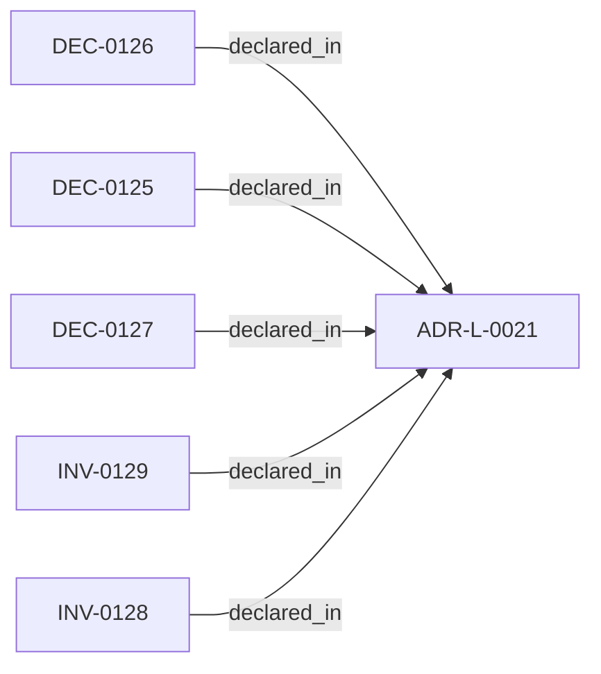

<!--
integrity_schema_version: 1
generated: deterministic_projection_v1
artifact_kind: rendered_adr_markdown
generator_id: adr-projection-markdown
generator_version: 2
hash_algorithm: sha256
source_hash: 6b79e5f94d38f935a94235164daaece4a3b6b0b3451e476ae9a70e78e0b0e9c1
rendered_hash: 7d8c806e762a90fc03fb70e58c6402fc1acb74ada60b13ba16623d9743fcb4e6
-->

# ADR-L-0021: Family-First Schema Contract Taxonomy and Authority

**Status:** accepted  
**Created:** 2026-08-15  
**Authors:** adr-architecture-kit  
**Domains:** architecture, schema  
**Tags:** schema-taxonomy, authority, compatibility  
**Alias name:** family-first-schema-contract-taxonomy  

## Context

Canonical JSON schemas currently use version-only root directories while
the accepted architecture distinguishes authoring, normalized-model,
governance, architecture-discovery, and evidence-attribution contracts.
This ADR establishes a family-first repository taxonomy without changing
schema semantics, JSON bytes, package resources, runtime behavior, or the
installed package namespace. Semantic attribution evidence v1.5 is not an
ADR authoring schema v1.5 and is not a normalized model version.

## Relationship graph

## Constraints

### CONST-0021 (technical)

**Description:**
Schema/v1.0 remains at its existing path as the stable compatibility exception.

**Rationale:**
Existing authoring consumers rely on the stable v1.0 path.

### CONST-0022 (technical)

**Description:**
Package resources remain under src/adr_kit/schema/v*_* and are not relocated.

**Rationale:**
Installed resource namespaces are an independent compatibility surface.

### CONST-0023 (technical)

**Description:**
No new bare root version directory may be introduced.

**Rationale:**
Family-first placement prevents version-only taxonomy ambiguity.

### CONST-0024 (regulatory)

**Description:**
The taxonomy inventory fixture is verification data, never semantic authority.

**Rationale:**
Canonical schema bytes and the accepted ADR retain authority.

## Invariants

### INV-0128

**Statement:** Canonical schema membership and SHA-256 fingerprints are unchanged by taxonomy relocation.  
**Scope:** global  
**Enforcement:** must (test)  
**Verification:** automated

**Rationale:**
Byte-preserving relocation is required for semantic neutrality.

### INV-0129

**Statement:** Every canonical schema artifact has one authoritative repository path and at most one explicit package mirror mapping.  
**Scope:** global  
**Enforcement:** must (test)  
**Verification:** automated

**Rationale:**
Authority must not be duplicated by topology or by the verification fixture.

## Decisions

### DEC-0125: Canonical schema placement is family-first with family-scoped versions

**Rationale:**
Place authoring, architecture-discovery, normalized-model, governance,
and evidence-attribution contracts beneath their family roots. Preserve
schema/v1.0 as the sole stable bare numeric compatibility exception, and
retain kernel/ and migrations/ as special families.

### DEC-0126: Canonical repository schemas are the single schema authority

**Rationale:**
The accepted ADR governs family and version policy; schema/... owns the
actual contract bytes; README files orient humans. Installed package
mirrors under src/adr_kit/schema/v*_* are compatibility resources and
remain independently named. The test inventory fixture is a derived,
non-authoritative verification snapshot only.

### DEC-0127: Taxonomy relocation is semantic and runtime neutral

**Rationale:**
Relocation must preserve schema JSON bytes, $id and $ref semantics,
parser/runtime behavior, SDK and CLI behavior, wheel behavior, package
version, and ADR corpus. Any production behavior change is outside this
ADR and is a stop condition.

---

*Generated from ADR-L-0021 by ADR Architecture Kit*