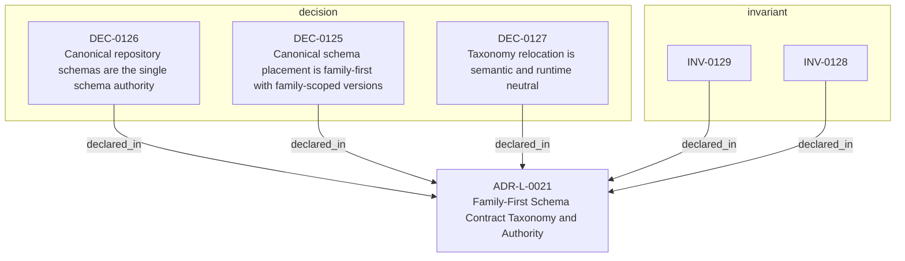

<!--
integrity_schema_version: 1
generated: deterministic_projection_v1
artifact_kind: rendered_adr_markdown
generator_id: adr-projection-markdown
generator_version: 3
hash_algorithm: sha256
source_hash: a51a879e109271365fef4827b79b3b98e3d6c8dbca256974a8ea3cdd6cf8f7f9
rendered_hash: d4f923218c33afd41cba61ee8f2516a194a2bbaca4c4e9db1d24bd4e4144f17b
-->

# ADR-L-0021: Family-First Schema Contract Taxonomy and Authority

## Identity / Status

**Type:** logical  
**Status:** accepted  
**Alias:** ADR-L-0021  
**Alias name:** family-first-schema-contract-taxonomy  
**Created:** 2026-08-15  
**Authors:** adr-architecture-kit  
**Domains:** architecture, schema  

## Architecture Position

Logical architecture authority for this subject. Neighborhood paths use structural bridges plus exactly one semantic architecture edge; they never invent ADR-to-ADR verbs.

## Architecture Neighborhood

### Semantic architecture inventory

- None

## Neighbor Relationships

No grammatical peer neighborhood for this subject.

## Context

Canonical JSON schemas currently use version-only root directories while
the accepted architecture distinguishes authoring, normalized-model,
governance, architecture-discovery, and evidence-attribution contracts.
This ADR establishes a family-first repository taxonomy without changing
schema semantics, JSON bytes, package resources, runtime behavior, or the
installed package namespace. Semantic attribution evidence v1.5 is not an
ADR authoring schema v1.5 and is not a normalized model version.

## Internal Structure

- `decision` DEC-0125 — Canonical schema placement is family-first with family-scoped versions
- `decision` DEC-0126 — Canonical repository schemas are the single schema authority
- `decision` DEC-0127 — Taxonomy relocation is semantic and runtime neutral
- `invariant` INV-0128 — INV-0128
- `invariant` INV-0129 — INV-0129

## Decisions

### DEC-0125: Canonical schema placement is family-first with family-scoped versions

**Rationale:**
Place authoring, architecture-discovery, normalized-model, governance,
and evidence-attribution contracts beneath their family roots. Preserve
schema/v1.0 as the sole stable bare numeric compatibility exception, and
retain kernel/ and migrations/ as special families.

### DEC-0126: Canonical repository schemas are the single schema authority

**Rationale:**
The accepted ADR governs family and version policy; schema/... owns the
actual contract bytes; README files orient humans. Installed package
mirrors under src/adr_kit/schema/v*_* are compatibility resources and
remain independently named. The test inventory fixture is a derived,
non-authoritative verification snapshot only.

### DEC-0127: Taxonomy relocation is semantic and runtime neutral

**Rationale:**
Relocation must preserve schema JSON bytes, $id and $ref semantics,
parser/runtime behavior, SDK and CLI behavior, wheel behavior, package
version, and ADR corpus. Any production behavior change is outside this
ADR and is a stop condition.

## Invariants

### INV-0128

**Statement:** Canonical schema membership and SHA-256 fingerprints are unchanged by taxonomy relocation.  
**Scope:** global  
**Enforcement:** must (test)

**Rationale:**
Byte-preserving relocation is required for semantic neutrality.

### INV-0129

**Statement:** Every canonical schema artifact has one authoritative repository path and at most one explicit package mirror mapping.  
**Scope:** global  
**Enforcement:** must (test)

**Rationale:**
Authority must not be duplicated by topology or by the verification fixture.

## Constraints

### CONST-0021

Schema/v1.0 remains at its existing path as the stable compatibility exception.

### CONST-0022

Package resources remain under src/adr_kit/schema/v*_* and are not relocated.

### CONST-0023

No new bare root version directory may be introduced.

### CONST-0024

The taxonomy inventory fixture is verification data, never semantic authority.

---

*Generated from ADR-L-0021 by ADR Architecture Kit (projection v3)*