<!--
integrity_schema_version: 1
generated: deterministic_projection_v1
artifact_kind: rendered_adr_markdown
generator_id: adr-projection-markdown
generator_version: 3
hash_algorithm: sha256
source_hash: fdde7ebe465f20d7cad999b91fdb367823613442b93fbfdde160a90f359c29fa
rendered_hash: eb4b05f80b0c37fcf6d1fea65018998b56f79ce0d1ca5acaaf20e38480b3eb53
-->

# ADR-L-0022: Universal UUIDv7 Entity Identity

## Identity / Status

**Type:** logical  
**Status:** accepted  
**Alias:** ADR-L-0022  
**Alias name:** universal-uuidv7-entity-identity  
**Created:** 2026-08-15  
**Authors:** adr-architecture-kit  
**Domains:** architecture, identity, schema-governance  

## Architecture Position

Logical architecture authority for this subject. Neighborhood paths use structural bridges plus exactly one semantic architecture edge; they never invent ADR-to-ADR verbs.

## Architecture Neighborhood

### Semantic architecture inventory

- None

## Neighbor Relationships

No grammatical peer neighborhood for this subject.

### Lifecycle / association

- ADR-L-0022 -[:references]-> ADR-L-0019
- ADR-L-0023 -[:references]-> ADR-L-0022

## Context

ADR-L-0019 correctly separated immutable UUIDv7 machine identity from human-oriented aliases, but DEC-0097 admitted that identity envelope for only a selected set of entity kinds. Other durable ADR-domain records still expose alias-shaped values as `id`, use alias references across artifacts, or omit identity entirely. Requirements snapshots, requirement items, decision ledgers, ledger decisions, reviews, overrides, constraints, non-functional requirements, gaps, system boundaries, data flows, and evidence expectations are examples.
That split creates an accumulating identity tax. A consumer cannot determine from the name `id` whether a field is immutable canonical identity, a human alias, a content-derived projection key, or an owner-local structural handle. New schema families such as rules could repeat the ambiguity unless schema admission is bound to one universal entity-identity invariant.
This ADR extends ADR-L-0019 rather than replacing its successful UUID, alias, reference, namespace, collision, and migration semantics. It supersedes the narrow entity-kind boundary in DEC-0097, establishes a structural test for entityhood, distinguishes canonical entities from local value objects and derived projections, and requires future schema contracts to make that classification explicit. Semantic schema versions, package namespaces, corpus migration, and removal of old compatibility surfaces remain implementation decisions that must be reviewed before destructive application. 

## Internal Structure

```mermaid
flowchart TB
  n_01a00643_1bfc_788c_911b_83a4725a8de1["ADR-L-0022<br/>Universal UUIDv7 Entity Identity"]
  subgraph sg_decision["decision"]
    n_01a00643_1bfc_7c3d_b935_01f39da8a0a5["DEC-0130<br/>Require the ADR-L-0019 identity envelope for every canonical independently addressable ADR-domain entity"]
    n_01a00643_1bfc_7676_812e_219c659674b2["DEC-0131<br/>Define entityhood by actual or potential participation in the system graph"]
    n_01a00643_1bfc_7922_9c18_f6938ee01c41["DEC-0132<br/>Require canonical entity references to use UUIDs while aliases remain orientation"]
    n_01a00643_1bfc_7b7e_883d_6c7dfff3325f["DEC-0133<br/>Keep owner-local value objects free of entity identity"]
    n_01a00643_1bfc_72a1_af3d_7cca88f676f7["DEC-0134<br/>Require stable UUIDv7 identity for every graph node and edge projection"]
    n_01a00643_1bfc_71ef_8e1f_694949767d59["DEC-0135<br/>Promote current durable alias-identified authoring and governance records to entities"]
    n_01a00643_1bfc_729a_833f_5a3bca5af998["DEC-0136<br/>Bind future rule evidence and other entity schemas to the same invariant"]
    n_01a00643_1bfc_7e7a_af3f_0484ebc351c9["DEC-0137<br/>Require semantic version boundaries and explicit package mappings for identity migration"]
    n_01a00643_1bfc_7528_951b_a457433ae5f4["DEC-0138<br/>Migrate identity with a sealed reviewable map and semantic parity proof"]
    n_01a00643_1bfc_7936_bb29_afde4c57721d["DEC-0139<br/>Remove obsolete compatibility surfaces only through an explicit reviewed gate"]
    n_01a002b7_e001_7010_8401_010101010101["DEC-0140<br/>Treat effective relationships and relationship assertions as distinct entities"]
    n_01a002b7_e002_7020_8802_020202020202["DEC-0141<br/>Model generated inverse traversal as a derived projection unless independently authored"]
    n_01a002b7_e003_7030_8c03_030303030303["DEC-0142<br/>Govern aliases for newly promoted entity families as an explicit namespace contract"]
    n_01a002b7_e004_7040_9004_040404040404["DEC-0143<br/>Bind identity changes to family-scoped semantic versions and explicit package mappings"]
    n_01a002b7_e005_7050_9405_050505050505["DEC-0144<br/>Preserve a graph-vNext compatibility posture while identity contracts advance"]
    n_01a002b7_e006_7060_9806_060606060606["DEC-0145<br/>Define the universal allocation map as a sealed, reviewable lifecycle artifact"]
    n_01a002b7_e007_7070_9c07_070707070707["DEC-0146<br/>Keep universal identity migration blocked until every human gate is explicit"]
  end
  subgraph sg_invariant["invariant"]
    n_01a00643_1bfc_757c_ba3a_63a007e981d0["INV-0130"]
    n_01a00643_1bfc_766c_ba3c_2f5aa66d59f6["INV-0131"]
    n_01a00643_1bfc_7dd1_a439_31a110f8ed50["INV-0132"]
    n_01a00643_1bfc_715b_a837_a062f86a6192["INV-0133"]
    n_01a00643_1bfc_7545_b11f_aebc124672f4["INV-0134"]
    n_01a00643_1bfc_7f05_b617_6960fa562bea["INV-0135"]
    n_01a00643_1bfc_7017_a03d_b61439e4cb2b["INV-0136"]
    n_01a00643_1bfc_7840_811f_831007e661b2["INV-0137"]
    n_01a002b7_e008_7080_a008_080808080808["INV-0138"]
    n_01a002b7_e009_7090_a409_090909090909["INV-0139"]
    n_01a002b7_e00a_70a0_a80a_0a0a0a0a0a0a["INV-0140"]
  end
  n_01a002b7_e001_7010_8401_010101010101 -->|"declared_in"| n_01a00643_1bfc_788c_911b_83a4725a8de1
  n_01a002b7_e002_7020_8802_020202020202 -->|"declared_in"| n_01a00643_1bfc_788c_911b_83a4725a8de1
  n_01a002b7_e003_7030_8c03_030303030303 -->|"declared_in"| n_01a00643_1bfc_788c_911b_83a4725a8de1
  n_01a002b7_e004_7040_9004_040404040404 -->|"declared_in"| n_01a00643_1bfc_788c_911b_83a4725a8de1
  n_01a002b7_e005_7050_9405_050505050505 -->|"declared_in"| n_01a00643_1bfc_788c_911b_83a4725a8de1
  n_01a002b7_e006_7060_9806_060606060606 -->|"declared_in"| n_01a00643_1bfc_788c_911b_83a4725a8de1
  n_01a002b7_e007_7070_9c07_070707070707 -->|"declared_in"| n_01a00643_1bfc_788c_911b_83a4725a8de1
  n_01a002b7_e008_7080_a008_080808080808 -->|"declared_in"| n_01a00643_1bfc_788c_911b_83a4725a8de1
  n_01a002b7_e009_7090_a409_090909090909 -->|"declared_in"| n_01a00643_1bfc_788c_911b_83a4725a8de1
  n_01a002b7_e00a_70a0_a80a_0a0a0a0a0a0a -->|"declared_in"| n_01a00643_1bfc_788c_911b_83a4725a8de1
  n_01a00643_1bfc_7017_a03d_b61439e4cb2b -->|"declared_in"| n_01a00643_1bfc_788c_911b_83a4725a8de1
  n_01a00643_1bfc_715b_a837_a062f86a6192 -->|"declared_in"| n_01a00643_1bfc_788c_911b_83a4725a8de1
  n_01a00643_1bfc_71ef_8e1f_694949767d59 -->|"declared_in"| n_01a00643_1bfc_788c_911b_83a4725a8de1
  n_01a00643_1bfc_729a_833f_5a3bca5af998 -->|"declared_in"| n_01a00643_1bfc_788c_911b_83a4725a8de1
  n_01a00643_1bfc_72a1_af3d_7cca88f676f7 -->|"declared_in"| n_01a00643_1bfc_788c_911b_83a4725a8de1
  n_01a00643_1bfc_7528_951b_a457433ae5f4 -->|"declared_in"| n_01a00643_1bfc_788c_911b_83a4725a8de1
  n_01a00643_1bfc_7545_b11f_aebc124672f4 -->|"declared_in"| n_01a00643_1bfc_788c_911b_83a4725a8de1
  n_01a00643_1bfc_757c_ba3a_63a007e981d0 -->|"declared_in"| n_01a00643_1bfc_788c_911b_83a4725a8de1
  n_01a00643_1bfc_766c_ba3c_2f5aa66d59f6 -->|"declared_in"| n_01a00643_1bfc_788c_911b_83a4725a8de1
  n_01a00643_1bfc_7676_812e_219c659674b2 -->|"declared_in"| n_01a00643_1bfc_788c_911b_83a4725a8de1
  n_01a00643_1bfc_7840_811f_831007e661b2 -->|"declared_in"| n_01a00643_1bfc_788c_911b_83a4725a8de1
  n_01a00643_1bfc_7922_9c18_f6938ee01c41 -->|"declared_in"| n_01a00643_1bfc_788c_911b_83a4725a8de1
  n_01a00643_1bfc_7936_bb29_afde4c57721d -->|"declared_in"| n_01a00643_1bfc_788c_911b_83a4725a8de1
  n_01a00643_1bfc_7b7e_883d_6c7dfff3325f -->|"declared_in"| n_01a00643_1bfc_788c_911b_83a4725a8de1
  n_01a00643_1bfc_7c3d_b935_01f39da8a0a5 -->|"declared_in"| n_01a00643_1bfc_788c_911b_83a4725a8de1
  n_01a00643_1bfc_7dd1_a439_31a110f8ed50 -->|"declared_in"| n_01a00643_1bfc_788c_911b_83a4725a8de1
  n_01a00643_1bfc_7e7a_af3f_0484ebc351c9 -->|"declared_in"| n_01a00643_1bfc_788c_911b_83a4725a8de1
  n_01a00643_1bfc_7f05_b617_6960fa562bea -->|"declared_in"| n_01a00643_1bfc_788c_911b_83a4725a8de1
```

- `decision` DEC-0130 — Require the ADR-L-0019 identity envelope for every canonical independently addressable ADR-domain entity
- `decision` DEC-0131 — Define entityhood by actual or potential participation in the system graph
- `decision` DEC-0132 — Require canonical entity references to use UUIDs while aliases remain orientation
- `decision` DEC-0133 — Keep owner-local value objects free of entity identity
- `decision` DEC-0134 — Require stable UUIDv7 identity for every graph node and edge projection
- `decision` DEC-0135 — Promote current durable alias-identified authoring and governance records to entities
- `decision` DEC-0136 — Bind future rule evidence and other entity schemas to the same invariant
- `decision` DEC-0137 — Require semantic version boundaries and explicit package mappings for identity migration
- `decision` DEC-0138 — Migrate identity with a sealed reviewable map and semantic parity proof
- `decision` DEC-0139 — Remove obsolete compatibility surfaces only through an explicit reviewed gate
- `decision` DEC-0140 — Treat effective relationships and relationship assertions as distinct entities
- `decision` DEC-0141 — Model generated inverse traversal as a derived projection unless independently authored
- `decision` DEC-0142 — Govern aliases for newly promoted entity families as an explicit namespace contract
- `decision` DEC-0143 — Bind identity changes to family-scoped semantic versions and explicit package mappings
- `decision` DEC-0144 — Preserve a graph-vNext compatibility posture while identity contracts advance
- `decision` DEC-0145 — Define the universal allocation map as a sealed, reviewable lifecycle artifact
- `decision` DEC-0146 — Keep universal identity migration blocked until every human gate is explicit
- `invariant` INV-0130 — INV-0130
- `invariant` INV-0131 — INV-0131
- `invariant` INV-0132 — INV-0132
- `invariant` INV-0133 — INV-0133
- `invariant` INV-0134 — INV-0134
- `invariant` INV-0135 — INV-0135
- `invariant` INV-0136 — INV-0136
- `invariant` INV-0137 — INV-0137
- `invariant` INV-0138 — INV-0138
- `invariant` INV-0139 — INV-0139
- `invariant` INV-0140 — INV-0140

## Decisions

### DEC-0130: Require the ADR-L-0019 identity envelope for every canonical independently addressable ADR-domain entity

**Rationale:**
Every canonical independently addressable ADR-domain entity authors an immutable lowercase RFC 9562 UUIDv7 in `id`, a governed type-prefixed `alias_id`, and a stable-by-default human-oriented `alias_name`. This supersedes DEC-0097's closed entity-kind allowlist without weakening the existing identity, alias, namespace, collision, or migration rules.

### DEC-0131: Define entityhood by actual or potential participation in the system graph

**Rationale:**
Any record that participates, or may later participate, as a node or edge in the system graph is an entity and must have the universal identity envelope before graph admission. Independent addressability, cross-artifact references, lifecycle, provenance, admission, governance meaning, and durable semantic continuity are evidence of graph eligibility. Uncertainty resolves toward entity identity; only records explicitly prohibited from graph participation may be classified as value objects.

### DEC-0132: Require canonical entity references to use UUIDs while aliases remain orientation

**Rationale:**
Canonical local references and relationship endpoints use the target entity UUID. Cross-namespace references use provider namespace, UUID, kind, and fingerprint. `alias_id`, `alias_name`, and derived `alias_ref` are human orientation and lookup presentation only and never foreign keys or retargetable identity.

### DEC-0133: Keep owner-local value objects free of entity identity

**Rationale:**
A record may remain a value object only when its contract explicitly excludes it from present and future graph participation and it has no independent lifecycle, authority, cross-owner reference, or durable semantic continuity. It has no `id`, `alias_id`, or `alias_name`. An owner-local structural handle is named `key` or `<role>_key`, is scoped to its owner, and cannot enter graph output. Any later graph eligibility requires promotion to an entity through a schema version and migration before graph admission.

### DEC-0134: Require stable UUIDv7 identity for every graph node and edge projection

**Rationale:**
A graph projection reuses the persisted UUID and aliases of its canonical node or edge entity. Relationship assertions, topology nodes and edges, unresolved findings, bindings, evidence claims, or other derived candidates cannot enter the system graph until canonical authority has allocated and persisted their UUIDv7 identity. Content hashes remain fingerprints or deduplication keys, never identity. Purely non-graph diagnostics may use deterministic keys, and generators never mint authoritative UUIDs opportunistically during regeneration.

### DEC-0135: Promote current durable alias-identified authoring and governance records to entities

**Rationale:**
Constraints, non-functional requirements, authored gaps, system boundaries, data flows, evidence expectations, requirements snapshots and their referencable requirement items, decision ledgers and ledger decisions, steelman reviews and referencable objections, objection overrides, remediation ledgers, and independently governed remediation entries are graph-eligible records and therefore receive the universal identity envelope in their next semantic contract version. Topology nodes and edges, relationship assertions, unresolved findings, bindings, and evidence claims also require the envelope whenever they can participate in the graph.

### DEC-0136: Bind future rule evidence and other entity schemas to the same invariant

**Rationale:**
Every new schema that models records eligible for graph participation, including rule, evidence, governance, authoring, and normalized-model contracts, must require the universal identity envelope. Rule instances, evidence entities, and graph-participating binding or assertion records use UUID identity; external references add provider namespace, kind, and fingerprint. A JSON Schema `$id` is contract URI identity and does not substitute for instance entity identity.

### DEC-0137: Require semantic version boundaries and explicit package mappings for identity migration

**Rationale:**
Changing alias-only identity, adding required UUID and alias fields, changing canonical references, or reclassifying `id` as `key` is a semantic contract change and must occur in a new family-scoped schema version. Canonical repository and installed-package resource paths are explicit mappings rather than inferred from an unqualified version label. Existing contract bytes are not silently rewritten in place.

### DEC-0138: Migrate identity with a sealed reviewable map and semantic parity proof

**Rationale:**
Migration inventories every promoted entity and reference before minting, records owner path and structural pointer, preserves the human alias, proposes an alias name deterministically, mints each UUID once into a sealed map, rewrites canonical references atomically, validates the entire write set, and proves idempotence and semantic parity. Counts alone are not proof and a migration cannot silently remint or retarget an entity.

### DEC-0139: Remove obsolete compatibility surfaces only through an explicit reviewed gate

**Rationale:**
Being the sole current external consumer permits a clean break but does not make deletion implicit. Exact schema versions, parser modes, package namespaces, public API shims, migration inputs, and corpus formats proposed for removal must be enumerated with dependency evidence and approved before deletion. Identity admission does not create a release tag or publication authority.

### DEC-0140: Treat effective relationships and relationship assertions as distinct entities

**Rationale:**
An effective relationship is an ENTITY and graph-eligible record with its own UUIDv7 identity and stable alias envelope. A relationship assertion is also a graph-eligible ENTITY with its own UUIDv7 identity and assertion alias; one effective relationship may therefore have multiple assertions that are independently governed. A content fingerprint such as `relationship_id` or `assertion_id` is a deduplication and provenance key, never a substitute for canonical entity identity. A VALUE_OBJECT is excluded from graph participation and a DERIVED_PROJECTION reuses canonical identity.

### DEC-0141: Model generated inverse traversal as a derived projection unless independently authored

**Rationale:**
An inverse edge generated from an effective relationship reuses the persisted relationship UUID and is a DERIVED_PROJECTION, not a second canonical entity. An independently authored or governed inverse relationship is a separate ENTITY only when its own lifecycle, authority, or provenance warrants it. Generators do not mint UUIDs to materialize a traversal view. Any exception requires explicit human approval.

### DEC-0142: Govern aliases for newly promoted entity families as an explicit namespace contract

**Rationale:**
Every newly promoted entity kind receives a unique governed type-prefixed alias namespace before migration. Namespace allocation, high-water marks, collision dispositions, and retired aliases are recorded in the migration contract; aliases remain human orientation and never become canonical references. Unknown or colliding legacy aliases block sealing rather than being silently reassigned.

### DEC-0143: Bind identity changes to family-scoped semantic versions and explicit package mappings

**Rationale:**
The vNext identity contract is family-scoped: authoring, architecture-discovery, normalized-model, governance, and evidence-attribution versions advance independently when their identity semantics change. Canonical repository paths and installed package resource paths are explicit mappings, not labels inferred from a version number; existing schema bytes and the stable authoring compatibility surface remain intact until a reviewed version admission changes them.

### DEC-0144: Preserve a graph-vNext compatibility posture while identity contracts advance

**Rationale:**
Graph-vNext may expose canonical UUID identity, relationship/assertion distinction, and derived inverse projections while retaining a deterministic compatibility projection for existing graph consumers. A graph projection is derived state; graph-vNext admission requires semantic parity evidence and does not authorize corpus migration, package behavior changes, or opportunistic UUID minting.

### DEC-0145: Define the universal allocation map as a sealed, reviewable lifecycle artifact

**Rationale:**
The allocation map records canonical owner path, structural pointer, entity kind, legacy alias, proposed UUIDv7, final alias, disposition, and provenance. It progresses through draft, collision-review, approved, and SEALED states; sealing is one-way for a migration pass and requires exact inventory, collision dispositions, vNext contract approval, graph posture approval, and semantic-parity evidence.

### DEC-0146: Keep universal identity migration blocked until every human gate is explicit

**Rationale:**
No universal corpus migration may mint UUIDs, rewrite references, or remove compatibility surfaces while alias collisions, family-scoped vNext contracts, graph-vNext posture, allocation-map contract, or map sealing remain unapproved. Working review packets are evidence for human decisions only and are not durable architecture authority; each gate requires explicit human approval before migration.

## Invariants

### INV-0130

**Statement:** Every record that participates or may participate as a node or edge in the system graph has an immutable lowercase RFC 9562 UUIDv7 `id`, a governed `alias_id`, and a human-oriented `alias_name` before graph admission.  
**Scope:** global  
**Enforcement:** must (design)

**Rationale:**
Universal canonical identity prevents new alias-only identity debt.

### INV-0131

**Statement:** Canonical entity references and relationship endpoints use UUIDs rather than aliases or owner-local keys.  
**Scope:** global  
**Enforcement:** must (design)

**Rationale:**
Reference stability must not depend on presentation or local structure.

### INV-0132

**Statement:** Human aliases orient and resolve for presentation but never define canonical identity or retarget a reference.  
**Scope:** global  
**Enforcement:** must (design)

**Rationale:**
Alias evolution must remain independent from identity.

### INV-0133

**Statement:** Owner-local value objects are explicitly ineligible for graph participation, have no entity identity, and name any local structural handle as a key rather than an id.  
**Scope:** global  
**Enforcement:** must (design)

**Rationale:**
Field vocabulary must reveal whether a value is canonical identity.

### INV-0134

**Statement:** Every graph projection reuses a persisted canonical node or edge UUID; only explicitly non-graph diagnostics may use deterministic keys, and generators do not mint canonical identity without canonical authority.  
**Scope:** global  
**Enforcement:** must (design)

**Rationale:**
Derived state cannot become an accidental authority source.

### INV-0135

**Statement:** Every new or revised schema declares graph eligibility and entity value-object and projection boundaries and mechanically enforces the universal identity invariant.  
**Scope:** global  
**Enforcement:** must (policy)

**Rationale:**
The invariant applies to rules and future schema families as well as ADR authoring.

### INV-0136

**Statement:** Identity migration mints each entity UUID once from a reviewed sealed map and proves reference and semantic parity after atomic application.  
**Scope:** global  
**Enforcement:** must (policy)

**Rationale:**
A migration must not remint retarget or partially apply canonical identity.

### INV-0137

**Statement:** No legacy schema package namespace parser mode public compatibility shim or corpus format is removed without explicit reviewed disposition.  
**Scope:** global  
**Enforcement:** must (policy)

**Rationale:**
Clean-break authority must be precise rather than inferred.

### INV-0138

**Statement:** Effective relationships and relationship assertions are distinct graph-eligible entities, each with its own UUIDv7 identity and alias envelope; fingerprints are not identity.  
**Scope:** global  
**Enforcement:** must (design)

**Rationale:**
Multiple assertions may explain one effective relationship without collapsing their independent provenance or governance lifecycle.

### INV-0139

**Statement:** Generated inverse traversal reuses the effective relationship UUID and is a DERIVED_PROJECTION unless an independently authored inverse is governed as a separate entity.  
**Scope:** global  
**Enforcement:** must (design)

**Rationale:**
Traversal views must not create duplicate canonical identity.

### INV-0140

**Statement:** Universal identity migration remains blocked until collision, vNext, graph, allocation-contract, and allocation-map seal gates are explicitly approved and evidence is sealed.  
**Scope:** global  
**Enforcement:** must (policy)

**Rationale:**
Architectural closure and implementation readiness are separate states.

---

*Generated from ADR-L-0022 by ADR Architecture Kit (projection v3)*