<!--
integrity_schema_version: 1
generated: deterministic_projection_v1
artifact_kind: rendered_adr_markdown
generator_id: adr-projection-markdown
generator_version: 3
hash_algorithm: sha256
source_hash: a47755c0f60726780062a31e855ce5f93f2d5cc317ecb3adcd22d0aa0867e11e
rendered_hash: 995c1d81d8f466130ba5756f3d8c1e1abb5916aefb80c0f4335033b865d13c6a
-->

# ADR-L-0023: Consumer Semantic Extension Contract

## Identity / Status

**Type:** logical  
**Status:** accepted  
**Alias:** ADR-L-0023  
**Alias name:** consumer-semantic-extension-contract  
**Created:** 2026-08-21  
**Authors:** adr-architecture-kit  
**Domains:** architecture, schema-governance, extensibility  

## Architecture Position

Logical architecture authority for this subject. Neighborhood paths use structural bridges plus exactly one semantic architecture edge; they never invent ADR-to-ADR verbs.

## Architecture Neighborhood

### Semantic architecture inventory

- None

## Neighbor Relationships

No grammatical peer neighborhood for this subject.

### Lifecycle / association

- ADR-L-0023 -[:references]-> ADR-L-0019
- ADR-L-0023 -[:references]-> ADR-L-0022
- ADR-L-0023 -[:references]-> ADR-L-0025
- ADR-L-0024 -[:references]-> ADR-L-0023
- ADR-L-0025 -[:references]-> ADR-L-0023

## Context

ADR-Kit owns the universal envelope, structural validation, references,
provenance eligibility, and deterministic projections, while consumers have
legitimate semantic types that are not universal enough for first-class
ontology promotion. A safe extension must preserve those boundaries without
creating a second graph or a schema-less metadata escape hatch.

## Internal Structure

```mermaid
flowchart TB
  n_01a00644_1bfc_7abc_8aaa_111111111111["ADR-L-0023<br/>Consumer Semantic Extension Contract"]
  subgraph sg_decision["decision"]
    n_01a00644_1bfd_7abc_8aaa_222222222222["DEC-0147<br/>Canonize the universal envelope while opening a qualified consumer semantic namespace"]
    n_01a00644_1bfe_7abc_8aaa_333333333333["DEC-0148<br/>Author extensions through explicit extension_entities and extension_relationships sections"]
    n_01a00644_1bff_7abc_8aaa_444444444444["DEC-0149<br/>Require consumer extension types to be qualified by the owning architecture namespace"]
    n_01a00644_1c00_7abc_8aaa_555555555555["DEC-0150<br/>Bound extension properties to scalar JSON-like values and require rationale"]
    n_01a00644_1c01_7abc_8aaa_666666666666["DEC-0151<br/>Require authored extension relationships for graph semantics"]
    n_01a00644_1c02_7abc_8aaa_777777777777["DEC-0152<br/>Validate consumer-owned alias registrations without centralizing them in ADR-Kit"]
    n_01a00644_1c03_7abc_8aaa_888888888888["DEC-0153<br/>Keep persisted canonical relationship identity mechanically distinct from hash compatibility projections"]
    n_01a00644_1c04_7abc_8aaa_999999999999["DEC-0154<br/>Preserve every valid unknown extension through parse, compile, normalization, and repository loading"]
  end
  subgraph sg_invariant["invariant"]
    n_01a00644_1c05_7abc_8aaa_aaaaaaaaaaaa["INV-0141"]
    n_01a00644_1c06_7abc_8aaa_bbbbbbbbbbbb["INV-0142"]
    n_01a00644_1c07_7abc_8aaa_cccccccccccc["INV-0143"]
    n_01a00644_1c08_7abc_8aaa_dddddddddddd["INV-0144"]
    n_01a00644_1c09_7abc_8aaa_eeeeeeeeeeee["INV-0145"]
    n_01a00644_1c0a_7abc_8aaa_ffffffffffff["INV-0146"]
    n_01a00644_1c0b_7abc_8aaa_121212121212["INV-0147"]
    n_01a00644_1c0c_7abc_8aaa_131313131313["INV-0148"]
  end
  n_01a00644_1bfd_7abc_8aaa_222222222222 -->|"declared_in"| n_01a00644_1bfc_7abc_8aaa_111111111111
  n_01a00644_1bfe_7abc_8aaa_333333333333 -->|"declared_in"| n_01a00644_1bfc_7abc_8aaa_111111111111
  n_01a00644_1bff_7abc_8aaa_444444444444 -->|"declared_in"| n_01a00644_1bfc_7abc_8aaa_111111111111
  n_01a00644_1c00_7abc_8aaa_555555555555 -->|"declared_in"| n_01a00644_1bfc_7abc_8aaa_111111111111
  n_01a00644_1c01_7abc_8aaa_666666666666 -->|"declared_in"| n_01a00644_1bfc_7abc_8aaa_111111111111
  n_01a00644_1c02_7abc_8aaa_777777777777 -->|"declared_in"| n_01a00644_1bfc_7abc_8aaa_111111111111
  n_01a00644_1c03_7abc_8aaa_888888888888 -->|"declared_in"| n_01a00644_1bfc_7abc_8aaa_111111111111
  n_01a00644_1c04_7abc_8aaa_999999999999 -->|"declared_in"| n_01a00644_1bfc_7abc_8aaa_111111111111
  n_01a00644_1c05_7abc_8aaa_aaaaaaaaaaaa -->|"declared_in"| n_01a00644_1bfc_7abc_8aaa_111111111111
  n_01a00644_1c06_7abc_8aaa_bbbbbbbbbbbb -->|"declared_in"| n_01a00644_1bfc_7abc_8aaa_111111111111
  n_01a00644_1c07_7abc_8aaa_cccccccccccc -->|"declared_in"| n_01a00644_1bfc_7abc_8aaa_111111111111
  n_01a00644_1c08_7abc_8aaa_dddddddddddd -->|"declared_in"| n_01a00644_1bfc_7abc_8aaa_111111111111
  n_01a00644_1c09_7abc_8aaa_eeeeeeeeeeee -->|"declared_in"| n_01a00644_1bfc_7abc_8aaa_111111111111
  n_01a00644_1c0a_7abc_8aaa_ffffffffffff -->|"declared_in"| n_01a00644_1bfc_7abc_8aaa_111111111111
  n_01a00644_1c0b_7abc_8aaa_121212121212 -->|"declared_in"| n_01a00644_1bfc_7abc_8aaa_111111111111
  n_01a00644_1c0c_7abc_8aaa_131313131313 -->|"declared_in"| n_01a00644_1bfc_7abc_8aaa_111111111111
```

- `decision` DEC-0147 — Canonize the universal envelope while opening a qualified consumer semantic namespace
- `decision` DEC-0148 — Author extensions through explicit extension_entities and extension_relationships sections
- `decision` DEC-0149 — Require consumer extension types to be qualified by the owning architecture namespace
- `decision` DEC-0150 — Bound extension properties to scalar JSON-like values and require rationale
- `decision` DEC-0151 — Require authored extension relationships for graph semantics
- `decision` DEC-0152 — Validate consumer-owned alias registrations without centralizing them in ADR-Kit
- `decision` DEC-0153 — Keep persisted canonical relationship identity mechanically distinct from hash compatibility projections
- `decision` DEC-0154 — Preserve every valid unknown extension through parse, compile, normalization, and repository loading
- `invariant` INV-0141 — INV-0141
- `invariant` INV-0142 — INV-0142
- `invariant` INV-0143 — INV-0143
- `invariant` INV-0144 — INV-0144
- `invariant` INV-0145 — INV-0145
- `invariant` INV-0146 — INV-0146
- `invariant` INV-0147 — INV-0147
- `invariant` INV-0148 — INV-0148

## Decisions

### DEC-0147: Canonize the universal envelope while opening a qualified consumer semantic namespace

**Rationale:**
ADR-Kit can preserve unknown consumer meaning without interpreting it.

### DEC-0148: Author extensions through explicit extension_entities and extension_relationships sections

**Rationale:**
Explicit sections preserve strict first-class schemas and prevent arbitrary field escape hatches.

### DEC-0149: Require consumer extension types to be qualified by the owning architecture namespace

**Rationale:**
Qualification prevents future collision with ADR-Kit controlled vocabulary.

### DEC-0150: Bound extension properties to scalar JSON-like values and require rationale

**Rationale:**
ADR-Kit validates deterministic shape while leaving domain meaning opaque.

### DEC-0151: Require authored extension relationships for graph semantics

**Rationale:**
Property values never imply graph edges.

### DEC-0152: Validate consumer-owned alias registrations without centralizing them in ADR-Kit

**Rationale:**
Each architecture corpus retains authority for its own alias allocation scope.

### DEC-0153: Keep persisted canonical relationship identity mechanically distinct from hash compatibility projections

**Rationale:**
Hash identifiers cannot become canonical graph identity by implication.

### DEC-0154: Preserve every valid unknown extension through parse, compile, normalization, and repository loading

**Rationale:**
Downstream consumers must not pre-register semantic types to consume validated records.

## Invariants

### INV-0141

**Statement:** Every extension entity and canonical extension relationship has UUID identity and governed alias orientation before graph admission.  
**Scope:** global  
**Enforcement:** must (design)

**Rationale:**
Extensions participate in the same identity system as first-class entities.

### INV-0142

**Statement:** Every locally authored extension semantic type is qualified by the containing architecture namespace and validated against consumer-owned allocation state.  
**Scope:** global  
**Enforcement:** must (design)

**Rationale:**
ADR-Kit validates ownership without becoming a central semantic registry.

### INV-0143

**Statement:** Extension property values never imply graph relationships.  
**Scope:** global  
**Enforcement:** must (design)

**Rationale:**
Explicit authored relationships keep graph construction deterministic.

### INV-0144

**Statement:** Normalized extension payload is represented in a typed extension field and is preserved without ADR-Kit semantic interpretation.  
**Scope:** global  
**Enforcement:** must (design)

**Rationale:**
Generic metadata must not become the extension contract.

### INV-0145

**Statement:** A relationship lacking persisted canonical UUID identity cannot enter the canonical v2.1 graph surface.  
**Scope:** global  
**Enforcement:** must (design)

**Rationale:**
Compatibility hashes remain derived projections only.

### INV-0146

**Statement:** Valid extension types, properties, rationale, and explicit relationships round-trip deterministically through normalized repository surfaces.  
**Scope:** global  
**Enforcement:** must (test)

**Rationale:**
Unknown valid types are a supported consumer capability.

### INV-0147

**Statement:** Compiler and projection stages never mint authoritative extension entity or relationship UUIDs.  
**Scope:** global  
**Enforcement:** must (design)

**Rationale:**
Identity allocation remains canonical-authority work.

### INV-0148

**Statement:** v1.4 authored extension relationship endpoints are local UUIDv7 references; future cross-namespace support uses the qualified external-reference contract.  
**Scope:** global  
**Enforcement:** must (design)

**Rationale:**
The local-only v1 boundary must not create an alias or hidden-property reference path.

---

*Generated from ADR-L-0023 by ADR Architecture Kit (projection v3)*