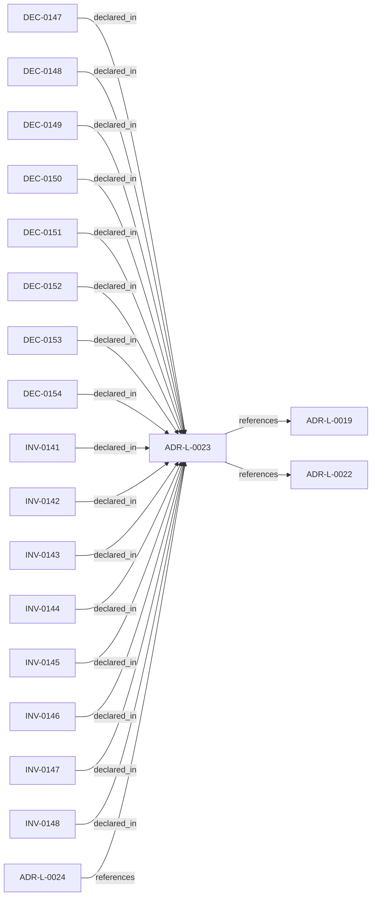

<!--
integrity_schema_version: 1
generated: deterministic_projection_v1
artifact_kind: rendered_adr_markdown
generator_id: adr-projection-markdown
generator_version: 2
hash_algorithm: sha256
source_hash: 41eee6f12da1eca70db41dd842b5a7e2fad23550081bcac1a04aa5b0255687f5
rendered_hash: 3e445512270433b33c59d142efac1213f1251b33683a879f5ea73e9092e1aa46
-->

# ADR-L-0023: Consumer Semantic Extension Contract

**Status:** accepted  
**Created:** 2026-08-21  
**Authors:** adr-architecture-kit  
**Domains:** architecture, schema-governance, extensibility  
**Alias name:** consumer-semantic-extension-contract  

## Context

ADR-Kit owns the universal envelope, structural validation, references,
provenance eligibility, and deterministic projections, while consumers have
legitimate semantic types that are not universal enough for first-class
ontology promotion. A safe extension must preserve those boundaries without
creating a second graph or a schema-less metadata escape hatch.

## Relationship graph

## Related ADRs

### ADR-L-0019 — Canonical Entity Identity

**Relationships:**
- this ADR -[:references]-> 019fee89-e617-78d9-ba3b-b7e3e6db1b12

**Context:** Earlier ADR Kit work established federation, repository boundaries, schema
v1.2, and a normalized semantic foundation, but canonical identity still
depended on human-oriented, type-prefixed identifiers in roles that also
served machine references, relationship endpoints, and federation. That
coupling made recognition, identity, location, and routing harder to evolve
independently and left alias changes or repository concerns too close to
canonical machine semantics.

[Open projection](ADR-L-0019-canonical-entity-identity.md)
### ADR-L-0022 — Universal UUIDv7 Entity Identity

**Relationships:**
- this ADR -[:references]-> 01a00643-1bfc-788c-911b-83a4725a8de1

**Context:** ADR-L-0019 correctly separated immutable UUIDv7 machine identity from human-oriented aliases, but DEC-0097 admitted that identity envelope for only a selected set of entity kinds. Other durable ADR-domain records still expose alias-shaped values as `id`, use alias references across artifacts, or omit identity entirely. Requirements snapshots, requirement items, decision ledgers, ledger decisions, reviews, overrides, constraints, non-functional requirements, gaps, system boundaries, data flows,…

[Open projection](ADR-L-0022-universal-uuidv7-entity-identity.md)
### ADR-L-0024 — Cross-Language Consumer Bindings and TypeScript Distribution

**Relationships:**
- 01a02d38-7cf3-7b3c-87ec-1c5f08490c6e -[:references]-> this ADR

**Context:** ADR-Kit already owns accepted ADR authority, canonical schema bytes, semantic
vocabularies, the repository discovery contract, the normalized model, and
validated derived embodiment evidence. Python is the existing implementation
of those contracts, but it is not their semantic owner. Node services,
engineering-agent integrations, and browser applications need a supported
read-only consumer binding without reparsing ADR source YAML, depending on
compiler internals, or importing Node authority…

[Open projection](ADR-L-0024-cross-language-consumer-bindings-and-typescript-distribution.md)

## Invariants

### INV-0141

**Statement:** Every extension entity and canonical extension relationship has UUID identity and governed alias orientation before graph admission.  
**Scope:** global  
**Enforcement:** must (design)  
**Verification:** automated

**Rationale:**
Extensions participate in the same identity system as first-class entities.

### INV-0142

**Statement:** Every locally authored extension semantic type is qualified by the containing architecture namespace and validated against consumer-owned allocation state.  
**Scope:** global  
**Enforcement:** must (design)  
**Verification:** automated

**Rationale:**
ADR-Kit validates ownership without becoming a central semantic registry.

### INV-0143

**Statement:** Extension property values never imply graph relationships.  
**Scope:** global  
**Enforcement:** must (design)  
**Verification:** automated

**Rationale:**
Explicit authored relationships keep graph construction deterministic.

### INV-0144

**Statement:** Normalized extension payload is represented in a typed extension field and is preserved without ADR-Kit semantic interpretation.  
**Scope:** global  
**Enforcement:** must (design)  
**Verification:** automated

**Rationale:**
Generic metadata must not become the extension contract.

### INV-0145

**Statement:** A relationship lacking persisted canonical UUID identity cannot enter the canonical v2.1 graph surface.  
**Scope:** global  
**Enforcement:** must (design)  
**Verification:** automated

**Rationale:**
Compatibility hashes remain derived projections only.

### INV-0146

**Statement:** Valid extension types, properties, rationale, and explicit relationships round-trip deterministically through normalized repository surfaces.  
**Scope:** global  
**Enforcement:** must (test)  
**Verification:** automated

**Rationale:**
Unknown valid types are a supported consumer capability.

### INV-0147

**Statement:** Compiler and projection stages never mint authoritative extension entity or relationship UUIDs.  
**Scope:** global  
**Enforcement:** must (design)  
**Verification:** automated

**Rationale:**
Identity allocation remains canonical-authority work.

### INV-0148

**Statement:** v1.4 authored extension relationship endpoints are local UUIDv7 references; future cross-namespace support uses the qualified external-reference contract.  
**Scope:** global  
**Enforcement:** must (design)  
**Verification:** automated

**Rationale:**
The local-only v1 boundary must not create an alias or hidden-property reference path.

## Decisions

### DEC-0147: Canonize the universal envelope while opening a qualified consumer semantic namespace

**Rationale:**
ADR-Kit can preserve unknown consumer meaning without interpreting it.

### DEC-0148: Author extensions through explicit extension_entities and extension_relationships sections

**Rationale:**
Explicit sections preserve strict first-class schemas and prevent arbitrary field escape hatches.

### DEC-0149: Require consumer extension types to be qualified by the owning architecture namespace

**Rationale:**
Qualification prevents future collision with ADR-Kit controlled vocabulary.

### DEC-0150: Bound extension properties to scalar JSON-like values and require rationale

**Rationale:**
ADR-Kit validates deterministic shape while leaving domain meaning opaque.

### DEC-0151: Require authored extension relationships for graph semantics

**Rationale:**
Property values never imply graph edges.

### DEC-0152: Validate consumer-owned alias registrations without centralizing them in ADR-Kit

**Rationale:**
Each architecture corpus retains authority for its own alias allocation scope.

### DEC-0153: Keep persisted canonical relationship identity mechanically distinct from hash compatibility projections

**Rationale:**
Hash identifiers cannot become canonical graph identity by implication.

### DEC-0154: Preserve every valid unknown extension through parse, compile, normalization, and repository loading

**Rationale:**
Downstream consumers must not pre-register semantic types to consume validated records.

---

*Generated from ADR-L-0023 by ADR Architecture Kit*