<!--
integrity_schema_version: 1
generated: deterministic_projection_v1
artifact_kind: rendered_adr_markdown
generator_id: adr-projection-markdown
generator_version: 3
hash_algorithm: sha256
source_hash: fb5c610e4e6aa769dc9c560f95ad16f2defab9574e083ea4119028d9a812514b
rendered_hash: 9bafe1f28113a504f51969bf8d17025b01ce47d19d4161a72034504a2e50f21d
-->

# ADR-L-0024: Cross-Language Consumer Bindings and TypeScript Distribution

## Identity / Status

**Type:** logical  
**Status:** accepted  
**Alias:** ADR-L-0024  
**Alias name:** cross-language-consumer-bindings-and-typescript-distribution  
**Created:** 2026-08-23  
**Authors:** adr-architecture-kit  
**Domains:** architecture, consumer-bindings, schema-governance, distribution  

## Architecture Position

Logical architecture authority for this subject. Neighborhood paths use structural bridges plus exactly one semantic architecture edge; they never invent ADR-to-ADR verbs.

## Architecture Neighborhood

### Semantic architecture inventory

- None

## Neighbor Relationships

No grammatical peer neighborhood for this subject.

### Lifecycle / association

- ADR-L-0024 -[:references]-> ADR-L-0013
- ADR-L-0024 -[:references]-> ADR-L-0019
- ADR-L-0024 -[:references]-> ADR-L-0020
- ADR-L-0024 -[:references]-> ADR-L-0023
- ADR-L-0025 -[:references]-> ADR-L-0024

## Context

ADR-Kit already owns accepted ADR authority, canonical schema bytes, semantic
vocabularies, the repository discovery contract, the normalized model, and
validated derived embodiment evidence. Python is the existing implementation
of those contracts, but it is not their semantic owner. Node services,
engineering-agent integrations, and browser applications need a supported
read-only consumer binding without reparsing ADR source YAML, depending on
compiler internals, or importing Node authority into browser applications.

A language binding must therefore be governed by one explicit consumer contract,
advertise only the capabilities it actually implements, and be qualified by
semantic and behavioral equivalence over overlapping capabilities. Binding-local
implementation details and deterministic fingerprints are not cross-language
identity. A first TypeScript distribution must preserve the repository boundary,
keep Node filesystem and linkage behavior behind explicit Node subpaths, and
remain framework-neutral for browser and Angular consumers.

## Internal Structure

```mermaid
flowchart TB
  n_01a02d38_7cf3_7b3c_87ec_1c5f08490c6e["ADR-L-0024<br/>Cross-Language Consumer Bindings and TypeScript Distribution"]
  subgraph sg_capability["capability"]
    n_01a02d38_7cf3_7dfe_80d8_28c51db97e18["CAP-9001<br/>Capability-Scoped Consumer Binding"]
    n_01a02d38_7cf3_7625_8e95_7fc0f62d7b09["CAP-9002<br/>TypeScript Node and Browser Consumer Distribution"]
  end
  subgraph sg_decision["decision"]
    n_01a02d38_7cf3_7194_8e04_4339c496d93a["DEC-0155<br/>Accepted ADRs canonical schemas vocabularies and promoted binding contracts are language-neutral semantic authority"]
    n_01a02d38_7cf3_7a6f_8b71_a3624877c1b3["DEC-0156<br/>The official TypeScript consumer binding is distributed as @system-of-thought/adr-kit from this repository"]
    n_01a02d38_7cf3_7b62_80b7_c907b9f972d6["DEC-0157<br/>Consumer Binding Contract 1.0 governs conformance across supported language bindings"]
    n_01a02d38_7cf3_7418_8bba_4fa7ecdd2151["DEC-0158<br/>Conformance is required only for the intersection of capabilities and contract versions advertised by bindings"]
    n_01a02d38_7cf3_700a_880b_182eb0956a24["DEC-0159<br/>Consumer Binding Contract 1.0 distinguishes structural semantic behavioral diagnostic and serialization equivalence"]
    n_01a02d38_7cf3_78dc_8d0f_4d4a41000fe3["DEC-0160<br/>TypeScript consumes copy-exact generated mirrors of canonical schema bytes from schema/"]
    n_01a02d38_7cf3_7765_8a96_0cdd35f55df5["DEC-0161<br/>The first TypeScript release is read-only and excludes authoring identity allocation graph admission CLI MCP and repository writes"]
    n_01a02d38_7cf3_724d_83e0_8739d6eeeeb5["DEC-0162<br/>Browser-safe entry points exclude Node built-ins and filesystem behavior is available only through explicit Node subpaths"]
    n_01a02d38_7cf3_74b3_8297_f3df87d11f35["DEC-0163<br/>TypeScript v1 supports normalized model 2.1 evidence attribution 1.5 and 1.6 discovery loading and normalized semantic extensions"]
    n_01a02d38_7cf3_7c3b_85b4_f2e1328d8363["DEC-0164<br/>Binding-local deterministic fingerprints may be exposed but Python and TypeScript fingerprint equality is not a contract"]
    n_01a02d38_7cf3_7271_8b60_20c2a3f50ae6["DEC-0165<br/>Node repository loading is index-first manifest-aware additive-safe and never reparses source ADR YAML as a fallback"]
    n_01a02d38_7cf3_7177_8edc_dfc953ae9947["DEC-0166<br/>Node embodiment linkage preserves validated-derived-evidence authority ceiling and not-admitted graph status"]
    n_01a02d38_7cf3_7532_8d1e_2c81adf25864["DEC-0167<br/>PyPI and npm artifacts represent one ADR-Kit source release and do not create independent semantic version lineages"]
  end
  subgraph sg_invariant["invariant"]
    n_01a02d38_7cf3_790b_8493_b1499943f075["INV-0149"]
    n_01a02d38_7cf3_7e8e_8a34_0865a8dd73af["INV-0150"]
    n_01a02d38_7cf3_7155_8973_148ceb722f1b["INV-0151"]
    n_01a02d38_7cf3_74eb_896e_01f6f7dd53c1["INV-0152"]
    n_01a02d38_7cf3_7696_8323_e760deca8334["INV-0153"]
    n_01a02d38_7cf3_7017_8767_4978a49c35f0["INV-0154"]
    n_01a02d38_7cf3_79cf_8174_b9f50adaf0bf["INV-0155"]
    n_01a02d38_7cf3_769e_8b24_6c0df4edf9af["INV-0156"]
  end
  n_01a02d38_7cf3_700a_880b_182eb0956a24 -->|"declared_in"| n_01a02d38_7cf3_7b3c_87ec_1c5f08490c6e
  n_01a02d38_7cf3_7017_8767_4978a49c35f0 -->|"declared_in"| n_01a02d38_7cf3_7b3c_87ec_1c5f08490c6e
  n_01a02d38_7cf3_7155_8973_148ceb722f1b -->|"declared_in"| n_01a02d38_7cf3_7b3c_87ec_1c5f08490c6e
  n_01a02d38_7cf3_7177_8edc_dfc953ae9947 -->|"declared_in"| n_01a02d38_7cf3_7b3c_87ec_1c5f08490c6e
  n_01a02d38_7cf3_7194_8e04_4339c496d93a -->|"declared_in"| n_01a02d38_7cf3_7b3c_87ec_1c5f08490c6e
  n_01a02d38_7cf3_724d_83e0_8739d6eeeeb5 -->|"declared_in"| n_01a02d38_7cf3_7b3c_87ec_1c5f08490c6e
  n_01a02d38_7cf3_7271_8b60_20c2a3f50ae6 -->|"declared_in"| n_01a02d38_7cf3_7b3c_87ec_1c5f08490c6e
  n_01a02d38_7cf3_7418_8bba_4fa7ecdd2151 -->|"declared_in"| n_01a02d38_7cf3_7b3c_87ec_1c5f08490c6e
  n_01a02d38_7cf3_74b3_8297_f3df87d11f35 -->|"declared_in"| n_01a02d38_7cf3_7b3c_87ec_1c5f08490c6e
  n_01a02d38_7cf3_74eb_896e_01f6f7dd53c1 -->|"declared_in"| n_01a02d38_7cf3_7b3c_87ec_1c5f08490c6e
  n_01a02d38_7cf3_7532_8d1e_2c81adf25864 -->|"declared_in"| n_01a02d38_7cf3_7b3c_87ec_1c5f08490c6e
  n_01a02d38_7cf3_7625_8e95_7fc0f62d7b09 -->|"declared_in"| n_01a02d38_7cf3_7b3c_87ec_1c5f08490c6e
  n_01a02d38_7cf3_7696_8323_e760deca8334 -->|"declared_in"| n_01a02d38_7cf3_7b3c_87ec_1c5f08490c6e
  n_01a02d38_7cf3_769e_8b24_6c0df4edf9af -->|"declared_in"| n_01a02d38_7cf3_7b3c_87ec_1c5f08490c6e
  n_01a02d38_7cf3_7765_8a96_0cdd35f55df5 -->|"declared_in"| n_01a02d38_7cf3_7b3c_87ec_1c5f08490c6e
  n_01a02d38_7cf3_78dc_8d0f_4d4a41000fe3 -->|"declared_in"| n_01a02d38_7cf3_7b3c_87ec_1c5f08490c6e
  n_01a02d38_7cf3_790b_8493_b1499943f075 -->|"declared_in"| n_01a02d38_7cf3_7b3c_87ec_1c5f08490c6e
  n_01a02d38_7cf3_79cf_8174_b9f50adaf0bf -->|"declared_in"| n_01a02d38_7cf3_7b3c_87ec_1c5f08490c6e
  n_01a02d38_7cf3_7a6f_8b71_a3624877c1b3 -->|"declared_in"| n_01a02d38_7cf3_7b3c_87ec_1c5f08490c6e
  n_01a02d38_7cf3_7b62_80b7_c907b9f972d6 -->|"declared_in"| n_01a02d38_7cf3_7b3c_87ec_1c5f08490c6e
  n_01a02d38_7cf3_7c3b_85b4_f2e1328d8363 -->|"declared_in"| n_01a02d38_7cf3_7b3c_87ec_1c5f08490c6e
  n_01a02d38_7cf3_7dfe_80d8_28c51db97e18 -->|"declared_in"| n_01a02d38_7cf3_7b3c_87ec_1c5f08490c6e
  n_01a02d38_7cf3_7e8e_8a34_0865a8dd73af -->|"declared_in"| n_01a02d38_7cf3_7b3c_87ec_1c5f08490c6e
```

- `capability` CAP-9001 — Capability-Scoped Consumer Binding
- `capability` CAP-9002 — TypeScript Node and Browser Consumer Distribution
- `decision` DEC-0155 — Accepted ADRs canonical schemas vocabularies and promoted binding contracts are language-neutral semantic authority
- `decision` DEC-0156 — The official TypeScript consumer binding is distributed as @system-of-thought/adr-kit from this repository
- `decision` DEC-0157 — Consumer Binding Contract 1.0 governs conformance across supported language bindings
- `decision` DEC-0158 — Conformance is required only for the intersection of capabilities and contract versions advertised by bindings
- `decision` DEC-0159 — Consumer Binding Contract 1.0 distinguishes structural semantic behavioral diagnostic and serialization equivalence
- `decision` DEC-0160 — TypeScript consumes copy-exact generated mirrors of canonical schema bytes from schema/
- `decision` DEC-0161 — The first TypeScript release is read-only and excludes authoring identity allocation graph admission CLI MCP and repository writes
- `decision` DEC-0162 — Browser-safe entry points exclude Node built-ins and filesystem behavior is available only through explicit Node subpaths
- `decision` DEC-0163 — TypeScript v1 supports normalized model 2.1 evidence attribution 1.5 and 1.6 discovery loading and normalized semantic extensions
- `decision` DEC-0164 — Binding-local deterministic fingerprints may be exposed but Python and TypeScript fingerprint equality is not a contract
- `decision` DEC-0165 — Node repository loading is index-first manifest-aware additive-safe and never reparses source ADR YAML as a fallback
- `decision` DEC-0166 — Node embodiment linkage preserves validated-derived-evidence authority ceiling and not-admitted graph status
- `decision` DEC-0167 — PyPI and npm artifacts represent one ADR-Kit source release and do not create independent semantic version lineages
- `invariant` INV-0149 — INV-0149
- `invariant` INV-0150 — INV-0150
- `invariant` INV-0151 — INV-0151
- `invariant` INV-0152 — INV-0152
- `invariant` INV-0153 — INV-0153
- `invariant` INV-0154 — INV-0154
- `invariant` INV-0155 — INV-0155
- `invariant` INV-0156 — INV-0156

## Capabilities

### CAP-9001: Capability-Scoped Consumer Binding

Provide an explicit contract and capability manifest for conforming language bindings over ADR-Kit authority.

### CAP-9002: TypeScript Node and Browser Consumer Distribution

Provide a read-only framework-neutral TypeScript package with explicit browser-safe and Node-only subpaths.

## Decisions

### DEC-0155: Accepted ADRs canonical schemas vocabularies and promoted binding contracts are language-neutral semantic authority

**Rationale:**
Python and TypeScript implement authority; neither implementation becomes authoritative by existing.

### DEC-0156: The official TypeScript consumer binding is distributed as @system-of-thought/adr-kit from this repository

**Rationale:**
A shared repository and release lineage prevent a sibling semantic authority and independent language versioning.

### DEC-0157: Consumer Binding Contract 1.0 governs conformance across supported language bindings

**Rationale:**
An explicit contract makes capability overlap and observable equivalence testable without requiring implementation identity.

### DEC-0158: Conformance is required only for the intersection of capabilities and contract versions advertised by bindings

**Rationale:**
A narrow binding may qualify honestly without implementing every operation exposed by another binding.

### DEC-0159: Consumer Binding Contract 1.0 distinguishes structural semantic behavioral diagnostic and serialization equivalence

**Rationale:**
Structural and semantic agreement must not silently impose exact exception classes, bytes, hashes, or object layout.

### DEC-0160: TypeScript consumes copy-exact generated mirrors of canonical schema bytes from schema/

**Rationale:**
Generated mirrors can serve packaging but cannot become a second schema authority.

### DEC-0161: The first TypeScript release is read-only and excludes authoring identity allocation graph admission CLI MCP and repository writes

**Rationale:**
Consumer safety and authority ownership require a deliberately bounded first release.

### DEC-0162: Browser-safe entry points exclude Node built-ins and filesystem behavior is available only through explicit Node subpaths

**Rationale:**
Angular is a consumer environment, not an ADR-Kit framework dependency, and the browser is not filesystem authority.

### DEC-0163: TypeScript v1 supports normalized model 2.1 evidence attribution 1.5 and 1.6 discovery loading and normalized semantic extensions

**Rationale:**
Unsupported versions must fail explicitly rather than being accepted through historical implementation parity.

### DEC-0164: Binding-local deterministic fingerprints may be exposed but Python and TypeScript fingerprint equality is not a contract

**Rationale:**
A portable architecture snapshot digest would require a separate promoted decision and must not be invented here.

### DEC-0165: Node repository loading is index-first manifest-aware additive-safe and never reparses source ADR YAML as a fallback

**Rationale:**
Cross-language consumers must preserve compiler-owned discovery authority and required baseline ingestion.

### DEC-0166: Node embodiment linkage preserves validated-derived-evidence authority ceiling and not-admitted graph status

**Rationale:**
Evidence declarations and validated links do not become canonical architecture graph authority.

### DEC-0167: PyPI and npm artifacts represent one ADR-Kit source release and do not create independent semantic version lineages

**Rationale:**
Consumers need one release identity while package publication remains an operational release step.

## Invariants

### INV-0149

**Statement:** Language bindings MUST implement accepted ADR schema vocabulary and explicitly promoted consumer contracts without redefining canonical identity or architecture semantics.  
**Scope:** global  
**Enforcement:** must (design)

**Rationale:**
Semantic ownership remains in the repository authority corpus.

### INV-0150

**Statement:** Cross-language qualification MUST compare only capabilities and contract versions advertised by both bindings.  
**Scope:** global  
**Enforcement:** must (test)

**Rationale:**
Capability discovery is part of the supported binding contract.

### INV-0151

**Statement:** Packaged TypeScript schema assets MUST preserve the bytes of their canonical counterparts under root schema/.  
**Scope:** global  
**Enforcement:** must (test)

**Rationale:**
A generated mirror must not drift into independent authority.

### INV-0152

**Statement:** Browser-safe package entry points MUST have no reachable Node built-in dependency and MUST have no Angular framework dependency.  
**Scope:** global  
**Enforcement:** must (test)

**Rationale:**
Browser and Angular compatibility requires a framework-neutral ESM boundary.

### INV-0153

**Statement:** TypeScript v1 MUST perform no repository writes identity allocation graph admission authoring mutation network access or import-time side effects.  
**Scope:** global  
**Enforcement:** must (test)

**Rationale:**
The first binding is a safe consumer surface only.

### INV-0154

**Statement:** Node repository loading MUST require architecture-index.yaml manifest.yaml and the primary entity relationship and unresolved registries, while treating additive subsets as non-authoritative.  
**Scope:** global  
**Enforcement:** must (test)

**Rationale:**
Required baseline ingestion is fixed by ADR-L-0013.

### INV-0155

**Statement:** Embodiment linkage MUST preserve authority_ceiling validated_derived_evidence and graph_admission_status not_admitted and MUST perform no graph writes.  
**Scope:** global  
**Enforcement:** must (test)

**Rationale:**
ADR-L-0020 keeps semantic linkage as derived evidence.

### INV-0156

**Statement:** A binding MUST reject unsupported schema or contract versions explicitly and MUST NOT silently coerce them into a supported semantic version.  
**Scope:** global  
**Enforcement:** must (test)

**Rationale:**
Explicit failure prevents historical implementation behavior from becoming accidental authority.

---

*Generated from ADR-L-0024 by ADR Architecture Kit (projection v3)*