<!--
integrity_schema_version: 1
generated: deterministic_projection_v1
artifact_kind: rendered_adr_markdown
generator_id: adr-projection-markdown
generator_version: 3
hash_algorithm: sha256
source_hash: f3fb7c9a7a65c83b70c7e6d5f246ee83a1b0575b2ef2102154425eb28663d055
rendered_hash: 5a30ec98ef8187dda1de2b157eb2ec6b57d827524c62658138bfb628ed616cbe
-->

# ADR-L-0025: Topology and Contract Succession Authority (Authoring v1.5 / Normalized v2.2)

## Identity / Status

**Type:** logical  
**Status:** accepted  
**Alias:** ADR-L-0025  
**Alias name:** topology-and-contract-succession-authority  
**Created:** 2026-08-28  
**Authors:** adr-architecture-kit  
**Domains:** architecture, schema-governance, topology, normalization  

## Architecture Position

Logical architecture authority for this subject. Neighborhood paths use structural bridges plus exactly one semantic architecture edge; they never invent ADR-to-ADR verbs.

## Architecture Neighborhood

### Semantic architecture inventory

- None

## Neighbor Relationships

No grammatical peer neighborhood for this subject.

### Lifecycle / association

- ADR-L-0001 -[:references]-> ADR-L-0025
- ADR-L-0007 -[:references]-> ADR-L-0025
- ADR-L-0023 -[:references]-> ADR-L-0025
- ADR-L-0025 -[:references]-> ADR-L-0001
- ADR-L-0025 -[:references]-> ADR-L-0007
- ADR-L-0025 -[:references]-> ADR-L-0023
- ADR-L-0025 -[:references]-> ADR-L-0024

## Context

Projection v3 and the ADR-P retirement boundary require durable logical authority
for authoring contract succession (v1.5) and normalized model succession (v2.2).
This ADR governs topology semantics, cross-document invariants, and endpoint-type
rules without encoding production implementation.

Authoring v1.5 extends v1.4 and retires generic physical ADR authoring. Normalized
v2.2 extends v2.1 and introduces topology verb vocabulary with explicit provenance.

## Internal Structure

```mermaid
flowchart TB
  n_01a048d8_454a_7464_bcaa_718e58dfb9c2["ADR-L-0025<br/>Topology and Contract Succession Authority (Authoring v1.5 / Normalized v2.2)"]
  subgraph sg_decision["decision"]
    n_01a048e9_bf60_7620_ad03_5af81c48c443["DEC-0168<br/>Authoring v1.5 succeeds v1.4 as current authoring contract"]
    n_01a048e9_bf60_7620_ad03_5af9dca56890["DEC-0169<br/>Normalized model v2.2 succeeds v2.1 as topology-capable semantic contract"]
    n_01a048e9_bf60_7620_ad03_5afa0d062cf8["DEC-0170<br/>TOPO handles are local; component_ref resolves to admitted COMP entity UUID"]
    n_01a048e9_bf60_7620_ad03_5afb9ba51d1c["DEC-0171<br/>composed_of is SYS UUID to COMP UUID only"]
    n_01a048e9_bf60_7620_ad03_5afc854d365b["DEC-0172<br/>Six topology verbs with grammatical FROM verb TO direction"]
    n_01a048e9_bf60_7620_ad03_5afd8acec9ee["DEC-0173<br/>Topology-sourced compatibility relationships use explicit provenance and stable identity posture"]
    n_01a048e9_bf60_7620_ad03_5afe983c297e["DEC-0174<br/>PS topology component_ref must agree with owning PC implements_system"]
    n_01a048e9_bf60_7620_ad03_5affd0982697["DEC-0175<br/>v2.2 endpoint-type semantics are normative beyond JSON Schema shape"]
  end
  n_01a048e9_bf60_7620_ad03_5af81c48c443 -->|"declared_in"| n_01a048d8_454a_7464_bcaa_718e58dfb9c2
  n_01a048e9_bf60_7620_ad03_5af9dca56890 -->|"declared_in"| n_01a048d8_454a_7464_bcaa_718e58dfb9c2
  n_01a048e9_bf60_7620_ad03_5afa0d062cf8 -->|"declared_in"| n_01a048d8_454a_7464_bcaa_718e58dfb9c2
  n_01a048e9_bf60_7620_ad03_5afb9ba51d1c -->|"declared_in"| n_01a048d8_454a_7464_bcaa_718e58dfb9c2
  n_01a048e9_bf60_7620_ad03_5afc854d365b -->|"declared_in"| n_01a048d8_454a_7464_bcaa_718e58dfb9c2
  n_01a048e9_bf60_7620_ad03_5afd8acec9ee -->|"declared_in"| n_01a048d8_454a_7464_bcaa_718e58dfb9c2
  n_01a048e9_bf60_7620_ad03_5afe983c297e -->|"declared_in"| n_01a048d8_454a_7464_bcaa_718e58dfb9c2
  n_01a048e9_bf60_7620_ad03_5affd0982697 -->|"declared_in"| n_01a048d8_454a_7464_bcaa_718e58dfb9c2
```

- `decision` DEC-0168 — Authoring v1.5 succeeds v1.4 as current authoring contract
- `decision` DEC-0169 — Normalized model v2.2 succeeds v2.1 as topology-capable semantic contract
- `decision` DEC-0170 — TOPO handles are local; component_ref resolves to admitted COMP entity UUID
- `decision` DEC-0171 — composed_of is SYS UUID to COMP UUID only
- `decision` DEC-0172 — Six topology verbs with grammatical FROM verb TO direction
- `decision` DEC-0173 — Topology-sourced compatibility relationships use explicit provenance and stable identity posture
- `decision` DEC-0174 — PS topology component_ref must agree with owning PC implements_system
- `decision` DEC-0175 — v2.2 endpoint-type semantics are normative beyond JSON Schema shape

## Decisions

### DEC-0168: Authoring v1.5 succeeds v1.4 as current authoring contract

**Rationale:**
v1.4 remains released and frozen (ADR-L-0023 extension semantics). v1.5 extends
v1.4 preserving extension_entities and extension_relationships while introducing
slim topology component records and closed ADR taxonomy (logical, physical-system,
physical-component only).

### DEC-0169: Normalized model v2.2 succeeds v2.1 as topology-capable semantic contract

**Rationale:**
v2.1 remains released and frozen. v2.2 preserves canonical and compatibility
relationship identity classes and extension payloads while adding topology verbs,
consumes_interface, composed_of, and explicit provenance posture.

### DEC-0170: TOPO handles are local; component_ref resolves to admitted COMP entity UUID

**Rationale:**
Topology components in physical-system ADRs use local TOPO handles (id, component_ref,
purpose). component_ref is the canonical admitted component entity UUIDv7, not an
ADR document UUID. TOPO must not become normalized component entities.

### DEC-0171: composed_of is SYS UUID to COMP UUID only

**Rationale:**
Normalized composed_of relationships connect system entities to component entities.
TOPO handles never appear as normalized relationship endpoints.

### DEC-0172: Six topology verbs with grammatical FROM verb TO direction

**Rationale:**
Physical-system topology relationships use depends_on, calls, publishes_to,
subscribes_to, reads_from, writes_to, and consumes_interface with explicit
FROM -> VERB -> TO grammatical direction.

### DEC-0173: Topology-sourced compatibility relationships use explicit provenance and stable identity posture

**Rationale:**
Compatibility relationships derived from authored topology carry
provenance_classification explicit and preserve protocol/description metadata.

### DEC-0174: PS topology component_ref must agree with owning PC implements_system

**Rationale:**
Cross-document invariant: every component_ref in a physical-system topology must
reference a component entity whose owning physical-component ADR implements_system
includes that system. Contradiction fails validation. JSON Schema validates local
structure only; mechanical enforcement belongs to production validator implementation.

### DEC-0175: v2.2 endpoint-type semantics are normative beyond JSON Schema shape

**Rationale:**
Schema-valid relationship records do not prove endpoint entity type. composed_of
requires system source and component target. Topology verbs require component endpoints.
Production semantic validation must prove endpoint existence and permitted types.

---

*Generated from ADR-L-0025 by ADR Architecture Kit (projection v3)*