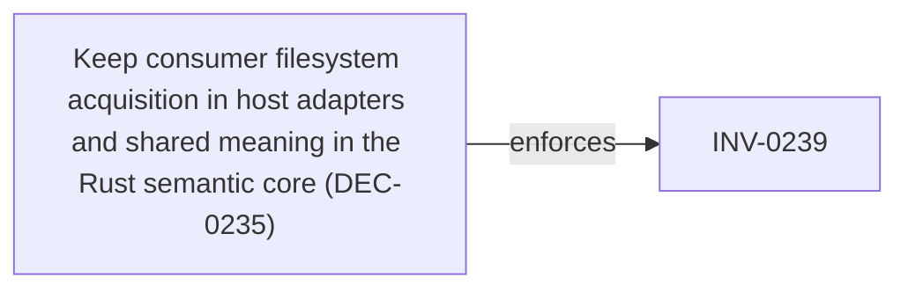

<!--
integrity_schema_version: 1
generated: deterministic_projection_v1
artifact_kind: rendered_adr_markdown
generator_id: adr-projection-markdown
generator_version: 3
hash_algorithm: sha256
source_hash: 743c16a151baef799085dcf73e6b51826c168e79895e4d4359a579faf5ce25ba
rendered_hash: 9163c09d0a5bfc42e6a560fd490f9d58eb31c0bf02be1c3805ba0aa4c760da34
-->

# ADR-L-0027: Public Binding Construction and Release Parity

## Identity / Status

**Type:** logical 
**Status:** accepted 
**Alias:** ADR-L-0027 
**Authoring contract:** authoring v1.5 
**Created:** 2026-09-06 
**Authors:** erik.gallmann 
**Domains:** architecture, consumer-bindings, schema-governance, distribution 
**Tags:** public-api, python, typescript, release-parity, stable-authority 

## Architecture at a Glance

| | |
| --- | --- |
| Logical authority | ADR-L-0027 |
| Status | accepted |
| Decisions | 7 |
| Invariants | 8 |

## Context

ADR-Kit publishes Python and TypeScript APIs from one repository and one
release lineage. Public bindings must be built from the language-neutral
authority substrate rather than from private compiler, parser, schema-model,
or integrity implementation objects. The authority substrate consists of
accepted ADR decisions and invariants, canonical schema bytes and semantic
vocabularies, the normalized repository discovery bundle, promoted binding
contracts, and validated derived evidence.

ADR-L-0024 establishes capability-scoped Consumer Binding Contract
conformance. This ADR makes the release construction rule explicit: a public
API change is not release-complete until both bindings have been considered,
implemented where their declared boundary permits, documented, tested, and
represented in compatibility evidence. A binding may remain narrower only
when an accepted ADR explicitly defines the execution-profile boundary;
browser constraints are not a valid reason to narrow the TypeScript/Node host
binding.
## Architectural Decisions

| Decision | Choice | Traceability |
| --- | --- | --- |
| DEC-0201 | Public Python and TypeScript bindings are projections of one stable authority substrate | — |
| DEC-0202 | Every PyPI/npm release qualification reviews and updates both public binding surfaces | — |
| DEC-0203 | Binding parity is required for shared promoted host capabilities and is explicit only for execution-profile differences | — |
| DEC-0204 | Python and TypeScript/Node are peer host bindings for supported filesystem-backed ADR-Kit capabilities | — |
| DEC-0205 | Public API compatibility snapshots, capability manifests, schema mirrors, documentation, and conformance tests are release evidence | — |
| DEC-0206 | Host parity MUST be implemented through one canonical semantic core or authority-preserving shared execution boundary | — |
| DEC-0235 | Keep consumer filesystem acquisition in host adapters and shared meaning in the Rust semantic core | Related INV-0239 |

### DEC-0201 — Public Python and TypeScript bindings are projections of one stable authority substrate

**Rationale**

Implementations must not become independent semantic authorities through API shape or package ownership.

### DEC-0202 — Every PyPI/npm release qualification reviews and updates both public binding surfaces

**Rationale**

Shared release lineage is meaningful only when both supported language packages are synchronized with the same authority and compatibility evidence.

### DEC-0203 — Binding parity is required for shared promoted host capabilities and is explicit only for execution-profile differences

**Rationale**

Python and TypeScript/Node are peer hosts for supported capabilities; browser constraints and staged migration status must not be mistaken for a permanent host-binding difference.

### DEC-0204 — Python and TypeScript/Node are peer host bindings for supported filesystem-backed ADR-Kit capabilities

**Rationale**

Node is a host execution environment; browser restrictions must not be generalized into a TypeScript/Node capability gap.

### DEC-0205 — Public API compatibility snapshots, capability manifests, schema mirrors, documentation, and conformance tests are release evidence

**Rationale**

Source-level similarity is insufficient to prove that published Python and npm surfaces remain synchronized.

### DEC-0206 — Host parity MUST be implemented through one canonical semantic core or authority-preserving shared execution boundary

**Rationale**

Hard convergence is an invariant for advertised peer-host capabilities.
Unacceptable parity mechanisms include an independent TypeScript
compiler/validator/renderer, Node invoking Python, Node invoking the ADR
CLI, and Python remaining on an independent semantic compiler while Node
uses Rust even if output-parity tests happen to pass. Accepted authority
wins when characterization oracles conflict with the canonical core.

### DEC-0235 — Keep consumer filesystem acquisition in host adapters and shared meaning in the Rust semantic core

**Rationale**

Python and TypeScript/Node may acquire Exact Source Basis inputs from
consumer-supplied paths or explicit bytes. The Rust semantic core performs
shared meaning-bearing execution and returns exact projection bytes or
semantic results. It does not traverse consumer filesystems or write
repositories. Exact shared-capability byte parity comes from one canonical
result rather than independent host renderers.

**Traceability**
- Related invariants: INV-0239

## Invariants

| Invariant | Requirement | Enforcement | Verification |
| --- | --- | --- | --- |
| INV-0201 | Public language bindings MUST consume accepted authority, canonical schemas, promoted contracts, normalized… | MUST / design | automated |
| INV-0202 | A release that changes a public binding MUST qualify both the Python and TypeScript public surfaces against the same… | MUST / test | automated |
| INV-0203 | Every capability advertised by both bindings MUST have shared contract, schema, documentation, and cross-language… | MUST / test | automated |
| INV-0204 | A capability implemented in one host binding but excluded from the other MUST have an accepted ADR exception and… | MUST / design | automated |
| INV-0205 | Public result object graphs and type declarations MUST exclude private compiler, parser, schema-model, and integrity… | MUST / test | automated |
| INV-0206 | TypeScript/Node parity MUST NOT be achieved by independently recreating compiler, validator, renderer, schema, or… | MUST / design | automated |
| INV-0207 | Browser-safe capability restrictions MUST be declared as an execution profile and MUST NOT remove filesystem-backed… | MUST / design | automated |
| INV-0239 | For advertised shared peer-host capabilities, Python and Node MUST obtain meaning-bearing projection bytes from one… | MUST / design | automated |

### INV-0201

**Statement**

Public language bindings MUST consume accepted authority, canonical schemas, promoted contracts, normalized discovery, or validated derived evidence and MUST NOT expose private implementation objects as public authority.

**Scope:** global

**Enforcement:** MUST (design)
**Verification:** automated

**Rationale**

Binding APIs are supported projections, not semantic owners.

### INV-0202

**Statement**

A release that changes a public binding MUST qualify both the Python and TypeScript public surfaces against the same release authority and MUST record any capability-specific boundary explicitly.

**Scope:** global

**Enforcement:** MUST (test)
**Verification:** automated

**Rationale**

PyPI and npm are one ADR-Kit release lineage.

### INV-0203

**Statement**

Every capability advertised by both bindings MUST have shared contract, schema, documentation, and cross-language conformance evidence.

**Scope:** global

**Enforcement:** MUST (test)
**Verification:** automated

**Rationale**

Capability intersection is the qualification unit defined by ADR-L-0024.

### INV-0204

**Statement**

A capability implemented in one host binding but excluded from the other MUST have an accepted ADR exception and MUST NOT be represented as silently equivalent.

**Scope:** global

**Enforcement:** MUST (design)
**Verification:** automated

**Rationale**

Explicit narrower support preserves honest capability discovery.

### INV-0205

**Statement**

Public result object graphs and type declarations MUST exclude private compiler, parser, schema-model, and integrity implementation types.

**Scope:** global

**Enforcement:** MUST (test)
**Verification:** automated

**Rationale**

Public compatibility must remain stable while private implementations evolve.

### INV-0206

**Statement**

TypeScript/Node parity MUST NOT be achieved by independently recreating
compiler, validator, renderer, schema, or governance semantics; by invoking
Python or the ADR CLI from Node; or by leaving Python on an independent
semantic compiler while Node uses the Rust core for the same advertised
capability.

**Scope:** global

**Enforcement:** MUST (design)
**Verification:** automated

**Rationale**

Shared host capability requires shared semantic authority.

### INV-0207

**Statement**

Browser-safe capability restrictions MUST be declared as an execution profile and MUST NOT remove filesystem-backed or repository-host capabilities from the TypeScript/Node binding.

**Scope:** global

**Enforcement:** MUST (design)
**Verification:** automated

**Rationale**

Browser and Node are distinct execution environments.

### INV-0239

**Statement**

For advertised shared peer-host capabilities, Python and Node MUST obtain
meaning-bearing projection bytes from one canonical semantic-core result and
MUST NOT rely on independent host-local renderers to manufacture byte parity.

**Scope:** global

**Enforcement:** MUST (design)
**Verification:** automated

**Rationale**

Independent renderers create semantic drift even when tests appear green.

## Decision / Intent Traceability

### Decision Traceability

## Lifecycle / Related Architecture

**Related ADRs**
- [ADR-L-0030](ADR-L-0030-canonical-source-basis-and-semantic-execution-surface.md)
- [ADR-L-0024](ADR-L-0024-cross-language-consumer-bindings-and-typescript-distribution.md)
- [ADR-L-0026](ADR-L-0026-authoring-domain-contract-discovery-authority.md)
- [ADR-L-0019](ADR-L-0019-canonical-entity-identity.md)
- [ADR-L-0017](ADR-L-0017-forward-authoring-ergonomics-for-split-physical-adr-types.md)

**References**
- [ADR-L-0019](ADR-L-0019-canonical-entity-identity.md)
- [ADR-L-0017](ADR-L-0017-forward-authoring-ergonomics-for-split-physical-adr-types.md)
- [ADR-L-0024](ADR-L-0024-cross-language-consumer-bindings-and-typescript-distribution.md)
- [ADR-L-0026](ADR-L-0026-authoring-domain-contract-discovery-authority.md)
- [ADR-L-0030](ADR-L-0030-canonical-source-basis-and-semantic-execution-surface.md)
- [ADR-L-0028](ADR-L-0028-normative-semantic-authority-and-materialization-foundation.md)
- [ADR-L-0029](ADR-L-0029-semantic-authoring-construction-and-candidate-authority.md)
- [ADR-L-0031](ADR-L-0031-non-recursive-semantic-contract-conformance-binding.md)

## Notes

{'packed_installed_package_qualification': 'Where a capability is advertised as peer-host shared, packed installed-package\nqualification remains release evidence under ADR-L-0028 INV-0222 and is not\nredefined here.\n', 'stable_authority_substrate': ['accepted ADR decisions and invariants', 'canonical schema bytes and semantic vocabularies', 'normalized repository discovery bundle', 'promoted consumer and authoring contracts', 'validated derived evidence'], 'qualification_artifacts': ['contracts/compatibility/python-surface.json', 'contracts/compatibility/typescript-surface.json', 'contracts/compatibility/host-capabilities.json', 'contracts/semantic-core/v1.0/contract.json', 'contracts/semantic-core/v1.0/vectors/contract-validation.json', 'contracts/semantic-core/v1.0/vectors/project-metadata-validation.json', 'contracts/semantic-core/v1.0/vectors/repository-validation.json', 'contracts/semantic-core/v1.0/vectors/generated-artifact-classification.json', 'contracts/semantic-core/v1.0/vectors/embodiment-linkage.json', 'contracts/semantic-core/v1.0/vectors/architecture-reference-validation.json', 'contracts/semantic-core/v1.0/vectors/architecture-validation.json', 'contracts/compatibility/python-capabilities.json', 'packages/node tests', 'Python public SDK tests'], 'staged_shared_core_migration': 'The first authority-preserving extraction covers normalized contract,\nproject-metadata, repository identity, provider-routing, and embodiment-\nlinkage semantics, generated-artifact integrity classification, and\narchitecture source-validation plus cross-reference/topology validation, through\ncontracts/semantic-core/v1.0. Python and Node consume the same\npackaged execution artifact directly, with filesystem discovery kept in each\nhost adapter. Remaining Python-only operations\nare listed in contracts/compatibility/host-capabilities.json and require\nthe same bounded extraction treatment before they become peer-host\ncapabilities.\n'}

---

*Generated from ADR-L-0027 by ADR Architecture Kit (projection v3)*