<!--
integrity_schema_version: 1
generated: deterministic_projection_v1
artifact_kind: rendered_adr_markdown
generator_id: adr-projection-markdown
generator_version: 3
hash_algorithm: sha256
source_hash: 524c54f1831e386382fe169cc11bac9c0625248a1d7c7dacd3741b674a19e04a
rendered_hash: 0cd4a72707dc5215a03f4ef24f824789e43b0fd452ba0470a7899efef1f9cd77
-->

# ADR-L-0030: Canonical Source Basis and Semantic Execution Surface

## Identity / Status

**Type:** logical 
**Status:** accepted 
**Alias:** ADR-L-0030 
**Authoring contract:** authoring v1.5 
**Created:** 2026-09-13 
**Authors:** erik.gallmann 
**Domains:** architecture, semantic-authority, authoring, consumer-bindings, determinism, projection 
**Tags:** exact-source-basis, semantic-execution, semantic-results, host-bindings, projection-bytes, promotion-seam 

## Architecture at a Glance

| | |
| --- | --- |
| Logical authority | ADR-L-0030 |
| Status | accepted |
| Decisions | 10 |
| Invariants | 10 |

## Context

Accepted host-parity and materialization authority already require one
semantic core and sealed source qualification for detached materialization.
ADR-Kit still needs an explicit authoring execution boundary for consumer-
bounded interpretation: how consumers establish what ADR-Kit may know, how
that basis becomes canonical semantic results, and how projections and
validation remain subordinate to that execution path.

This ADR promotes that execution-surface architecture only. It does not
implement public semantic-result APIs, move the compiler into Rust, add Node
APIs, authorize semantic-fragment construction, finalize Design Journal UX,
or advertise new distribution capabilities. Existing peer-host and materialization
decisions remain authoritative where they already bind shared semantics.
## Architectural Decisions

| Decision | Choice | Traceability |
| --- | --- | --- |
| DEC-0219 | Require canonical interpretation and compilation to operate over an Exact Source Basis | Related INV-0224, INV-0226, INV-0227 |
| DEC-0220 | Allow path-scoped governed discovery or explicit source bytes, converging to one Exact Source Basis | Related INV-0224, INV-0225 |
| DEC-0221 | Make Rust semantic-core execution the canonical meaning-bearing path over an Exact Source Basis | Related INV-0225, INV-0230 |
| DEC-0222 | Treat semantic results as interpret(source basis) with optional deterministic bounded selection | Related INV-0228 |
| DEC-0223 | Require relationship maps and graph results to project canonical normalized semantics only | Related INV-0229 |
| DEC-0224 | Require meaning-bearing deterministic projection bytes to come from the canonical semantic execution path | Related INV-0230, INV-0231 |
| DEC-0225 | Require generated-artifact validation to use the same canonical projection authority as generation | Related INV-0230 |
| DEC-0226 | Preserve capability through public APIs while treating CLI as a human UX adapter | Related INV-0232 |
| DEC-0227 | Allow prepare_promotion, check_promotion, and apply_promotion as versioned peer-host seams without finalizing Design Journal | Related INV-0233 |
| DEC-0228 | Keep workspace compile, Runtime discovery, Design Journal finality, construction, ArchSplain, and online version discovery deferred | — |

### DEC-0219 — Require canonical interpretation and compilation to operate over an Exact Source Basis

**Rationale**

An Exact Source Basis is the consumer-bounded set of ADR-Kit-owned source
artifacts ADR-Kit is allowed to know for a semantic operation. It preserves,
as appropriate, logical source identity or relative path, exact source bytes,
source classification, ADR-Kit-calculated content digest, applicable contract
qualification, source-basis fingerprint, and acquisition diagnostics. It is
not whole-repository authority and must not infer architecture from source
code, IaC, arbitrary docs, or Runtime-style embodiment surfaces.

**Traceability**
- Related invariants: INV-0224
- Related invariants: INV-0226
- Related invariants: INV-0227

### DEC-0220 — Allow path-scoped governed discovery or explicit source bytes, converging to one Exact Source Basis

**Rationale**

Consumers may either supply an explicit repository or ADR-domain path for
bounded governed discovery of ADR-Kit-owned artifacts within that scope, or
supply exact source artifacts or bytes directly. Both modes must converge to
the same Exact Source Basis before semantic interpretation. Equivalent exact
source bases must yield equivalent semantic results regardless of acquisition
mode. Host adapters perform acquisition; the Rust semantic core must not
traverse the consumer filesystem.

**Traceability**
- Related invariants: INV-0224
- Related invariants: INV-0225

### DEC-0221 — Make Rust semantic-core execution the canonical meaning-bearing path over an Exact Source Basis

**Rationale**

For every advertised peer-host capability, Python and TypeScript/Node must
converge on the same canonical Rust semantic implementation. The existing
Python implementation may act as a characterization or migration oracle, but
accepted authority wins when behavior conflicts. This decision extends
ADR-L-0027 hard-convergence authority into the Exact Source Basis execution
boundary without redefining host-parity ownership.

**Traceability**
- Related invariants: INV-0225
- Related invariants: INV-0230

### DEC-0222 — Treat semantic results as interpret(source basis) with optional deterministic bounded selection

**Rationale**

Given an Exact Source Basis, ADR-Kit must eventually provide a public
peer-host capability that returns either the complete canonical semantic
result or a deterministic bounded semantic selection or traversal projection.
Source basis (what ADR-Kit may know) remains distinct from selection (which
semantic subset the consumer wants returned). This ADR does not lock a public
function name and does not define a speculative query DSL. Selections may
later address entities such as ADR, Decision, Invariant, NormativeProposition,
System, Component, Interface, DataFlow, relationships, UUID or alias,
unresolved semantics, and bounded graph traversal.

**Traceability**
- Related invariants: INV-0228

### DEC-0223 — Require relationship maps and graph results to project canonical normalized semantics only

**Rationale**

Relationship and graph outputs must remain deterministic projections of the
same canonical semantic result. They must not become a second ontology or an
independently interpreted graph authority. This aligns with human-projection
relationship authority in ADR-L-0007 without duplicating that renderer rule.

**Traceability**
- Related invariants: INV-0229

### DEC-0224 — Require meaning-bearing deterministic projection bytes to come from the canonical semantic execution path

**Rationale**

For an Exact Source Basis and exact compile options, the canonical core
produces the exact artifact byte set. Hosts may acquire source, preview
returned bytes, persist exact returned bytes, and compare repository bytes to
canonical expected bytes. The Rust core itself does not write repositories.
Python and Node byte parity must come from one canonical result, not from
independent renderers attempting to agree.

**Traceability**
- Related invariants: INV-0230
- Related invariants: INV-0231

### DEC-0225 — Require generated-artifact validation to use the same canonical projection authority as generation

**Rationale**

Host bindings must not independently reproduce meaning-bearing validation
rules for shared generated artifacts. Validation compares repository state to
canonical expected bytes or equivalent canonical projection results.

**Traceability**
- Related invariants: INV-0230

### DEC-0226 — Preserve capability through public APIs while treating CLI as a human UX adapter

**Rationale**

ADR-Kit is pre-1.0 and preserves capability rather than historical command
topology. Public APIs are the machine integration boundary. Compilation
remains the unified projection capability. Redundant CLI generation commands
may later be removed when fully represented by public APIs. Retained CLI
commands must not own unique semantic behavior, and public operations must
not be invented merely to mirror historical CLI command names such as
generateManifest or generateRegistry.

**Traceability**
- Related invariants: INV-0232

### DEC-0227 — Allow prepare_promotion, check_promotion, and apply_promotion as versioned peer-host seams without finalizing Design Journal

**Rationale**

These operations are real governed authoring execution capabilities based on
the explicitly provisional ste.design_journal.promotion_contract/v0.1.
Exposing them through peer hosts is allowed so consumers can pressure the
current model. Doing so must not imply Design Journal stability, authorize
richer Design Journal construction APIs, or depend on semantic-fragment
construction authority.

**Traceability**
- Related invariants: INV-0233

### DEC-0228 — Keep workspace compile, Runtime discovery, Design Journal finality, construction, ArchSplain, and online version discovery deferred

**Rationale**

This authority pass does not authorize workspace or recursive compilation
semantics, arbitrary Runtime repository/source-code/IaC discovery, final
Design Journal UX or domain model, semantic-fragment construction, ArchSplain
application behavior, or online tool-version or update discovery.

## Invariants

| Invariant | Requirement | Enforcement | Verification |
| --- | --- | --- | --- |
| INV-0224 | Equivalent Exact Source Bases MUST yield equivalent canonical semantic results regardless of acquisition mode. | MUST / design | automated |
| INV-0225 | The Rust semantic core MUST NOT traverse the consumer filesystem; host adapters MUST perform source acquisition into… | MUST / design | automated |
| INV-0226 | When exact source bytes are available, ADR-Kit-calculated content digests MUST be authoritative and caller-provided… | MUST / design | automated |
| INV-0227 | The semantic-core boundary SHOULD receive exact source bytes rather than host-specific parsed YAML objects unless… | SHOULD / design | manual |
| INV-0228 | Bounded semantic selections or traversals MUST be deterministic projections of the same canonical semantic result… | MUST / design | automated |
| INV-0229 | Relationship maps and graph results MUST project canonical normalized semantics and MUST NOT become a second… | MUST / design | automated |
| INV-0230 | For shared peer-host capabilities, host bindings MUST NOT independently implement meaning-bearing compilers,… | MUST / design | automated |
| INV-0231 | The Rust semantic core MUST return exact projection bytes or semantic results and MUST NOT write consumer repositories. | MUST / design | automated |
| INV-0232 | Retained CLI commands MUST adapt public API capability for human UX and MUST NOT own unique meaning-bearing semantic… | MUST / design | automated |
| INV-0233 | Peer-host availability of prepare_promotion, check_promotion, and apply_promotion MUST NOT imply that the Design… | MUST / design | manual |

### INV-0224

**Statement**

Equivalent Exact Source Bases MUST yield equivalent canonical semantic results regardless of acquisition mode.

**Scope:** global

**Enforcement:** MUST (design)
**Verification:** automated

**Rationale**

Acquisition mode must not become a hidden semantic input.

### INV-0225

**Statement**

The Rust semantic core MUST NOT traverse the consumer filesystem; host adapters MUST perform source acquisition into an Exact Source Basis.

**Scope:** global

**Enforcement:** MUST (design)
**Verification:** automated

**Rationale**

Filesystem policy and consumer scope remain host responsibilities.

### INV-0226

**Statement**

When exact source bytes are available, ADR-Kit-calculated content digests MUST be authoritative and caller-provided hashes MUST NOT be trusted as semantic authority.

**Scope:** global

**Enforcement:** MUST (design)
**Verification:** automated

**Rationale**

Digests are derived integrity evidence of exact bytes, not caller claims.

### INV-0227

**Statement**

The semantic-core boundary SHOULD receive exact source bytes rather than host-specific parsed YAML objects unless existing accepted authority already requires otherwise.

**Scope:** global

**Enforcement:** SHOULD (design)
**Verification:** manual

**Rationale**

Exact bytes preserve host-neutral acquisition and digest authority.

### INV-0228

**Statement**

Bounded semantic selections or traversals MUST be deterministic projections of the same canonical semantic result for the Exact Source Basis.

**Scope:** global

**Enforcement:** MUST (design)
**Verification:** automated

**Rationale**

Selection cannot invent an alternate interpreted architecture.

### INV-0229

**Statement**

Relationship maps and graph results MUST project canonical normalized semantics and MUST NOT become a second ontology or independently interpreted graph authority.

**Scope:** global

**Enforcement:** MUST (design)
**Verification:** automated

**Rationale**

One semantic ontology must remain shared across hosts and projections.

### INV-0230

**Statement**

For shared peer-host capabilities, host bindings MUST NOT independently implement meaning-bearing compilers, validators, or renderers, and MUST NOT achieve parity by invoking another host or the ADR CLI.

**Scope:** global

**Enforcement:** MUST (design)
**Verification:** automated

**Rationale**

Hard convergence requires one canonical semantic authority path.

### INV-0231

**Statement**

The Rust semantic core MUST return exact projection bytes or semantic results and MUST NOT write consumer repositories.

**Scope:** global

**Enforcement:** MUST (design)
**Verification:** automated

**Rationale**

Persistence and repository mutation remain host or caller responsibilities.

### INV-0232

**Statement**

Retained CLI commands MUST adapt public API capability for human UX and MUST NOT own unique meaning-bearing semantic behavior.

**Scope:** global

**Enforcement:** MUST (design)
**Verification:** automated

**Rationale**

Machine integration remains the public API surface.

### INV-0233

**Statement**

Peer-host availability of prepare_promotion, check_promotion, and apply_promotion MUST NOT imply that the Design Journal or promotion-contract domain model is final, and MUST NOT authorize richer Design Journal construction APIs by itself.

**Scope:** global

**Enforcement:** MUST (design)
**Verification:** manual

**Rationale**

The promotion seam is provisional execution pressure, not Design Journal completion.

## Decision / Intent Traceability

### Decision Traceability

```mermaid
flowchart LR
  %% Decision traceability
  n_01a09cf0_179e_71cc_b150_d4a88b327ed8["Require canonical interpretation and compilation to operate over an Exact Source Basis (DEC-0219)"]
  n_01a09cf0_179e_71cc_b150_d4a9898342bc["Allow path-scoped governed discovery or explicit source bytes, converging to one Exact Source Basis (DEC-0220)"]
  n_01a09cf0_179e_71cc_b150_d4aa0167e62c["Make Rust semantic-core execution the canonical meaning-bearing path over an Exact Source Basis (DEC-0221)"]
  n_01a09cf0_179e_71cc_b150_d4abc8366d8e["Treat semantic results as interpret(source basis) with optional deterministic bounded selection (DEC-0222)"]
  n_01a09cf0_179e_71cc_b150_d4ac397306fa["Require relationship maps and graph results to project canonical normalized semantics only (DEC-0223)"]
  n_01a09cf0_179e_71cc_b150_d4ad04f5223a["Require meaning-bearing deterministic projection bytes to come from the canonical semantic execution path (DEC-0224)"]
  n_01a09cf0_179e_71cc_b150_d4aef5d57af2["Require generated-artifact validation to use the same canonical projection authority as generation (DEC-0225)"]
  n_01a09cf0_179e_71cc_b150_d4af6633c6f5["Preserve capability through public APIs while treating CLI as a human UX adapter (DEC-0226)"]
  n_01a09cf0_179e_71cc_b150_d4b0b024e76b["Allow prepare_promotion, check_promotion, and apply_promotion as versioned peer-host seams without finalizing Design Journal (DEC-0227)"]
  n_01a09cf0_179e_71cc_b150_d4b267533634["INV-0224"]
  n_01a09cf0_179e_71cc_b150_d4b3dc9cb5ab["INV-0225"]
  n_01a09cf0_179e_71cc_b150_d4b450b69792["INV-0226"]
  n_01a09cf0_179e_71cc_b150_d4b520a6b4d2["INV-0227"]
  n_01a09cf0_179e_71cc_b150_d4b6e1a037ce["INV-0228"]
  n_01a09cf0_179e_71cc_b150_d4b76a1fb95a["INV-0229"]
  n_01a09cf0_179e_71cc_b150_d4b88005b71b["INV-0230"]
  n_01a09cf0_179e_71cc_b150_d4b924025c57["INV-0231"]
  n_01a09cf0_179e_71cc_b150_d4ba17576e20["INV-0232"]
  n_01a09cf0_179e_71cc_b150_d4bbcb854583["INV-0233"]
  n_01a09cf0_179e_71cc_b150_d4a88b327ed8 -->|"enforces"| n_01a09cf0_179e_71cc_b150_d4b267533634
  n_01a09cf0_179e_71cc_b150_d4a88b327ed8 -->|"enforces"| n_01a09cf0_179e_71cc_b150_d4b450b69792
  n_01a09cf0_179e_71cc_b150_d4a88b327ed8 -->|"enforces"| n_01a09cf0_179e_71cc_b150_d4b520a6b4d2
  n_01a09cf0_179e_71cc_b150_d4a9898342bc -->|"enforces"| n_01a09cf0_179e_71cc_b150_d4b267533634
  n_01a09cf0_179e_71cc_b150_d4a9898342bc -->|"enforces"| n_01a09cf0_179e_71cc_b150_d4b3dc9cb5ab
  n_01a09cf0_179e_71cc_b150_d4aa0167e62c -->|"enforces"| n_01a09cf0_179e_71cc_b150_d4b3dc9cb5ab
  n_01a09cf0_179e_71cc_b150_d4aa0167e62c -->|"enforces"| n_01a09cf0_179e_71cc_b150_d4b88005b71b
  n_01a09cf0_179e_71cc_b150_d4abc8366d8e -->|"enforces"| n_01a09cf0_179e_71cc_b150_d4b6e1a037ce
  n_01a09cf0_179e_71cc_b150_d4ac397306fa -->|"enforces"| n_01a09cf0_179e_71cc_b150_d4b76a1fb95a
  n_01a09cf0_179e_71cc_b150_d4ad04f5223a -->|"enforces"| n_01a09cf0_179e_71cc_b150_d4b88005b71b
  n_01a09cf0_179e_71cc_b150_d4ad04f5223a -->|"enforces"| n_01a09cf0_179e_71cc_b150_d4b924025c57
  n_01a09cf0_179e_71cc_b150_d4aef5d57af2 -->|"enforces"| n_01a09cf0_179e_71cc_b150_d4b88005b71b
  n_01a09cf0_179e_71cc_b150_d4af6633c6f5 -->|"enforces"| n_01a09cf0_179e_71cc_b150_d4ba17576e20
  n_01a09cf0_179e_71cc_b150_d4b0b024e76b -->|"enforces"| n_01a09cf0_179e_71cc_b150_d4bbcb854583
```

## Lifecycle / Related Architecture

**Related ADRs**
- [ADR-L-0007](ADR-L-0007-deterministic-documentation-projection.md)
- [ADR-L-0009](ADR-L-0009-derived-architecture-discovery-surfaces.md)
- [ADR-L-0013](ADR-L-0013-architecture-repository-boundary-and-normalized-semantic-model.md)
- [ADR-L-0010](ADR-L-0010-kernel-interface-contract-and-validation-profiles.md)
- [ADR-L-0026](ADR-L-0026-authoring-domain-contract-discovery-authority.md)
- [ADR-L-0027](ADR-L-0027-public-binding-construction-and-release-parity.md)
- [ADR-L-0028](ADR-L-0028-normative-semantic-authority-and-materialization-foundation.md)

**References**
- [ADR-L-0007](ADR-L-0007-deterministic-documentation-projection.md)
- [ADR-L-0009](ADR-L-0009-derived-architecture-discovery-surfaces.md)
- [ADR-L-0026](ADR-L-0026-authoring-domain-contract-discovery-authority.md)
- [ADR-L-0027](ADR-L-0027-public-binding-construction-and-release-parity.md)
- [ADR-L-0029](ADR-L-0029-semantic-authoring-construction-and-candidate-authority.md)
- [ADR-L-0013](ADR-L-0013-architecture-repository-boundary-and-normalized-semantic-model.md)
- [ADR-L-0010](ADR-L-0010-kernel-interface-contract-and-validation-profiles.md)
- [ADR-L-0028](ADR-L-0028-normative-semantic-authority-and-materialization-foundation.md)
- [ADR-L-0031](ADR-L-0031-non-recursive-semantic-contract-conformance-binding.md)

## Notes

Reuses ADR-L-0027 DEC-0206/INV-0206 for shared semantic-core host parity,
ADR-L-0028 DEC-0212/INV-0217 for sealed materialization source qualification,
ADR-L-0028 DEC-0215/INV-0222 for peer-host observation and installed-distribution
qualification evidence, and ADR-L-0007 DEC-0109 for human-projection
relationship ontology. This ADR adds the Exact Source Basis plus semantic-
result execution boundary those decisions do not fully define.

Explicit non-claims: no public semantic-result API is implemented or
advertised here; capability manifests remain truthful to current behavior;
semantic-fragment construction remains outside this authority pass.

---

*Generated from ADR-L-0030 by ADR Architecture Kit (projection v3)*