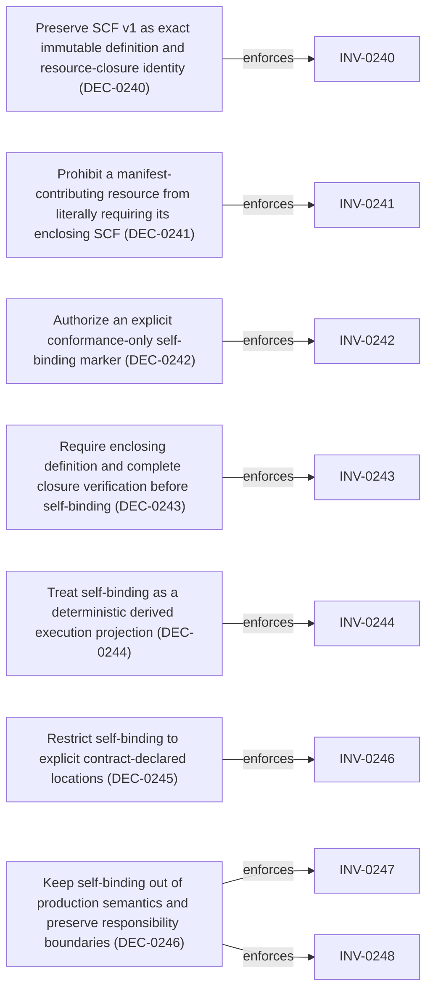

<!--
integrity_schema_version: 1
generated: deterministic_projection_v1
artifact_kind: rendered_adr_markdown
generator_id: adr-projection-markdown
generator_version: 3
hash_algorithm: sha256
source_hash: adc6305471721dbca04f75a60b992a9c024be14aa28920edf1402582b5e6069a
rendered_hash: 565482adb9be4904fccb6b6d2aea925e4243213387a8d8f5353a9a7ccef8e0e2
-->

# ADR-L-0031: Non-Recursive Semantic Contract Conformance Binding

## Identity / Status

**Type:** logical 
**Status:** accepted 
**Alias:** ADR-L-0031 
**Authoring contract:** authoring v1.5 
**Created:** 2026-09-18 
**Authors:** erik.gallmann 
**Domains:** architecture, semantic-authority, schema-governance, conformance, determinism 
**Tags:** semantic-contracts, scf, resource-closure, conformance-binding, exact-authority, non-recursive-identity 

## Architecture at a Glance

| | |
| --- | --- |
| Logical authority | ADR-L-0031 |
| Status | accepted |
| Decisions | 7 |
| Invariants | 9 |

## Context

Accepted semantic-contract authority defines SCF v1 as an identity over an
immutable semantic-contract definition whose resource manifest contains
exact content digests. Frozen normative conformance resources are members of
that manifest, and resource closure verifies the supplied canonical bytes
against those digests.

A frozen conformance resource may need to exercise requests or results that
carry the exact identity of its enclosing semantic contract. Literal
insertion of that enclosing SCF into the same resource would make the
resource bytes depend on the resource digest that participates in the SCF,
creating an identity cycle. Fixed-point iteration is not a semantic identity
mechanism and cannot resolve this recursive dependency.

This ADR promotes the non-recursive authority boundary required for exact
conformance resources. It preserves SCF v1 and exact closure, authorizes a
conformance-only self-binding marker, and defines the bound value as a
verified derived execution projection. It does not implement binding,
modify ACC resources, add production APIs, or advertise construction.
## Architectural Decisions

| Decision | Choice | Traceability |
| --- | --- | --- |
| DEC-0240 | Preserve SCF v1 as exact immutable definition and resource-closure identity | Related INV-0240 |
| DEC-0241 | Prohibit a manifest-contributing resource from literally requiring its enclosing SCF | Related INV-0241 |
| DEC-0242 | Authorize an explicit conformance-only self-binding marker | Related INV-0242 |
| DEC-0243 | Require enclosing definition and complete closure verification before self-binding | Related INV-0243 |
| DEC-0244 | Treat self-binding as a deterministic derived execution projection | Related INV-0244 |
| DEC-0245 | Restrict self-binding to explicit contract-declared locations | Related INV-0246 |
| DEC-0246 | Keep self-binding out of production semantics and preserve responsibility boundaries | Related INV-0247, INV-0248 |

### DEC-0240 — Preserve SCF v1 as exact immutable definition and resource-closure identity

**Rationale**

SCF v1 remains scf:v1:sha256 over the immutable semantic-contract
definition. Exact resource bytes, their content digests, the resource
manifest, and frozen normative conformance membership remain semantic
identity inputs. No field exclusion, alternate resource digest, or
conformance-specific fingerprint calculation is introduced.

**Traceability**
- Related invariants: INV-0240

### DEC-0241 — Prohibit a manifest-contributing resource from literally requiring its enclosing SCF

**Rationale**

A resource whose exact content digest participates in an enclosing
contract's SCF cannot contain a literal copy of that same final SCF as a
required frozen value. The prohibition prevents an identity cycle without
weakening exact qualification or removing the resource from semantic
identity.

**Traceability**
- Related invariants: INV-0241

### DEC-0242 — Authorize an explicit conformance-only self-binding marker

**Rationale**

A frozen normative conformance resource MAY use the reserved marker
$enclosing_scf at contract-declared binding locations. The marker means
only the semanticContractFingerprint of the exact enclosing semantic
contract whose verified resource closure contains the resource. It never
means latest, current, installed, repository-derived, or default
authority.

**Traceability**
- Related invariants: INV-0242

### DEC-0243 — Require enclosing definition and complete closure verification before self-binding

**Rationale**

Binding is permitted only after the enclosing definition verifies against
its declared SCF, every required resource in the manifest closes against
exact supplied bytes, and the conformance resource is proven to be the
exact manifest-qualified resource being bound. A caller-provided or
ambient fingerprint cannot supply the replacement value.

**Traceability**
- Related invariants: INV-0243

### DEC-0244 — Treat self-binding as a deterministic derived execution projection

**Rationale**

Replacing an authorized marker with the verified enclosing SCF produces a
bound request or result for conformance execution. That projection is not
a new semantic-contract resource, does not enter the enclosing SCF
preimage, does not mutate the frozen resource, and does not acquire
independent semantic authority.

**Traceability**
- Related invariants: INV-0244

### DEC-0245 — Restrict self-binding to explicit contract-declared locations

**Rationale**

Binding must not be arbitrary recursive textual replacement. The
conformance resource must declare the permitted locations and each marker
is replaced only there by the verified enclosing SCF. Unknown markers,
undeclared locations, conflicting binding sources, or markers remaining
after binding fail closed.

**Traceability**
- Related invariants: INV-0246

### DEC-0246 — Keep self-binding out of production semantics and preserve responsibility boundaries

**Rationale**

The marker is permitted only in frozen conformance material. Production
requests, results, retained exact source bases, and public schemas require
the real verified SCF and reject the unbound marker. This authority adds no
persistence, admission, governance, alias reservation, Runtime mutation,
semantic inference, public capability, or host-specific semantic
implementation.

**Traceability**
- Related invariants: INV-0247
- Related invariants: INV-0248

## Invariants

| Invariant | Requirement | Enforcement | Verification |
| --- | --- | --- | --- |
| INV-0240 | SCF v1 MUST remain an identity over the immutable semantic-contract definition and exact content-addressed resource… | MUST / design | automated |
| INV-0241 | A semantic resource whose exact content digest participates in an enclosing semantic contract SCF MUST NOT require a… | MUST / design | manual |
| INV-0242 | The reserved marker $enclosing_scf MAY occur only in a frozen normative conformance resource at an explicitly… | MUST / design | automated |
| INV-0243 | Self-binding MUST occur only after the enclosing semantic-contract definition verifies against its declared SCF,… | MUST / design | automated |
| INV-0244 | A projection that replaces an authorized self-binding marker with the verified enclosing SCF MUST be treated as a… | MUST / design | automated |
| INV-0245 | Self-binding MUST replace markers only at contract-declared locations; unknown markers, undeclared locations,… | MUST / design | automated |
| INV-0246 | Production wire schemas, public APIs, ordinary consumer requests, semantic results, and retained exact source bases… | MUST / design | automated |
| INV-0247 | Any change to a frozen unbound conformance resource, including case meaning, expected results, diagnostics, binding… | MUST / design | automated |
| INV-0248 | Self-binding MUST NOT create persistence, repository admission, governance promotion, alias reservation, Runtime… | MUST / design | manual |

### INV-0240

**Statement**

SCF v1 MUST remain an identity over the immutable semantic-contract definition and exact content-addressed resource closure; implementations MUST NOT exclude conformance resources, ignore fields in exact resource digests, or introduce an alternate semantic digest for this rule.

**Scope:** global

**Enforcement:** MUST (design)
**Verification:** automated

**Rationale**

Exact closure and SCF identity remain one semantic authority.

### INV-0241

**Statement**

A semantic resource whose exact content digest participates in an enclosing semantic contract SCF MUST NOT require a literal copy of that same enclosing SCF in its frozen bytes.

**Scope:** global

**Enforcement:** MUST (design)
**Verification:** manual

**Rationale**

Literal self-embedding creates a recursive identity dependency.

### INV-0242

**Statement**

The reserved marker $enclosing_scf MAY occur only in a frozen normative conformance resource at an explicitly declared self-binding location and MUST denote only the verified SCF of its exact enclosing semantic contract.

**Scope:** conformance

**Enforcement:** MUST (design)
**Verification:** automated

**Rationale**

The marker is a closed conformance binding mechanism, not ambient authority.

### INV-0243

**Statement**

Self-binding MUST occur only after the enclosing semantic-contract definition verifies against its declared SCF, complete required resource closure verifies successfully, and the conformance resource is proven to be the exact manifest-qualified resource being bound.

**Scope:** conformance

**Enforcement:** MUST (design)
**Verification:** automated

**Rationale**

Binding cannot establish or repair the authority it consumes.

### INV-0244

**Statement**

A projection that replaces an authorized self-binding marker with the verified enclosing SCF MUST be treated as a deterministic execution projection, MUST NOT be a new semantic-contract resource, and MUST NOT mutate or replace the frozen resource.

**Scope:** conformance

**Enforcement:** MUST (design)
**Verification:** automated

**Rationale**

Execution binding does not create a second identity or authority.

### INV-0245

**Statement**

Self-binding MUST replace markers only at contract-declared locations; unknown markers, undeclared locations, multiple conflicting binding sources, and markers remaining after binding MUST fail closed.

**Scope:** conformance

**Enforcement:** MUST (design)
**Verification:** automated

**Rationale**

Closed paths prevent arbitrary recursive replacement from becoming semantic behavior.

### INV-0246

**Statement**

Production wire schemas, public APIs, ordinary consumer requests, semantic results, and retained exact source bases MUST require the real verified scf:v1:sha256 value and MUST reject an unbound $enclosing_scf marker.

**Scope:** production

**Enforcement:** MUST (design)
**Verification:** automated

**Rationale**

Conformance-only self-binding cannot weaken production exact qualification.

### INV-0247

**Statement**

Any change to a frozen unbound conformance resource, including case meaning, expected results, diagnostics, binding declarations, binding locations, or the self-binding marker, MUST change its exact resource digest and therefore the enclosing semantic-contract identity.

**Scope:** conformance

**Enforcement:** MUST (design)
**Verification:** automated

**Rationale**

Self-binding must not provide a loophole around normative contract identity.

### INV-0248

**Statement**

Self-binding MUST NOT create persistence, repository admission, governance promotion, alias reservation, Runtime mutation, semantic inference, or a host-specific semantic implementation, and peer hosts MUST obtain equivalent binding semantics from one canonical authority when implemented.

**Scope:** global

**Enforcement:** MUST (design)
**Verification:** manual

**Rationale**

Binding preserves the existing responsibility boundaries and canonical execution authority.

## Decision / Intent Traceability

### Decision Traceability

## Lifecycle / Related Architecture

**Related ADRs**
- [ADR-L-0027](ADR-L-0027-public-binding-construction-and-release-parity.md)
- [ADR-L-0028](ADR-L-0028-normative-semantic-authority-and-materialization-foundation.md)
- [ADR-L-0029](ADR-L-0029-semantic-authoring-construction-and-candidate-authority.md)
- [ADR-L-0030](ADR-L-0030-canonical-source-basis-and-semantic-execution-surface.md)

**References**
- [ADR-L-0027](ADR-L-0027-public-binding-construction-and-release-parity.md)
- [ADR-L-0028](ADR-L-0028-normative-semantic-authority-and-materialization-foundation.md)
- [ADR-L-0029](ADR-L-0029-semantic-authoring-construction-and-candidate-authority.md)
- [ADR-L-0030](ADR-L-0030-canonical-source-basis-and-semantic-execution-surface.md)
- [ADR-L-0032](ADR-L-0032-candidate-source-representation-and-round-trip-basis-authority.md)

## Notes

This promotion responds to the recursive identity contradiction exposed while
hardening Authoring Construction Contract 1.0. The unbound frozen
conformance resource remains the normative content-addressed resource. A
future shared semantic authority may derive a bound execution projection
only after verified definition and closure checks.

The marker and binding declarations are conformance-only authority. They do
not authorize ACC schema changes, semantic-core 1.2 implementation,
architecture-authoring@1.0, public construction or validation capabilities,
persistence, Runtime integration, or release packaging. Python and
TypeScript/Node MUST NOT independently evolve binding semantics; future
execution belongs to the shared canonical semantic authority.

No accepted historical semantic-contract definition is amended or replaced
by this ADR. ACC cleanup may proceed in a later bounded slice after the
conformance resource uses this non-recursive authority boundary.

---

*Generated from ADR-L-0031 by ADR Architecture Kit (projection v3)*