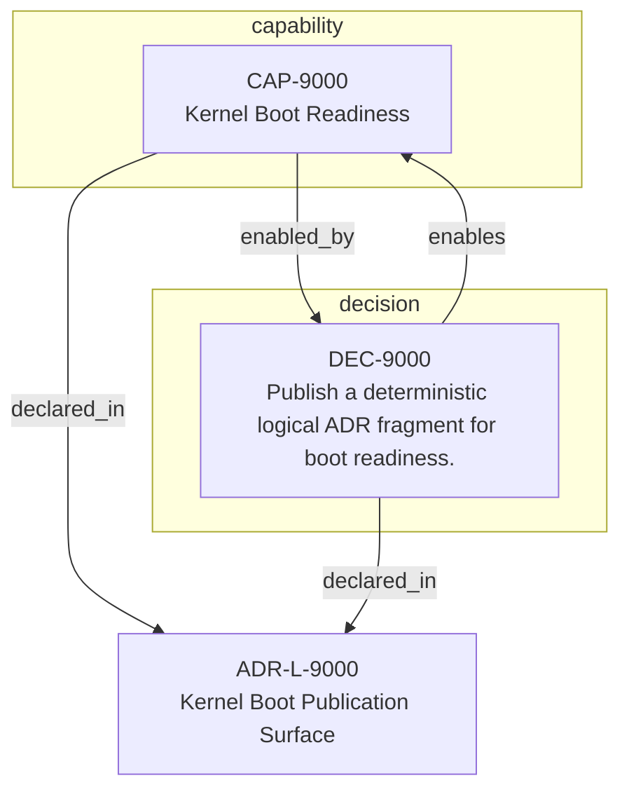

<!--
integrity_schema_version: 1
generated: deterministic_projection_v1
artifact_kind: rendered_adr_markdown
generator_id: adr-projection-markdown
generator_version: 3
hash_algorithm: sha256
source_hash: df5695415a231232f068b576390e9ef40ac1653003dd1260dc69eaf772749c9f
rendered_hash: d78ce2aa58aa3c6424519dde4df926aa4748337dcbca496939c027b95636a100
-->

# ADR-L-9000: Kernel Boot Publication Surface

## Identity / Status

**Type:** logical  
**Status:** accepted  
**Alias:** ADR-L-9000  
**Alias name:** kernel-boot-publication-surface  
**Created:** 2026-03-21  
**Authors:** adr-architecture-kit  
**Domains:** kernel, integration  

## Architecture Position

Logical architecture authority for this subject. Neighborhood paths use structural bridges plus exactly one semantic architecture edge; they never invent ADR-to-ADR verbs.

## Architecture Neighborhood

### Semantic architecture inventory

- None

## Neighbor Relationships

No grammatical peer neighborhood for this subject.

## Context

The STE workspace needs a deterministic ADR-backed Architecture IR fragment
publication surface at a conventional path so ste-kernel can prove boot
readiness across real sibling adapters. This ADR defines only that minimal
publication surface.

## Internal Structure

- `capability` CAP-9000 — Kernel Boot Readiness
- `decision` DEC-9000 — Publish a deterministic logical ADR fragment for boot readiness.

## Capabilities

### CAP-9000: Kernel Boot Readiness

Provide a deterministic ADR publication surface for kernel boot-readiness compilation.

## Decisions

### DEC-9000: Publish a deterministic logical ADR fragment for boot readiness.

**Rationale:**
ste-kernel requires a contract-backed ADR fragment source at a conventional path.

---

*Generated from ADR-L-9000 by ADR Architecture Kit (projection v3)*