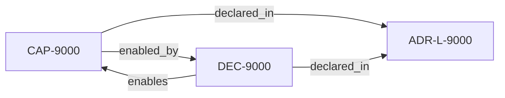

<!--
integrity_schema_version: 1
generated: deterministic_projection_v1
artifact_kind: rendered_adr_markdown
generator_id: adr-projection-markdown
generator_version: 2
hash_algorithm: sha256
source_hash: 4b2661372fe1cb303cedd3c426a1cb486f0db3edc4a9af652869966075bfe5bf
rendered_hash: 56b166ac85cf3966a76db45c0088493593c369ee031aa25b4e93ab531f6c29dd
-->

# ADR-L-9000: Kernel Boot Publication Surface

**Status:** accepted  
**Created:** 2026-03-21  
**Authors:** adr-architecture-kit  
**Domains:** kernel, integration  
**Tags:** boot, publication  **Alias name:** kernel-boot-publication-surface  
## Context

The STE workspace needs a deterministic ADR-backed Architecture IR fragment
publication surface at a conventional path so ste-kernel can prove boot
readiness across real sibling adapters. This ADR defines only that minimal
publication surface.

## Relationship graph

## Capabilities

### CAP-9000: Kernel Boot Readiness

Provide a deterministic ADR publication surface for kernel boot-readiness compilation.

## Decisions

### DEC-9000: Publish a deterministic logical ADR fragment for boot readiness.

**Rationale:**
ste-kernel requires a contract-backed ADR fragment source at a conventional path.

---

*Generated from ADR-L-9000 by ADR Architecture Kit*