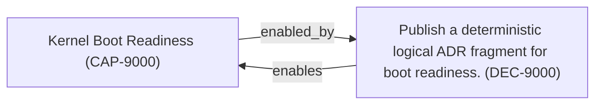

<!--
integrity_schema_version: 1
generated: deterministic_projection_v1
artifact_kind: rendered_adr_markdown
generator_id: adr-projection-markdown
generator_version: 3
hash_algorithm: sha256
source_hash: 56b2c397fc96155d5d008f2a1709d4bb517f3839752a0db59ab54fc42a2b1e2d
rendered_hash: 33ffa4374f43fe417fb64f41198992446f107f1558376b994420a585355d02d4
-->

# ADR-L-9000: Kernel Boot Publication Surface

## Identity / Status

**Type:** logical 
**Status:** accepted 
**Alias:** ADR-L-9000 
**Authoring contract:** authoring v1.5 
**Created:** 2026-03-21 
**Authors:** erik.gallmann 
**Domains:** kernel, integration 
**Tags:** boot, publication 

## Architecture at a Glance

| | |
| --- | --- |
| Logical authority | ADR-L-9000 |
| Status | accepted |
| Decisions | 1 |
| Capabilities | 1 |

## Context

The STE workspace needs a deterministic ADR-backed Architecture IR fragment
publication surface at a conventional path so ste-kernel can prove boot
readiness across real sibling adapters. This ADR defines only that minimal
publication surface.
## Architectural Decisions

### DEC-9000 — Publish a deterministic logical ADR fragment for boot readiness.

**Rationale**

ste-kernel requires a contract-backed ADR fragment source at a conventional path.

**Traceability**
- Enables: Kernel Boot Readiness (CAP-9000)

## Capabilities

### CAP-9000 — Kernel Boot Readiness

Provide a deterministic ADR publication surface for kernel boot-readiness compilation.

## Decision / Intent Traceability

### Decision Traceability

---

*Generated from ADR-L-9000 by ADR Architecture Kit (projection v3)*