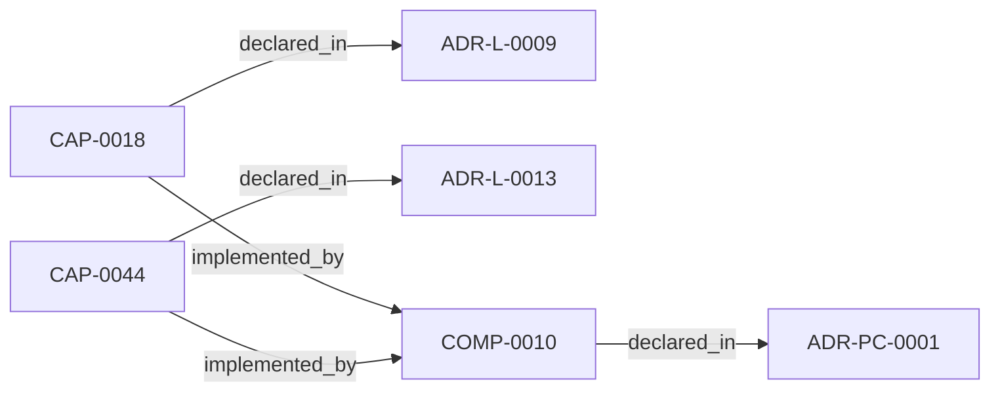
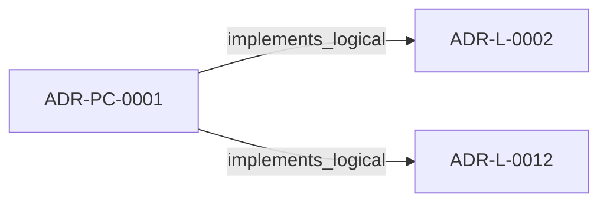
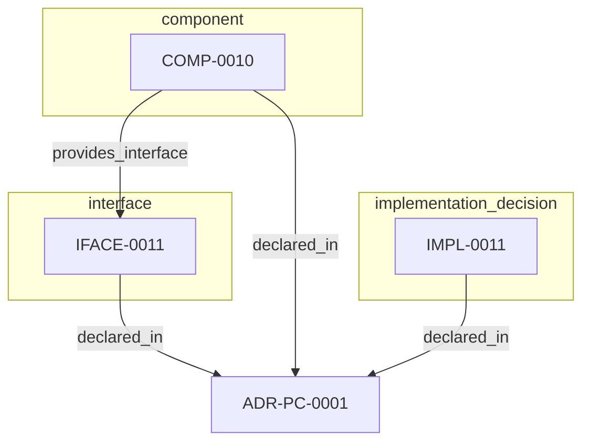

<!--
integrity_schema_version: 1
generated: deterministic_projection_v1
artifact_kind: rendered_adr_markdown
generator_id: adr-projection-markdown
generator_version: 3
hash_algorithm: sha256
source_hash: 3a03a9e4b619fc0cc5fac01705bd4f57d1c94ba9b6590eb65dab1125e302bdc4
rendered_hash: 869c6655ac9f294514723584aabd45f5362f0e2a670177afdce6e64f89cfbd22
-->

# ADR-PC-0001: Entity Registry and Discovery Index

## Identity / Status

**Type:** physical-component  
**Status:** accepted  
**Alias:** ADR-PC-0001  
**Alias name:** entity-registry-and-discovery-index  
**Created:** 2026-03-13  
**Implements Logical:** [ADR-L-0009](../logical/ADR-L-0009-derived-architecture-discovery-surfaces.md), [ADR-L-0012](../logical/ADR-L-0012-federation-authority-and-qualified-identity-model.md), [ADR-L-0002](../logical/ADR-L-0002-multi-scope-adr-architecture-for-sub-module-development.md)  
**Implements System:** [ADR-PS-0001](../physical-system/ADR-PS-0001-adr-architecture-kit-discovery-and-indexing-system.md)  

## Architecture Position

Physical-component ADRs author component, interface, and implementation entities. Topology is not authored here; neighborhood uses compiled semantic architecture edges plus structural bridges.

## Architecture Neighborhood

### Semantic architecture inventory

- `implemented_by`: CAP-0018 → COMP-0010
- `implemented_by`: CAP-0044 → COMP-0010
- `implements_logical`: ADR-PC-0001 → ADR-L-0002
- `implements_logical`: ADR-PC-0001 → ADR-L-0012

## Neighbor Relationships

### ADR-L-0002 — Multi-Scope ADR Architecture for Sub-Module Development

- ADR-PC-0001 -[:implements_logical]-> ADR-L-0002 (peer ADR-L-0002)

**Context:** The adr-architecture-kit is being actively developed in a single workspace alongside
multiple sub-modules (ste-runtime, future services) that will eventually become
independent services. Each sub-module needs to leverage the ADR system for its own
architectural documentation while being developed in parallel within the monorepo.

[Open projection](../logical/ADR-L-0002-multi-scope-adr-architecture-for-sub-module-development.md)
### ADR-L-0009 — Derived Architecture Discovery Surfaces

- CAP-0018 -[:implemented_by]-> COMP-0010 (peer ADR-L-0009)

**Context:** adr-architecture-kit is primarily machine-facing tooling used by agents to
reason over canonical architecture artifacts. Relying on agents to scan raw
ADR bodies for discovery is inconsistent with the toolkit's AI-first design
theory: discovery surfaces should be explicit, deterministic, cheap to query,
and derived from canonical authority.

[Open projection](../logical/ADR-L-0009-derived-architecture-discovery-surfaces.md)
### ADR-L-0012 — Federation Authority and Qualified Identity Model

- ADR-PC-0001 -[:implements_logical]-> ADR-L-0012 (peer ADR-L-0012)

**Context:** The compiler and recursive multi-scope model preserve repository-local
compilation boundaries, while STE federation spans independently compiled
repositories. Federation therefore requires global identity without weakening
provider authority or allowing the aggregation layer to rewrite canonical
repository state.

[Open projection](../logical/ADR-L-0012-federation-authority-and-qualified-identity-model.md)
### ADR-L-0013 — Architecture Repository Boundary and Normalized Semantic Model

- CAP-0044 -[:implemented_by]-> COMP-0010 (peer ADR-L-0013)

**Context:** adr-architecture-kit now has an explicit compiler pipeline, a compiler IR
(`ArchModel`), compiled registry bundles, and an additive architecture graph.
Those pieces are sufficient to produce deterministic machine-facing artifacts,
and ArchitectureRepository already defines the semantic in-process boundary.
Phase 1 adds a narrow supported authoring facade that reuses that seam without
expanding the normalized model or exposing compiler internals.

[Open projection](../logical/ADR-L-0013-architecture-repository-boundary-and-normalized-semantic-model.md)

## Context

The discovery/indexing component now centers on the unified compiler path. It
generates the normalized discovery bundle under `adrs/index/`, emits the
legacy compatibility registry at `adrs/entities/registry.yaml`, generates
manifest and rendered ADR markdown outputs through the same compiler-owned
path for single-scope use, and exposes exact-ID and filtered CLI query
operations over generated registry state.

It also serves as the file-format discovery surface for cross-language or
out-of-process consumers such as `ste-runtime`, which must bootstrap from the
indexed bundle rather than reparsing source ADRs.

## Internal Structure

### COMP-0010: Entity Registry Generator and Query Surface (service)

**Responsibilities:**
- Compile canonical ADR and invariant artifacts into a normalized discovery bundle
- Emit deterministic `adrs/index/*.yaml` registry artifacts
- Emit deterministic legacy compatibility registry output at `adrs/entities/registry.yaml`
- Support manifest and rendered markdown emission through the unified compile path
- Provide CLI query access over generated registry state
- Preserve an index-first discovery posture for cross-language consumers

**Interfaces:**
- **IFACE-0011** (CLI): Commands:
- adr compile
- adr generate-architecture-index
- adr generate-manifest
- adr generate-adr-projection - adr generate-rendered-docs
- adr generate-entity-registry
- adr entities list
- adr entities get <id>
- adr entities invariants
- adr entities capabilities

**Implementation Identifiers:**
- Module Path: `src/adr_kit/compiler/driver.py`

- `component` COMP-0010 — Entity Registry Generator and Query Surface
- `implementation_decision` IMPL-0011 — Route single-scope discovery generation through the unified compiler driver
- `interface` IFACE-0011 — 019fee89-e617-70e7-bb17-27b693ad01a8

## Technology Stack

### Python (language)

**Version:** >=3.14

**Rationale:**
Minimum supported Python minor is 3.14 (`requires-python >=3.14`); currently qualified released minor line is 3.14; repository reference interpreter is currently 3.14.7; new GA Python minors require explicit qualification before support is advertised. 

### PyYAML (library)

**Version:** 6.x

**Rationale:**
Stable YAML parsing and rendering for registry artifacts.

### Click (tooling)

**Version:** 8.x

**Rationale:**
Existing CLI framework for scope-aware commands.

---

*Generated from ADR-PC-0001 by ADR Architecture Kit (projection v3)*